## 1 số tùy chọn khi backup restore

> Lưu ý:

- Khi muốn restore dữ liệu backup từ server 1 qua server 2 thì cả 2 server đều phải chạy phiên bản Check_MK giống nhau

ảnh bên dưới là ví dụ khi restore dữ liệu backup từ phiên bản cao hơn, có lỗi xảy ra và không thể restore

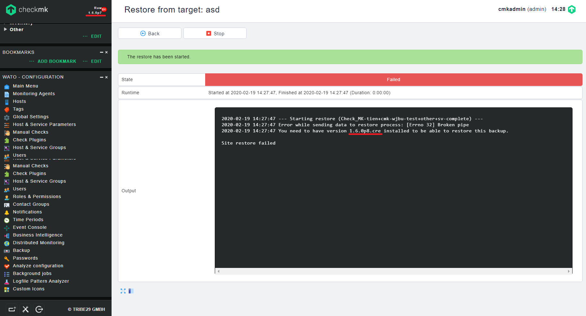

### 1. Định dạng sao lưu

Mỗi công việc sao lưu sẽ tạo một thư mục trên backup target. Tên thư mục này phù hợp với lược đồ sau:

- Appliance backups: Check_MK_Appliance-[HOSTNAME]-[LOCAL_JOB_ID]-[STATE]

- Instance backups: Check_MK-[HOSTNAME]-[SITE]-[LOCAL_JOB_ID]-[STATE]

Trong các trường ký tự đại diện, mọi ký tự `-` (trừ) được thay thế bằng `+` để không bị nhầm lẫn với các dấu tách trường.

Trong quá trình sao lưu, thư mục sẽ được lưu với hậu tố: `-incomplete`. Sau khi hoàn thành, thư mục được đổi tên và hậu tố thay đổi thành: `-complete`.

Một tập dữ liệu `mkbackup.info` chứa thông tin meta liên quan đến bản sao lưu được lưu trong thư mục. Bên cạnh tập tin này, một số tài liệu lưu trữ được lưu vào thư mục.

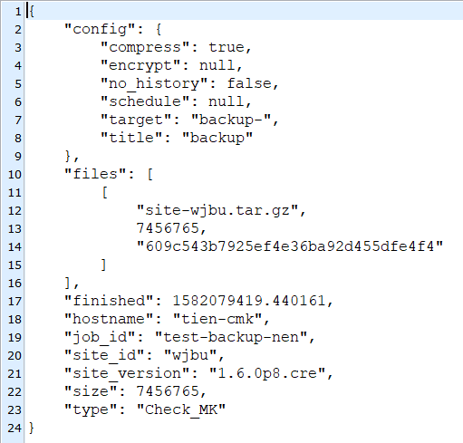

Lưu trữ có tên `system` chứa cấu hình thiết bị, `system-data` chứa dữ liệu của hệ thống tệp dữ liệu - ngoại trừ dữ liệu của các monitoring instances. Các monitoring instances được lưu trong các kho lưu trữ riêng biệt sử dụng lược đồ đặt tên trang site-[SITENAME].

Tùy thuộc vào chế độ của bản sao lưu, các bộ dữ liệu này được lưu với phần mở rộng tệp `.tar` cho không nén và không được mã hóa, `.tar.gz` là nén nhưng không được mã hóa và `.tar.gz.enc` là lưu trữ được nén và mã hóa.

### 2. Tự động sao lưu

Để thiết lập sao lưu dữ liệu tự động, hãy định cấu hình một hoặc nhiều công việc sao lưu. Một bộ dữ liệu sao lưu phải được tạo trên hệ thống đích cho mỗi công việc sao lưu. Khi mỗi bản sao lưu mới được hoàn thành, bản sao lưu trước đó sẽ bị xóa - nghĩa là trên hệ thống đích phần lưu trữ sao lưu sẽ được tạm thời cần nhiều hơn để sử dụng.

Trên `WATO - CONFIGURATION` -> `Backup` -> `New job`

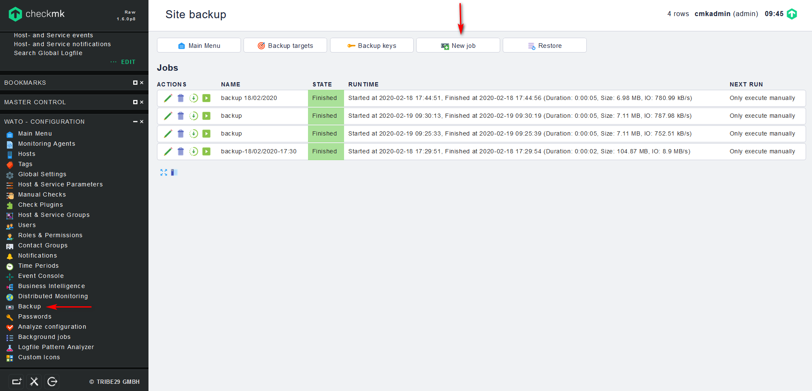

Trong mục `Schedule` chọn `Schedule execution`

mục `Period` sẽ có các lựa chọn sau:

- At the beginning of every month at day: thực hiện sao lưu vào 1 ngày nào đó hằng tháng, các giá trị được phép từ 1 đến 28

- Every day: thực hiện sao lưu hằng ngày

- Every week on... : thực hiện sao lưu vào 1 ngày nào đó hằng tuần

mục `Time of day to start the backup at` sẽ có lựa chọn thời gian để thực hiện sao lưu

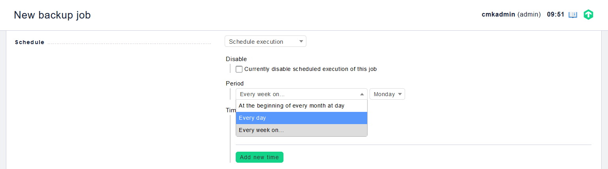

### 3. Nén

Có thể nén dữ liệu trong quá trình sao lưu. Điều này có thể hữu ích nếu bạn cần tiết kiệm băng thông hoặc nếu không gian lưu trữ trên hệ thống đích bị hạn chế.

Nhưng xin lưu ý rằng việc nén đòi hỏi thời gian sử dụng CPU đáng kể hơn và do đó quá trình sao lưu sẽ mất nhiều thời gian hơn. Bình thường, việc nén dữ liệu backup sẽ không được kích hoạt.

> Sao lưu không nén được hỗ trợ đầu tiên từ Checkmk-Phiên bản 1.2.8p5. Nếu bạn chạy các phiên bản giám sát với các phiên bản cũ hơn, bạn phải kích hoạt nén để sao lưu hoàn chỉnh.

### 4. Mã hóa

Nếu bạn muốn mã hóa bản sao lưu của mình, bạn có thể định cấu hình trực tiếp từ giao diện người dùng web. Dữ liệu được sao lưu của bạn sau đó sẽ được mã hóa hoàn toàn trước khi được chuyển đến backup target. Mã hóa bằng cách sử dụng khóa mã hóa được xác định trước. Khóa này được bảo vệ bằng mật khẩu được xác định khi tạo khóa và khóa đó phải được giữ an toàn, vì chỉ với những mật khẩu này mới có thể truy xuất dữ liệu được sao lưu.

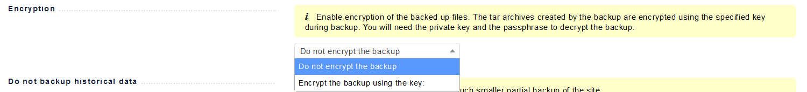

Để tạo khóa, hãy đi đến `WATO - CONFIGURATION` -> `Backup` -> `Backup keys`

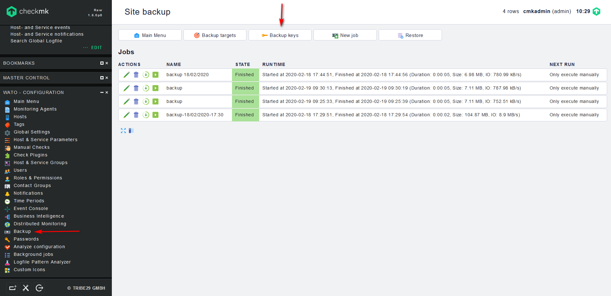

Chọn `Create Key` nếu muốn tạo 1 khóa mới, `Upload Key` nếu muốn tải lên khóa đã có trước, ở đây tôi sẽ tạo 1 khóa mới

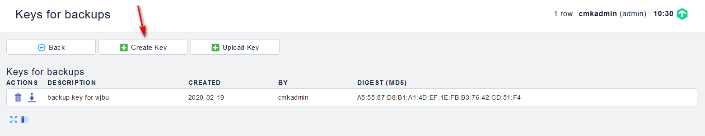

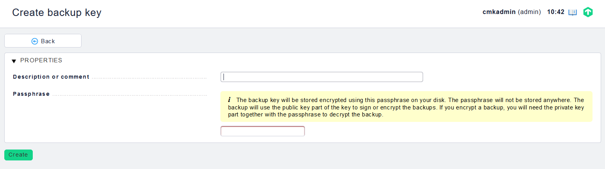

mục `Description or comment` ta sẽ điền vào mô tả cho khóa

mục `Passphrase` sẽ điền password cho khóa

Khi nhập mật khẩu, hãy chắc chắn sử dụng một chuỗi ký tự đủ phức tạp - mật khẩu của bạn càng dài và càng phức tạp, kẻ tấn công càng khó giải mã khóa của bạn và do đó bản backup của bạn càn đuwọc an toàn.

Khi bạn đã tạo khóa của mình, hãy tải xuống và giữ nó ở một vị trí an toàn.

> Một bản sao lưu được mã hóa chỉ có thể được khôi phục bằng khóa mã hóa và mật khẩu tương ứng của nó.

Bây giờ, chỉnh sửa công việc sao lưu để tạo bản sao lưu được mã hóa, ở đó kích hoạt mục `Encryption` và chọn khóa mã hóa mới được tạo.

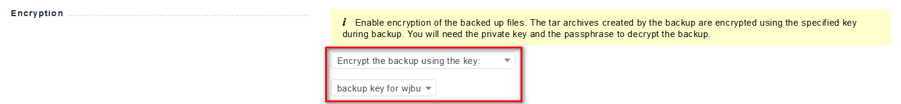

Khi bạn đã xác nhận hộp thoại, bản sao lưu tiếp theo sẽ được tự động mã hóa.

### 5. Phục hồi bản sao lưu

Sử dụng các chức năng tích hợp của giao diện người dùng web, bạn chỉ có thể complete restore. Khôi phục các bộ dữ liệu cá nhân thông qua giao diện web không được hỗ trợ. Tuy nhiên, có thể thông qua dòng lệnh và bằng cách giải nén thủ công từ bản sao lưu.

Nếu bạn muốn khôi phục bản sao lưu hoàn chỉnh trên thiết bị hiện đang chạy, hãy chọn mục `Restore`

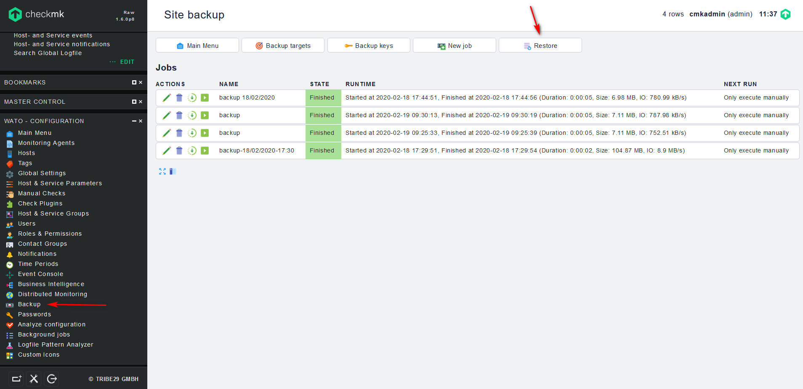

tiếp theo chọn backup target là nơi bạn muốn lấy nguồn dữ liệu được sao lưu. Khi backup target đã được chọn, một danh sách tất cả các bản sao lưu có sẵn của nó sẽ được hiển thị.

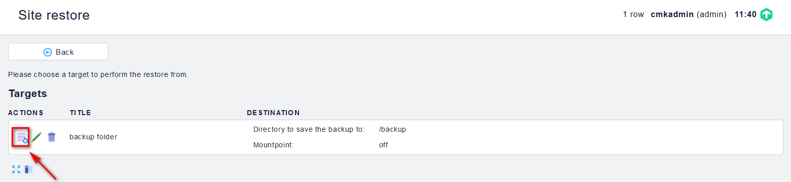

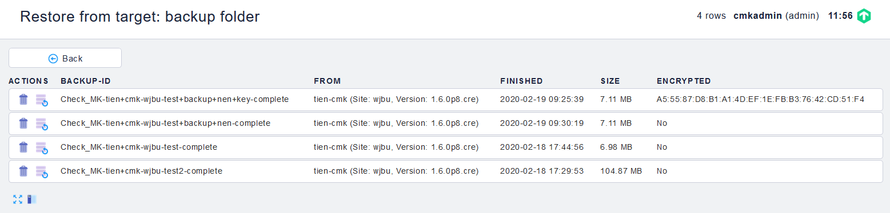

Tiếp theo, nhấp vào biểu tượng action bên cạnh dữ liệu sao lưu bạn muốn sử dụng và khôi phục sẽ bắt đầu - và sau khi xác nhận truy vấn bảo mật, quá trình khôi phục sẽ bắt đầu.

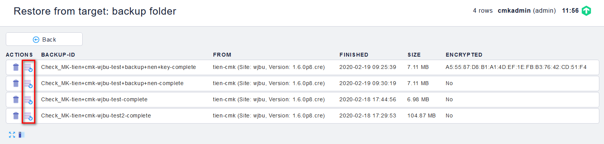

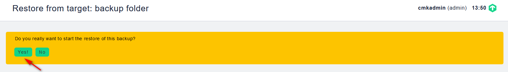

Trong khi khôi phục đang chạy, ta có thể theo dõi tiến trình của nó được hiển thị tự động.

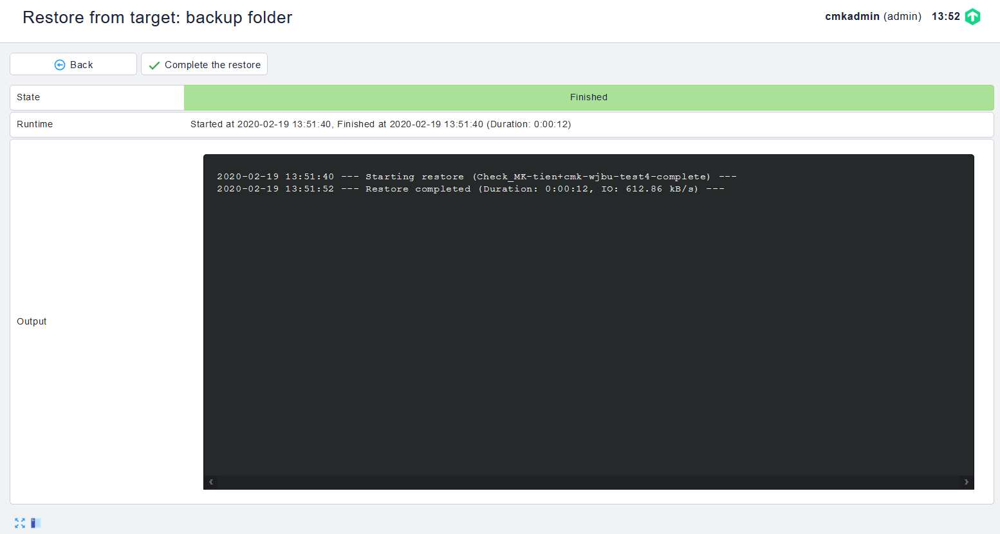

Cuối cùng bấm `Complete the restore` để kết thúc quá trình khôi phục

### 5. Live migration backup & restore

Các lệnh `omd backup` và `omd restore` theo truyền thống Unix cũ, thay vì các tệp, nó cũng hoạt động với input/output tiêu chuẩn. Thay vì đường dẫn dữ liệu cho tệp tar, chỉ cần nhập dấu gạch nối `-`.

Theo cách này, một đường ống có thể được xây dựng và dữ liệu "truyền trực tiếp" đến một máy tính khác mà không yêu cầu các tệp trung gian. Sao lưu càng lớn, điều này sẽ càng có lợi vì sẽ không cần không gian tạm thời trong hệ thống tệp của máy chủ được sao lưu.

Lệnh sau sao lưu một thể hiện cho một máy tính khác bằng SSH:

`omd backup tên_site - | ssh user@otherserver "cat > /var/backup/tên_site.tar.gz"`

Nếu ngược lại, bạn muốn truy cập Check_MK server từ server backup, điều đó cũng có thể, như trong ví dụ sau. Đối với điều này, trước tiên, phải đăng nhập SSH với tư cách là người dùng được phép:

`ssh tên_site@checkmkserver "omd backup -" > /var/backup/tên_site.tar.gz`

Bạn cũng có thể khéo léo và kết hợp cách trên với lệnh `omd restore` để đọc dữ liệu từ đầu vào tiêu chuẩn, bạn có thể sao chép một bản sao hoàn chỉnh, đang chạy từ máy chủ này sang máy chủ khác - và không cần thêm không gian cho tệp sao lưu:

`ssh tên_site@checkmkserver "omd backup -" | omd restore - `

Và bây giờ, quy trình tương tự với quyền truy cập SSH đảo ngược - nhưng lần này là từ hệ thống nguồn đến hệ thống đích:

`omd backup tên_site - | ssh root@otherserver "omd restore -"`