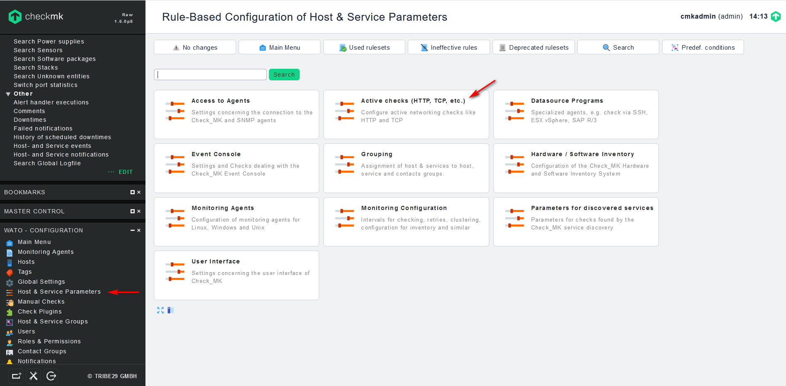
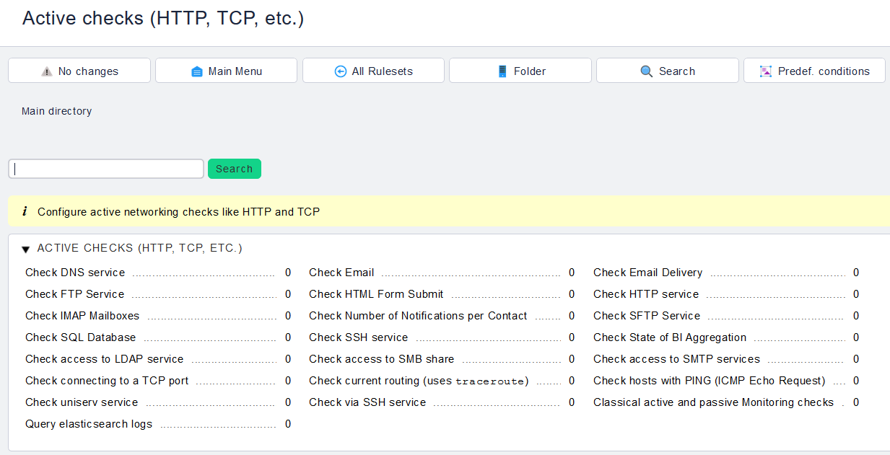
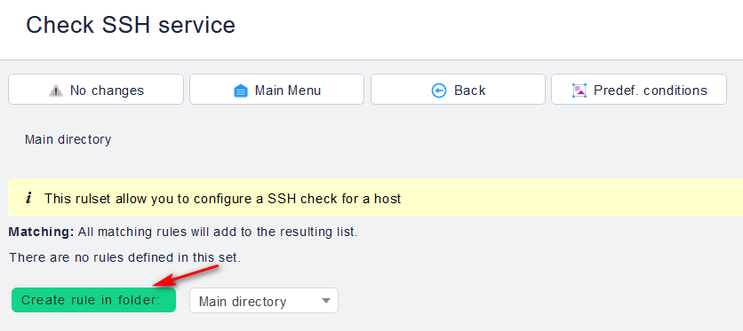
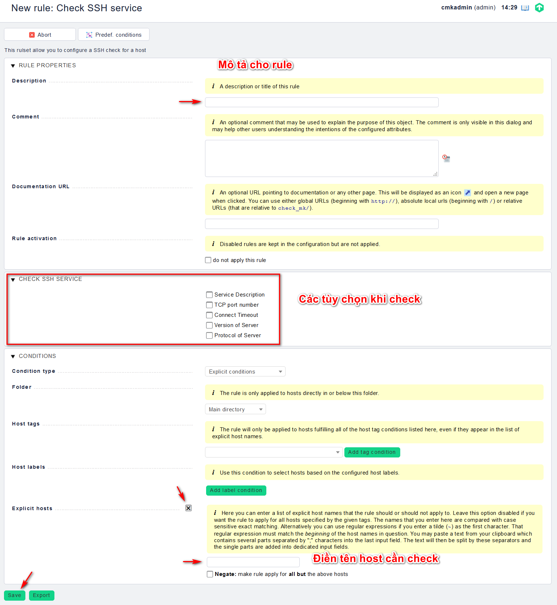
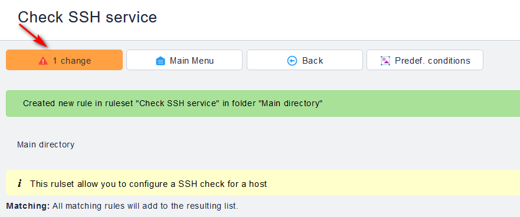
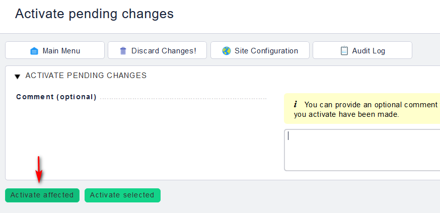
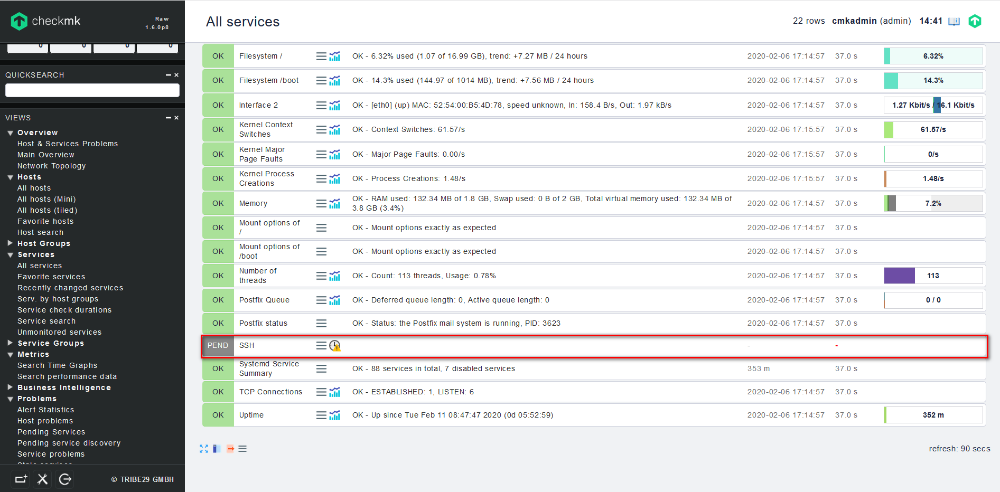
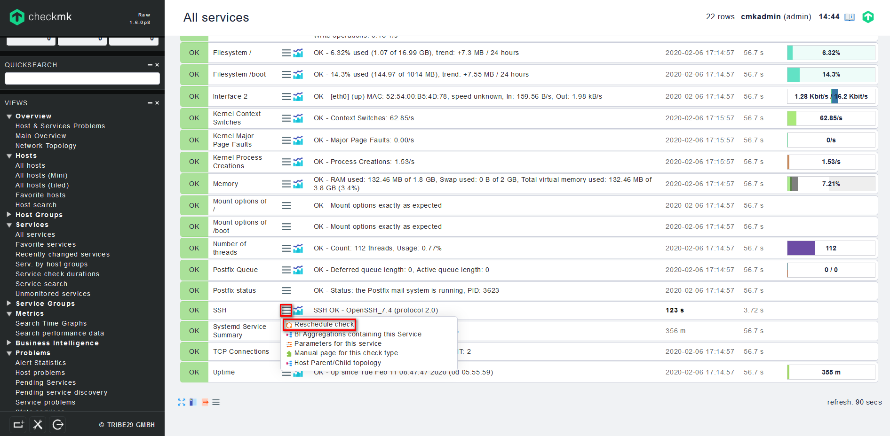

## Thêm dịch vụ giám sát Active Check

Trong giám sát có khái niệm active check và passive check. Active check được kích hoạt bởi server giám sát thường thông qua một cuộc thăm dò hoặc yêu cầu.

Passive check được gửi trực tiếp bởi host được giám sát và server không ảnh hưởng đến khi kết quả này được gửi. Hơn nữa, passive check có thể không gửi kết quả trong khung thời gian được chỉ định và máy chủ giám sát có thể đưa ra cảnh báo tại thời điểm đó.

Thực hiện như sau:

- Trên Web UI, chọn `WATO - CONFIGURATION` -> `Host & Service Parameters` -> `Active checks (HTTP, TCP, etc.)`

- Tại phần active checks này, sẽ có khá nhiều dịch vụ có thể chọn, chọn dịch vụ muốn check, ví dụ chọn SSH service để giám sát:

- Chọn `Create rule in folder` để tạo 1 rule mới:

- Khai báo các thông tin cần thiết rồi chọn `Save` để lưu lại:

- Lưu lại các thay đổi:

- Kiêm tra lại tại mục `VIEWS` -> `Services` -> `All services`

lúc này service mới được thêm vào, ta bấm vào biểu tượng 3 que bên cạnh, chọn `Reschedule check` để check:

