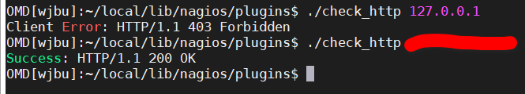
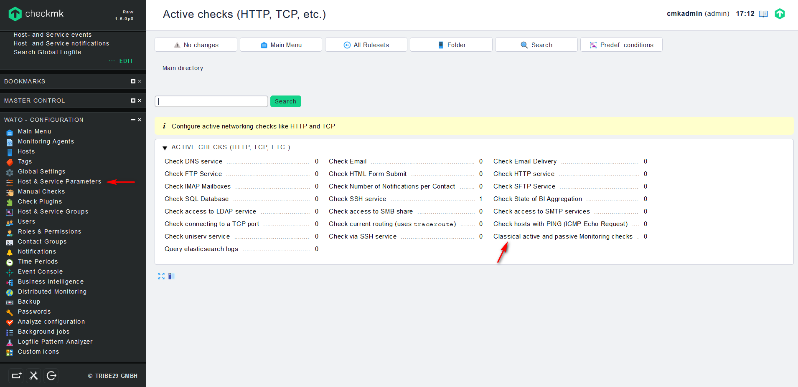
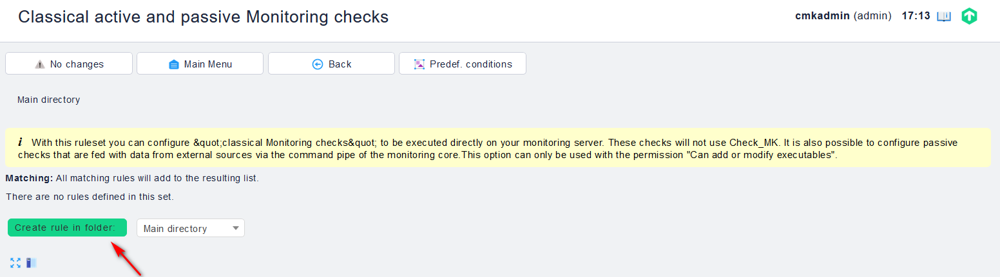
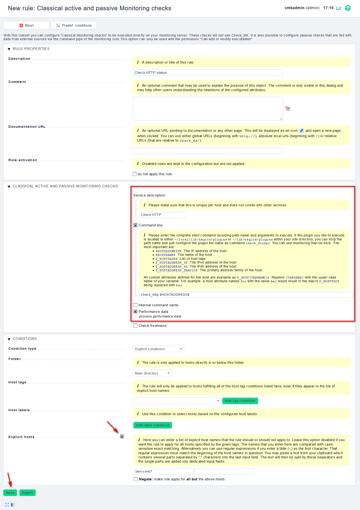
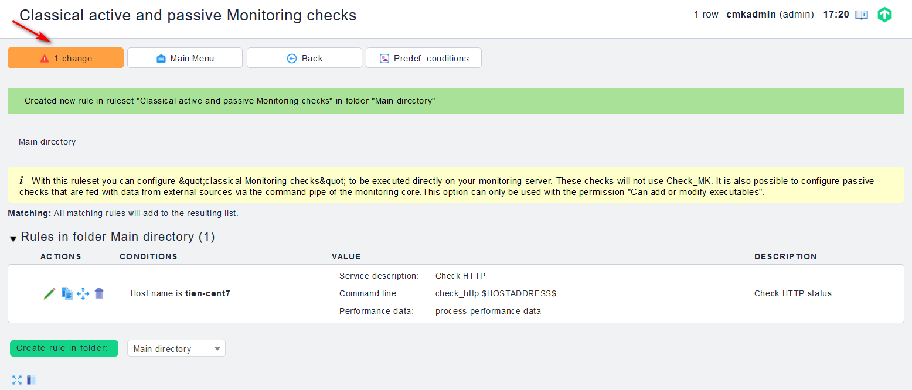
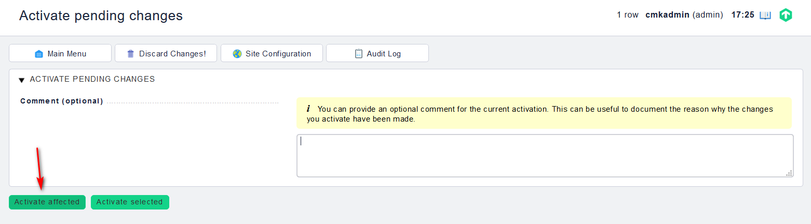
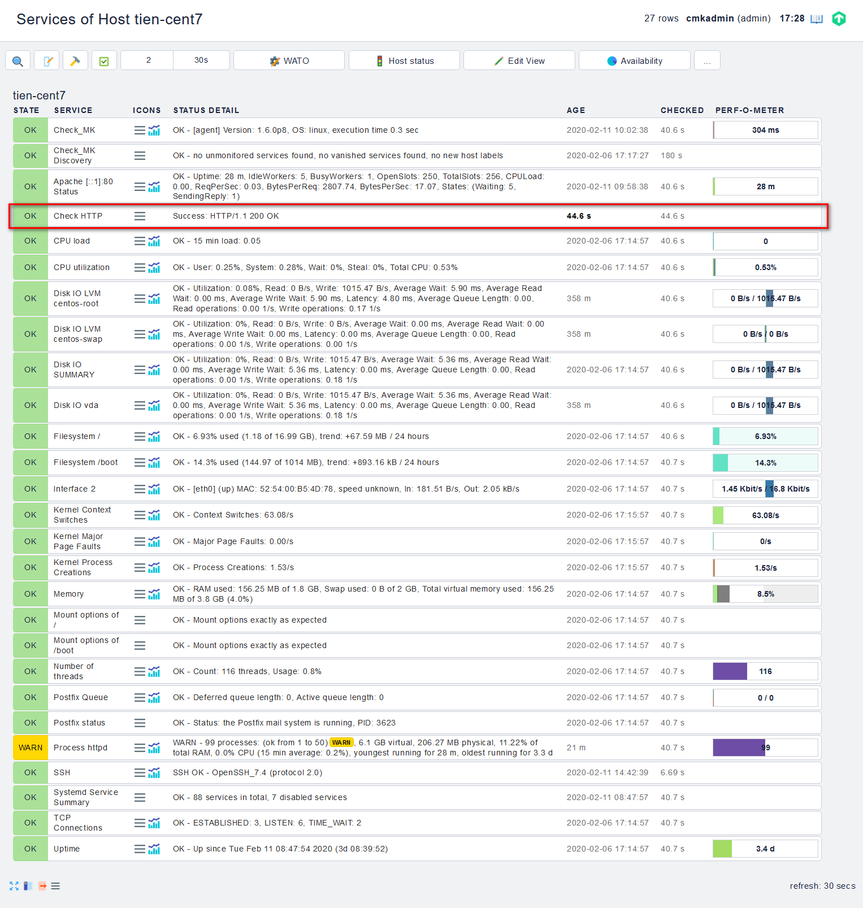

## Thêm plugin vào Check_mk

### Chuẩn bị plugin

Với ví dụ trong bài viết này, plugin được sử dụng để check trạng thái của web server (apache)

Bước 1: Tải xuống plugin vào thư mục

```
su <tên_site>
cd ~/local/lib/nagios/plugins
wget https://raw.githubusercontent.com/hoangdh/meditech-ghichep-nagios/master/scripts/Plugin-nagios/check%20http/check_http
```

thay thế `<tên_site>` bằng tên site của bạn

Bước 2: Phân quyền cho plugin:

`chmod 755 check_http`

Bước 3: Chạy thử plugin:

`./check_http <HOST_NAME>`



Như vậy, ta thấy script chạy khá ổn. Tiếp đến chúng ta sẽ thêm vào Check_mk.

### Cấu hình trên WEB UI

Trên Web UI, chúng ta tìm đến `WATO - CONFIGURATION` -> `Host & Service Parameters` -> `Active checks (HTTP, TCP, etc.)` -> `Classical active and passive Monitoring checks`



Bấm vào `Create rule in folder` để tạo rule mới:



Điền thông tin cho lệnh check, biến `$HOSTADDRESS` để xác định ra địa chỉ của HOST đang áp dụng. Bấm `Save` để lưu



Activate Change





Kiểm tra lại trên dashboard

