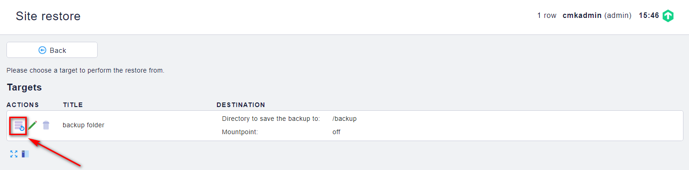

## Backup và restore site

Để bảo vệ dữ liệu giám sát của bạn trong trường hợp xảy ra lỗi phần cứng hoặc các lỗi tương tự, ta có thể sao lưu lại dữ liệu giám sát trên site. Bản sao lưu dữ liệu có thể được định cấu hình qua giao diện người dùng web của thiết bị.

Bản sao lưu đầy đủ bao gồm tất cả các cấu hình được xác định trên hệ thống, các tệp được cài đặt và tương tự như các phiên bản giám sát của bạn.

### Backup dữ liệu cho site

Chúng ta backup lại thông tin theo các bước sau:

Đầu tiên trên Web UI, chúng ta tìm đến `WATO - CONFIGURATION` -> `Backup` -> `Backup targets` để tạo 1 nơi chứa các file backup

chọn `New backup target`

Điền các thông tin và lưu lại, folder dùng để backup phải là folder mà group `omd` có quyền ghi

Sau đó back lại và chọn `New job`

Điền các thông tin cho việc backup và lưu lại

Bấm vào nút như trong hình để bắt đầu công việc backup

Backup đang được diễn ra

Sau khi backup xong

### Restore dữ liệu đã backup

Việc này được thực hiện khi muốn restore lại dữ liệu trên cùng 1 site hoặc chuyển dữ liệu giữa các site với nhau

Các bước thực hiện như sau

Trên mục `WATO - CONFIGURATION`, chọn `Backup` -> `Restore`

Chọn backup target muốn restore

Chọn bản backup và restore dữ liệu

Xác nhận việc restore

Việc restore đang được diễn ra

Hoàn tất restore

### Backup vầ restore bằng câu lệnh

Các bước tiến hành

#### Backup site

Bước 1: Liệt kê các site đang có trên hệ thống:

`omd sites`

Bước 2: Dừng site mà bạn muốn backup

`omd stop <tên_site>`

Bước 3: Backup dữ liệu của site

`omd backup <tên_site> /opt/<tên_site>-bk.tar.gz`

Chú ý:

Tùy vào số lượng host, thời gian backup sẽ tăng theo

`<tên_site>` là tên site

`/opt/<tên_site>-bk.tar.gz`: nơi lưu trữ file, với dạng nén tar.gz

#### Restore site

Bước 1: Restore lại site

`omd restore <tên_site> /opt/<tên_site>-bk.tar.gz`

Bước 2: Xem lại status của các site

`omd status`

Bước 3: Khởi động site vừa restore

`omd start <tên_site>`

