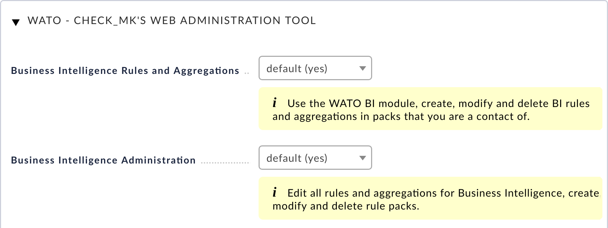
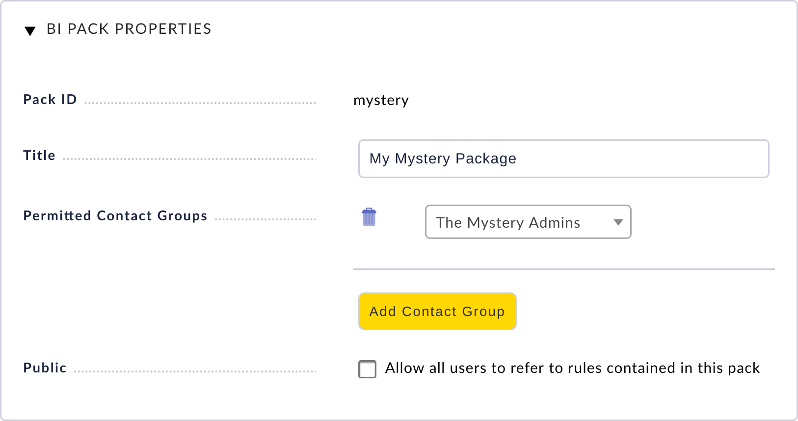
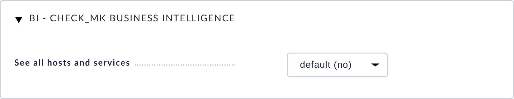
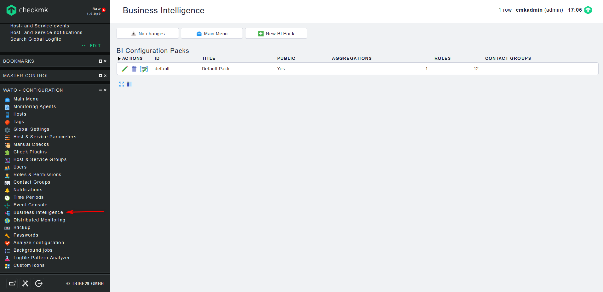

## Business Intelligence

Checkmk Business Intelligence  về cơ bản mô tả cốt lõi của mô-đun BI trong Check_mk. BI-Module được tích hợp trong Multisite-GUI. Nó tổng hợp Dữ liệu trạng thái từ nhiều máy chủ và dịch vụ để cung cấp trạng thái hoàn chỉnh cho các ứng dụng phức tạp và các quy trình tương tự. Điều này cung cấp một cái nhìn tổng quan nhanh chóng cho các nhà quản lý và người dùng.

Checkmk BI cho phép bạn rút ra một bản tóm tắt về tình trạng tổng thể của một ứng dụng từ trạng thái hiện tại của các máy chủ và dịch vụ riêng lẻ. Bạn sử dụng các quy tắc BI để xác định trong cấu trúc cây cách các phần tử phụ thuộc lẫn nhau. Mỗi ứng dụng có thể là `OK`, `WARN` hoặc `CRIT`

- Hiển thị trạng thái chung của 1 ứng dụng trong GUI

- Tính toán mức độ [availability] của 1 ứng dụng

- [notifications] trong trường hợp xảy ra sự cố hoặc thậm chí là lỗi ứng dụng

- Phân tích tác động: Một dịch vụ trong trạng thái `CRIT`

- Lập kế hoạch thời gian bảo trì và phân tích "điều gì xảy ra nếu ..."

Ngoài ra, khả năng biểu diễn dưới dạng cây trong BI cho cái nhìn đi sâu vào trạng thái của máy chủ và tất cả các dịch vụ của nó.

Một điểm đặc biệt của Checkmk BI, không giống như các công cụ tương tự trong môi trường giám sát, là ở đây, Checkmk cũng hoạt động dựa trên quy tắc. Điều này cho phép bạn mô tả linh hoạt một số lượng không xác định các ứng dụng tương tự với một bộ quy tắc chung. Điều đó vô cùng thuận lợi cho công việc và giúp tránh những sai lầm - đặc biệt là trong các môi trường linh hoạt.

### Điều kiện

Trước khi bạn bắt đầu với ứng dụng thực tế, trước tiên bạn cần biết một vài điều khoản:

Mỗi ứng dụng được chính thức hóa với BI được gọi là **Aggregation** (tập hợp), vì một trạng thái chung được tổng hợp từ nhiều trạng thái riêng lẻ.

Một tập hợp là một cây của các đối tượng. Chúng được gọi là các nút (node). Các nút dưới cùng - lá của cây - là các máy chủ và dịch vụ trong Checkmk instances của bạn. Các nút còn lại là các đối tượng BI được tạo ra.

Mỗi nút được tạo bởi một quy tắc. Điều này cũng áp dụng cho thư mục gốc của cây - nút trên cùng. Các quy tắc này xác định các nút nào nằm bên dưới một nút khác, và do đó từ trạng thái của chúng, trạng thái của nút sẽ được xác định.

Nút trên cùng của tập hợp (gốc của cây) cũng được tạo theo quy tắc. Theo cách này, một quy tắc có thể tạo ra nhiều tập hợp.

### Quyền và khả năng hiển thị

#### Quyền chỉnh sửa

Như bên trên đã đề cập, BI dựa trên các gói quy tắc. Đối với tất cả các hành động chỉnh sửa trong BI, bạn thường cần phải có vai trò Quản trị viên. Chính xác hơn, đối với BI có hai quyền:

Theo mặc định, vai trò *User* chỉ là cái đầu tiên trong hai quyền hoạt động. Người dùng bình thường chỉ có thể làm việc trong các gói quy tắc mà họ đã được xác định là một liên hệ. Điều này được thực hiện trong `Details of the rule package`.

Trong ví dụ sau, trong mục *Permitted Contact Groups*  thì `The Mystery Admins` contact group đã được ủy quyền - do đó tất cả các thành viên của nhóm này có thể hiệu chỉnh các quy tắc trong gói này:

#### Quyền đối với Host và Service

Trong tập hợp BI, bạn không thể gán bất kỳ quyền nào. Điều này được thực hiện một cách gián tiếp thông qua khả năng hiển thị của máy chủ và dịch vụ và nó được điều chỉnh bởi tùy chọn *See all hosts and services* bên trong mục `WATO` ➳ `Roles & Permissions`:

Trong vai trò *User*, quyền này theo mặc định bị vô hiệu hóa. Người dùng bình thường chỉ có thể thấy các máy chủ và dịch vụ được chia sẻ và trong BI, chúng được thể hiện theo cách mà họ có thể thấy chính xác tất cả các tập hợp BI có chứa ít nhất một máy chủ hoặc dịch vụ chia sẻ. Tuy nhiên, các tập hợp như vậy **chỉ** chứa các đối tượng được ủy quyền này và do đó chúng có thể bị "thinned out". Và điều này có nghĩa là họ có thể có các trạng thái khác nhau cho những người dùng khác nhau!

### Cấu hình BI

Đầu tiên ở giao diện `WATO - CONFIGURATION` chọn `Business Intelligence`

