## Cài đặt Check_mk agent để giám sát các client

### CentOS 7

- Truy cập vào web UI trên server giám sát theo đường dẫn `ip-server/tên_site`, đăng nhập với tài khoản và mật khẩu đã tạo, tại phần `WATO - CONFIGURATION` chọn `Monitoring Agents`

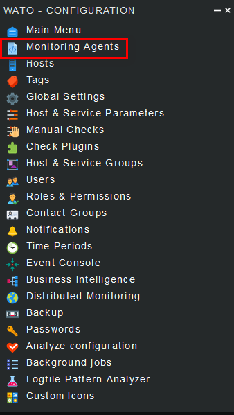

- Tại mục `PACKAGED AGENTS` sẽ có các gói tin để tải xuống tương ứng với hđh của client

	- gói tin .rpm cho client RHEL/CentOS
	
	- gói tin .deb cho client Debian/Ubuntu
	
	- gói tin .msi cho client Windows

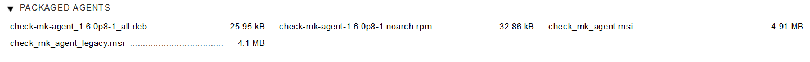

tùy theo client sử dụng hđh nào mà tải xuống gói tin tương ứng.

- Trên client Cent 7, sử dụng wget để tải xuống file cài đặt

```
cd /tmp
wget http://192.168.20.81/wjbu/check_mk/agents/check-mk-agent-1.6.0p8-1.noarch.rpm
```

nếu chưa có `wget`, hãy cài nó

`yum install -y wget`

- Trước khi cài đặt gói tin trên agent, hãy kiểm tra xem `xinetd` đã được cài đặt hay chưa

`rpm -qa | grep xinetd`

nếu chưa có, hãy cài nó

`yum install -y xinetd`

- Khởi động và cho phép `xinetd` chạy cùng hệ thống

```
systemctl start xinetd
systemctl enable xinetd
```

- Cài đặt gói check_mk agent

`rpm -ivh check-mk-agent-1.6.0p8-1.noarch.rpm`

- Để cho phép Check_mk server được truy cập vào client, chúng ta chỉnh sửa file cấu hình agent trên client:

`vi /etc/xinetd.d/check_mk`

Có 3 thông số cần phải chỉnh:

	- port: 6556

	- only_from: Thêm địa chỉ IP server CMK

	- disable: no

- Khởi động lại xinetd:

`systemctl restart xinetd`

- Kiểm tra port đã hoạt động:

`netstat -npl | grep 6556`

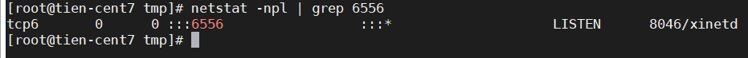

- Mở port 6556 trên firewall:

```
firewall-cmd --add-port=6556/tcp --permanent
firewall-cmd --reload
```

- Tắt SELinux:

```
sed -i 's/SELINUX=enforcing/SELINUX=disabled/g' /etc/selinux/config
sed -i 's/SELINUX=enforcing/SELINUX=disabled/g' /etc/sysconfig/selinux
setenforce 0
```

- Sau khi cài thành công, chúng ta cấu hình trên Web UI. Thêm host trên check_mk server, tại `WATO - CONFIGURATION` chọn `Hosts`:

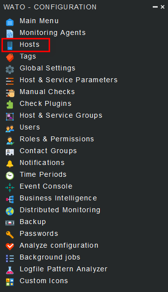

chọn `Create new host`

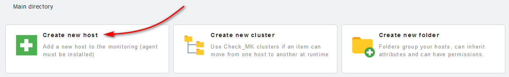

điền các thông tin cần thiết

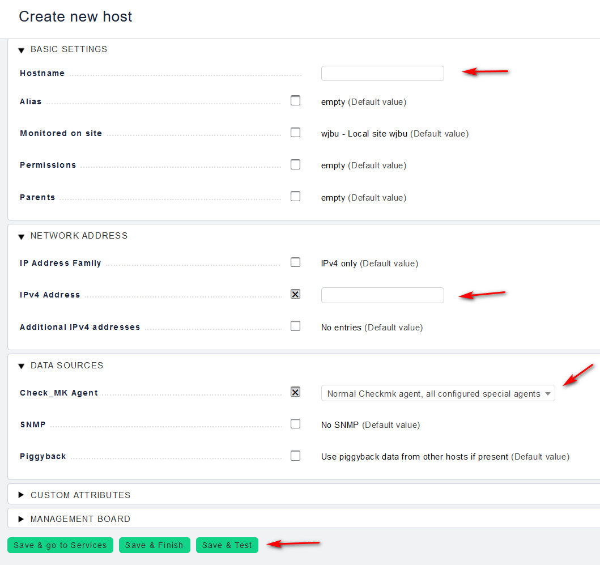

Kết quả thu được như sau, chọn `Save & Exit` để quay trở lại:

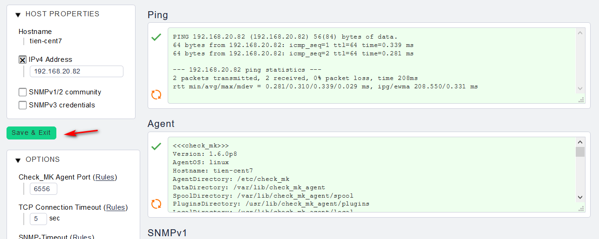

Sau đó chọn `Save & go to Services` để kiểm tra những dịch vụ và những thông số vật lý được giám sát thông qua agent, tại đây chọn `Fix all missing/vanished` để khi lưu lại thì các dịch vụ sẽ lên luôn các thông số:

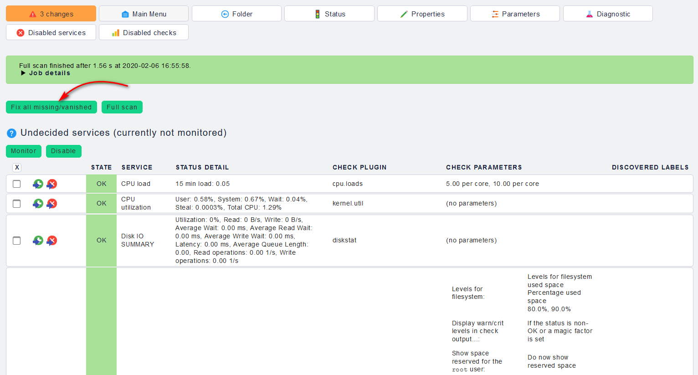

Sau các bước làm như trên thì check_mk sẽ có những thay đổi, chọn `Changes` để xem những thay đổi đó:

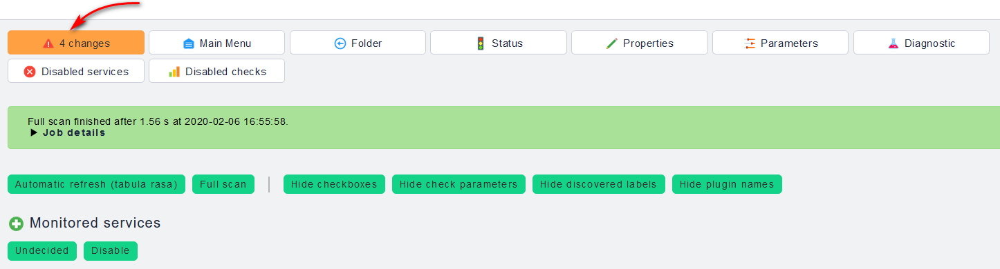

Sau đó lưu lại để hoàn thành thêm host mới :

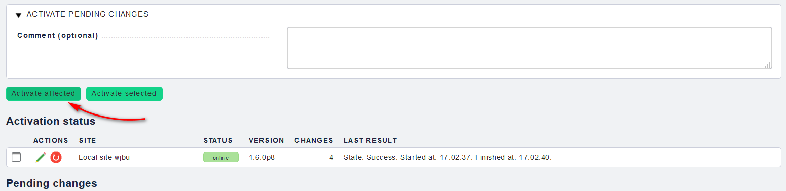

- Kiểm tra lại host vừa mới thêm vào, tại `VIEWS`, chọn `Hosts` rồi sau đó vào `All hosts`:

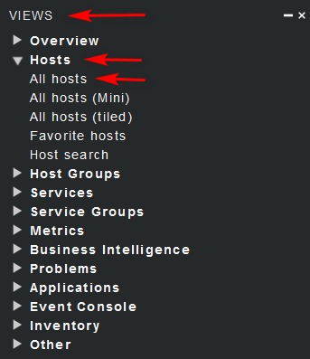

### Ubuntu 16

- Đối với Ubuntu, ta sẽ tải file có đuôi .deb

```
cd /tmp
wget http://192.168.20.81/wjbu/check_mk/agents/check-mk-agent_1.6.0p8-1_all.deb
```

- Cài đặt agent bằng lệnh sau:

`dpkg -i check-mk-agent_1.5.0p13-1_all.deb`

Mở port 6556 trên firewall:

```
ufw allow 6556/tcp
ufw reload
```

- Cài đặt `xinetd`

`apt-get install xinetd`

Các bước tiếp làm tương tự như trên CentOS 7.