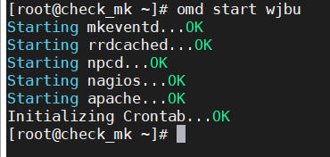

## Cài đặt Check_mk trên CentOS 7

| Host name | IP | RAM | CPU | DISK |
| --- | --- | --- | --- | --- |
| check_mk | 192.168.254.22 | 2G | 1 | 20G |

### Cài đặt

- Cài đặt repo EPEL

Check_MK cần khá nhiều các gói dependence đi kèm, vì thế chúng ta cài đặt thêm gói repo này để có thể đáp ứng được một số gói mà local repo không cung cấp.

`yum install -y epel-release`

- Cài đặt gói wget

`yum install -y wget`

- Tải file cài đặt Check_mk

```
cd /tmp
wget https://checkmk.com/support/1.6.0p8/check-mk-raw-1.6.0p8-el7-38.x86_64.rpm
```

tùy vào platform hđh và phiên bản mà chọn đúng phiên bản để tải, truy cập vào link [sau](https://checkmk.com/download.php?) để xem thêm

- Sử dụng yum để cài đặt gói rpm để có thể tải được đầy đủ những dependencies:

`yum install -y check-mk-raw-1.6.0p8-el7-38.x86_64.rpm`

### Tạo và khởi động site trên Check_mk

- Tạo site

`omd create <tên_site>`


- Đổi mật khẩu user cmkadmin

```
su - <tên_site>`
htpasswd -m ~/etc/htpasswd cmkadmin
```


- Mở port 80 trên firewall

```
firewall-cmd --permanent --add-port=80/tcp
firewall-cmd --reload
```

- Tắt SELinux

```
sed -i 's/SELINUX=enforcing/SELINUX=disabled/g' /etc/selinux/config
sed -i 's/SELINUX=enforcing/SELINUX=disabled/g' /etc/sysconfig/selinux
setenforce 0
```

- Khởi động site

`omd start <tên_site>`



- Truy cập địa chỉ `ip-server/tên_site` để kiểm xem đã cài đặt và khởi động thành công hay chưa, nếu thành công kết quả nhận được sẽ như sau:


Đăng nhập với tài khoản `cmkadmin` và mật khẩu khởi tạo cho site ở bên trên, kết quả như sau:

