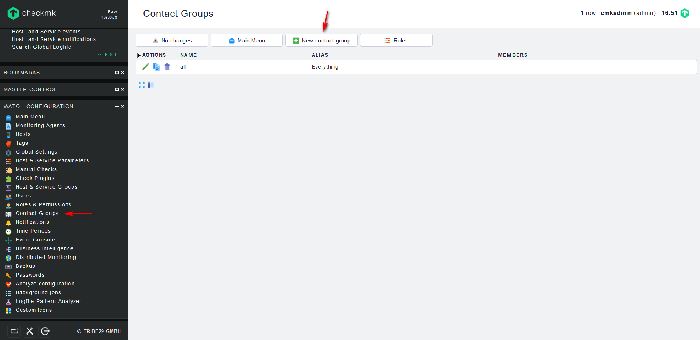

## Cấu hình gửi cảnh báo qua email

### Cấu hình mail relay sử dụng Gmail

Chúng ta thực hiện các bước sau để có thể sử dụng Gmail để cho Check_mk có thể gửi cảnh báo khi có sự cố xảy ra với host/service.

Trên OMD server, chúng ta thực hiện các bước sau để cấu hình Postfix thành một Mail Relay sử dụng Gmail.

- Bước 1: Cài đặt `postfix` và gói `mailutil`:

`yum install -y postfix mailx cyrus-sasl cyrus-sasl-plain`

- Bước 2: Cấu hình xác thực cho Gmail:

Các file cấu hình của postfix được lưu trữ trong `/etc/postfix`, chúng ta tạo file để lưu trữ thông tin của Gmail.

sửa file `etc/postfix/sasl_passwd` và thêm nội dung sau:

`[smtp.gmail.com]:587    username@gmail.com:password`

trong đó:

	- username: Tên đăng nhập Gmail
	
	- password: Mật khẩu của Gmail

- Bước 3: Cấu hình `Postfix`:

Chỉnh sửa file cấu hình `/etc/postfix/main.cf` và thêm những dòng sau:

```
# enable SASL authentication
smtp_sasl_auth_enable = yes
# disallow methods that allow anonymous authentication.
smtp_sasl_security_options = noanonymous
# where to find sasl_passwd
smtp_sasl_password_maps = hash:/etc/postfix/sasl_passwd
# Enable STARTTLS encryption
smtp_use_tls = yes
# where to find CA certificates
smtp_tls_CAfile = /etc/ssl/certs/ca-certificates.crt
```

- Bước 4: Xử lý thông tin xác thực Gmail:

Sử dụng `postmap` để mã hóa file xác thực, kết quả mã hóa được lưu tại `sasl_passwd.db`

`postmap /etc/postfix/sasl_passwd`

- Bước 5: Bảo mật cho Password và Hash Database Files:

```
chown root:root /etc/postfix/sasl_passwd /etc/postfix/sasl_passwd.db
chmod 0600 /etc/postfix/sasl_passwd /etc/postfix/sasl_passwd.db
```

- Bước 6: Khởi động lại `postfix`:

`systemctl restart postfix`

- Bước 7: Cài đặt Gmail, cho phép truy cập bằng ứng dụng kém an toàn:

Đăng nhập vào nick gmail đã nhập vào ở bước 2, truy cập vào link https://myaccount.google.com/lesssecureapps?pli=1 để cài đặt tính năng này.

- Bước 8: Kiểm tra Mail relay:

Chúng ta kiểm tra hoạt động của nó bằng cách gửi đi một email:

`echo "Test email." | mail -s "Test postfix relay." nobody@example.com`

Thay địa chỉ email của bạn vào câu lệnh.

Vào hộp thư của bạn kiểm tra email.


### Cấu hình gửi email trong Check_mk

- Thêm group nhận mail cảnh báo:

Bước 1: Trên tab `WATO - CONFIGURATION`, chọn `Contact Groups` -> `New contact group`:



Bước 2: Điền thông tin cho Group và lưu lại


- Thêm user nhận mail cảnh báo:

Bước 1: Trên tab `WATO - CONFIGURATION`, chọn `Users` -> `New User`:


Bước 2: Điền thông tin cho User và lưu lại:


xem lại thông tin user vừa add:


Bước 3: Active những thay đổi:


