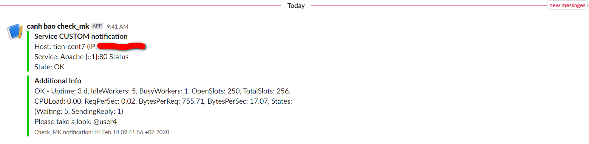

## Cấu hình gửi cảnh báo qua Slack

### Chuẩn bị Slack

- Đăng nhập vào Slack của bạn và bấm vào (+) để tạo một channel mới dùng để nhận thông báo từ Check_mk.


- Sau khi đã tạo channel, truy cập vào link [sau](https://api.slack.com/apps), chọn `Create an App` để tạo app và lấy thông tin Incomming WebHooks


- Đặt tên cho app, chọn workspace rồi bấm `Create app`


- Sau khi tạo xong app, chọn `Incoming Webhooks`


- Activate Incoming Webhooks và Add New Webhook to Workspace:


- Chọn channel đã tạo ở trên rồi bấm `Allow`:


- Copy Webhook URL:


### Cấu hình trên Web UI WATO

Giờ đây, Check_MK có thể gửi thông báo về các thay đổi trạng thái của host và service vào kênh Slack, chi tiết tại [đây](https://checkmk.com/check_mk-werks.php?werk_id=6639)

- Đầu tiên, chúng ta tạo 1 user mới bằng cách vào `WATO - CONFIGURATION` -> `Users` -> `New User`:


- Sau đó vào `WATO - CONFIGURATION` -> `Notifications` -> `New Rule`:


- Điền các thông tin cần thiết và lưu lại:


- Kích hoạt các thay đổi:


> Lưu ý: Đối với các phiên bản Check_MK cũ hơn, ta phải tự thêm script để gửi cảnh báo

Tham khảo script sau:

- Bước 1: Cài đặt gói Ruby

Do script được viết bằng Ruby nên chúng ta cài `ruby` để script có thể hoạt động.

`yum install -y ruby ruby-json`

- Bước 2: Tải Script

Tiếp theo, chúng ta tải script và phân quyền cho nó.

```
cd /opt
wget https://gist.githubusercontent.com/matmannion/57265df46e6b23485a07/raw/ba983e8c9614af73907ab0e657fa93f9a8a9408d/slack.rb
chmod +x slack.rb
```

- Bước 3: Chỉnh sửa thông tin trong Script

Chúng ta mở script và chỉnh sửa một vài thông tin chính sau:

`domain`: Địa chỉ Slack của bạn.

`webhook_url`: Địa chỉ WebHooks mà bạn vừa tạo ở bên trên.

`monitoring_server`: Địa chỉ server Check_mk của bạn

`monitoring_site`: Tên site của bạn.

- Bước 4: Copy script vào thư mục cấu hình

```
cd /opt
cp slack.rb /opt/omd/versions/version_dang_su_dung/share/check_mk/notifications
```

Thay thế `version_dang_su_dung` bằng version Check_mk của bạn

Để xem phiên bản đang sử dụng, vui lòng chạy lệnh sau:

`omd version`

hoặc tham khảo script [sau](https://raw.githubusercontent.com/rmblake/check_mk-slack/master/slack)

hoặc [link](https://lists.mathias-kettner.de/pipermail/checkmk-commits/2018-September/023509.html)

### Kiểm tra hoạt động

- Chúng ta vào một dịch vụ bất kỳ và thử cảnh báo.


- Kiểm tra trên kênh Slack:

