## Cấu hỉnh gửi cảnh báo qua telegram

### Yêu cầu

Đã cài đặt Check_MK

Python mạc định trên cent 7 sẽ được cài đặt bản python 2.7)

Telegram

### Tạo bot để gửi cảnh báo và tìm chat ID

Truy cập [link](https://t.me/BotFather) hoặc mở phiên bản telegram desktop và chat với `@BotFather`:

```
/start
/newbot
{your_bot_name}
{your_bot_name}_bot
```

Để cho bot có thể gửi tin nhắn thì ta phải start con bot vùa tạo,

truy cập theo đường link:

`t.me/{your_bot_name}_bot`

chat với bot như sau:

`/start`

Sau đó để lấy được chat id của tài khoản, truy cập [link](https://t.me/my_id_bot), chat với bot và bot sẽ trả lại chat id tài khoản của bạn.

### Cấu hình trên Check_mk server

Tạo file `telegram.py`:

`vi /opt/omd/sites/tên_site/local/share/check_mk/notifications/telegram.py`

nội dung file như sau:

```
#!/usr/bin/env python
# Gui Canh Bao Telegram
import json
import requests
import os

TOKEN = "your_token"
URL = "https://api.telegram.org/bot{}/".format(TOKEN)


def get_url(url):
    response = requests.get(url)
    content = response.content.decode("utf8")
    return content


def get_json_from_url(url):
    content = get_url(url)
    js = json.loads(content)
    return js


def get_updates():
    url = URL + "getUpdates"
    js = get_json_from_url(url)
    return js


def get_last_chat_id_and_text(updates):
    num_updates = len(updates["result"])
    last_update = num_updates - 1
    text = updates["result"][last_update]["message"]["text"]
    chat_id = updates["result"][last_update]["message"]["chat"]["id"]
    return (text, chat_id)


def send_message(text, chat_id):
    url = URL + "sendMessage?text={}&chat_id={}".format(text, chat_id)
    get_url(url)


#text, chat = get_last_chat_id_and_text(get_updates())
#send_message(text, chat)
mess = os.environ['NOTIFY_LASTSERVICESTATE']+ '->' + os.environ['NOTIFY_SERVICESTATE'] + ' Host:' + os.environ['NOTIFY_HOSTNAME'] + ' IP:' + os.environ['NOTIFY_HOSTADDRESS'] + ' Service:' + os.environ['NOTIFY_SERVICEDESC'] + ' Time:' + os.environ['NOTIFY_SHORTDATETIME']
send_message(mess, os.environ['NOTIFY_CONTACT_TELEGRAM_CHAT_ID'])
```

Thay `TOKEN` bằng TOKEN của bot đã được cấp

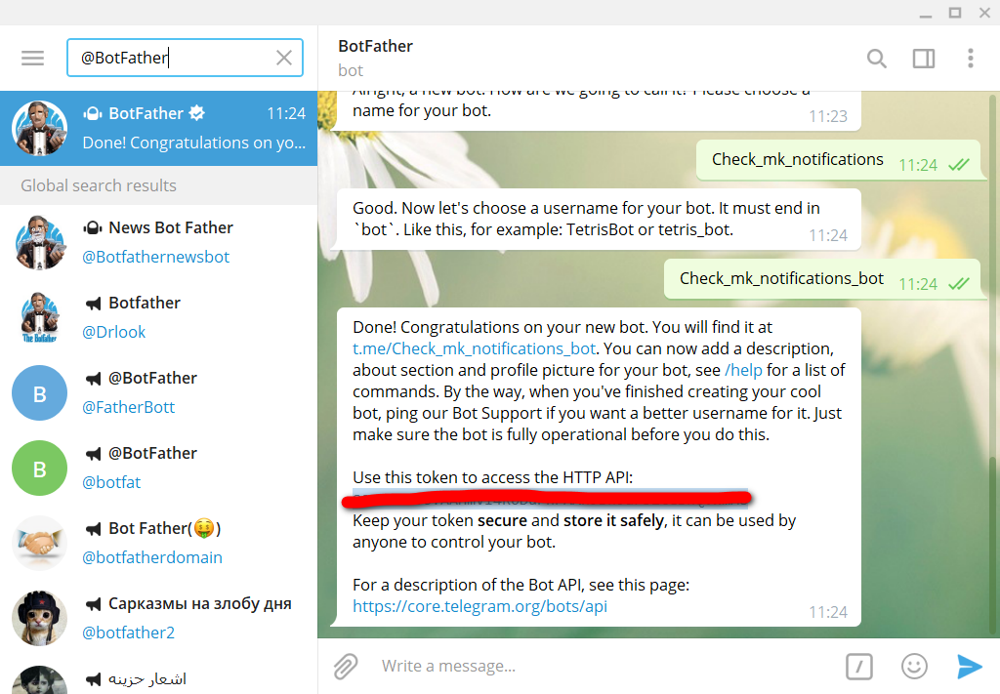

Phân quyền cho file `telegram.py`:

`chmod +x /opt/omd/sites/tên_site/local/share/check_mk/notifications/telegram.py`

Restart lại Check_mk server:

`omd restart`

### Cấu hình trên WATO

Tạo một `Attributes User`:

tại `WATO - CONFIGURATION` chọn `Users` -> `Custom attributes`:

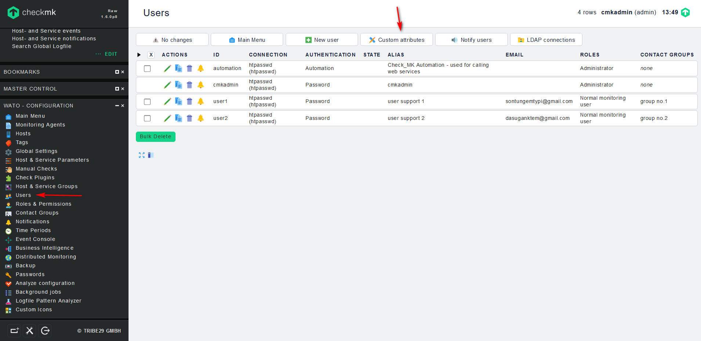

chọn `New attribute`:

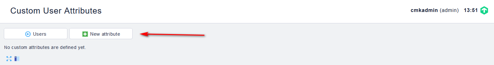

điền các thông số như sau:

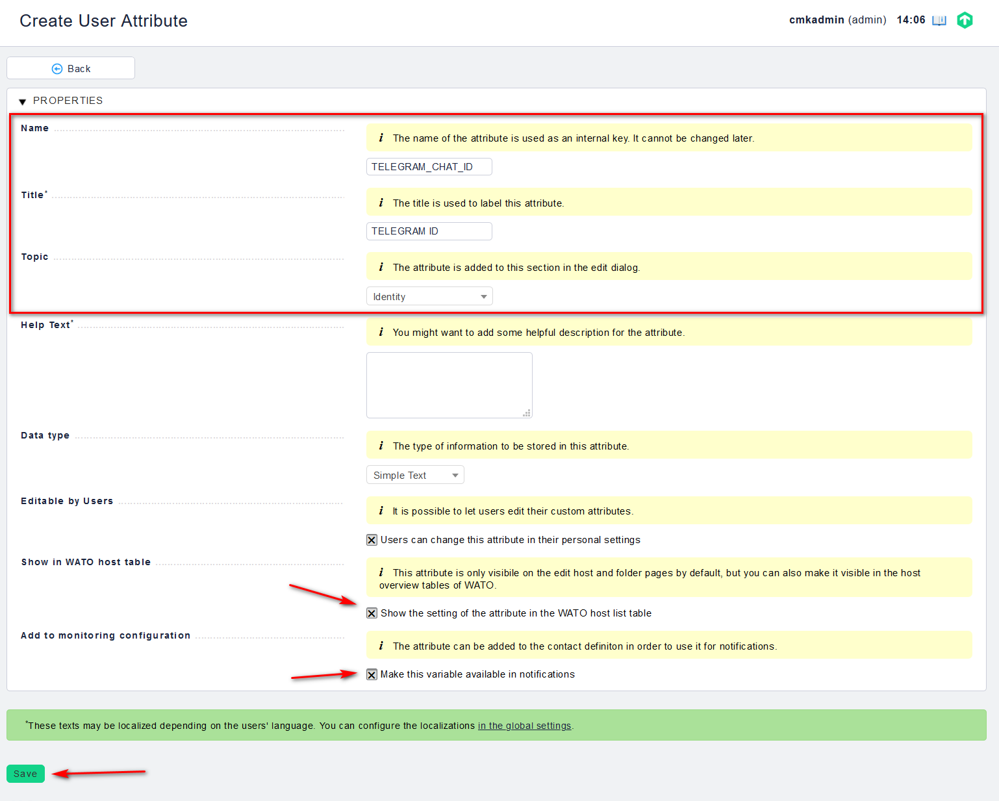

Tạo 1 user mới:

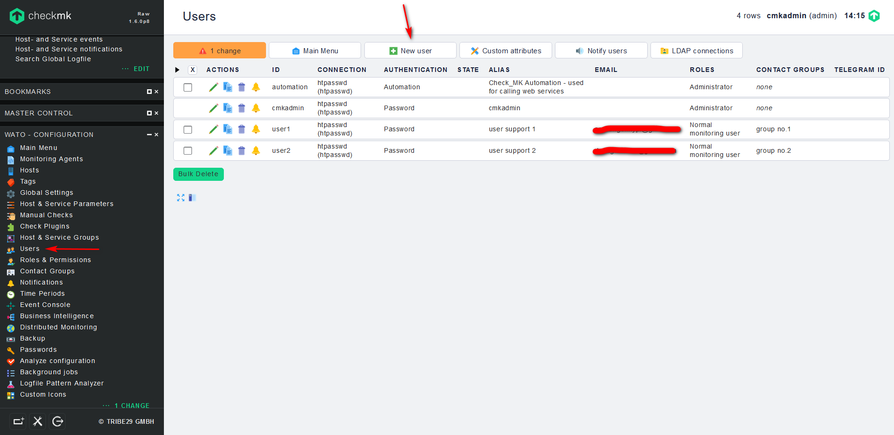

điền các thông tin cho user:

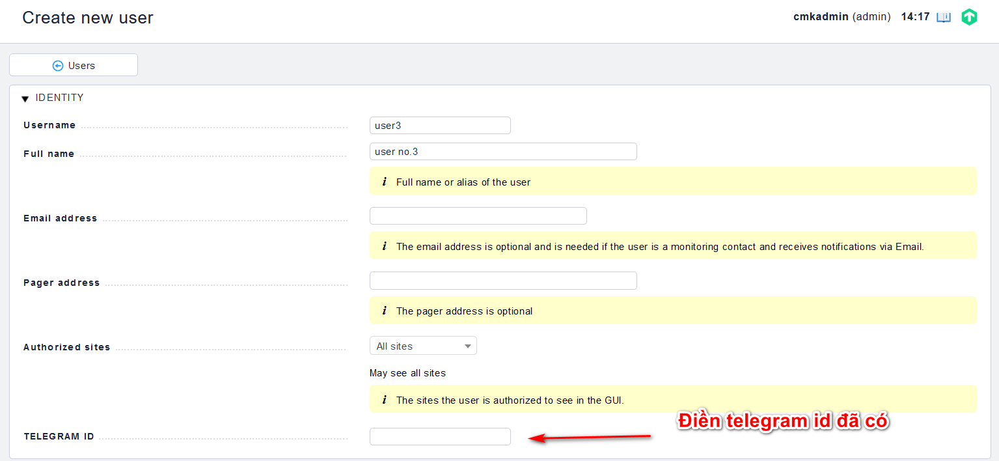

Tạo rule mới:

`WATO - CONFIGURATION`, chọn `Notifications` -> `New Rule`:

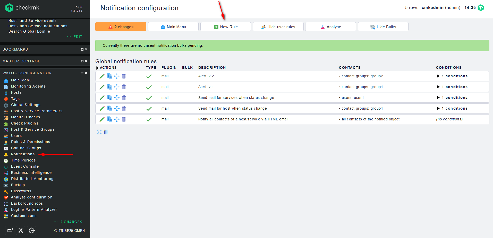

điền các thông tin và lưu lại:

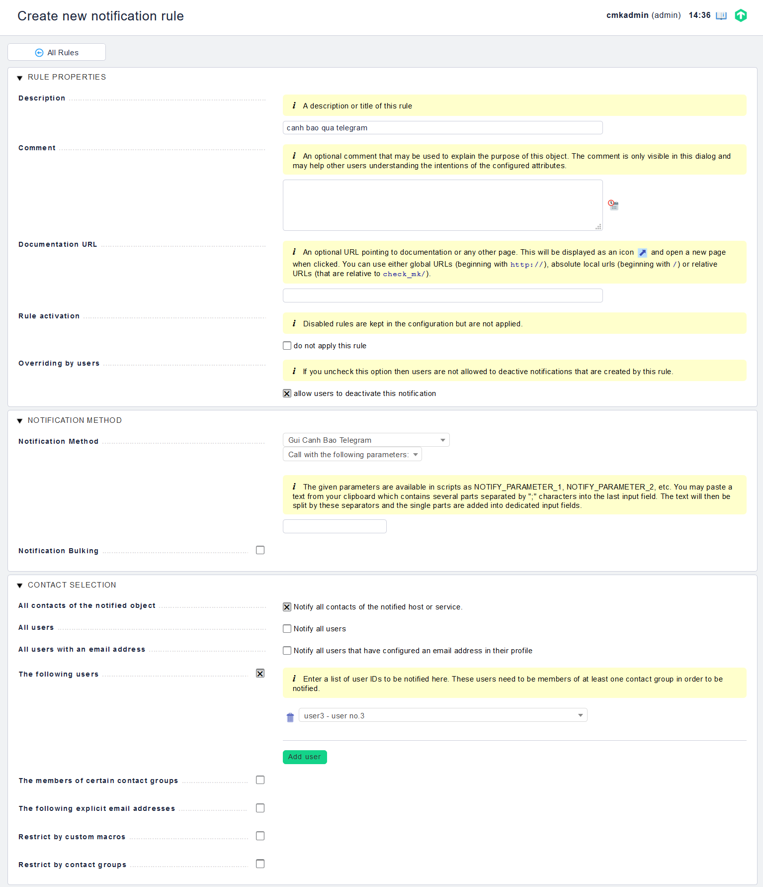

lưu lại các thay đổi:

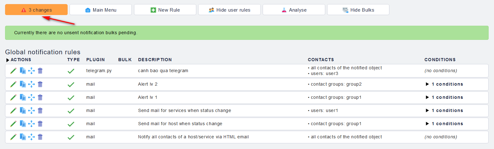

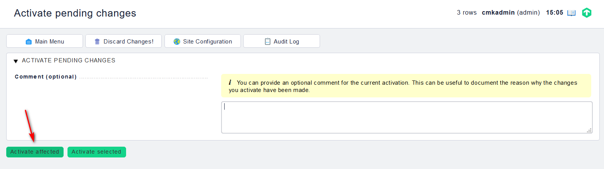

### Kiểm tra

Gửi cảnh báo kiểm tra

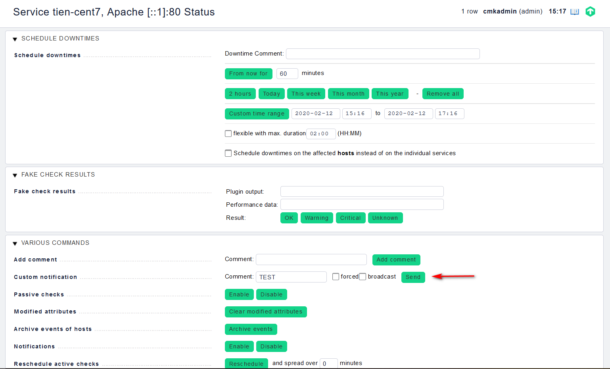

kết quả

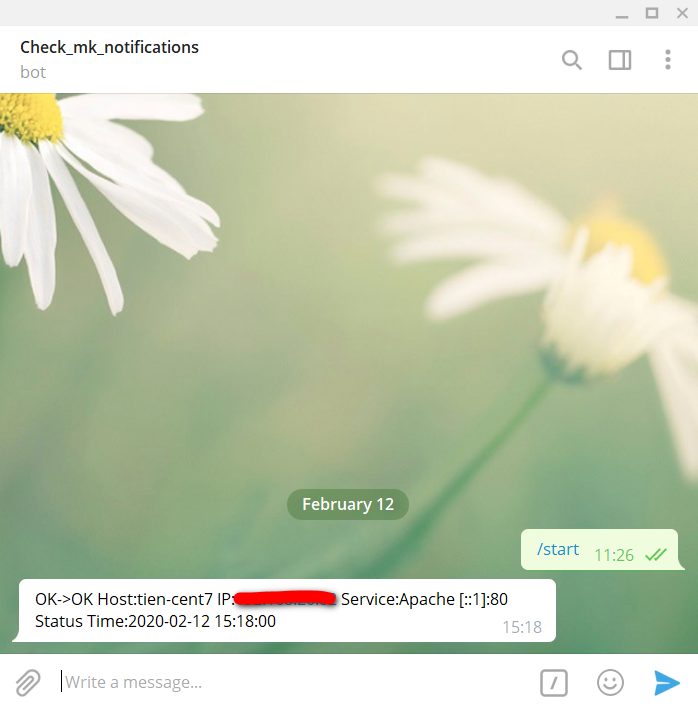