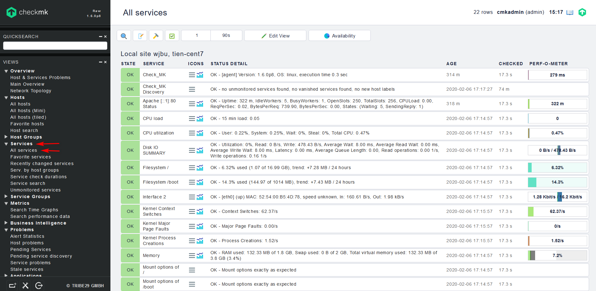
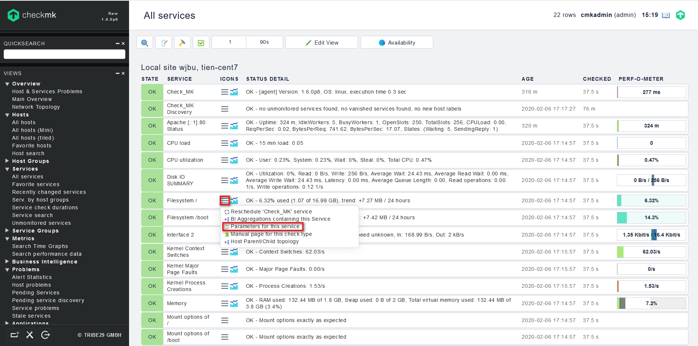
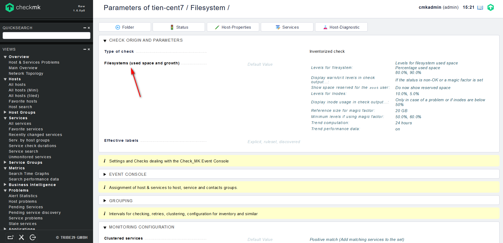
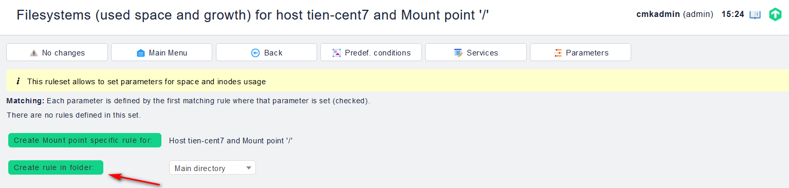
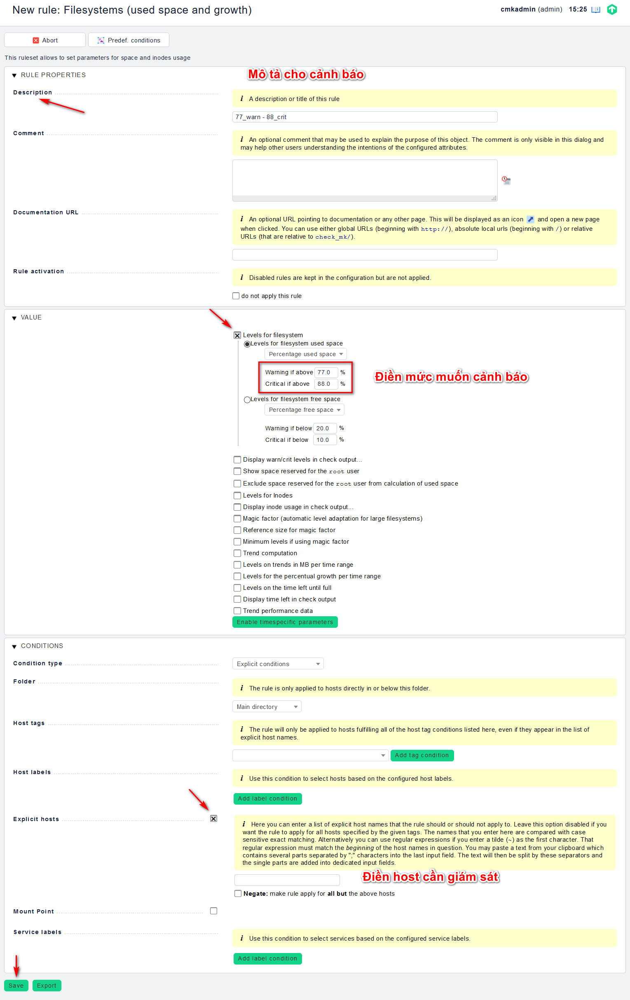
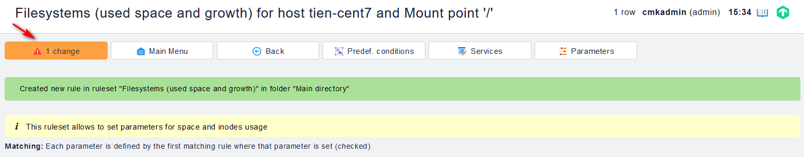
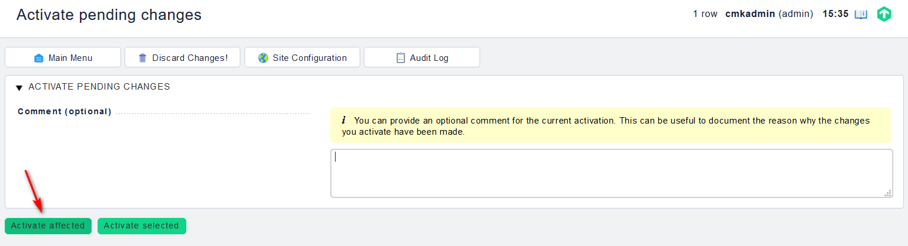

## Cấu hình ngưỡng cảnh báo trong Check_mk

Theo mặc định thì Check_mk đã có những ngưỡng cảnh báo cho từng dịch vụ, tuy nhiên những thông số đó chưa hẳn đã ổn đối với hệ thống của chúng ta vì thế chúng ta cần phải cấu hình lại ngưỡng cảnh báo của dịch vụ.

Thực hiện như sau:

- Trên Web UI, chúng ta tìm đến `VIEWS`, mở tab `Services` và chọn `All services`

- Trong ví dụ này, tôi sẽ đặt ngưỡng cảnh báo khi thư mục `/` được sử dụng 77% dung lượng thì cảnh báo `Warning` và 88% dung lượng là `Critical`. Bấm vào biểu tượng 3 que, chọn mục `Parameters for this service`

- Chọn `Filesystems (used space and growth)`:

- Chọn `Create rule in folder` để tạo rule mới:

- Điền các thông tin và lưu lại:

- Kích hoạt các thay đổi:

