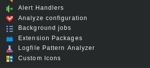
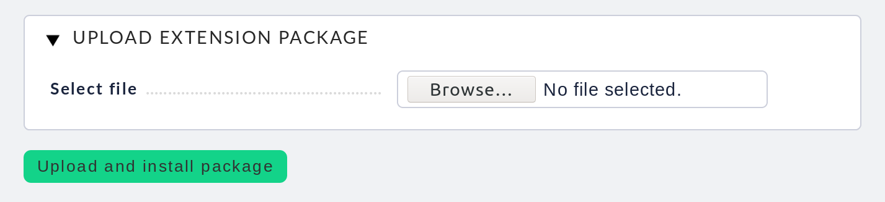
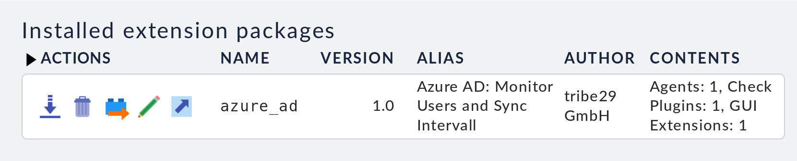
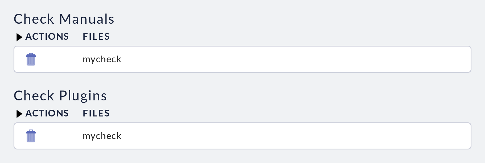
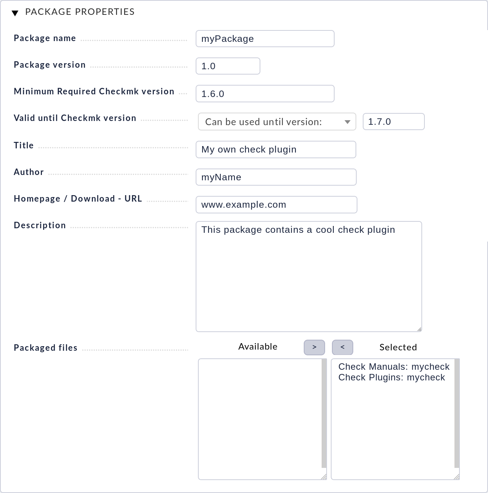
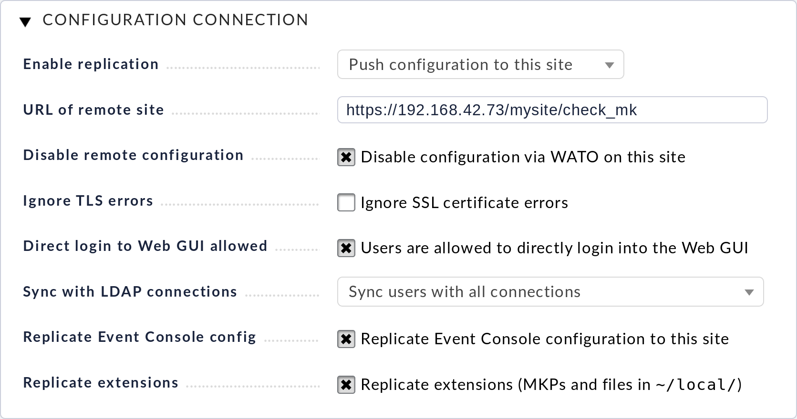

## Checkmk extension packages (MKPs)

Checkmk có cấu trúc mô đun cơ bản và nhiều thành phần của nó có thể được mở rộng bởi những người có kinh nghiệm lập trình Python.

Bạn có thể mở rộng Checkmk với các yếu tố sau:

- Own checks và agent plug-ins, kể cả input masks cho WATO
	
- Own plug-ins cho [Checkmk Inventory](https://checkmk.com/cms_inventory.html)
	
- Các tiện ích mở rộng cho GUI (views, dashboards, columns, icons, v.v.)
	
- Định nghĩa đồ thị hoặc Perf-O-Meters
	
- Các script cảnh báo và xử lý cảnh báo (bằng Shell hoặc bất kì loại ngôn ngữ script nào)

Tất cả các tiện ích mở rộng này được triển khai bằng cách lưu trữ các tệp trong thư mục `~/local` trong Checkmk instance. Để quản lý các tiện ích mở rộng này một cách hiệu quả, để triển khai chúng trong các môi trường phân tán và cũng để chia sẻ chúng với những người dùng khác, Checkmk cung cấp định dạng gói riêng của nó: gọi tắt là MKP - Checkmk Extension Package (Gói mở rộng Checkmk).

MKP thu thập bất kỳ số lượng tiện ích mở rộng nào - ví dụ: một bộ plugin kiểm tra bao gồm các trang hướng dẫn sử dụng, WATO mask và định nghĩa số liệu. Nó có tên, phiên bản và có thể được cài đặt hoặc gỡ bỏ với 1 thao tác đơn giản.

### Checkmk Exchange

Trên [Checkmk Exchange](https://checkmk.com/check_mk-exchange.php?), người dùng có thể cung cấp các gói cho mọi người và chia sẻ chúng với nhau. Tại đây, bạn có thể tải xuống và sử dụng các tiện ích mở rộng miễn phí. Xin lưu ý rằng các gói được cung cấp bởi người dùng khác một cách tự nguyện và không có bất kỳ đảm bảo nào - chúng có thể được lập trình không đúng và có thể gây ra sự cố với phiên bản Checkmk của bạn. Tất nhiên MKP cũng có thể chứa các lỗi chung có thể dẫn đến tất cả các loại lỗi khác hoặc thậm chí mất dữ liệu. Do đó, để thử một gói mới, trước tiên nên cài đặt nó trên một hệ thống thử nghiệm.

### Công cụ cho MKP

Có hai công cụ để quản lý MKP:

- Lệnh `mkp` được nhập từ dòng lệnh
	
- Extension Packages WATO module (chỉ có ở phiên bản Enterprise Editions - nghĩa là các bản CFE, CEE hoặc CME)

### Quản lý các gói mở rộng thông qua WATO

Trong WATO, bạn sẽ tìm thấy mô-đun  Extension Packages, trong đó bạn có thể quản lý MKP và thậm chí thay đổi chúng hoặc tạo mô-đun mới. Bạn có thể truy cập mô-đun như bình thường thông qua WATO:



- Cài đặt MKP

Một gói MKP mà bạn ví dụ được tải xuống từ Exchange, bạn có thể tải lên trong Checkmk và cài đặt bằng nút `Upload Package`. Đối với điều này, bạn cần tệp này trên máy tính mà trình duyệt web của bạn đang chạy. Tên của gói phải có phần mở rộng tệp `.mkp`



Trong quá trình cài đặt, các tệp được cài đặt ở đúng vị trí trong `~/local/`. Một tệp mô tả gói cũng được lưu trữ trong `~/var/check_mk/packages/`. Sau khi được tải lên, gói sẽ xuất hiện trong danh sách MKP đã cài đặt:



Bây giờ bạn chỉ cần thực hiện `Activate Changes` và tất cả các chức năng từ gói sẽ xuất hiện trong hệ thống và sẵn sàng để sử dụng.

- Gỡ cài đặt gói

Sử dụng các biểu tượng tương ứng trong danh sách các gói, bạn có thể "xóa" các gói đã cài đặt  hoặc "giải phóng" chúng . Khi xóa, gói sẽ bị xóa cùng với các tệp đã cài đặt và do đó phần mở rộng bị xóa. Vì vậy, điều này là ngược lại với một phần. Mặt khác, chức năng "release" sẽ khiến các tệp được đóng gói bên trong `~/local/` và chỉ xóa mô tả gói. Kết quả là các tệp sau đó được giải nén và các phần mở rộng vẫn hoạt động. Điều này ngược lại với việc tạo ra một gói.

- Tạo gói

Tạo gói MKP của riêng bạn rất dễ dàng (ngoài chi tiết nhỏ là các phần mở rộng tất nhiên phải được lập trình trước). Điểm khởi đầu là bạn đã tạo các tệp của riêng mình trong các thư mục tương ứng trong `~/local/`. Thư mục đúng cho các plugin kiểm tra của riêng bạn là `~/local/share/check_mk/checks` chẳng hạn. Các tệp này ban đầu không thuộc về bất kỳ gói nào và do đó được liệt kê trong `Unpackaged Files`:



Biểu tượng  sẽ đưa bạn đến hộp thoại để tạo ra một gói phần mềm mới:



Ngoài thông tin rõ ràng, điều quan trọng là bạn chọn ít nhất một tệp sẽ được đóng gói. Khi gói được tạo, nó được lưu trong `~/var/check_mk/packages/`, bao gồm danh sách các tệp cùng với thông tin chung.

Bạn có thể tải xuống gói này dưới dạng tệp MKP từ danh sách gói có biểu tượng  - ví dụ: để chuyển gói sang hệ thống khác hoặc tải tệp lên Exchange.

Lưu ý rằng nếu sau này bạn thực hiện thay đổi đối với các tệp được đóng gói, thì gói đó không phải tạo lại. Một bản tải xuống đơn giản của tệp MKP là đủ. Mặt khác, tất nhiên không thể cung cấp cho gói số phiên bản mới sau khi thay đổi.

### MKP trên dòng lệnh

Bạn cũng có thể thực hiện tất cả các hành động trên trên dòng lệnh. Lệnh `mkp` (thực ra là tên viết tắt của `cmk -P`) được sử dụng cho việc này:

```
OMD[mysite]:~$ mkp
Usage: check_mk [-v] -P|--package COMMAND [ARGS]

Available commands are:
   create NAME      ...  Collect unpackaged files into new package NAME
   pack NAME        ...  Create package file from installed package
   release NAME     ...  Drop installed package NAME, release packaged files
   find             ...  Find and display unpackaged files
   list             ...  List all installed packages
   list NAME        ...  List files of installed package
   list PACK.mkp    ...  List files of uninstalled package file
   show NAME        ...  Show information about installed package
   show PACK.mkp    ...  Show information about uninstalled package file
   install PACK.mkp ...  Install or update package from file PACK.mkp
   remove NAME      ...  Uninstall package NAME

   -v  enables verbose output

Package files are located in /omd/sites/mysite/var/check_mk/packages/.
```

- Cài đặt MKP

Một gói được cài đặt với lệnh `mkp install`. Để làm điều này, trước tiên bạn phải chuyển tệp MKP sang máy chủ giám sát (ví dụ: với scp). Việc cài đặt sau đó được thực hiện với một lệnh:

`mkp install [package]`

Bạn có thể nhận danh sách các gói đã cài đặt với lệnh:

`mkp list`

Bạn có thể tìm hiểu chi tiết về một gói duy nhất với `mkp show`:

`mkp show [package]`

- Gỡ cài đặt hoặc release gói

Một gói được gỡ cài đặt với lệnh `mkp remove`. Lệnh này xóa cả mô tả gói và tất cả các tệp mà nó chứa!

`mkp remove [package]`

Bạn có thể "release" một gói với lệnh `mkp release`. Các tệp mở rộng được giữ lại và chỉ mô tả gói bị xóa:

`mkp release [package]`

- Tạo một gói

Việc tạo MKP trên dòng lệnh tương tự như mô-đun WATO, chỉ là không được thuận tiện như trên web UI. Đầu tiên tạo tiện ích mở rộng của bạn trong các thư mục thích hợp trong `~/local/`. Bạn có thể tìm thấy tất cả các tệp chưa được đóng gói với lệnh `mkp find`.

Sử dụng lệnh `mkp create` để tạo một gói mới. Nhập tên mong muốn cho gói mới:

`mkp create [package]`

Chỉnh sửa các thuộc tính của gói với một trình soạn thảo văn bản.

Sau đó, bạn có thể tạo tệp MKP với lệnh `mkp pack`:

`mkp pack [package]`

### MKP trong môi trường phân tán

Với giám sát phân tán, việc cài đặt các gói trên site master là đủ. Đối với mỗi site con được kết nối, sau đó bạn có thể xác định xem có bất kỳ thay đổi nào sẽ được chuyển đến site của bạn không. Tất cả bạn phải làm là kích hoạt tùy chọn `Extensions`. Sau đó, các tệp MKP và tất cả các thay đổi khác trong thư mục `~/local` sẽ được chuyển trong quá trình đồng bộ hóa.



Nếu quá trình transfer không được như mong muốn, chỉ cần tắt tùy chọn này hoặc cho tất cả các site.

> Các thay đổi chỉ được chuyển nếu tùy chọn `Enable replication` được đặt thành `Push configuration to this site`.