## Dashboard

### 1. Introduction

Giao diện người dùng đồ họa (GUI) dựa trên web của Check_mk có hai chức năng:

- Nó hiển thị trạng thái hiện tại của tất cả các máy chủ, dịch vụ và sự kiện.

- Nó được sử dụng để cấu hình Check_mk. Các mô-đun có liên quan được gọi là WATO .

Một tính năng của giao diện của Check_mk là nó có thể đồng thời hiển thị và định cấu hình nhiều phiên bản giám sát và sau đó hoạt động như một hệ thống lớn. Ảnh chụp màn hình sau đây cho thấy giao diện chính Check_mk ngay sau khi đăng nhập:

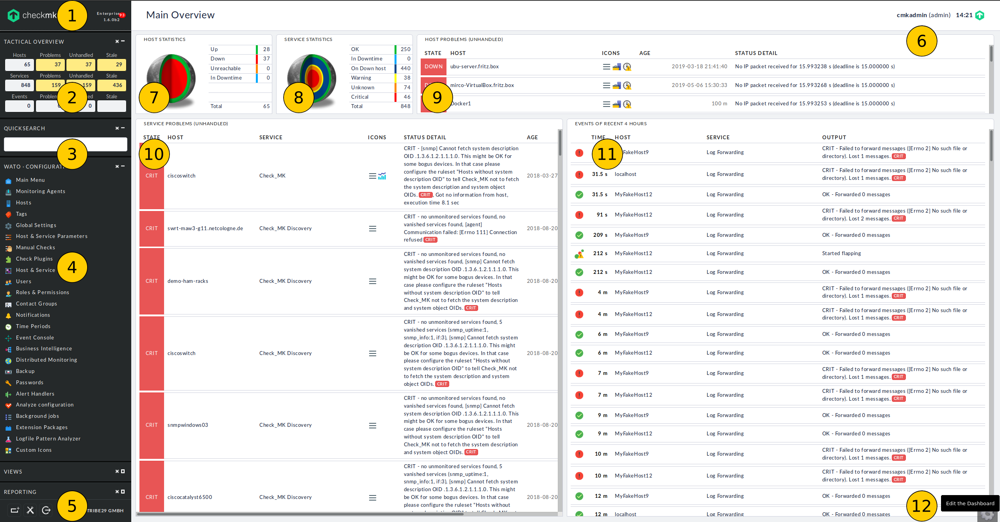

Tại đây bạn có thể thấy các yếu tố sau:

| 1 | Phiên bản Check_mk được cài đặt. Nhấp vào số phiên bản sẽ mở ra một bản tóm tắt các bản cập nhật cho phiên bản này |
| --- | --- |
| 2 | *Tactical Overview*: số lượng các host và service được theo dõi, các vấn đề hiện tại và số lượng các vấn đề unhandled. Bạn có thể nhấp vào những con số này và sẽ nhận được một bản tóm tắt về chúng. Các vấn đề từ các dịch vụ của các host `DOWN` sẽ không được đưa vào đây! |
| 3 | Quick search: để tìm kiếm các host và service |
| 4 | Views cung cấp quyền truy cập vào các tab hiển thị khác nhau của host, service và thông tin khác từ giám sát hiện tại |
| 5 | Ở cạnh dưới của phần sidebar có 3 nút theo thứ tự nút đầu tiên sẽ tùy chỉnh phần sidebar, nút thứ 2 là đến cài đặt cá nhân và cuối cùng là logout khỏi giao diện Check_mk |
| 6 | Trong tiêu đề của mỗi trang, bạn sẽ tìm thấy tên của người dùng đã đăng nhập, vai trò của họ và timestamp cho lần làm mới cuối cùng của trang |
| 7 | *Host Statistics* cho thấy số lượng các host ở các trạng thái khác nhau - theo số lượng và được biểu diễn bằng đồ thị theo đúng tỷ lệ |
| 8 | *Service Statistics* hiển thị các service, cũng giống như phần *Host Statistics* |
| 9 | 1 danh sách tất cả các vấn đề unhandled của các host. Nhấp vào tiêu đề để xem chi tiết hơn |
| 10 | Các unhandled service, giống mục 9 |
| 11 | Ghi lại các event được giám sát trong 4 tiếng |
| 12 | Nút để tùy chỉnh dashboard |

Dashboard ở phía bên phải có thể được tùy chỉnh, xem thêm ở [đây](https://checkmk.com/cms_dashboards.html)

### 2. WATO

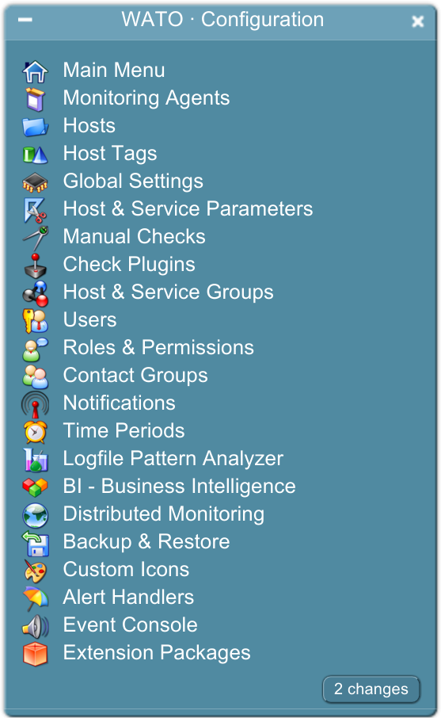

Check_mk phân biệt giữa monitoring nơi bạn xem trạng thái các host/service và configuration environment trong đó bạn duy trì những host/service và các cài đặt.

Thay đổi trong cấu hình - ví dụ: thêm host mới - ban đầu sẽ không có hiệu lực trong việc giám sát. Thay đổi trước tiên phải được kích hoạt (bằng cách *Activate Changes* ) để có hiệu lực. Điều này có vẻ hơi cồng kềnh, nhưng nó có lợi thế là những thay đổi phức tạp hơn có thể được chuẩn bị. Ví dụ: sau khi thêm host mới, bạn có thể muốn xác định ngưỡng hoặc xóa một số service trước khi 'kích hoạt' thành phần mới.

Các công cụ để cấu hình Check_mk qua GUI được gọi là WATO ( Web Administration Tool ). WATO duy trì tất cả các cấu hình ở định dạng dữ liệu văn bản thông thường mà người dùng có kinh nghiệm có thể chỉnh sửa thủ công hoặc thậm chí tạo bằng các script. Có thể truy cập WATO thông qua các mục tương ứng trong sidebar. Các mục này được bao gồm dưới dạng tiêu chuẩn và cung cấp quyền truy cập trực tiếp vào tất cả các mô-đun WATO.

Bất cứ khi nào bạn thực hiện thay đổi cấu hình giám sát bằng cách sử dụng WATO, thay đổi này trước tiên sẽ được chọn và giữ dưới dạng *pending*. Những thay đổi như vậy có thể được xác định bằng nút trong các mô-đun WATO và tương ứng là nút trong sidebar. Cả hai nút này đều mở danh sách các thay đổi:

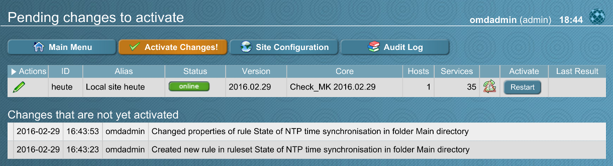

Với nút *Activate Changes*, dữ liệu cấu hình từ WATO sẽ được sử dụng để tạo cấu hình mới cho lõi giám sát và hướng dẫn lõi bắt đầu ngay lập tức bằng cách sử dụng cấu hình mới:

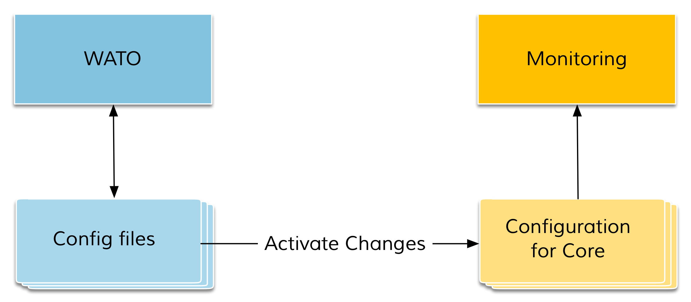

Danh sách các thay đổi đang chờ xử lý sau đó sẽ bị xóa. Tuy nhiên, những mục này không bị mất, chúng có thể được gọi bằng nút *Audit Log* . Tại đây bạn có thể tìm thấy một tệp nhật ký của tất cả các thay đổi đã được thực hiện bằng cách sử dụng WATO.

#### Các mô-đun quan trọng của WATO

WATO bao gồm nhiều mô-đun - một mô-đun đại diện cho 1 khía cạnh quan trọng của Check_mk. Các mô-đun sau đây đặc biệt quan trọng:

| Mô đun | Chức năng |
| --- | --- |
| *Main Menu* | Một danh sách tất cả các mô-đun WATO, mỗi mô-đun có một mô tả ngắn |
| *Monitoring Agents* | Tại đây bạn sẽ tìm thấy các Check_mk agent cho Linux, Windows và các hệ điều hành khác. Trong Phiên bản Enterprise Editions, bạn cũng có thể định cấu hình, đóng gói và tự động cập nhật các agent thông qua WATO |
| *Hosts* | Quản lý các host được giám sát - có lẽ là mô-đun quan trọng nhất |
| *Global Settings* | Global Settings - những cài đặt không áp dụng cho host, service hoặc người dùng cụ thể |
| *Host & Service Parameters* | Tất cả các cài đặt cho host hoặc service cụ thể được tìm thấy ở đây. Thủ tục cấu hình dựa trên [quy tắc](https://checkmk.com/cms_wato_rules.html) |

### 3. Views

Nhiệm vụ quan trọng nhất được thực hiện bởi giao diện người dùng của Check_mk là hiển thị trạng thái hiện tại của host và service. Điều này đạt được chủ yếu một phần bởi giao diện Views. Để các hoạt động hàng ngày chạy hiệu quả nhất có thể, các bảng này cung cấp nhiều chức năng và chúng có thể được tùy chỉnh để đáp ứng yêu cầu của bạn.

Global view được truy cập dễ dàng nhất thông qua phần *Tactical Overview* và *Views*. Trong Tactical Overview , ta có thể click vào mỗi trường, liệt kê riêng các host hoặc service được tính trong từng trường hợp tương ứng.

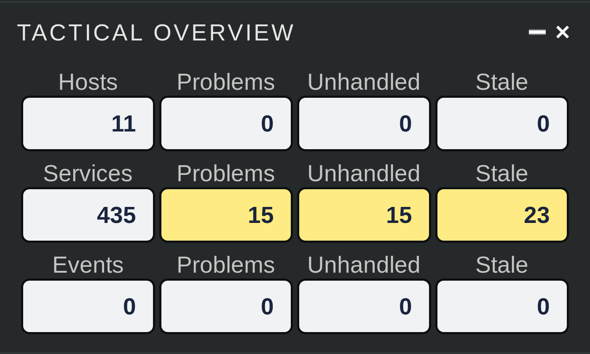

Trong phần *Views*, tất cả các mục global views đều có thể truy cập - được nhóm theo chủ đề.

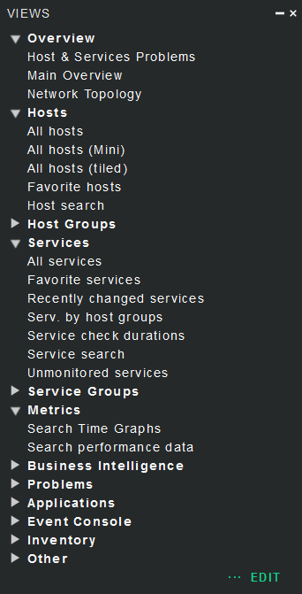

Từ đây, ta có thể truy cập các chi tiết cho một host hoặc service cụ thể.

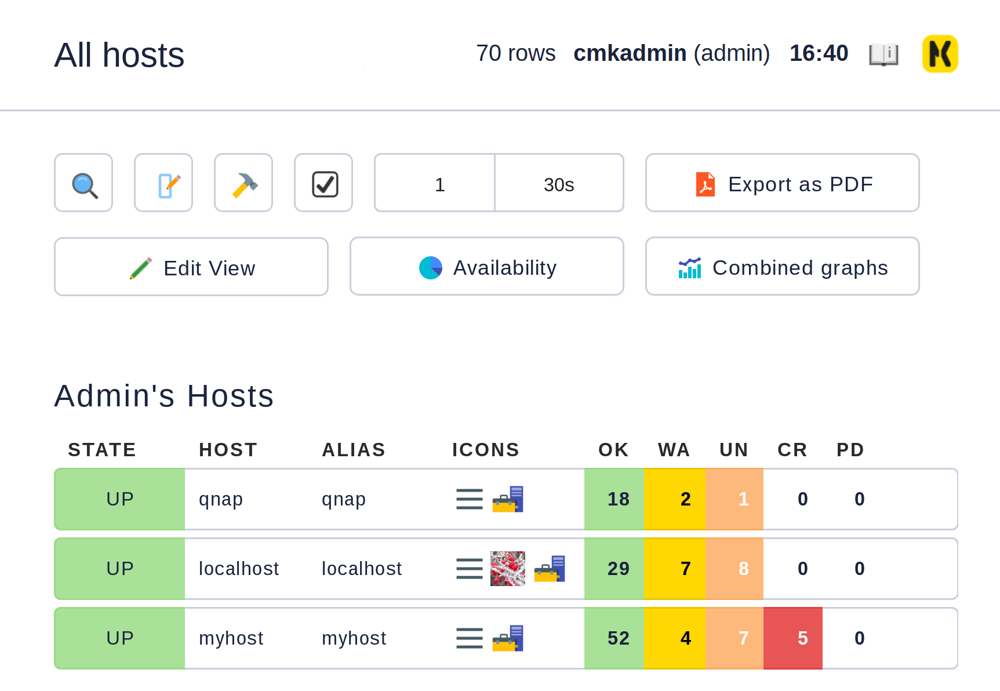

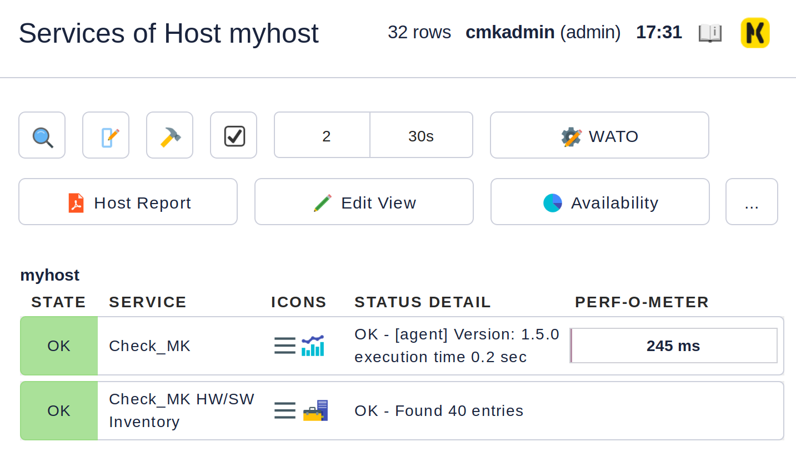

#### Tùy chọn, bộ lọc và lệnh

Ở phía trên bên trái của mỗi mục Views, có sáu biểu tượng mà bạn có thể tác động đến các hành động hiển thị và kích hoạt:

|  | Mở hộp thoại với các bộ lọc. Với điều này, bạn có thể tiếp tục giới hạn dữ liệu được hiển thị. Thay đổi đối với các bộ lọc không được lưu, thay vào đó chúng được đặt lại khi bạn thoát |
| --- | --- |
|  | Mở các tùy chọn hiển thị mà bạn có thể, ví dụ: xác định định dạng dữ liệu thời gian (tương đối hoặc tuyệt đối). Những tùy chọn có sẵn tùy thuộc vào những gì phù hợp với thông tin được hiển thị trong chế độ xem |
|  | Tại đây bạn có thể thực thi các lệnh trên đối tượng được hiển thị (ví dụ: downtime theo lịch trình). Các lệnh được mô tả chi tiết tại [đây](https://checkmk.com/cms_commands.html) |
|  | Với điều này, bạn bật hoặc tắt checkbox. Với các checkbox, bạn có thể giới hạn các lệnh trong các tập dữ liệu đã chọn |
|  | Nó xác định số lượng cột cho chế độ xem được chọn. Chế độ xem với nhiều cột cho phép khai thác không gian trên màn hình rộng hơn. Đối với các chế độ xem chỉ hiển thị một bộ dữ liệu, cài đặt này không có hiệu lực |
|  | Xác định khoảng thời gian làm mới của chế độ xem. Bạn cũng có thể vô hiệu hóa làm mới tự động. Xin lưu ý rằng trong trường hợp này, có thể bạn sẽ không được thông báo về các vấn đề xảy ra trong thời gian này! |

#### Sắp xếp

Các khung view dạng bảng có thể được sắp xếp bằng cách nhấp vào tiêu đề cột. Một cột có ba trạng thái có thể được chọn trong một vòng lặp gồm nhiều lần nhấp:

- sắp xếp theo thứ tự tăng dần

- sắp xếp theo thứ tự giảm dần

- cột chưa được sắp xếp

Views ban đầu được sắp xếp "tự nhiên" theo cách xác định chế độ xem. Trong danh sách service, việc sắp xếp là theo thứ tự chữ cái tương ứng tên service - ngoại trừ các service Check_MK luôn đứng đầu. Các service Check_MK trách nhiệm quản lý các agent giám sát. Ngoài ra còn có các service Check_MK Discovery và Check_MK HW/SW Inventory.

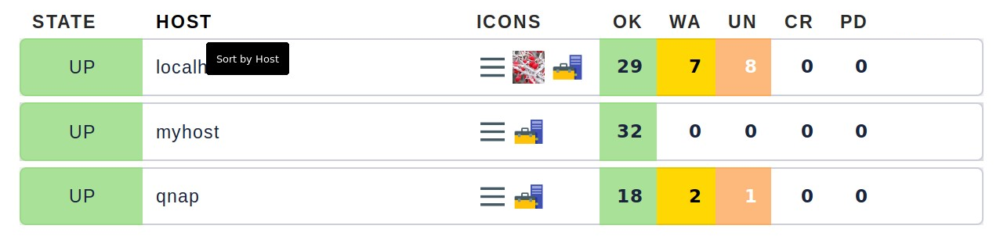

Sắp xếp theo cột Perf-O-Meter đôi khi tạo ra kết quả đáng ngạc nhiên. Điều này là do hiển thị đồ họa của các giá trị một phần là so sánh tỷ lệ phần trăm của các giá trị thực tế. Tuy nhiên, việc sắp xếp được thực hiện theo các giá trị tuyệt đối và luôn dựa trên metric đầu tiên được tạo bởi một service.

#### Export

Dữ liệu được hiển thị trong chế độ xem có thể được xuất theo nhiều định dạng:

- PDF: chỉ dành cho phiên bản Enterprise Editions

- CSV: nhấn vào nút  ở bên dưới

- JSON: nhập `&output_format=json` vào URL field của view. Điều này được thực hiện với biểu tượng  ở cuối trang

- JSONP: gần giống như JSON, nhưng cú pháp gọi một thủ tục Javascript. Nhập `jsonp` dưới định dạng và tương tự tên của thủ tục JSON trong biến `jsonp`, ví dụ: Example: `...&output_format=jsonp&jsonp=myfunc`

- Python: Xuất dưới dạng cấu trúc dữ liệu Python giống như JSON, trong đó bạn nhập `output_format=python` cho định dạng. Điều này đặc biệt thiết thực nếu bạn muốn tiếp tục xử lý dữ liệu trực tiếp trong tập lệnh Python

#### Display limit

Trong một môi trường giám sát lớn hơn, hiển thị tất cả các khung view không còn thực tế nữa. Ví dụ khi bạn đang theo dõi 50.000 service và chọn chế độ `All service`, sẽ yêu cầu một khaoảng thời gian rất dài và nó cũng sẽ không hữu dụng.

Trong các tình huống như vậy, views được giới hạn ở 1000 mục. Vượt quá giới hạn này sẽ tạo ra cảnh báo sau:

Nếu bạn thực sự muốn xem hơn một nghìn bộ dữ liệu, nhấp vào *Repeat query and allow more results*. Ở đây giới hạn là 5.000 bộ dữ liệu. Tuy nhiên, vẫn có thể xem nhiều hơn 5000 mục dữ liệu. Trong trường hợp này là một hành động tiềm ẩn rủi ro, bạn sẽ được yêu cầu quyền Quản trị viên.

Bạn có thể xác định cả hai cấp độ trong `WATO ➳ Global Settings` bên dưới phần `User interface`:

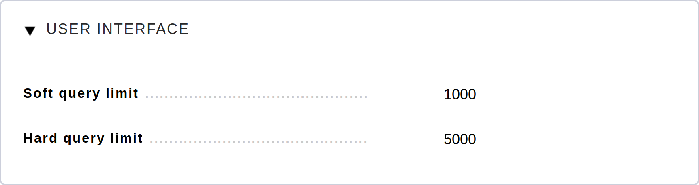

#### Creating new views

Tạo một chế độ xem mới với các chức năng về nguyên tắc giống như chỉnh sửa chế độ xem cũ - với một sự khác biệt nhỏ: trước tiên bạn phải chọn **nguồn dữ liệu** và **loại đối tượng cụ thể**

- Nguồn dữ liệu

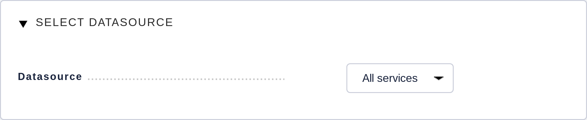

Nguồn dữ liệu có thể được mô tả như một bảng trong cơ sở dữ liệu SQL. Checkmk không sử dụng các cơ sở SQL-Data, nhưng có cấu trúc tương tự bên trong. Trong hầu hết các trường hợp, bạn sẽ đúng với *All services* hoặc *All hosts*. Tuy nhiên, có một số nguồn dữ liệu cần được liệt kê ngắn gọn:

| Data source | Ý nghĩa |
| --- | --- |
| Host and service groups, various | Xem bên dưới |
| *Alert Statistics* | thống kê trạng thái |
| *BI, various* | Business Intelligence |
| *Event Console*, host and service events | Event Console |
| *Inventory*, various | inventory items |
| *The Logfile* | Livestatus data |

- Host and service groups

Các nguồn dữ liệu *Hostgroups* và *Servicegroups* cung cấp thông tin về chính nhóm trên mỗi dòng - không có bộ lọc cho các host hoặc service riêng lẻ tương ứng. Một ví dụ về nguồn dữ liệu này là chế độ xem mặc định *Host groups* (Tóm tắt). Trong các môi trường phân tán, các nguồn dữ liệu *Hostgroups, merged and Servicegroups*, được hợp nhất thực hiện giống hệt nhau.

Tuy nhiên, nếu bạn muốn thông tin về các host riêng lẻ, chỉ được nhóm theo host groups, bạn có thể sử dụng *Hosts grouped by host groups*. Ở đây, mỗi host được liệt kê một lần cho mỗi nhóm mà nó thuộc về, như được thấy trong chế độ xem mặc định *Host groups*.

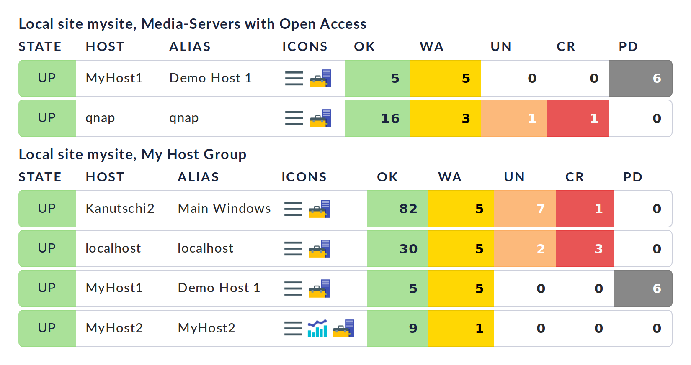

Bạn có thể tiến hành theo cách tương tự với các services

Tùy thuộc vào nguồn dữ liệu đã chọn, các cột khác nhau có sẵn để xây dựng chế độ xem.

- Object type

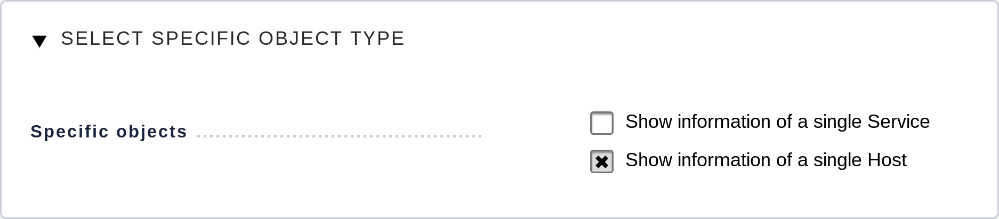

Ở đây có thể quyết định xem chế độ xem mới của bạn nên có bối cảnh hay liệu đó sẽ là global view. Các lựa chọn có sẵn cho bạn phụ thuộc vào nguồn dữ liệu. Bối cảnh phổ biến nhất cho đến nay là 'Host'. Hình ảnh trên xuất hiện sau khi chọn nguồn dữ liệu *All services*.

Kiểm tra thông tin *Show information of a single host* xác định rằng chế độ xem mới mô tả một host cụ thể. Do đó, bạn đã tạo cơ sở cho chế độ xem không phải global mà chỉ hiển thị qua liên kết:

	- Đối với host view với nút ngữ cảnh (có thể ẩn phía sau 

	- Là một liên kết trong một cột (ví dụ: nhấp vào tên máy chủ trong dạng view)

Có hai khả năng cho loại ngữ cảnh Services: Nếu bạn chỉ chọn *Show information of a single service*, bạn có thể tạo chế độ xem hiển thị tất cả các services có cùng tên trên các host khác nhau. Nếu đó phải là một service cụ thể cho một host, thì hãy chọn {{Show information of a single host}}.