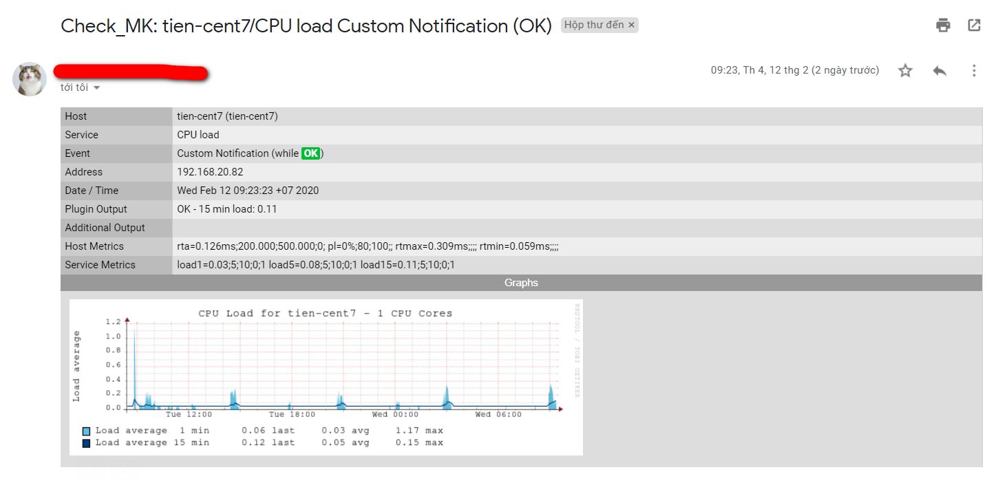
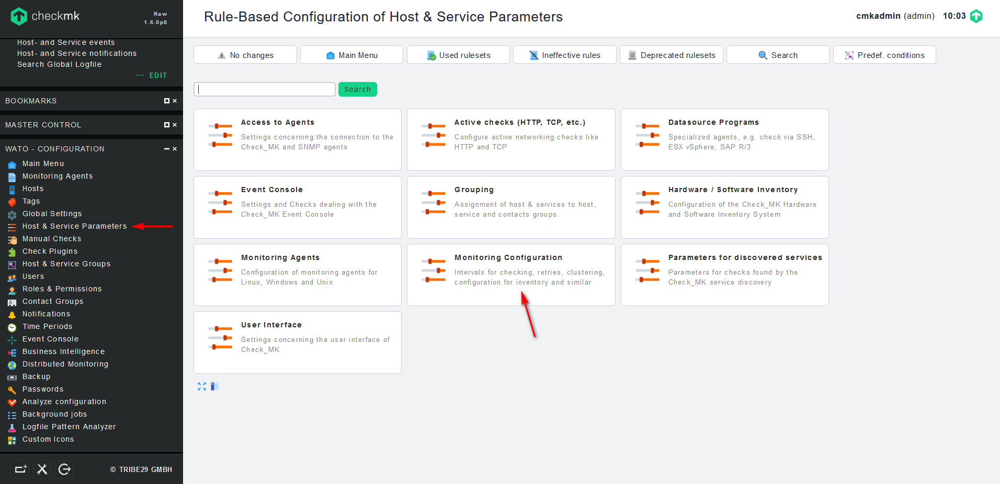
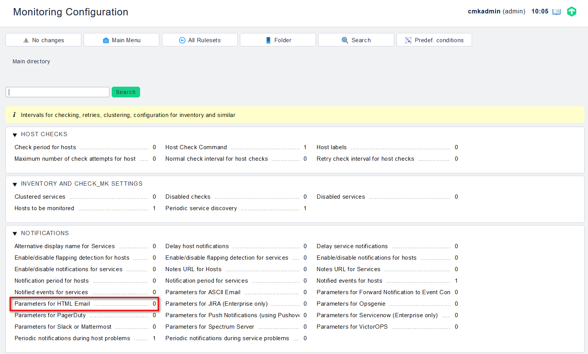
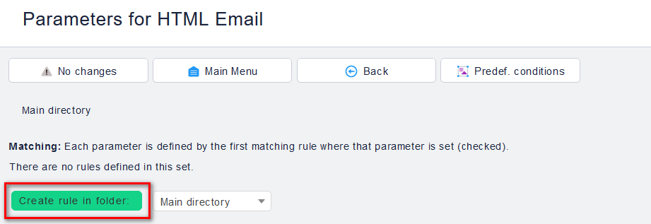
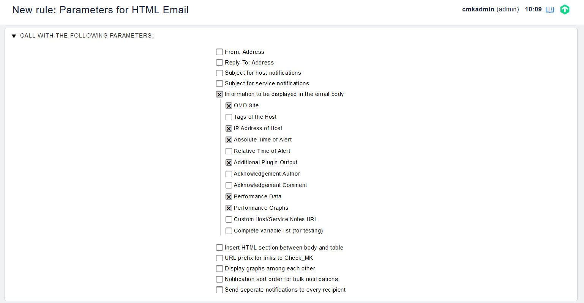
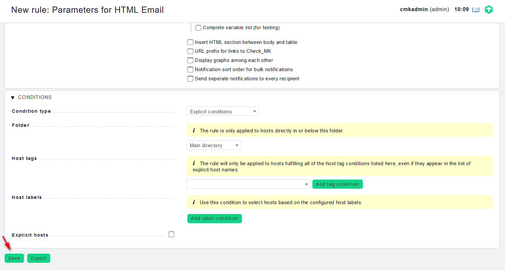

## Chỉnh sửa bản tin mail cảnh báo Check_mk

Trong hướng dẫn này, bản tin mail cảnh báo của OMD đang để định dạng là HTML, do vậy hướng dẫn này sẽ hướng dẫn chỉnh sửa format của mail cảnh báo HTML

Định dạng mail cảnh báo HTML có dạng như sau:

Muốn chỉnh sửa nội dung của bản tin mail này cho phù hợp để theo dõi hơn, làm theo các bước sau (có thể chỉnh để hiển thị thêm hoặc bớt thông tin theo dõi)

- Bước 1: Trên giao diện WEB `WATO - CONFIGURATION` chọn mục `Host & Service Parameters` -> `Monitoring Configuration`

- Bước 2: Trên giao diện của `Monitoring Configuration` chọn mục `Parameters for HTML Email`

- Bước 3: Tạo rule cho mail cảnh báo

- Bước 4: Chỉnh sửa email cảnh báo

1 số option để chỉnh sửa như sau:

`OMD site`: tên site

`IP Address of Host`: Hiển thị tên của host hoặc địa chỉ IP trong nội dung mail cảnh báo

`Absolute Time of Alert`: Thời gian chính xác cảnh báo gửi đến

`Additional Plugin Output`: Thông tin về sự kiện mà có cảnh báo

`Performance Data`: Dữ liệu thu thập được

`Performance Graphs`: Hiển thị biểu đồ của dữ liệu

- Bước 5: Lưu lại thông tin về Rule

> Lưu ý: Để chỉnh sủa nội dung cảnh báo trên kênh Slack ta cũng làm tương tự trong mục `Parameters for Slack or Mattermost`