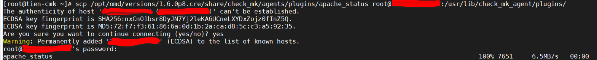
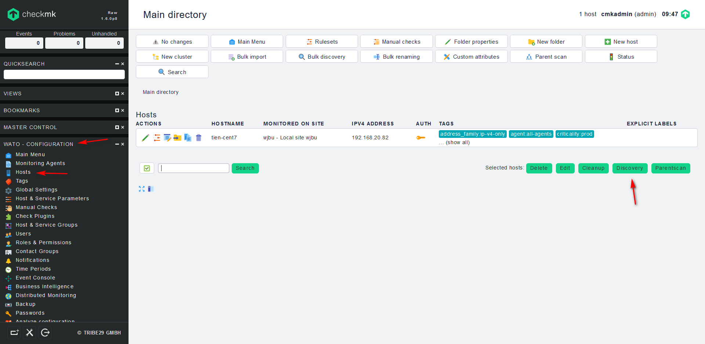
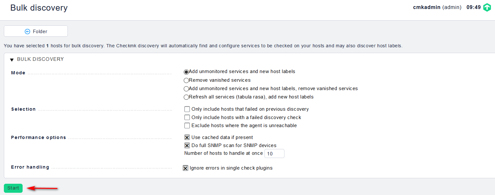
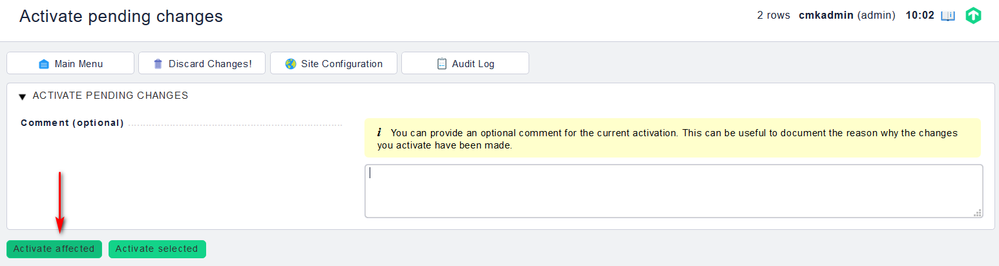
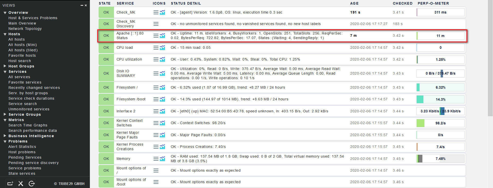
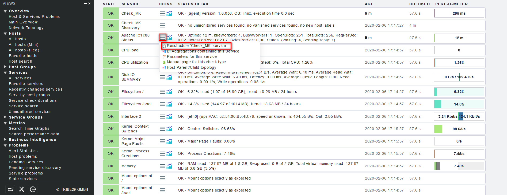

## Giám sát Apache bằng Check_mk

Chúng ta sẽ thực hiện giám sát 1 máy chủ CentOS 7 cài web server apache (httpd).

- Kiểm tra dịch vụ httpd trên host cần giám sát:

`rpm -qa | grep httpd`

- Nếu chưa được cài, hãy cài với câu lệnh:

`yum install -y httpd`

- Mở file cấu hình `/etc/httpd/conf/httpd.conf` của `httpd` trên host apache và thêm đoạn module sau:

```
<IfModule mod_status.c>
<Location /server-status>
SetHandler server-status
Order deny,allow
Deny from all
Allow from 127.0.0.1 ::1
</Location>
# Keep track of extended status information for each request
ExtendedStatus On
</IfModule>
```

- Trên server Check_mk, sủ dụng `scp` copy plugin qua host cần giám sát:

`scp /opt/omd/versions/1.6.0p8.cre/share/check_mk/agents/plugins/apache_status root@ip_host_apache:/usr/lib/check_mk_agent/plugins/`



- Phân quyền cho plugin trên host apache:

`chmod +x /usr/lib/check_mk_agent/plugins/apache_status`

- Trên Web UI, chọn `WATO - CONFIGURATION` -> `Hosts` -> `Discovery`:



sau đó chọn `Start`:



chọn `Activate affected`



kiểm tra lại:



nếu vẫn chưa load, bấm chuột trái vào nút có biểu tượng 3 que, chọn `Reschedule 'Check_MK' service`

