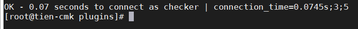
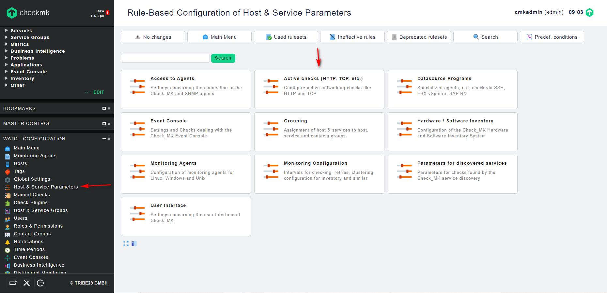
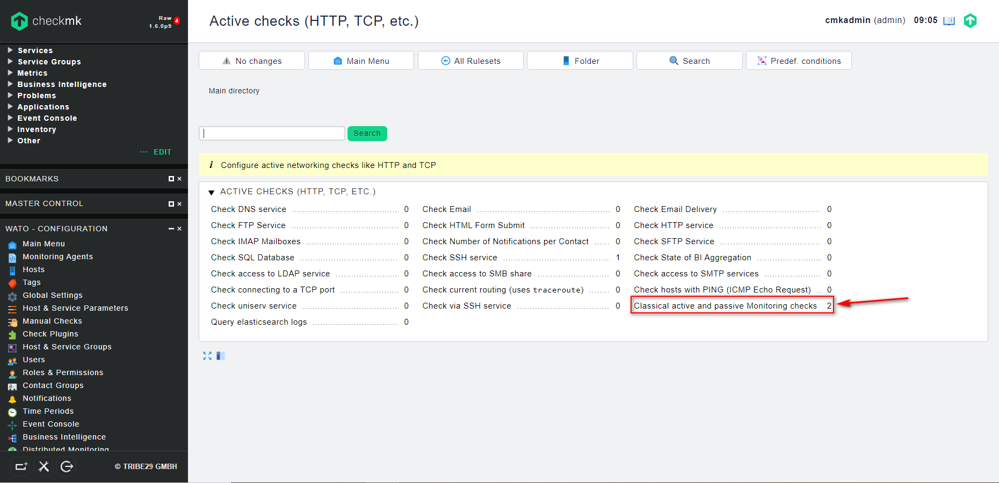
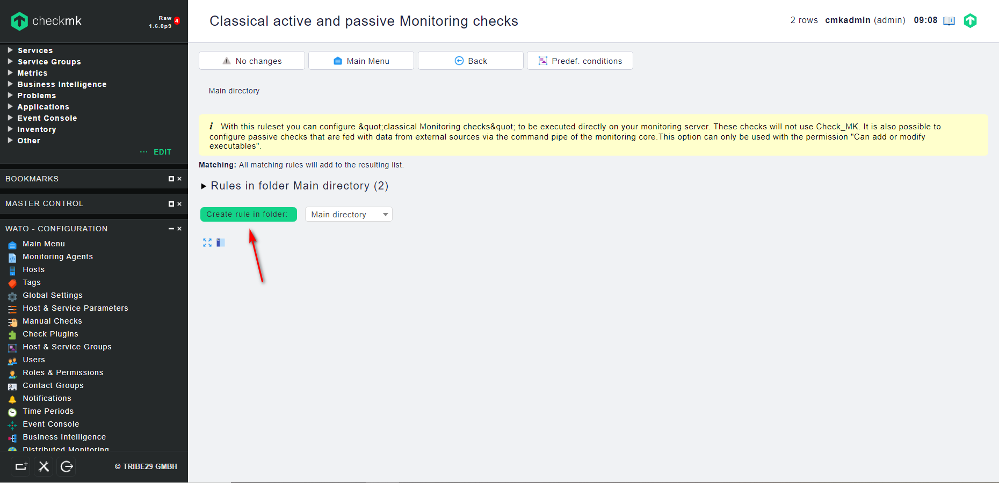
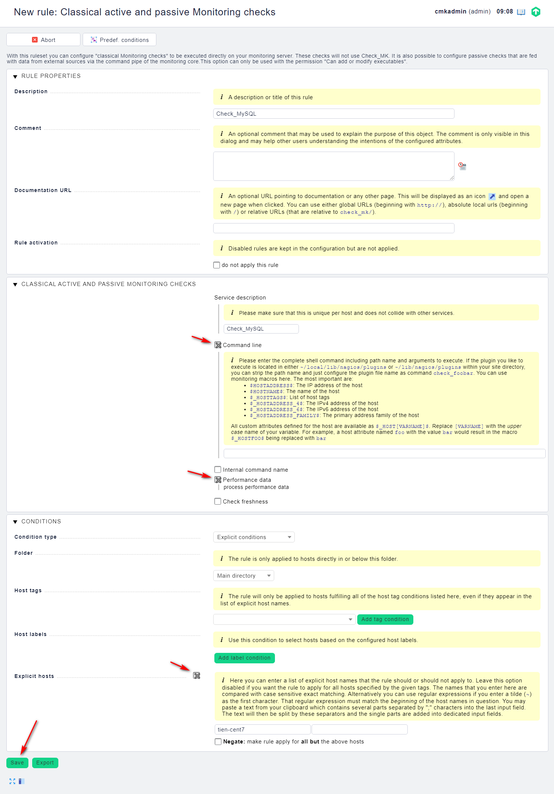
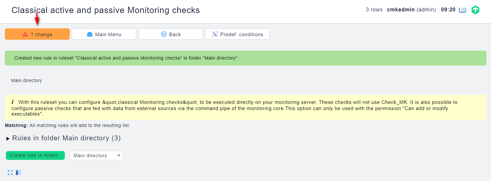
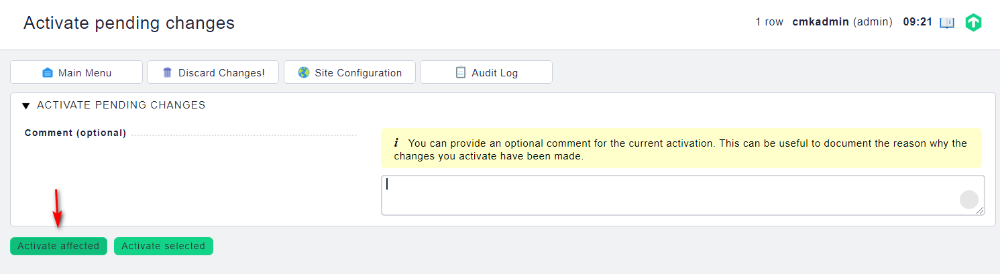
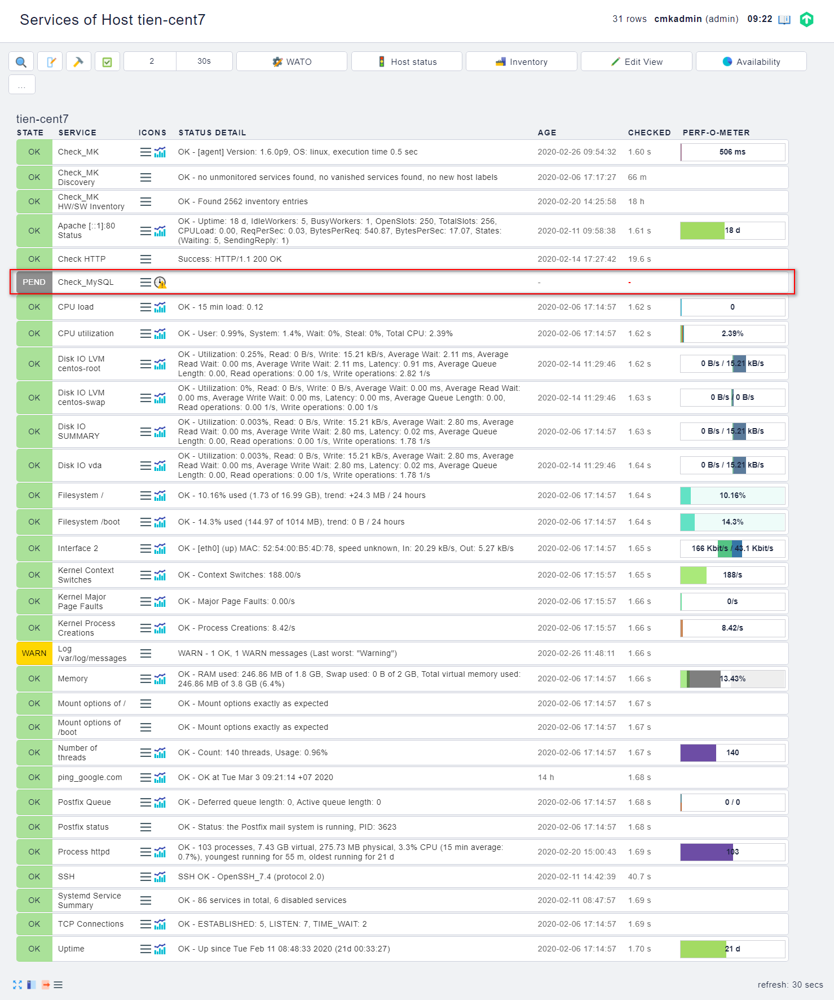
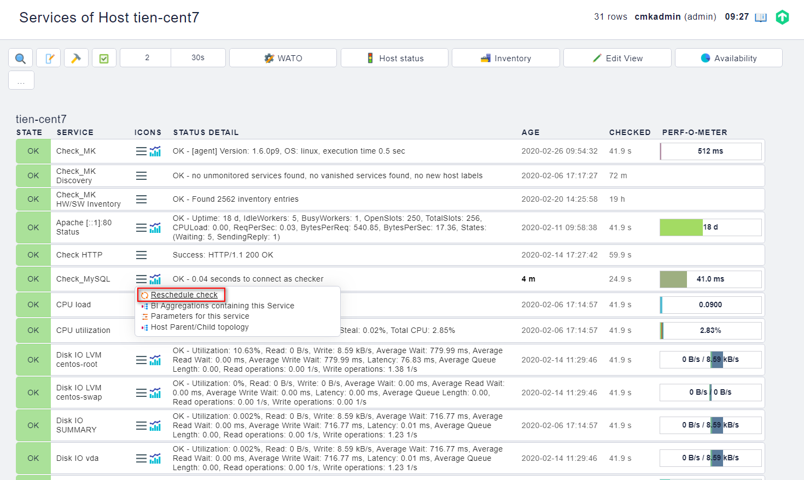

## Giám sát MySQL

### Chuẩn bị

#### Chuẩn bị trên host MySQL

- Bind địa chỉ của server database:

Sửa file `/etc/my.cnf.d/server.cnf` và thêm ở phần [mysqld-x.x]

`bind-address = 0.0.0.0`

- Restart mariadb service:

`systemctl restart mariadb`

- Tạo user kiểm tra cho Check_mk:

Ta cần tạo một USER có quyền USAGE trên host DB

Đăng nhập vào MySQL:

`mysql -u root -p`

Thực hiện câu lệnh sau:

`GRANT usage ON *.* TO 'checker'@'%' IDENTIFIED BY 'password_checker';`

- Tắt firewall:

```
systemctl stop firewalld
systemctl disable firewalld
```

#### Chuẩn bị trên server Check_mk

- Cài đặt các gói đi kèm:

Thêm repo của MariaDB:

```
cat > /etc/yum.repos.d/MariaDB.repo <<\EOF
[mariadb]
name = MariaDB
baseurl = http://yum.mariadb.org/10.3/centos7-amd64
gpgkey=https://yum.mariadb.org/RPM-GPG-KEY-MariaDB
gpgcheck=1
EOF
```

Cài gói MariaDB-client và DBI, DBD-mysql:

`yum install -y MariaDB-client perl-DBI perl-DBD-MySQL`

- Kiểm tra plug-in trên server Check_mk:

Kiểm tra plugin `check_mysql_health` trong thư mục chứa plugin của Check_mk. Vì plugin này đã tích hợp sẵn. Plug-in này sẽ nằm bên trong thư mục `/opt/omd/versions/1.6.0p9.cre/lib/nagios/plugins/`

> thay `1.6.0p9.cre` bằng versions bạn đang sử dụng

`cd /opt/omd/versions/1.6.0p9.cre/lib/nagios/plugins/`

`./check_mysql_health --hostname ip_node_mysql --username checker --password password_checker --mode connection-time --warning 3 --critical 5`

nếu bạn làm đúng và có thể connect đến host mysql, mọi thứ sẽ như sau:



### Cấu hình trên Web UI

- Đầu tiên, chúng ta cài agent lên host DB - MySQL và thêm nó vào Check_mk.

Có thể cài theo hướng dẫn [này](https://github.com/nvtien996/thuctap062019/blob/master/Tiennv/Check_mk/Cai_dat_check_mk_agent.md)

- Trên Web UI, tìm đến `WATO - CONFIGURATION` -> `Host & Service Parameters` -> `Active Checks (HTTP, TCP, etc.)` -> `Classical active and passive Monitoring checks`





- Bấm vào `Create rule in folder` để tạo thêm 1 rule mới:



- Điền các thông tin và lưu lại:



trong đó:

	+ `Description`: Mô tả service

	+ `Service description` Tên hiển thị của service

	+ `Command line`: Câu lệnh sử dụng

	`check_mysql_health --hostname $HOSTADDRESS$ --username checker --password password_checker --mode connection-time --warning 3 --critical 5`
	
	+ `Performance data`: Cho phép Check_mk xử lý, phân tích dữ liệu thu thập được

- Kích hoạt các thay đổi vừa lưu:





- Kiểm tra thông tin service vừa thêm vào



service vừa được thêm vào và cần thời gian để load hoặc check thủ công bằng cách bấm vào biểu tượng 3 que bên cạnh tên service, chọn `Reschedule check`

