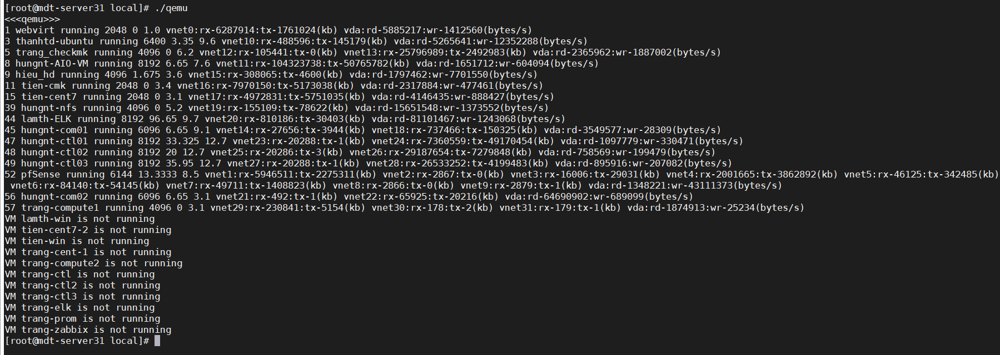
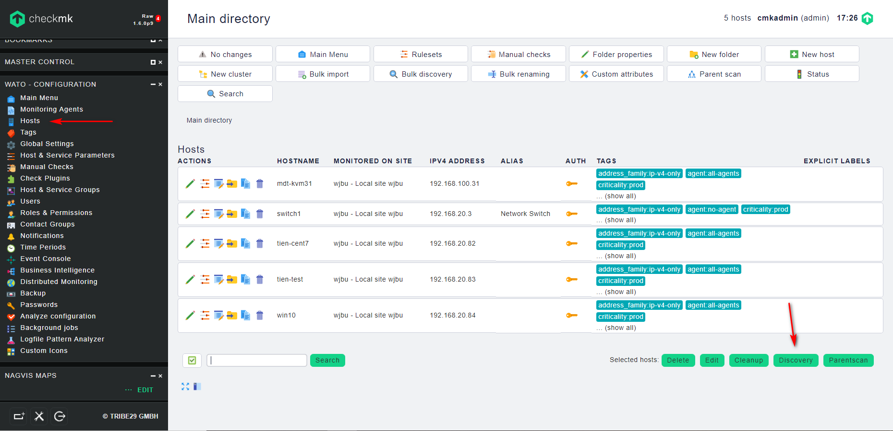
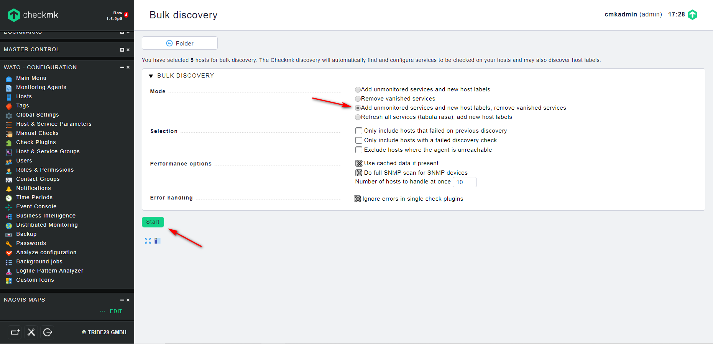
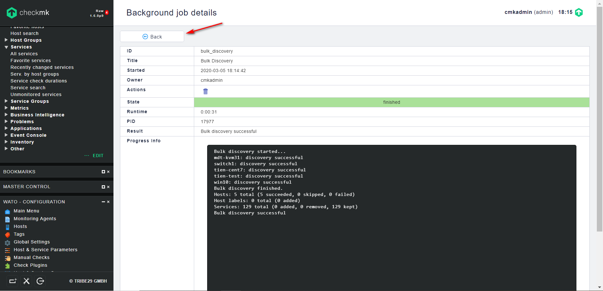
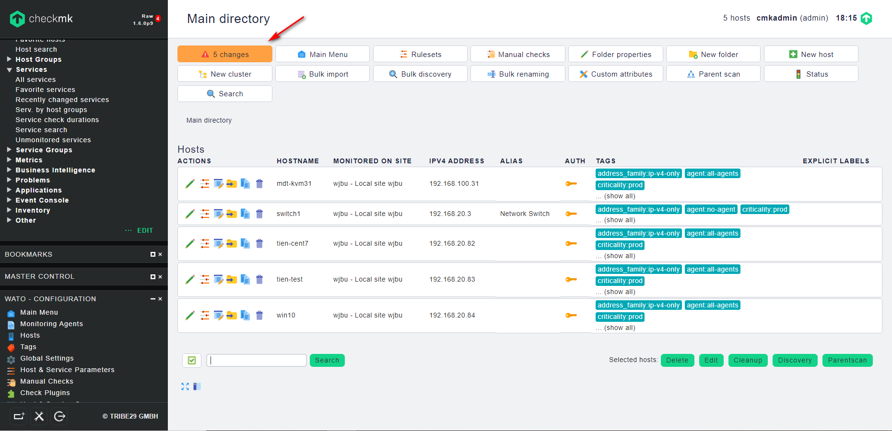
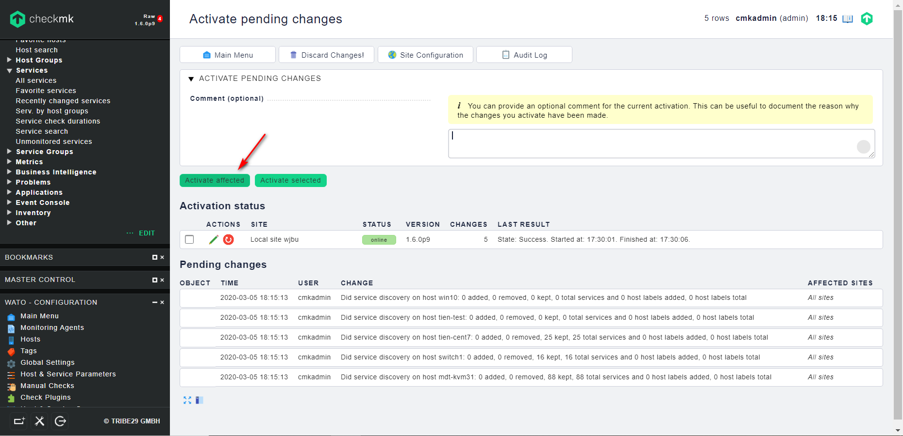

## Giám sát các thông số máy ảo trong KVM

Cấu hình Check_mk lấy các thông số về ram, cpu, disk, network của các VM trên KVM

- Bước 1: Tải xuống extension trên Check_mk server

```
cd /opt
wget https://github.com/Bastian-Kuhn/Check_MK-Treasures/raw/master/qemu/qemu-2.0.mkp
```

- Bước 2: Cài đặt gói extension vừa tải xuống

```
su wjbu
mkp install /opt/qemu-2.0.mkp
mkp list
exit
```

> thay `wjbu` bằng tên site của bạn

> Phiên bản 2.0 của extension `qemu` được viết dành cho Check_mk kể từ phiên bản 1.6 trở đi, nếu version Check_mk của bạn thấp hơn, có thể tải bản 1.0 hoặc 1.1 ở [đây](https://github.com/Bastian-Kuhn/Check_MK-Treasures/tree/master/qemu)

- Bước 4: Sửa file trên server để cho đúng với output

```
cd /omd/sites/wjbu/local/share/check_mk/checks/
wget -O qemu https://raw.githubusercontent.com/trangnth/Monitor/master/Ghichep_omd/script/check_mk-qemu-server.py
```

Bước 4: Trên client, tạo một file script để thực hiện lấy các thông tin của các VM:

Thư mục chứa script là `/usr/lib/check_mk_agent/local`

```
cd /usr/lib/check_mk_agent/local
wget -O qemu https://github.com/nvtien996/thuctap062019/blob/master/Tiennv/Check_mk/plugin-script/check_VM
chmod +x qemu
```

Chạy thử script:



Bước 5: Kiểm tra trên Web UI

Truy cập `WATO -CONFIGURATION` -> `Hosts` -> `Discovery`



chọn `Add unmonitored services and new host labels, remove vanished services` rồi bấm `Start`



bấm `Back` rồi `Active changes`





