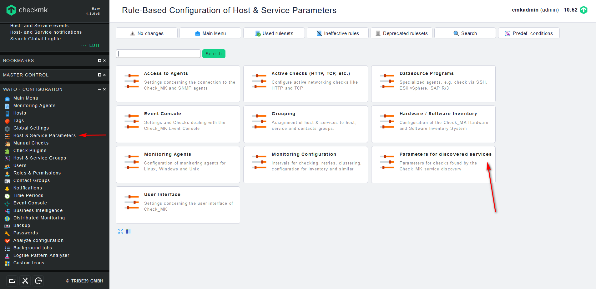
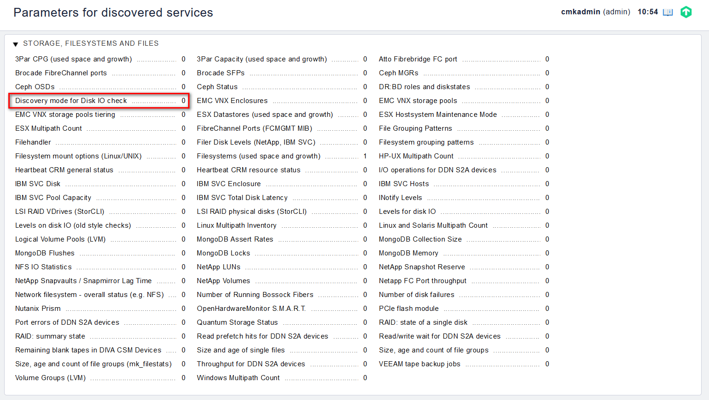
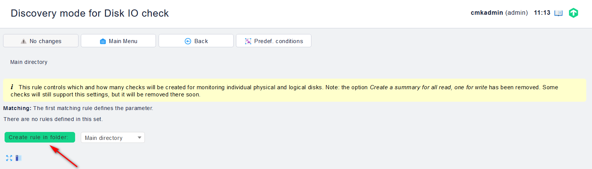
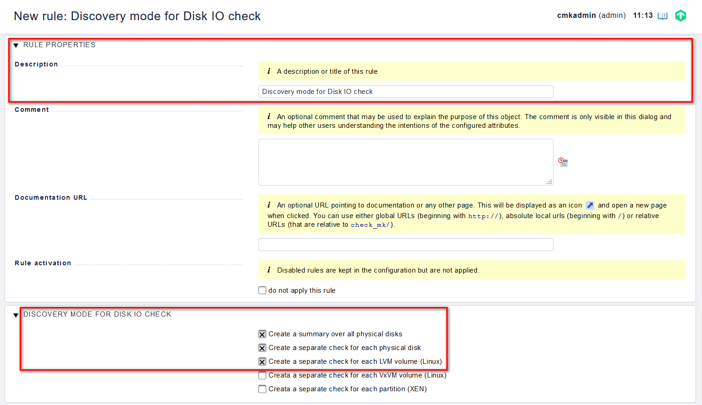
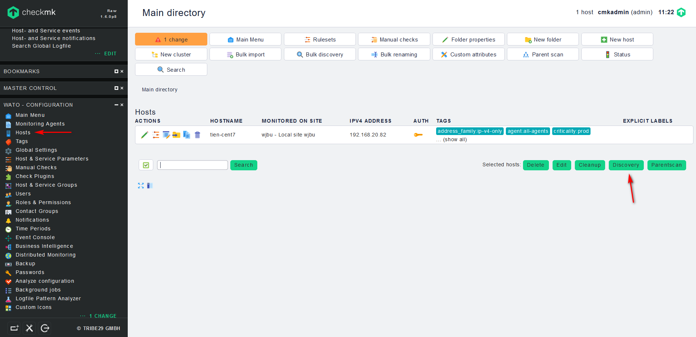
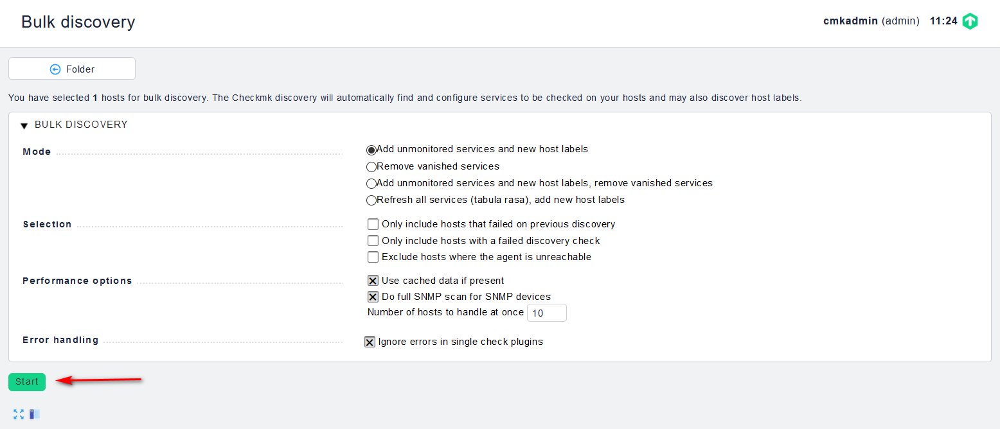
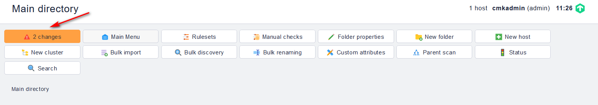
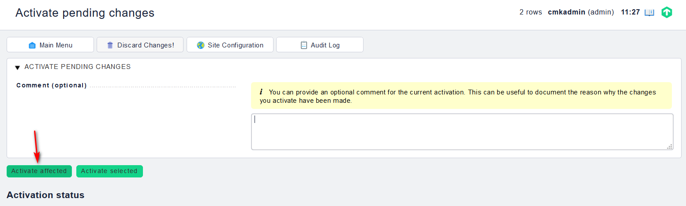
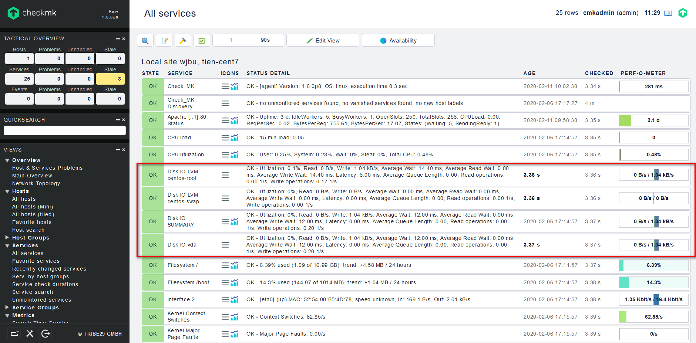

## Giám sát file system

Mặc định thì Check_mk sẽ gộp chung các vùng nhớ của chúng ta lại với nhau để giám sát dưới thông số `DISK IO SUMMARY`. Tuy nhiên như thế này chúng ta không thể theo dõi được các vùng nhớ hay ô nhớ khác trên hệ thống. Để tách riêng từng vùng nhớ chúng ta vào mục `Host & Service Parameters` để thực hiện việc này.

Các bước thực hiện:

- Trong phần `WATO - CONFIGURATION` chọn `Host & Service Parameters` -> `Parameters for Discovered Services`:

- Tại mục `STORAGE, FILESYSTEMS AND FILES` chọn `Discovery mode for Disk IO check`:

- Chọn `Create rule in folder`

- Điền các thông tin và ấn `Save`:

- Sau đó, trong phần `WATO - CONFIGURATION` chọn `Hosts` -> `Discovery`:

- Chọn `Start`:

- Cuối cùng là Active Change:

- Kiểm tra kết quả:

