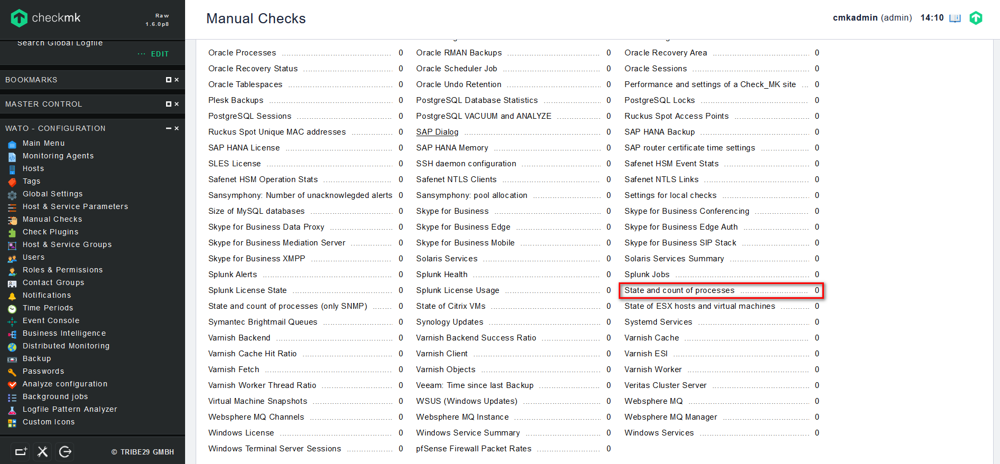

## Giám sát số lượng process của 1 service

Ví dụ chúng ta cần giám sát số process của dịch vụ web `HTTP`

- Đầu tiên chúng ta cần kiểm tra xem các process của HTTP:

`ps -ef | grep httpd`

kết quả:

- Sau đó, kiểm tra số process hiện có của dịch vụ `HTTP`:

`pidof httpd | wc -w`

kết quả:

như trong ảnh thì hiện tại dịch vụ `HTTP` đang có 7 process

Bây giờ ta tiến hành giám sát các tiến trình của dịch vụ `HTTP`.

- Đầu tiên, tại `WATO - CONFIGURATION` chọn `Manual Checks` -> `APPLICATIONS, PROCESSES & SERVICES` -> `State and count of processes`:

- Chọn `Create rule in folder`:

- Điền các thông số về process muốn giám sát rồi ấn `Save`:

1 số tùy chọn như:

`Levels for process count`: cảnh báo dựa trên số lượng process

`Levels on total CPU utilization`: cảnh báo dựa trên % cpu sử dụng

`CPU Averaging`: trung bình của tổng mức sử dụng CPU trong một khoảng thời gian nhất định

`Levels on CPU utilization of a single process`: cảnh báo dựa trên mức sử dụng cpu của 1 process

`Physical memory usage`: cảnh báo dựa trên dung lượng ram vật lý sử dụng

`Physical memory usage, in percentage of total RAM`: cảnh báo dựa trên dung lượng ram vật lý sử dụng trên tổng số RAM (%)

- Kích hoạt các thay đổi:

- Kiểm tra kết quả:

như trong ảnh thì service chưa hiện trên web nhưng sau khi áp dụng rule thì đã có ảnh báo gửi về telegram như bên góc phải bên dưới ảnh

sau khi reload để check service:

