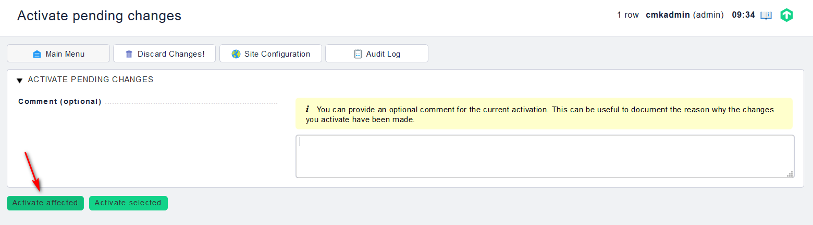

## Giám sát switch

SNMP (viết tắt từ tiếng Anh: Simple Network Management Protocol) là một tập hợp các giao thức không chỉ cho phép kiểm tra các thiết bị mạng như router, switch hay server có đang vận hành mà còn hỗ trợ vận hành các thiết bị này một cách tối ưu, ngoài ra SNMP còn cho phép quản lý các thiết bị mạng từ xa.

Một hệ thống sử dụng SNMP bao gồm 2 thành phần chính:

- Manager: Là một máy tính chạy chương trình quản lý mạng. Manager còn được gọi là một NMS (Network Management Station). Nhiệm vụ của một manager là truy vấn các agent và xử lý thông tin nhận được từ agent.

- Agent: Là một chương trình chạy trên thiết bị mạng cần được quản lý. Agent có thể là một chương trình riêng biệt (ví dụ như daemon trên Unix) hay được tích hợp vào hệ điều hành, ví dụ như IOS (Internetwork Operation System) của Cisco. Nhiệm vụ của agent là thông tin cho manager.

SNMP sử dụng UDP (User Datagram Protocol) làm giao thức truyền tải thông tin giữa manager và các agent. Việc sử dụng UDP, thay vì TCP, bởi vì UDP là phương thức truyền mà trong đó hai đầu thông tin không cần thiết lập kết nối trứơc khi dữ liệu được trao đổi (connectionless), thuộc tính này phù hợp trong điều kiện mạng gặp trục trặc, hư hỏng v.v. cần ưu tiên về mặt tốc độ.

SNMP có các phương thức quản lý nhất định và các phương thức này được định dạng bởi các gói tin PDU (Protocol Data Unit). Các manager và agent sử dụng PDU để trao đổi với nhau. 

### Yêu cầu

- Switch phải hỗ trợ SNMP

- Check_mk server có thể kết nối đến switch

### Cấu hình

Trên `WATO - CONFIGURATION`, chọn `Hosts` -> `New host`

Điền các thông tin của switch

Xong chọn `Save & go to Services` để lưu cấu hình và check lại 1 lần nữa. Chọn `Fix all missing/vanished` rồi kích hoạt các thay đổi

Kiểm tra trên dashboard

