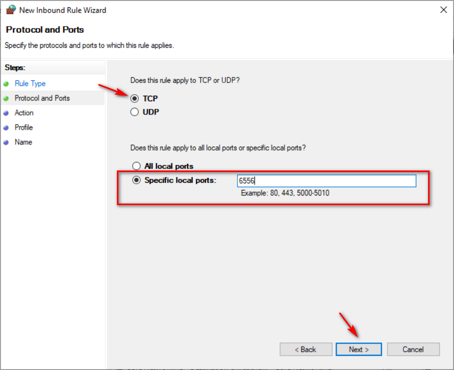

## Giám sát Windows service

### Các bước chuẩn bị

Để giám sát được các service chạy trong hđh Windows, trước tiên ta cần 1 máy tính (hoặc máy ảo) đã được cài đặt Windows lên đó.

Các bạn có thể tham khảo bài viết [sau](https://getlabsdone.com/10-easy-steps-to-install-windows-10-on-linux-kvm/) để biết cách cài đặt Windows lên KVM.

### Cài đặt agent

Sau khi đã có máy tình cài Windows, bước tiếp theo ta cần làm là cài đặt agent Check_mk lên máy tính Windows.

Bước 1: Tải xuống gói cài đặt agent

Copy đường link của file cài đặt qua máy Windows, thay vì là file `.exe` như thường lệ, file cài đặt sẽ có đuôi `.msi`

File cài đặt agent có thể được tìm thấy tại `WATO - CONFIGURATION` -> `Monitoring Agents`

Link file cài đặt sẽ có dạng `http://ip_check_mk/tên_site/check_mk/agents/windows/check_mk_agent.msi`

Bước 2: Sau khi tải về, tiến hành cài đặt bình thường

Bước 3: Kiểm tra Service đã hoạt động chưa

gõ `services.msc` vào ô tìm kiếm trong Windows, kiểm tra Check_mk service

Bước 4: Nếu có sử dụng firewall, cần phải tạo rule cho firewall với port 6556

Nếu trong môi trường lab, các bạn cứ tắt firewall đi cho nhanh.

Vào `Windows Defender Firewall with Advanced Security`, chọn `Inbound Rules` -> `New Rule...`

điền các thông số như sau

Làm tương tự với Outbound Rule

### Add host trên Dashboard

Trên Dashboard, truy cập vào `WATO - CONFIGURATION` -> `Hosts` -> `New host`

điền các thông tin cho host

Lưu lại các thay đổi

kết quả:

### Monitor windows services

Cách giám sát các services cụ thể trên Windows

Trên Dashboard, đi đến mục `WATO - CONFIGURATION` chọn `Host & Service Parameters` -> `Parameters for discovered services`

Tiếp theo trong mục `DISCOVERY - AUTOMATIC SERVICE DETECTION` chọn `Windows Service Discovery`

Chọn `Create rule in folder`

Điền các thông tin

Trên `WATO - CONFIGURATION` chọn `Hosts` -> `Discovery`

Bấm `Start` rồi đợi 1 lúc

Lưu lại các thay đổi

Kiểm tra trên Dashboard

