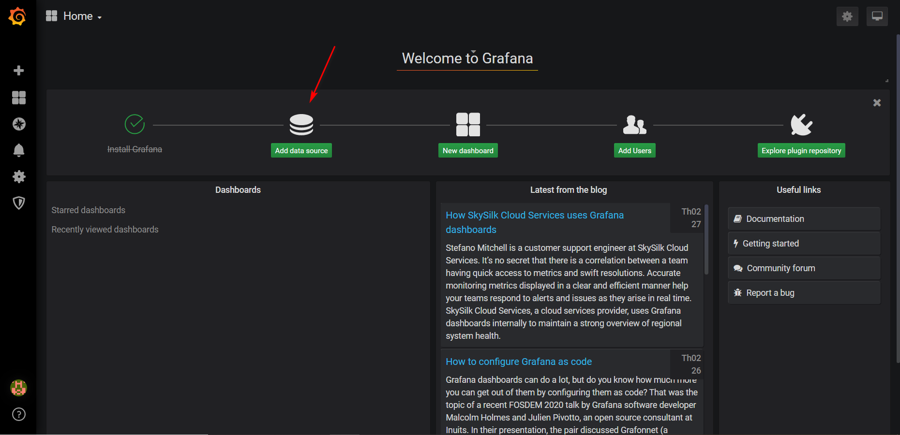
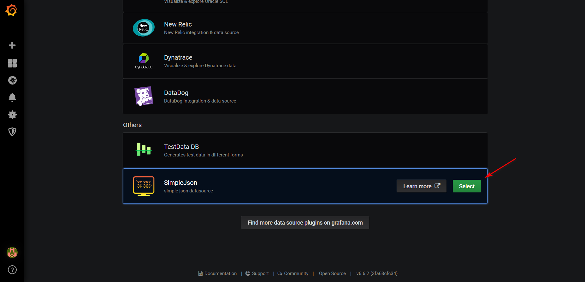
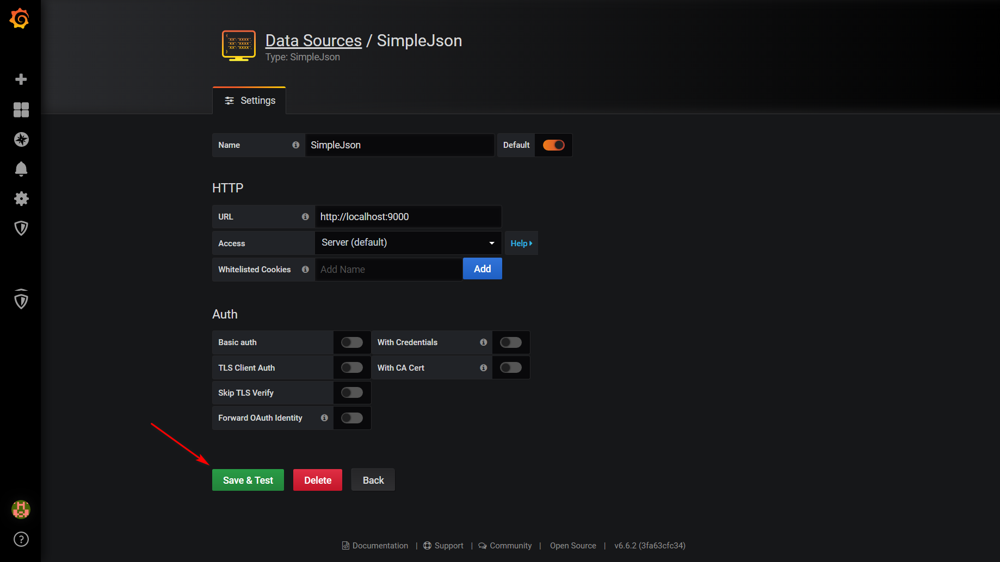
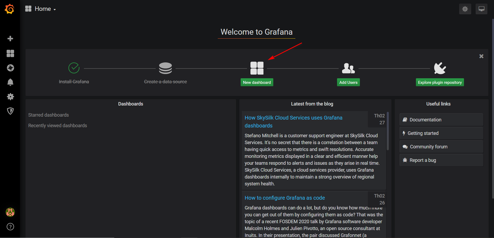
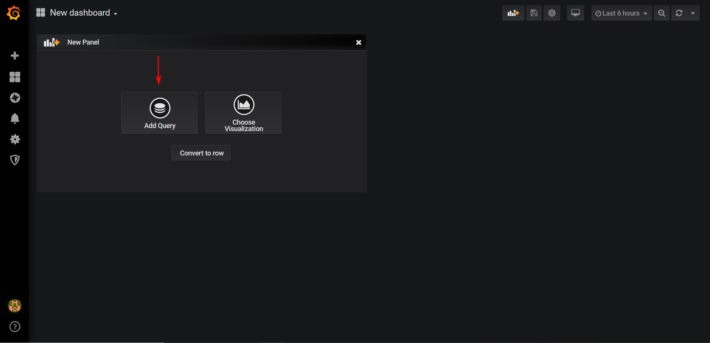
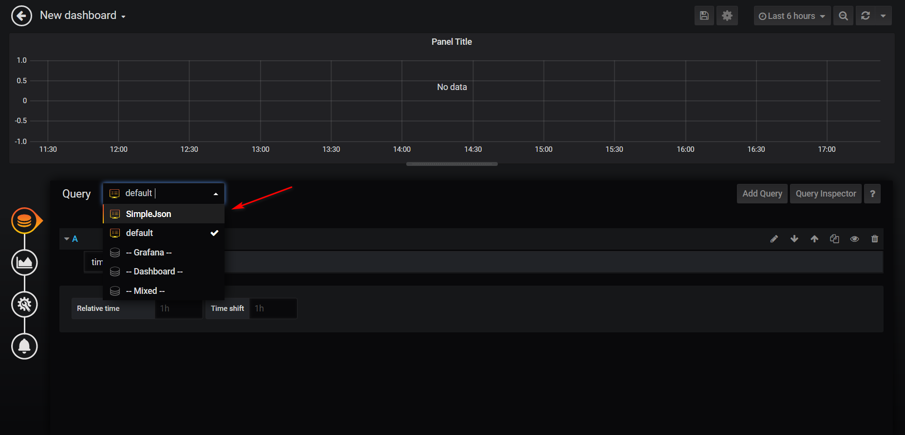
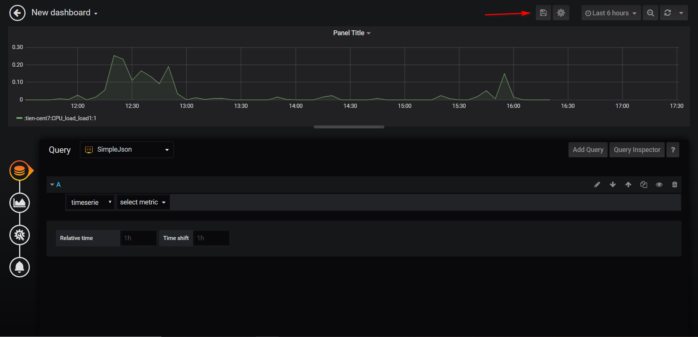
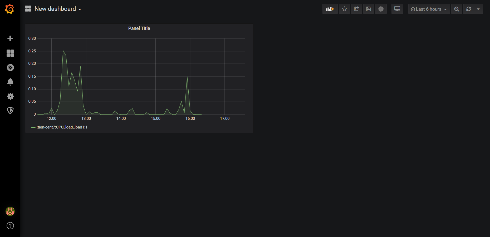

## Grafana

### Tổng quan

Grafana là một phần mềm phân tích và tương tác mã nguồn mở đa nền tảng có sẵn từ năm 2014. Nó cung cấp các biểu đồ, đồ thị và cảnh báo cho web khi được kết nối với các nguồn dữ liệu được hỗ trợ. Nó có thể mở rộng thông qua hệ thống plug-in. Người dùng cuối có thể tạo bảng điều khiển giám sát phức tạp bằng cách sử dụng trình tạo truy vấn tương tác.

Là một công cụ trực quan, Grafana là một thành phần phổ biến trong các monitoring stacks, thường được sử dụng kết hợp với cơ sở dữ liệu chuỗi thời gian như Prometheus và Graphite ; các nền tảng giám sát như Sensu, Icinga, Zabbix, Netdata, và PRTG; SIEM như Elasticsearch và Splunk; và các nguồn dữ liệu khác.

Grafana được phát triển bởi Grafana Labs và được xây dựng bởi ngôn ngữ lập trình Go dựa trên giấy phép phép mã nguồn mở Apache 2.0

### Lịch sử phát triển

Grafana ban đầu được phát hành vào năm 2014 bởi Torkel Ödegaard với tư cách là một nhánh của dự án tại Orbitz, nó nhắm mục tiêu các cơ sở dữ liệu chuỗi thời gian như InfluxDB, OpenTSDB và Prometheus nhưng lại được phát triển để hỗ trợ các relational sources như MySQL, PostgreSQL và Microsoft SQL Server.

Phiên bản stable release mới nhất của Grafana là bản 6.6 được phát hành vào tháng 1 năm 2020.

### Tính năng

- Visualize (trực quan hóa): Vẽ biểu đồ từ metric được cung cấp. Grafana có rất nhiều tuỳ chọn visualize giúp người dùng vẽ biểu đồ một cách nhanh chóng và linh hoạt. Từ heatmap đến biểu đồ, đồ thị cho đến geomaps. Grafana có rất nhiều tùy chọn trực quan để giúp bạn biể diễn dữ liệu của mình một cách đẹp mắt.


- Dynamic Dashboards (bảng điều khiển linh hoạt): Tạo bảng điều khiển 1 cách linh hoạt và có thể sử dụng lại với các template được chọn trong menu ở đầu bảng điều khiển.


- Explore Metrics (khám phá các số liệu): Khám phá dữ liệu của bạn thông qua các truy vấn đặc biệt và truy vấn động. Chia nhỏ để dễ dàng xem và so sánh các phạm vi thời gian khác nhau, truy vấn và nguồn dữ liệu cạnh nhau.


- Explore Logs (khám phá logs): Chuyển đổi từ metric sang log với các bộ lọc label. Nhanh chóng tìm kiếm thông qua log.


- Alerting (cảnh báo): Giúp người dùng xác định các ngưỡng metric, hiển thị ngưỡng metric cảnh báo và định nghĩa các quy tắc cảnh báo, xác định quy tắc cảnh báo cho các số liệu quan trọng nhất của bạn. Grafana liên tục đánh giá metric và gửi cảnh báo khi metric vượt quá ngưỡng cho phép đến các hệ thống như Slack, PagerDuty, VictorOps, OpsGenie.


- Mixed Data Sources (nhiều nguồn dữ liệu): Kết hợp các nguồn dữ liệu khác nhau trong cùng một biểu đồ! Bạn có thể chỉ định nguồn dữ liệu trên cơ sở mỗi truy vấn. Điều này cũng làm việc với cả các nguồn dữ liệu tùy chỉnh.


- Annotations (chú thích): Chú thích biểu đồ với các rich event từ các nguồn dữ liệu khác nhau. Di chuột qua các sự kiện hiển thị cho bạn toàn bộ siêu dữ liệu và thẻ sự kiện.


- Ad-hoc Filters (bộ lọc đặc biệt): Bộ lọc đặc biệt cho phép bạn tạo 1 bộ lọc với khóa / giá trị mới một cách nhanh chóng, được tự động áp dụng cho tất cả các truy vấn sử dụng nguồn dữ liệu đó.


- Unify (hợp nhất): Kết hợp dữ liệu để có cái nhìn toàn cảnh tốt hơn. Grafana hỗ trợ hàng chục loại database một cách tự nhiên, kết hợp chúng với nhau trong cùng một giao diện dashboard


- Open (mở): Grafana cung cấp cho bạn các tùy chọn. Nó hoàn toàn là nguồn mở và được hỗ trợ bởi một cộng đồng sôi động. Sử dụng Hosted Grafana hoặc dễ dàng cài đặt trên mọi nền tảng.


- Extend (khả năng mở rộng): Khám phá hàng trăm dashboards và plug-ins trong thư viện chính thức. Nhờ sự đóng góp và nỗ lực của cộng đồng người dùng, những người mới được thêm vào mỗi tuần.


- Collaborate (cộng tác): Kết nối mọi người lại với nhau, chia sẻ dữ liệu và dashboard giữa các nhóm.


> Grafana là công cụ được sử dụng với nhiệm vụ chính là trực quan hoá và phân tích dữ liệu thời gian thực - tức là nó không phải đi thu thập metric từ hệ thống cần giám sát mà chỉ là công cụ để hiển thị và phân tích dữ liệu. Với giao diện đẹp mắt và nhiều tính năng tuyệt vời, Grafana được cộng đồng tin tưởng và yêu thích sử dụng.

### 1 số khái nệm cơ bản

- Data Source

	+ Grafana hỗ trợ khá nhiều storage backend khác nhau cho dữ liệu thời gian thực. Các DS được hỗ trợ chính thức có thể kể đến như: Graphite, InfluxDB, OpenTSDB, Prometheus, Elasticsearch, CloudWatch
	
	+ Ngôn ngữ truy vấn và khẩ năng của mỗi DS là khác nhau. Tuy nhiên, có thể kết hợp dữ liệu từ nhiều DS khác nhau trong cùng 1 dashboard, nhưng mỗi panel thuộc về 1 DS cụ thể và thuộc về 1 tổ chức xác định

- Organization

	+ Grafana hỗ trợ nhiều tổ chức để hỗ trợ nhiều mô hình triển khai khác nhau, bao gồm sử dụng một Grafana instance duy nhất để cung cấp dịch vụ cho nhiều tổ chức có khả năng không tin cậy
	
	+ Trong hầu hết các trường hợp, Grafana được triển khai với một tổ chức duy nhất
	
	+ Mỗi tổ chức có thể có một hoặc nhiều DS
	
	+ Tất cả các dashboard được sở hữu bởi một tổ chức cụ thể
	
- User

	+ Một người dùng là một tài khoản có tên trong Grafana. Một người dùng có thể thuộc về một hoặc nhiều tổ chức và có thể được chỉ định các cấp đặc quyền khác nhau thông qua các vai trò
	
	+ Grafana hỗ trợ nhiều cách bên trong và bên ngoài để người dùng tự xác thực. Chúng bao gồm từ cơ sở dữ liệu tích hợp của riêng nó, từ máy chủ SQL bên ngoài hoặc từ máy chủ LDAP bên ngoài

- Panel

	+ Panel là khối trực quan hoá cơ bản trong Grafana. Mỗi panel cung cấp một Query Editor (phụ thuộc vào DS được lựa chọn trong panel) cho phép bạn trích xuất trực quan hoá hoàn hảo để hiển thị trên dashboard bằng cách sử dụng Query Editor.

	+ Có nhiều tuỳ chọn để tạo kiểu và định dạng mà mỗi panel hiển thị để cho phép tạo ra các hình ảnh hoàn hảo
	
	+ Các panel sau khi tạo có thể kéo, thả và sắp xếp lại trên dashboard, và tuỳ chỉnh kích cỡ một cách dễ dàng thông qua sử dụng chuột
	
	+ Hiện có các kiểu panel: Graph, Singlestat, Dashlist, Table và Text,...
	
	+ Các panel cũng có thể được tạo một cách linh hoạt bằng cách sử dụng các biến Dashboard Templating trong cấu hình của panel

- Query Editor

	+ Query Editor cho thấy khả năng của DS và cho phép truy vấn các metric mà nó chứa. Sử dụng Query Editor để dựng lên một hoặc nhiều truy vấn (cho một hoặc nhiều chuỗi dữ liệu) trong cơ sở dữ liệu thời gian thực. Panel sẽ liên tục cập nhật cho phép khám phá hiệu quả dữ liệu thời gian thực và tạo nên truy vấn hoàn hảo.

	+ Ngoài ra, bạn có thể sử dụng Template variables trong Query Editor để tự truy vấn chúng. Điều này cung cấp một cách mạnh mẽ để khám phá dữ liệu tự động dựa trên các biến Templating được chọn từ dashboard

	+ Grafana cho phép tham chiếu các truy vấn trong Query Editor tại các dòng. Nếu bạn thêm truy vấn thứ 2 vào đồ thị, bạn có thể tham chiếu tới truy vấn thứ nhất bằng cách gõ #A. Đây là cách cung cấp sự hiệu quả và dễ dàng để xây dựng nên các truy vấn phức tạp
	
- Dashboard

	+ Dashboard là nơi mọi thứ kết hợp với nhau. Dashboard có thể được xem như là tập hợp của một hoặc nhiều Panel được tổ chức và sắp xếp thành một hoặc nhiều hàng
	
	+ Trên giao diện Dashboard, bạn có thể điều khiển chu kì thời gian cập nhật metric, sử dụng các Templating tương tác một cách tự động, sử dụng Annotations để tạo chú thích cho các sự kiện trên panel
	
	+ Dashboard (hoặc một panel cụ thể) có thể được chia sẻ dễ dàng bằng nhiều cách. Bạn có thể gửi link tới những người có thể đăng nhập được vào Grafana

### Cấu hình

- Thêm repo Grafana:

```
cat > /etc/yum.repos.d/grafana.repo <<\EOF
[grafana]
name=grafana
baseurl=https://packages.grafana.com/oss/rpm
repo_gpgcheck=1
enabled=1
gpgcheck=1
gpgkey=https://packages.grafana.com/gpg.key
sslverify=1
sslcacert=/etc/pki/tls/certs/ca-bundle.crt
EOF
```

- Cài đặt Grafana:

`yum install -y grafana`

- Start và enable Grafana:

```
systemctl daemon-reload
systemctl start grafana-server
systemctl status grafana-server
```

- Add port trên firewall

```
firewall-cmd --add-port=3000/tcp --permanent
firewall-cmd --reload
```

Truy cập vào `ip-server:3000` để kiểm tra và đăng nhập với tài khoản / mật khẩu là admin/admin.

- Cài đặt plugin `SimpleJson` trên Grafana-server và khởi động lại Grafana-server:

```
grafana-cli plugins install grafana-simple-json-datasource
systemctl restart grafana-server
```

- Cài đặt rrdtool server:

`yum install -y rrdtool-devel`

- Cài đặt golang:

`yum install -y golang golang-go`

- Tạo `GOPATH` và thiết lập biến môi trường:

```
mkdir ~/.go
export GOPATH=$HOME/.go
```

- Get package grafana-rrd-server:

```
yum install -y git
go get github.com/doublemarket/grafana-rrd-server
```

- Khởi chạy grafana-rrd-server:

```
cd ~/.go/bin/
./grafana-rrd-server -s 300 -r /opt/omd/sites/wjbu/var/pnp4nagios/perfdata
```

> thay `wjbu` bằng tên site của bạn

- Truy cập vào grafana `ip-grafana-server:3000` và thêm vào datasource như sau:



chọn `Add data source`

kéo thanh cuộn xuống dưới và chọn `SimpleJson`



điền các thông tin và chọn `Save & Test`



- Tạo biểu đồ test xem data đã được đẩy hay chưa

sau khi add data source, quay trở lại trang chính và chọn `New dashboard`



chọn `Add Query`



ở mục `Query` chọn tên của data source vừa tạo



thêm dữ liệu để query vào và save lại



Dashboard sau khi add vào

