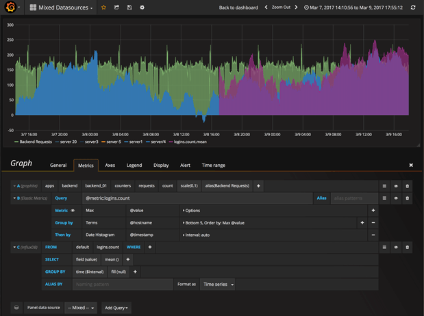
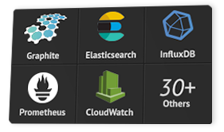
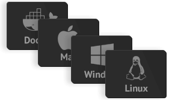
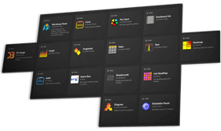
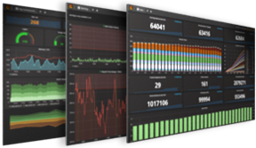

## Grafana

### Tổng quan

Grafana là một phần mềm phân tích và tương tác mã nguồn mở đa nền tảng có sẵn từ năm 2014. Nó cung cấp các biểu đồ, đồ thị và cảnh báo cho web khi được kết nối với các nguồn dữ liệu được hỗ trợ. Nó có thể mở rộng thông qua hệ thống plug-in. Người dùng cuối có thể tạo bảng điều khiển giám sát phức tạp bằng cách sử dụng trình tạo truy vấn tương tác.

Là một công cụ trực quan, Grafana là một thành phần phổ biến trong các monitoring stacks, thường được sử dụng kết hợp với cơ sở dữ liệu chuỗi thời gian như Prometheus và Graphite ; các nền tảng giám sát như Sensu, Icinga, Zabbix, Netdata, và PRTG; SIEM như Elasticsearch và Splunk; và các nguồn dữ liệu khác.

Grafana được phát triển bởi Grafana Labs và được xây dựng bởi ngôn ngữ lập trình Go dự trên giấy phép phép mã nguồn mở Apache 2.0

### Lịch sử phát triển

Grafana ban đầu được phát hành vào năm 2014 bởi Torkel Ödegaard với tư cách là một nhánh của dự án tại Orbitz, nó nhắm mục tiêu các cơ sở dữ liệu chuỗi thời gian như InfluxDB, OpenTSDB và Prometheus nhưng lại được phát triển để hỗ trợ các relational sources như MySQL, PostgreSQL và Microsoft SQL Server.

Phiên bản stable release mới nhất của Grafana là bản 6.6 được phát hành vào tháng 1 năm 2020.

### Tính năng

- Visualize (trực quan hóa): Vẽ biểu đồ từ metric được cung cấp. Grafana có rất nhiều tuỳ chọn visualize giúp người dùng vẽ biểu đồ một cách nhanh chóng và linh hoạt. Từ heatmap đến biểu đồ, đồ thị cho đến geomaps. Grafana có rất nhiều tùy chọn trực quan để giúp bạn biể diễn dữ liệu của mình một cách đẹp mắt.

- Dynamic Dashboards (bảng điều khiển linh hoạt): Tạo bảng điều khiển 1 cách linh hoạt và có thể sử dụng lại với các template được chọn trong menu ở đầu bảng điều khiển.

- Explore Metrics (khám phá các số liệu): Khám phá dữ liệu của bạn thông qua các truy vấn đặc biệt và truy vấn động. Chia nhỏ để dễ dàng xem và so sánh các phạm vi thời gian khác nhau, truy vấn và nguồn dữ liệu cạnh nhau.

- Explore Logs (khám phá logs): Chuyển đổi từ metric sang log với các bộ lọc label. Nhanh chóng tìm kiếm thông qua log.

- Alerting (cảnh báo): Giúp người dùng xác định các ngưỡng metric, hiển thị ngưỡng metric cảnh báo và định nghĩa các quy tắc cảnh báo, xác định quy tắc cảnh báo cho các số liệu quan trọng nhất của bạn. Grafana liên tục đánh giá metric và gửi cảnh báo khi metric vượt quá ngưỡng cho phép đến các hệ thống như Slack, PagerDuty, VictorOps, OpsGenie.

- Mixed Data Sources (nhiều nguồn dữ liệu): Kết hợp các nguồn dữ liệu khác nhau trong cùng một biểu đồ! Bạn có thể chỉ định nguồn dữ liệu trên cơ sở mỗi truy vấn. Điều này cũng làm việc với cả các nguồn dữ liệu tùy chỉnh.

- Annotations (chú thích): Chú thích biểu đồ với các rich event từ các nguồn dữ liệu khác nhau. Di chuột qua các sự kiện hiển thị cho bạn toàn bộ siêu dữ liệu và thẻ sự kiện.

- Ad-hoc Filters (bộ lọc đặc biệt): Bộ lọc đặc biệt cho phép bạn tạo 1 bộ lọc với khóa / giá trị mới một cách nhanh chóng, được tự động áp dụng cho tất cả các truy vấn sử dụng nguồn dữ liệu đó.

- Unify (hợp nhất): Kết hợp dữ liệu để có cái nhìn toàn cảnh tốt hơn. Grafana hỗ trợ hàng chục loại database một cách tự nhiên, kết hợp chúng với nhau trong cùng một giao diện dashboard

- Open (mở): Grafana cung cấp cho bạn các tùy chọn. Nó hoàn toàn là nguồn mở và được hỗ trợ bởi một cộng đồng sôi động. Sử dụng Hosted Grafana hoặc dễ dàng cài đặt trên mọi nền tảng.

- Extend (khả năng mở rộng): Khám phá hàng trăm dashboards và plug-ins trong thư viện chính thức. Nhờ sự đóng góp và nỗ lực của cộng đồng người dùng, những người mới được thêm vào mỗi tuần.

- Collaborate (cộng tác): Kết nối mọi người lại với nhau, chia sẻ dữ liệu và dashboard giữa các nhóm.

