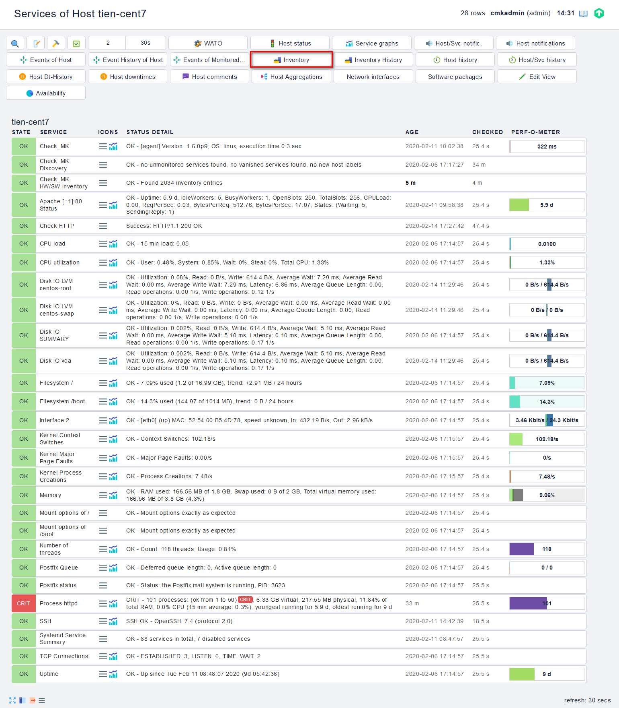

## Cấu hình hardware & software inventory

### Tổng quan

Ngoài giám sát cổ điển - tức là giám sát trạng thái, nhật ký và dữ liệu đo lường - Check_mk còn bao gồm một chức năng khác hoàn toàn miễn phí: Hardware/Software Inventory (viết tắt là HW/SW Inventory). Đây là 1 thành phần mới, có sẵn từ phiên bản 1.2.5i1 của Check_mk. Nó có thể tự động xác định các thành phần trên máy chủ của bạn, chẳng hạn như:

- Những gói phần mềm nào - và phiên bản nào trong số này - được cài đặt trên máy chủ?

- Máy chủ có những loại linh kiện RAM nào?

- Phiên bản BIOS nào được cài đặt trên bo mạch chủ?

- Số sê-ri của các đĩa cứng được cài đặt.

- 1 trong số bất kỳ port nào trên switch không được sử dụng trong một thời gian

- v.v

Dữ liệu thu được theo cách này được hiển thị trên mỗi máy chủ theo cấu trúc cây và trong các chế độ xem khác nhau và cũng có sẵn thông qua API. Dưới đây là một ví dụ nhỏ về kiểm kê cơ sở dữ liệu ORACLE:


Với HW/SW Inventory, bạn có thể thực hiện nhiều tác vụ khác nhau, chẳng hạn như:

- Cung cấp dữ liệu về phần mềm đã cài đặt cho hệ thống quản lý giấy phép

- Xác định chỉ định loại cho các linh kiện (RAM, đĩa cứng, quạt)

- Cung cấp dữ liệu phần cứng và phần mềm chung để nhập thường xuyên vào CMDB, để chúng dựa trên dữ liệu hiện tại

- Theo dõi các thay đổi đối với phần cứng hoặc phần mềm, ví dụ: để xác định thời điểm cập nhật BIOS cụ thể được thực hiện

- Cảnh báo nếu có gì đó đã thay đổi trong phần cứng hoặc phần mềm

- Xác định các máy chủ chưa cài đặt gói dịch vụ cụ thể

Ưu điểm quan trọng nhất so với các hệ thống tương tự khác là rõ ràng - bạn chỉ cần sử dụng cơ sở hạ tầng hiện tại của Check_mk và tiết kiệm công sức triển khai và quản lý môi trường phần mềm khác. Bạn chỉ cần thêm một agent plug-in duy nhất. Điều này thậm chí không cần thiết với các thiết bị SNMP vì SNMP cũng được hỗ trợ và chỉ cần tìm nạp dữ liệu qua tuyến đường này.

### Cài đặt

Cài đặt HW/SW Inventory được thực hiện theo hai bước. Điều kiện tiên quyết là Check_mk agent đã được cài đặt trên host (nếu chúng không được giám sát qua SNMP):

- Kích hoạt thông qua quy tắc mới được đặt trong WATO.

- Triển khai agent plugin mới `mk_inventory` trên các Check_mk agent hiện tại

### Cách thức hoạt động

- Cài đặt agent plugin `mk_inventory` trên các hệ thống của bạn. Điều này sẽ thêm một vài phần mới vào output agent của bạn.

- Bạn kích hoạt thông qua WATO. Điều này sẽ tạo ra một kiểm tra hoạt động mới Checkmk HW/SW Inventory cho mỗi máy chủ được chọn.

- Kiểm tra hoạt động này sẽ trích xuất phần mới và một số tác nhân classical về phần cứng và phần mềm và xây dựng một cây cấu trúc phần cứng và phần mềm cho mỗi máy chủ.

- GUI Multisite có các view mới để duyệt qua dữ liệu kiểm kê, tìm kiếm các gói phần mềm nhất định, v.v. Bạn cũng có thể thêm inventory data vào chế độ xem tùy chỉnh của mình.

- Thông qua các export hooks tùy chỉnh, bạn có thể xuất dữ liệu sang các hệ thống của bên thứ ba như quản lý giấy phép hoặc CMDB

- Dữ liệu cũng được hiển thị thông qua HTTP ở định dạng JSON và Python.

### Cấu hình

Bước 1: Trên `WATO - CONFIGURATION` chọn `Host & Service Parameters` -> `Hardware / Software Inventory`


Bước 2: Chọn `Do hardware/software inventory`


Bước 3: Chọn `Create rule in folder`


Bước 4: Điền thông tin cho rule


Ở đó bạn sẽ tìm thấy một số cài đặt:


Các tùy chọn này nếu bạn muốn được cảnh báo mỗi khi có sự thay đổi về phần mềm hoặc phần cứng. Điều này được thực hiện thông qua trạng thái của dịch vụ Check_MK HW/SW Inventory.

Trong bảng các gói phần mềm đã cài đặt, bạn có thể thấy cách cập nhật phần mềm trên hệ thống Linux đã thay đổi số phiên bản của một số gói đã cài đặt. Dữ liệu không thay đổi không được hiển thị ở đây:


Sau đó bấm `Save` để lưu lại rule

Kích hoạt rule vừa lưu


Quy tắc bạn vừa tạo sẽ tạo một active check cho từng host tại mục 'Activate Changes' tiếp theo, thu thập tất cả inventory data cho host đó - có thể là từ dữ liệu nhận được từ các Check_mk agent bình thường hoặc thông qua các truy vấn SNMP bổ sung.

Bước 5: Tải xuống plug-in cho host

Các plugin này có thể được tìm thấy trong `WATO` -> `Monitoring Agents` -> `Agent Files` ở phiên bản Enterprise Editions và trong `WATO` -> `Monitoring Agents` với phiên bản Raw Edition. Tùy thuộc vào hệ điều hành, hayc lựa chọn gói cài đặt phù hợp.

```
cd /tmp
wget http://192.168.20.81/wjbu/check_mk/agents/plugins/mk_inventory.linux
```

Bạn cũng có thể tìm thấy các tệp này trong thư mục con `share/check_mk/agent/plugins` (Linux / Unix) hoặc trong `share/check_mk/agent/windows/plugins` (Windows).

Bước 6: Di chuyển plugin vào đúng thư mục và phân quyền cho plugin

Sao chép plug-in vào trong thư mục chính xác trên host. Đối với Windows Agent phiên bản 1.6.0, đó là `C:\ProgramData\checkmk\agent\plugins`. Đối với Linux và Unix thư mục là `/usr/lib/check_mk_agent/plugins`.

`mv mk_inventory.linux /usr/lib/check_mk_agent/plugins/mk_inventory.linux`

Bước 7: Phân quyền cho plugin

`chmod +x /usr/lib/check_mk_agent/plugins/mk_inventory.linux`

Bước 8: Kiểm tra kết quả trên Web



Click vào để xem các thông số mà chúng ta thu thập được từ Client


### Lưu ý

Hardware/Software Inventory có tự tạo 1 rule để check mỗi ngày 1 lần, có thể sửa lại check_interval tại rule này


Plugin `mk_inventory` mặc định 4 tiếng mới có thể thu thập dữ liệu 1 lần, nếu dưới 4 tiếng cho dù có force check cũng không có kết quả gì khác. Tuy nhién, ta có thể thay đổi thời gian này:

- Với Windows:


14400 là thời gian tính theo giây, 14400 giây = 4 tiếng.

còn với Linux và Unix thì điều này hơi khác một chút. Hãy tạo tệp cấu hình `/etc/check_mk/mk_inventory.cfg` với dòng sau (ở đây ví dụ với 7200 giây):

`INVENTORY_INTERVAL=7200`

### Tập tin và thư mục

#### Thư mục trên máy chủ Checkmk

| Đường dẫn | Mô tả |
| --- | --- |
| share/check_mk/agents/plugins/ | agent plug-in cho Linux và Unix |
| share/check_mk/agents/windows/plugins/ | agent plug-in cho Windows |
| var/check_mk/inventory/ | inventory data từ các host riêng lẻ dưới dạng tệp Python (được nén và không nén) |

#### Thư mục trên host được theo dõi

| Đường dẫn | Mô tả |
| --- | --- |
| C:\ProgramData\checkmk\agent\plugins\ | vị trí lưu trữ cho inventory plug-in của Windows agent |
| /usr/lib/check_mk_agent/plugins/ | vị trí lưu trữ cho inventory plug-in của các Linux/Unix agent |
| /etc/check_mk/mk_inventory.cfg | tệp cấu hình cho inventory plug-in của các Linux/Unix agent |