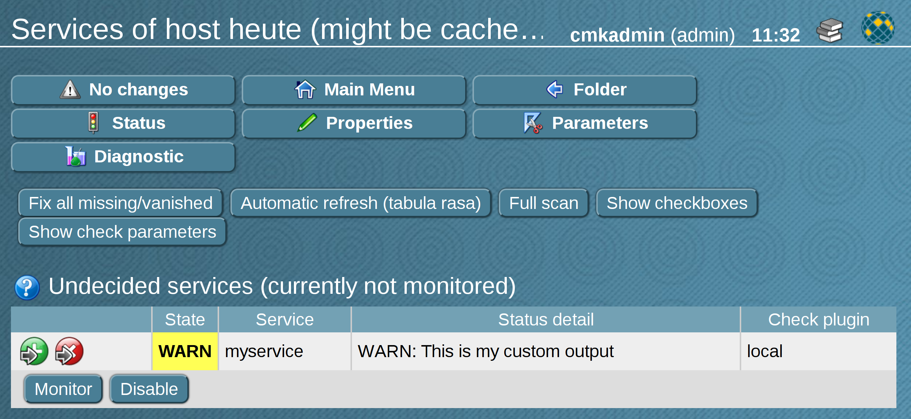
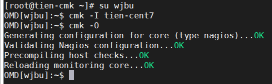
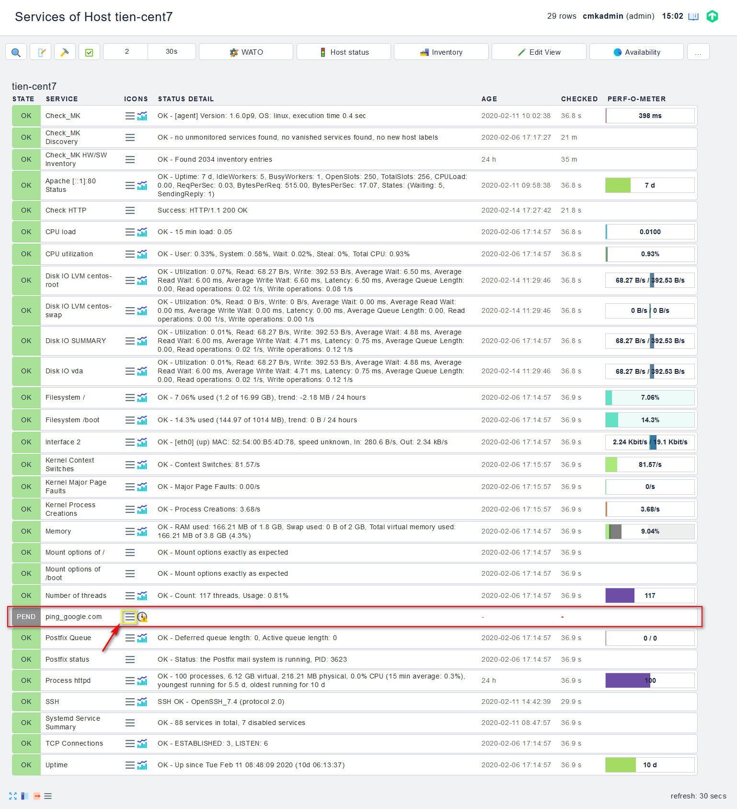
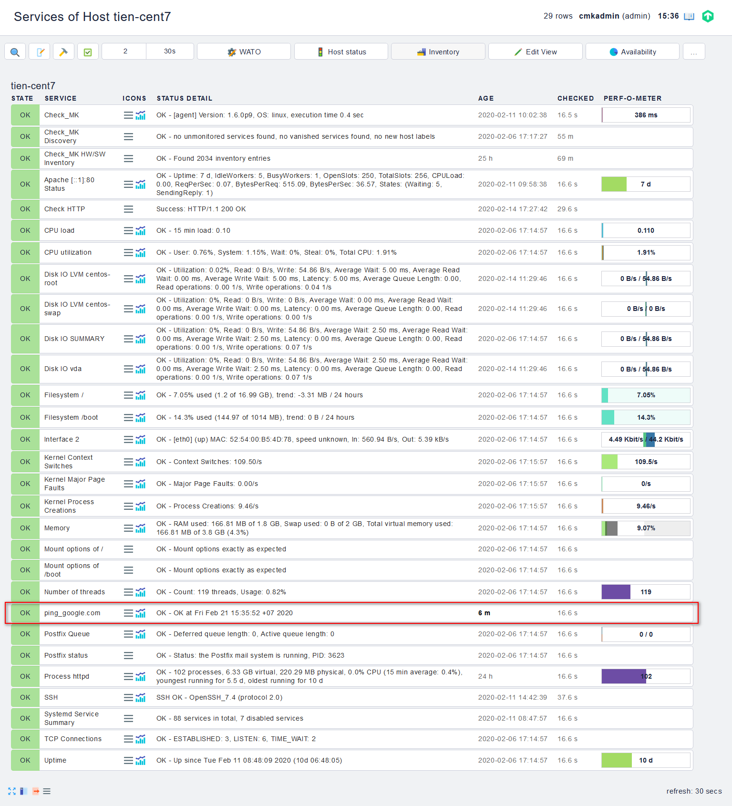

## Local check

Checkmk đã giám sát nhiều loại dữ liệu có liên quan bằng cách sử dụng một số lượng lớn các plugin kiểm tra tiêu chuẩn của riêng nó. uy nhiên, không phải lúc nào các plug-in này cũng có thể giám sát hết được, do đó thường có thể phát sinh các yêu cầu rất chuyên biệt. Với local check, bạn có một cơ sở để nhanh chóng và dễ dàng tạo ra các dịch vụ của riêng bạn phù hợp để đáp ứng các yêu cầu này.

Local check là kĩ thuật cho phép tự viết các script. Các script này sẽ được đặt ở thư mục mà check_mk_agent có thể scan được.

### Chuẩn bị script

Một script local check có thể được viết bằng bất kỳ ngôn ngữ lập trình nào được hỗ trợ bởi host target. Script phải được xây dựng sao cho mỗi kiểm tra tạo ra một dòng trạng thái bao gồm bốn phần. Đây là một ví dụ:

`0      myservice   myvalue=73;80;90  My output text which may contain spaces`

Bốn phần được phân tách bằng khoảng trống và có các ý nghĩa sau:

| STT | Tên | Ý nghĩa |
| --- | --- | --- |
| 1 | Trạng thái | Trạng thái của dịch vụ được cung cấp dưới dạng số: 0 = `OK` , 1 = `WARN`, 2 = `CRIT` và 3 = `UNKNOWN` |\
| 2 | Tên dịch vụ | Tên dịch vụ như được hiển thị trong Checkmk. Không chứa khoảng trống |
| 3 | Metrics | Giá trị hiệu suất cho dữ liệu. Tham khảo thêm ở [đây](https://checkmk.com/cms_localchecks.html#perfdata). Ngoài ra, một dấu trừ có thể được mã hóa nếu kiểm tra không tạo ra số liệu |
| 4 | Chi tiết trạng thái | Chi tiết về trạng thái chúng sẽ được hiển thị trong Checkmk. Phần này cũng có thể chứa khoảng trống |

Luôn phải có một ký tự trống giữa từng phần của output và ký tự đầu tiên của chi tiết trạng thái. Mọi thứ sau đó sẽ được tính là chi tiết trạng thái, đó là lý do tại sao các ký tự trống được cho phép.

Nếu bạn không chắc chắn về output của script, nó có thể được kiểm tra đơn giản bằng cách viết một tập lệnh nhỏ bằng lệnh `echo`. Chèn đầu ra cần kiểm tra vào lệnh `echo`:

```
#!/bin/sh
echo "0 myservice - OK: This is my custom output"
```

Đối với các host chạy Windows:

```
@echo off
echo 0 myservice - OK: This is my custom output
```

### Phân phối script

Khi script đã được viết, nó có thể được phân phối đến các host phù hợp. Các đường dẫn được sử dụng sẽ phụ thuộc vào hệ điều hành.

- Thư mục script trên host

| Đường dẫn | OS |
| --- | --- |
| /usr/check_mk/lib/local/ | AIX |
| /usr/local/lib/check_mk_agent/local/ | FreeBSD |
| /omd/versions/0.45.20110123/lib/check_mk_agent/local/ | HP-UX |
| /usr/lib/check_mk_agent/local/ | Linux, Solaris, OpenBSD và OpenWRT |
| %PROGRAMFILES(X86)%\check_mk\local | Windows (sử dụng cho agent cho đến phiên bản 1.5.0) |
| %PROGRAMFDATA%\check_mk\local | Windows (sử dụng cho agent kể từ phiên bản 1.6.0) |

- Thư mục cache trên host

| Đường dẫn | OS |
| --- | --- |
| /tmp/check_mk/cache/ | AIX |
| /var/run/check_mk/cache/ | FreeBSD |
| /var/lib/check_mk_agent/cache/ | Linux và Solaris |

Cho script quyền thực thi trên các hệ thống Unix-base. Ví dụ dưới là dành cho Linux:

`chmod +x /usr/lib/check_mk_agent/local/mylocalcheck`

### Add service vào giám sát

Tại mọi lệnh gọi của Checkmk agent, check local cũng sẽ được thực thi và gắn vào output của agent. `Service Discovery` cũng có chức năng tự động giống như với các dịch vụ khác:



Khi các thay đổi đã được kích hoạt, việc triển khai dịch vụ tự tạo với sự trợ giúp của local check sẽ hoàn tất.

### Thực hành

- Kiểm tra xem host có ping được đến 1 trang web hay không, ví dụ `google.com`

Tạo scritp:

`vi /usr/lib/check_mk_agent/local/check_ping`

Nội dung script sẽ như sau:

```
#!/bin/bash
host="google.com"
if ping -c 1 $host &> /dev/nul
then
status=0
statustxt=OK
else
status=2
statustxt="Cannot Ping Google"
fi
bien="$status ping_$host varname=2;crit $statustxt"
echo "$bien at `date`"
```

Phân quyền cho script

`chmod +x /usr/lib/check_mk_agent/local/check_ping`

Sau đó trên server Checkmk ta sẽ kiểm tra các check mới trên host

```
su tên_site
cmk -I hostname
cmk -O
```



> Lưu ý: `hostname` ở đây là của host được giám sát chứ không phải hostname của Checkmk server

Kiểm tra kết quả



service mới được thêm vào, đợi 30s để tự động load hoặc check thử công bằng cách bấm vào biểu tượng 3 que bên cạnh tên service, chọn `Reschedule 'Check_MK' service`



- Giám sát file trong thư mục /tmp và /var/log

Tạo scritp:

`vi /usr/lib/check_mk_agent/local/check_filecount`

Nội dung script:

```
#!/bin/bash
DIRS=”/var/log /tmp”
for dir in $DIRS
do
count=$(ls $dir | wc –lines)
if [ $count -lt 50 ] ; then
status=0
statustxt=OK
elif [ $count -lt 100 ] ; then
status=1
statustxt=WARNING
else
status=2
statustxt=CRITICAL
fi
bien1="$status Filecount_$dir count=$count;50;100;0; $statustxt – $count files in $dir"
echo "$bien1 at `date`"
done
```

Phân quyền cho script

`chmod +x /usr/lib/check_mk_agent/local/check_filecount`