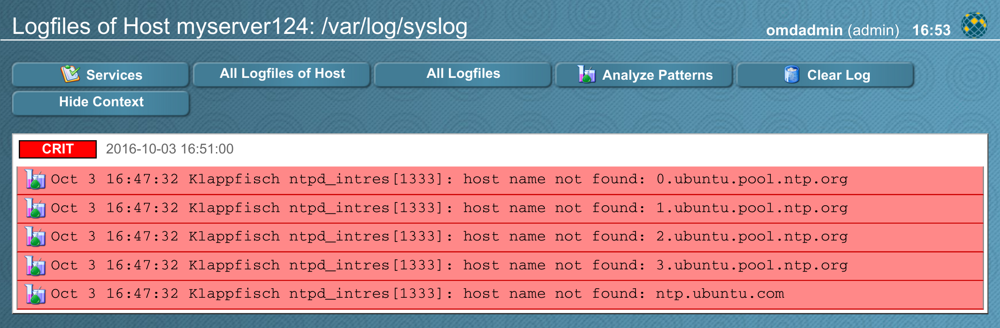

## Logwatch

Việc giám sát nội dung của logfiles là một nhiệm vụ đặc biệt khó khăn đối với người quản trị Nagios. Khó khăn chính là, log messages là sự kiện dựa trên bản chất - trong khi Nagios dựa trên các trạng thái. Cơ chế logwatch của Checkmk khắc phục vấn đề này bằng cách xác định trạng thái quan trọng cho logfile là "no unacknownledged critical log messages".

Khi bắt đầu giám sát, một logfile bắt đầu ở trạng thái `OK` - bất kể nội dung của nó là gì. Khi một thông báo quan trọng mới được thêm trong tệp, nó sẽ được lưu trữ trên máy chủ Nagios để quản trị viên tham khảo. Trạng thái của logfile thay đổi thành `CRITICAL` và sẽ ở trong trạng thái đó trừ khi quản trị viên thừa nhận các thông báo. Các thông điệp quan trọng mới đến trong khi ở trạng thái `CRITICAL` chỉ đơn giản là được lưu trữ và không thay đổi trạng thái.

Checkmk cung cấp một trang web `logwatch.php` hiển thị log messages và cho phép xóa (và do đó thừa nhận) chúng một cách dễ dàng:



### Logwatch với Linux và Unix

- Cài đặt tiện ích mở rộng logwatch

Các logfiles trên Linux và UNIX được theo dõi với phần mở rộng logwatch cho check_mk_agent. Bạn có thể tìm thấy tệp `mk_logwatch` tại `/opt/omd/versions/x.x.x/share/check_mk/agents/plugins/`. Đó là một chương trình nhỏ được viết bằng Python và nó phải được cài đặt vào thư mục plugin của agent. Đường dẫn mặc định cho thư mục plugin là `/usr/lib/check_mk_agent/plugins`. Và cũng cần đảm bảo rằng host đã cài đặt Python phiên bản 2.3 trở lên.

Trên Linux, một cách khác là cài đặt tiện ích mở rộng logwatch thông qua gói RPM hoặc DEB của nó.

- Cấu hình

Logwatch cần biết tập tin nào cần theo dõi và những mẫu nào cần tìm. Điều này được thực hiện trong tệp cấu hình `logwatch.cfg` trên mỗi host target. Tập tin đó được tìm kiếm trong các thư mục sau:

	+ Trong thư mục được chỉ định bởi biến môi trường `LOGWATCH_DIR`
	
	+ Trong thư mục cấu hình check_mk bạn đã chỉ định trong `setup.sh`
	
	+ Nếu biến `LOGWATCH_DIR` không được đặt và `mk_logwatch` được gọi thủ công, thì nó sẽ tìm trong thư mục hiện tại cho tệp đó.

Cũng có thể chia file cấu hình thành nhiều file nhỏ. Hãy tạo 1 folder trong `LOGWATCH_DIR` có tên `logwatch.d`. Bên trong thư mục này bạn có thể đặt nhiều file .cfg

Nếu bạn đã sử dụng gói DEB hoặc RPM để cài đặt hoặc sử dụng các cài đặt mặc định để thiết lập, đường dẫn đến file sẽ là `/etc/check_mk/logwatch.cfg`. Tệp đó liệt kê tất cả các tệp dữ liệu có liên quan và xác định các mẫu sẽ chỉ ra mức độ quan trọng hoặc cảnh báo nếu được tìm thấy trong một dòng nhật ký. Ví dụ sau định nghĩa một số mẫu cho `/var/log/messages`:

`/etc/check_mk/logwatch.cfg`
```
/var/log/messages
 C Fail event detected on md device
 O Backup created*
 I mdadm.*: Rebuild.*event detected
 W mdadm\[
```

Mỗi mẫu là một biểu thức chính quy và được bắt đầu bằng một ký tự khoảng trắng, ký tự C, W, O, I và những thứ khác cũng phải cách một khoảng trắng. Ví dụ trên có nghĩa là:

	+ Các dòng chứa `Fail event detected on md device`: critical
	
	+ Các dòng chứa `Backup created...`: ok
	
	+ Các dòng chứa `mdadm. ...`, sau đó là `Rebuild. ...` và theo sau là `event detected`: ignored
	
	+ Tất cả các dòng khác có chứa `mdadm[`: warning
	
	+ Tất cả các dòng khác cũng sẽ bị bỏ qua

Bạn có thể liệt kê một số logfile được phân tách bằng dấu cách:

`/etc/check_mk/logwatch.cfg`
```
/var/log/kern /var/log/kern.log
 C panic
 C Oops
```

Nó cũng được phép sử dụng các mẫu trong tên tệp:

`/etc/check_mk/logwatch.cfg`
```
/sapdata/*/saptrans.log
 C critical.*error
 C some.*other.*thingy
```

Một số lượng tùy ý của các đoạn như vậy có thể được liệt kê trong `logwatch.cfg`. Các dòng trống và dòng dùng để comment sẽ được bỏ qua. Ví dụ này xác định các mẫu khác nhau cho một số logfiles:

`/etc/check_mk/logwatch.cfg`
```
# This is a comment: monitor system messages
/var/log/messages
 C Fail event detected on md device
 I mdadm.*: Rebuild.*event detected
 W mdadm\[

# Several instances of SAP log into different subdirectories
/sapdata/*/saptrans.log
 C critical.*error
 C some.*other.*thingy
```

- Viết lại dòng

Có thể viết lại các dòng bằng cách đơn giản thêm Quy tắc thứ hai sau mẫu phù hợp bắt đầu bằng R

`etc/check_mk/logwatch.cfg`
```
/var/log/messages
 C Error: (.*)
 R There is error: \1
```

có thể nhóm mẫu trùng khớp với () và sử dụng chúng trong phần viết lại với \ 1, \ 2 ...

- Gộp nhiều dòng

Logwatch có thể được cấu hình để xử lý nhiều dòng cùng nhau thành một dòng nhật ký, điều này rất hữu ích, ví dụ để xử lý java traces. Để cấu hình việc này, cần phải thêm một quy tắc thứ hai sau mẫu phù hợp bắt đầu với A. Ví dụ:

`/etc/check_mk/logwatch.cfg`
```
/var/log/messages
 C Error
 A ^\s
```

Điều này kết hợp mỗi dòng bắt đầu bằng một khoảng trắng hoặc tab trực tiếp sau một dòng chứa `Error` cùng với một dòng.

- Tùy chọn logfile

`mk_logwatch` cho phép giới hạn thời gian cần thiết để phân tích các tin nhắn mới trong logfile. Điều này giúp ích trong trường hợp logfiles đang phát triển một cách nhanh chóng (ví dụ như do lỗi lặp lại). Những trường hợp đó thường phát sinh trong trường hợp các máy chủ ứng dụng Java ghi lại long stack traces.

Có thể giới hạn số lượng dòng mới được xử lý trong tệp logfile cũng như thời gian trong quá trình phân tích tệp. Điều này được thực hiện bằng cách nối thêm các tùy chọn vào các dòng tên tệp:

`/etc/check_mk/logwatch.cfg`
```
/var/log/foobar.log maxlines=10000 maxtime=3 overflow=W
 C critical.*error
 C some.*other.*thingy
```

Ngoài ra còn có các tùy chọn để giới hạn độ dài của các dòng trong tệp logfile và để nhận cảnh báo về kích thước của tệp logfile quá lớn (ví dụ: do xoay vòng tệp logfile).

Các tùy chọn có các ý nghĩa sau:

| maxlines | số lượng log messages mới tối đa sẽ được phân tích trong một lượt trong tệp logfile này |
| --- | --- |
| maxtime | thời gian tối đa tính bằng giây sẽ được sử dụng để phân tích các dòng mới trong tệp logfile này |
| overflow | Khi vượt quá số lượng dòng hoặc thời gian, một thông điệp logfile được tạo ra sẽ được thêm vào, do đó bạn sẽ được cảnh báo. Mặc định là C, nhưng người dùng cũng có thể đặt thành W hoặc I. Đặt `overflow=I` sẽ âm thầm bỏ qua các succeeding messages. Nếu bạn bỏ tùy chọn này, thì hệ thống sẽ giả sử là C được chọn |
| nocontext | Tùy chọn này có thể được sử dụng để vô hiệu hóa xử lý các context log messages, xảy ra cùng với một dòng khớp mẫu. Để tắt xử lý, thêm `nocontext=1` làm tùy chọn |
| maxlinesize | Version 1.2.6. Số lượng ký tự tối đa được xử lý của từng dòng của tệp. Nếu một dòng dài có số ký tự lớn hơn, phần còn lại của dòng sẽ bị cắt ngắn và từ [TRUNCATED] đang được thêm vào. Bạn có thể lọc từ đó trong các biểu thức nếu bạn muốn |
| maxfilesize | Version 1.2.6. Số byte tối đa mà logfile dự kiến ​​sẽ có kích thước |

> Lưu ý: khi vượt quá số lượng tin nhắn mới hoặc thời gian xử lý, các thông điệp nhật ký mới chưa được xử lý sẽ bị bỏ qua và không được phân tích cú pháp ngay cả trong lần chạy tiếp theo. Bằng cách đó, agent luôn giữ đồng bộ với đầu cuối hiện tại của logfile. Từ đó, bạn có thể phải kiểm tra thủ công nội dung của logfile.

> Lưu ý (2): Không nhất thiết phải chỉ định cả `maxlines` và `maxtime`. Nó cũng được phép chỉ định một giới hạn. Mặc định là không áp đặt bất kỳ giới hạn nào cả.

- Lọc tên tệp với các biểu thức thông thường

Đôi khi các tệp khớp mẫu với `*` và `?` không đủ cụ thể để chỉ định logfiles. Trong trường hợp như vậy, bạn có thể sử dụng các tùy chọn mới `regex` hoặc `iregex` để lọc thêm tên tệp được tìm thấy theo mẫu. Đây là một ví dụ:

`etc/check_mk/logwatch.cfg`
```
/var/log/*.log regex=/[A-Z]+\.log$
 C foo.*bar
 W some.*text
```

Điều này chỉ bao gồm các tệp có đường dẫn kết thúc bằng `/`, theo sau là một hoặc nhiều chữ in hoa theo sau là .log , chẳng hạn như `/var/log/FOO.log`. Tập tin `/var/log/bar.log` sẽ bị bỏ qua bởi dòng này.

| regex | Biểu thức chính quy mở rộng phải được tìm thấy trong tên tệp. Nếu không các tập tin sẽ bị bỏ qua. Sử dụng `^` để khớp với phần đầu của đường dẫn và `$` để khớp phần cuối |
| --- | --- |
| iregex | Giống như regex , nhưng khớp mẫu được làm cho trường hợp insensitive |

Lưu ý: Trong mỗi dòng logfile, bạn có thể sử dụng `regex` và `iregex` nhiều nhất một lần.

### Logwatch trên Windows

`check_mk_agent.exe` cho Windows tự động giám sát Windows Eventlog. Output của nó hoàn toàn tương thích với phần mở rộng logwatch cho Linux / UNIX. Sự khác biệt chính là Windows đã phân loại các thông báo của nó bằng `Warning` hoặc `Error`. Hơn nữa, agent tự động theo dõi tất cả các bản ghi sự kiện hiện có mà nó tìm thấy, do đó bạn không cần cấu hình nào trên host target. Tuy nhiên - có thể phân loại lại các tin nhắn ở mức cao hơn hoặc thấp hơn thông qua biến cấu hình `logwatch_patterns`. Các tin nhắn được phân loại là thông tin của Windows không thể được phân loại lại do chúng không được gửi bởi agent.

Windows agent hiện cũng hỗ trợ giám sát các tệp văn bản tùy chỉnh, giống như linux / unix agent.