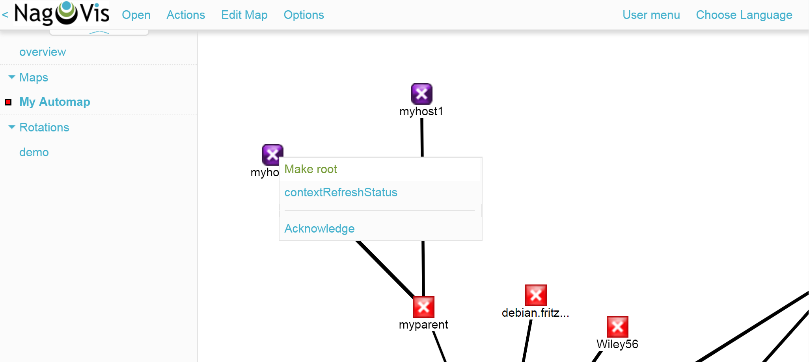
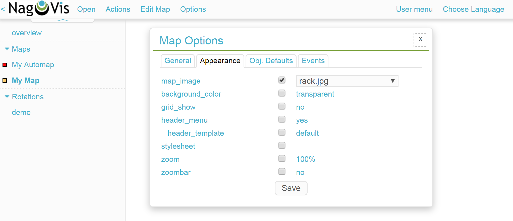
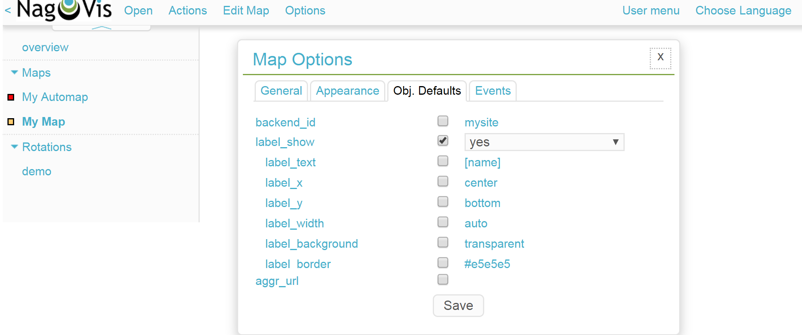
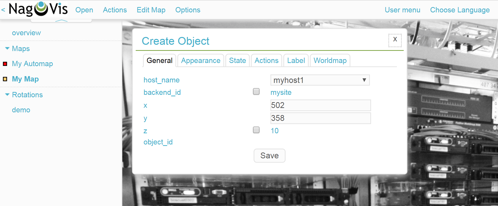
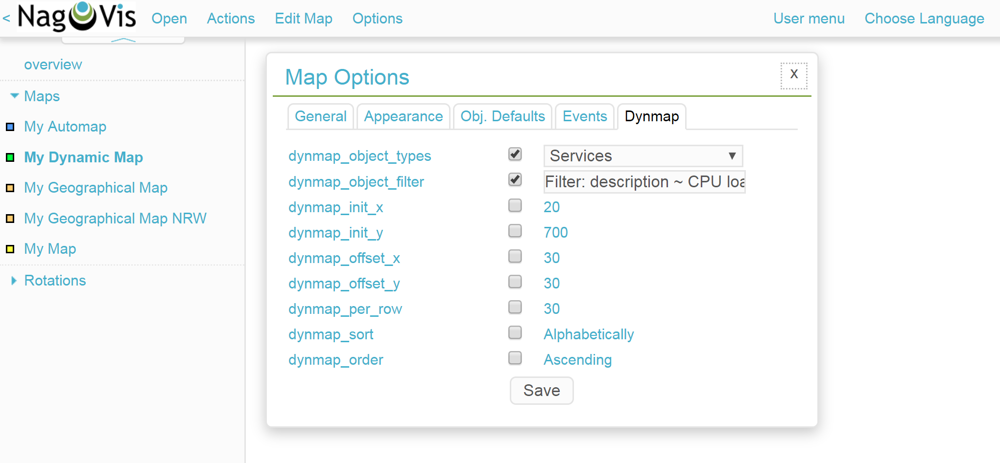
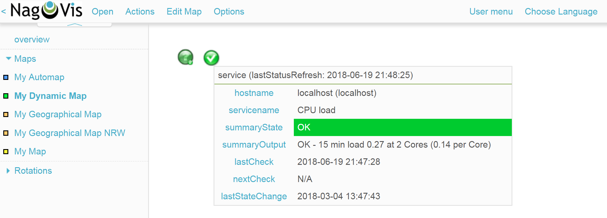

## Nagvis

Ở đây ta có 1 ví dụ về network map. NagVis là một addon trực quan hóa cho hệ thống quản lý mạng nổi tiếng Nagios® (và Icinga là một nhánh của Nagios). NagVis chịu trách nhiệm cho các bản đồ như vậy. Tiện ích mở rộng Nagios cho phép trực quan hóa dữ liệu của Nagios, ví dụ như cơ sở hạ tầng, máy chủ, các port hoặc tiến trình.

Sử dụng nagvis giúp chúng ta có thể vẽ được mối liên hệ giữa các thiết bị trong mạng và theo dõi được hiện trạng của mạng cũng như từng services. Sử dụng dữ liệu được cung cấp bởi 1 backend, nó sẽ cập nhật các đối tượng được đặt trên bản đồ theo các khoảng nhất định để phản ánh trạng thái hiện tại. Những bản đồ này cho phép sắp xếp các đối tượng để hiển thị chúng theo các bố cục khác nhau:

- vật lý (ví dụ: tất cả các máy chủ trên tủ rack / trong phòng)

- logic (ví dụ: tất cả các máy chủ ứng dụng)

- địa lý (ví dụ: tất cả host trong vùng địa lý)

- business processes (ví dụ: tất cả máy chủ / dịch vụ liên quan đến một quy trình)

Nói chung, NagVis là một công cụ trình bày thông tin được Nagios thu thập và chuyển bằng cách sử dụng backend.

Các backend được hỗ trợ là:

- mklivestatus (mặc định kể từ NagVis 1.5)

- NDOUtils / IDOUtils (yêu cầu MySQL)

- merlin (yêu cầu MySQL)

Backend lấy thông tin từ quy trình Nagios (mklivestatus) hoặc từ cơ sở dữ liệu (NDOUtils / IDOUtils, merlin).

Bạn có thể đặt tất cả các đối tượng từ Nagios (Máy chủ, Dịch vụ, Nhóm máy chủ, Nhóm dịch vụ) trên bản đồ. Mỗi bản đồ có thể được cấu hình thông qua tập tin cấu hình riêng của nó. Bạn có thể chỉnh sửa các tệp cấu hình trực tiếp bằng cách sử dụng trình soạn thảo văn bản hoặc các cơ chế cấu hình web. Hơn nữa, bạn có thể thêm một số đối tượng NagVis đặc biệt vào bản đồ. Các đối tượng này là hình dạng, hộp văn bản và đối tượng tham chiếu cho các bản đồ khác.

Mỗi đối tượng trên bản đồ của bạn có thể được cấu hình để phù hợp với nhu cầu của bạn. Ví dụ, có các liên kết đến giao diện Nagios trên mỗi đối tượng đại diện cho một đối tượng Nagios. Bạn có thể dễ dàng tùy chỉnh các liên kết này.

Có một menu di chuột được bật theo mặc định. Menu này hiển thị thông tin chi tiết cho từng đối tượng. Nó có thể dễ dàng được sửa đổi bằng cách thay đổi các mẫu template. Bạn cũng có thể vô hiệu hóa menu di chuột.

Theo mặc định, trạng thái của các đối tượng được hiển thị bằng các biểu tượng trên bản đồ. Bạn có thể thay đổi các biểu tượng này bằng cách thêm các biểu tượng từ trang chủ NagVis hoặc tạo biểu tượng của riêng bạn. Trạng thái của các đối tượng cũng có thể được hiển thị dưới dạng đường hoặc dưới dạng tiện ích.

### Yêu cầu hệ thống

- Nagios® / Icinga (đã cài đặt, định cấu hình, đang chạy)

Bạn có thể tải xuống Nagios từ [trang chủ chính thức của Nagios](http://www.nagios.org/).

Thông tin thêm về các [gói / tải xuống Icinga có sẵn](https://www.icinga.org/download/packages/) có thể được tìm thấy trên [trang web chính thức của Icinga](https://www.icinga.org/).

- MKLivestatus (đã cài đặt, thêm vào Nagios)

Kể từ NagVis 1.5,default backend được chuyển sang MKLivestatus vì nó nhanh hơn, nhẹ hơn và ổn định hơn so với NDO. Và nó cũng dễ dàng để xử lý và cài đặt. Bạn không cần bất kỳ cơ sở dữ liệu nào để chạy MKLivestatus.

MKLivestatus là Event Broker Module cho Nagios, phục vụ cho unix socket nơi các addon bên thứ ba như NagVis có thể kết nối để thu thập thông tin live status một cách nhanh chóng.

Bạn có thể tìm thấy các hướng dẫn MKLivestatus từ [trang chủ MKLivestatus chính thức](http://www.mathias-kettner.de/checkmk_livestatus.html).

- Máy chủ web có hỗ trợ PHP

NagVis là một ứng dụng dựa trên web được hiện thực hóa trong Javascript và PHP. Bạn cần một máy chủ web có hỗ trợ PHP để chạy NagVis. Bạn nên sử dụng máy chủ web Apache với mod_php.

Yêu cầu phiên bản tối thiểu của PHP là 5.0.0.

Các mô-đun PHP cần thiết:

php5-gd

php5-gettext

php5-mbstring

php5-session

php5-json (Được xây dựng từ PHP 5.2)

php5-pdo và pdo-sqlite (Mới trong bản 1.5, cho mô-đun xác thực / ủy quyền mặc định)

> Lưu ý: Có thể một số chức năng đã được biên dịch sẵn vào PHP.`php -m` sẽ hiển thị các mô-đun tích hợp.

- Yêu cầu đặc biệt bởi các backend:

Các backend kết nối với các nguồn dữ liệu bên ngoài và thường cần một số mô-đun đặc biệt. Dưới đây là danh sách các mô-đun cần thiết cho các backend khác nhau. Bạn chỉ cần đáp ứng các yêu cầu của backend mà bạn sử dụng.

**mklivestatus**

php-net-socket (Debian) / php5-socket (SLES)

**ndomy**

php5-mysql

**merlinmy**

php5-mysql

- Graphviz cho automap

Automap dựa trên Graphviz. Bạn cần nó khi bạn muốn sử dụng tính năng automap. Bạn nên sử dụng phiên bản Graphviz >= 2.14 (Phiên bản cũ hơn (với số phiên bản thấp hơn) có một số vấn đề với kết xuất truecolor).

Graphviz có sẵn trong một số bản phân phối. Khi bạn không thể sử dụng gói phân phối được biên dịch sẵn, bạn có thể tải xuống Graphviz từ [trang chủ chính thức của Graphviz](http://www.graphviz.org/) để tự biên dịch nó.

Bạn cũng sẽ cần các gói hơn như gd, libpng, freetype, ... nhưng nếu bạn có graphviz được biên dịch hoặc cài đặt sẵn thì nó sẽ hoạt động.

### Thiết lập NagVis

NagVis được tích hợp đầy đủ trong Checkmk và được định cấu hình để bạn có thể ngay lập tức bắt đầu thêm các yếu tố từ giám sát của mình vào bản đồ.

Để khởi động NagVis, trước tiên tại phần Sidebar-Snapins hãy nhấn nút  ở phía dưới bên trái. Chọn snapin NAGVIS MAPS, kéo nó vào side-bar phía bên trái, và cuối cùng khởi động NagVis bằng nút .

Ngoài ra, một cách khác để sử dụng nagvis là truy cập vào đường dẫn ip_server_check_mk/site/nagvis

Trong đó:

ip_server_check_mk: là địa chỉ của máy server

site: là tên site mà chúng ta tạo trên OMD

Giao diện nagvis

Chọn `Options`, sau đó chọn `Manage Maps`

Sau đó hệ thống đưa ra 1 bảng để tạo một map mới, điền các thông tin cần thiết rồi nhấp chọn `Create`

ở phần `Map Type` có tổng cộng 5 loại bản đồ khác nhau: regular, dynamic, automatic và interactive/non-interactive geographic maps

`Regular Map` là loại bản đồ tiêu chuẩn. Các bản đồ có thể thể hiện bất kỳ kịch bản mong muốn nào - từ switch port, đến phòng máy chủ, đến cơ sở hạ tầng hoàn chỉnh. Các yếu tố (Biểu tượng, Lines, v.v.) được thêm riêng vào bản đồ từ inventory của các máy chủ và dịch vụ của Checkmk.

`Dynamic Maps` phần lớn giống với `Regular Map`, tuy nhiên có một sự khác biệt đáng kể: máy chủ, dịch vụ, Máy chủ lưu trữ và nhóm dịch vụ không được chỉ định rõ ràng mà thay vào đó bằng cách sử dụng các bộ lọc ở dạng biểu thức chính quy, để nói chính xác hơn, dưới dạng Livestatus-Filter-Definitions hợp lệ. Theo cách này, các máy chủ và dịch vụ mới, và tương tự, mọi thay đổi sẽ tự động trên bản đồ mà không cần thêm hành động thủ công.

`Automaps based on parent/child relations` bạn có thể xem ảnh ở phần đầu. Đây là các bản đồ cấu trúc mạng được tạo hoàn toàn tự động từ Parent-Child-Relationships được xác định trong Checkmk.

`Geographical Maps` là các bản đồ được hiển thị bằng các tài liệu bản đồ từ Open-Street-Map(OSM)-Projekt cho nền của chúng.

- Tạo automap

Cơ sở nhanh nhất để tạo bản đồ đại diện là Parent-Child-Automap. Tạo bản đồ mới của `Automap based on parent/child relations` thông qua `Options` -> `Manage Maps` -> `Create Map`. Trong mục `ID` và `Alias` lần lượt nhaập tên và bí danh để hiển thị.

Bản đồ sẽ ngay lập tức xuất hiện trong Content Area và liên kết tương ứng của nó sẽ xuất hiện trong NagVis-Sidebar-Snapin. Các cài đặt tiếp theo có thể được tùy chỉnh trong `Edit Map` -> `Map Options` -> `Automap`. `render_mode` đặc biệt thú vị vì nó cung cấp bố cục cơ bản của các nút trên bản đồ.

Ngoài ra, phần gốc của bản đồ có thể được chỉ định ở đây - mặc dù điều đó có thể thực hiện một cách đơn giản hơn bằng việc click chuột trên một biểu tượng trên bản đồ, và sau đó thực hiện một mục trong menu `Make root`.

- Tạo regular map

`Regular Maps` là bản đồ phổ biến nhất ở NagVis. Để tạo bản đồ, mở các tùy chọn thông qua `Options` -> `Manage Maps`. Ở đây trong phần `Create Map` cung cấp cho bản đồ tên (ID) và bí danh (Alias). Đối với `Map Type`, chọn `Regular map` và xác minh bằng nút `Create`.

Tiếp theo, import ảnh của host được theo dõi để làm background - thông qua `Options` -> `Manage Backgrounds`. Chỉ cần chọn tệp hình ảnh để tải lên và xác minh nó bằng nút `Upload`.

Bây giờ hình ảnh đã được upload phải được xác định làm background cho bản đồ hiện tại. Truy cập `Edit Map` -> `Map Options` và chuyển đến tab `Appearance`. Tại đây kích hoạt tùy chọn `map_image` và chọn hình ảnh từ menu.

Đến tab `Obj. Defaults`, tại đây kích hoạt tùy chọn `label_show`. Tùy chọn này cho phép các biểu tượng máy chủ và dịch vụ trên bản đồ được gắn nhãn với tên máy chủ / dịch vụ phù hợp của chúng - nếu không các biểu tượng sẽ chỉ được xác định thông qua các menu di chuột. Cuối cùng, lưu các cài đặt này.

Bây giờ thêm host giám sát vào. Nhấp vào `Edit Map` -> `Add Icon` -> `host` và sau đó với con trỏ chuột (dưới dạng hình chữ thập) chọn vị trí trên bản đồ nơi đặt biểu tượng, mục `Create Object` sẽ xuất hiện. Trong tab `General`, chỉ cần chọn máy chủ mong muốn từ menu trong mục `host_name` và lưu lại. Nếu bạn vận hành nhiều sites Checkmk, một nguồn dữ liệu thay thế có thể được sử dụng thông qua `backend_id`.

Biểu tượng hiện được định vị trên bản đồ và nó cung cấp thông tin chi tiết khi di chuột vào. Nhấp vào biểu tượng sẽ đưa bạn trực tiếp đến máy trang giám sát host trong Checkmk - tất cả các đối tượng được định vị trong NagVis hiện đang liên kết đến các đối tượng Checkmk của bạn.

Chế độ chỉnh sửa cần được kích hoạt để có thể di chuyển hoặc chỉnh sửa biểu tượng. Nhấp chuột phải vào biểu tượng để mở menu của nó và chọn `Unlock`.

Khi quá trình chỉnh sửa máy chủ / biểu tượng hoàn tất, hãy mở lại menu của nó và chọn `Lock`. Thông qua `Edit Map` -> `Lock/Unlock all`, tất cả chế độ chỉnh sửa cũng có thể được kích hoạt và hủy kích hoạt cho bản đồ hoàn chỉnh.

Để các sự cố sẽ được báo hiệu bằng cảnh báo cảnh báo và nhấp nháy trên các biểu tượng máy chủ, truy cập `Edit Map` -> `Map Options` và chuyển sang tab `Events`. Tại đây, ở trên cùng của màn hình, kích hoạt cảnh báo trong mục `event_on_load` và ở dưới cùng kiểm tra mục `event_sound` để nhận cảnh báo bằng âm thanh.

- Tạo geographical map

Geographical maps có sẵn ở hai dạng khác nhau: `interactive` có thể được cuộn và phóng to theo như trên Google Maps và background được đặt tự động. Các đối tượng đã được đặt trên các bản đồ như vậy sẽ xuất hiện trên mọi bản đồ tiếp theo cùng loại. NagVis giả định rằng một đối tượng sẽ luôn được tìm thấy tại một địa điểm cụ thể bất kể tỷ lệ của bản đồ. Vì vậy, ví dụ, một máy chủ đặt tại Hamburg sẽ xuất hiện trên bản đồ thế giới cũng như trên bản đồ của Đức và tất nhiên là trên bản đồ của Hamburg.

NagVis cuối cùng xem các phần bản đồ và phóng to các cấp chỉ như Viewports. Bất cứ lúc nào, các viewport có thể được lưu dưới dạng bản đồ mới, riêng biệt. Vì các viewports/maps ũng có thể được coi là biểu tượng trên bản đồ, nên ở một mức độ nào đó, bản đồ có thể được lồng vào nhau.

Các bản đồ non-interactive phải được cung cấp với tệp CSV chứa các host và các tọa độ sẽ được hiển thị. Không có yếu tố chung tồn tại trước trong trường hợp này.

Trong tài liệu, các bản đồ `interactive` được gọi là `Worldmaps` và các biến thể `non-interactive` được gọi là `Geomaps`. `Worldmaps` lần đầu tiên được thêm vào phiên bản 1.9 hiện tại của NagVis

Ví dụ: tạo một bản đồ `interactive` bằng cách chọn `Options` -> `Manage Maps` -> `Create Map`. Mục `Map Type` chọn `Geographical Map (interactive)`, tên (ID) vầ bí danh (Alias) của map cũng có thể được định nghĩa ở đây.

Để hoàn tất, chỉ định phần bản đồ mong muốn làm overview và lưu lại bằng cách chọn `Edit Map` -> `Viewport` -> `Save view`.

Tiếp theo phóng to bản đồ cho đến khi đạt được chi tiết mong muốn cho NRW. Lần này lưu lại bằng cách chọn `Map` -> `Viewport` -> `Save as new map`

- Tạo dynamic map

Dynamic maps khác với `Regular Maps` - như đã đề cập trước đó - trong phương pháp thêm các yếu tố của chúng. Thay vì bổ sung thủ công, `Dynamic Maps` nhận các yếu tố của chúng - máy chủ, dịch vụ và các nhóm dịch vụ và máy chủ tương tự - một cách linh hoạt thông qua các bộ lọc Livestatus.

Ví dụ, một bản đồ sẽ tự động nhận các CPU load-services từ tất cả các máy chủ.

Để tạo bản đồ như vậy, chọn `Options` -> `Manage Maps` -> `Create Map`, đwạt tên cho ID và Alias của map.

Tiếp theo mở các tùy chọn bản đồ với `Edit Map` -> `Map Options` và chọn tab `Dynmap`. Ở đây kích hoạt tùy chọn `dynmap_object_types` và chọn các dịch vụ làm loại đối tượng.

Phần thú vị bây giờ tiếp theo với tùy chọn thứ hai `dynmab_object_filter`, trong đó bộ lọc cho các dịch vụ được xác định. Sử dụng [Livestatus-Abfrage](https://checkmk.com/cms_livestatus.html) `Filter: description ~ CPU load\n` để tìm kiếm chuỗi `CPU load` trong cột `description`. `\n ` không thuộc về bản thân bộ lọc, nó tạo ra một dấu ngắt dòng theo yêu cầu của truy vấn Livestatus trái ngược với bộ lọc.

Nếu bây giờ bạn lưu lại, tất cả các dịch vụ `CPU load` được giám sát của bạn sẽ xuất hiện trên map. Đồng thời, mọi đối tượng mới trong giám sát phù hợp với bộ lọc sẽ được thêm tự động vào.

> vì dynamic maps cũng có thể được lưu dưới dạng static maps với `Actions` -> `Export to static map`, phương pháp này có thể được sử dụng làm trợ giúp cho người mới bắt đầu để tạo static maps chứa rất nhiều yếu tố.

### Chỉnh sửa Icon

Bạn hoàn toàn có thể tự tạo 1 bộ icon để phục vụ cho việc giám sát của mình.

Một bộ biểu tượng hoàn chỉnh bao gồm một số tệp. Những tập tin này là những tệp hình ảnh png được đặt tên như sau:

NagVis kiểm tra hình ảnh `<set>_ok.png` để liệt kê các biểu tượng, có nghĩa là phải có ít nhất một hình ảnh `<set>_ok.png` để có bộ biểu tượng có thể lựa chọn.

Để triển khai cài đặt trong cài đặt NagVis của bạn, hãy sao chép tất cả các tệp vào thư mục bộ biểu tượng (share/userfiles/images/iconsets).

Mở một trong những bản đồ của bạn và thêm một biểu tượng máy chủ mới. Bây giờ bạn có thể chọn icon vừa được thêm vào làm biểu tượng.