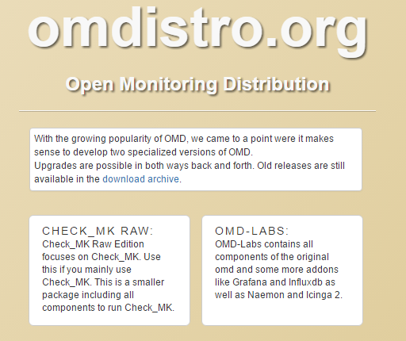
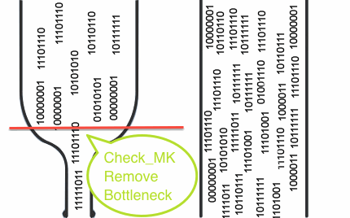
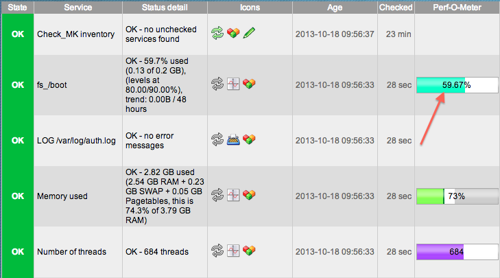
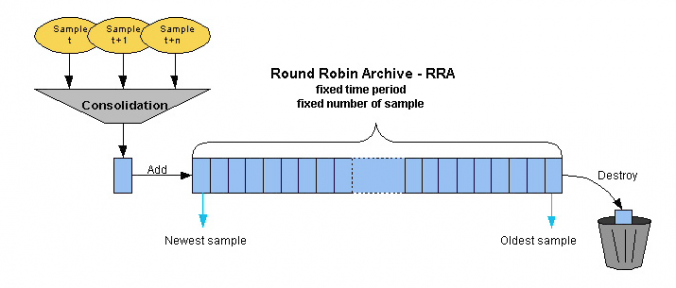

## Tìm hiểu về Check_mk

### 1. Tổng quan

Dự án Check_mk được phát triển từ năm 2008 như là một plugin của Nagios Core.

Năm 2010 dự án OMD (Open Monitoring Distribution) được khởi động bởi Mathias Kettner, là sự kết hợp của Nagios, Check_mk, NagVis, PNP4Nagios, DocuWiki, ...tạo nên sự linh hoạt trong giám sát. Các distro của OMD đang là OMD-Labs và Check_mk Raw.

Năm 2015, phiên bản đơn giản của OMD ra đời gọi là Check_mk.

Đây là một phần mềm được phát triển bằng Python và C ++ để theo dõi Cơ sở hạ tầng CNTT. Nó được sử dụng để giám sát các máy chủ, ứng dụng, mạng, cơ sở hạ tầng đám mây (công cộng, riêng, lai), container, storages, cơ sở dữ liệu ...

Checkmk có sẵn trong 4 phiên bản khác nhau:

- Checkmk Raw Edition hoàn toàn miễn phí, 100% mã nguồn mở, và toàn diện hệ thống giám sát CNTT.

- Checkmk Enterprise - Free Edition là phiên bản miễn phí của sản phẩm thương mại, bị giới hạn ở 2 sites, mỗi với tối đa 10 host có thể được theo dõi.

- Checkmk Enterprise - Standard Edition bao gồm nhiều tính năng bổ sung có liên quan, cung cấp một khả năng mở rộng lớn hơn, hỗ trợ doanh nghiệp thông qua các nhà cung cấp hoặc các partner network. Nó có sẵn dưới dạng gói thuê bao hàng năm, với giá khởi điểm là 600 €, chưa kể thuế.

- Checkmk Enterprise - Managed Services Edition dựa trên Enterprise - Standard Edition và cung cấp các tính năng đặc biệt nhắm vào các công ty muốn cung cấp Check_mk dưới dạng dịch vụ được quản lý, giá khởi điểm là 1200 €, chưa kể thuế.

Các phiên bản Check_mk này có sẵn cho một loạt các nền tảng, đặc biệt là các phiên bản khác nhau của Debia, Ubunt, SLES (SUSE Linux Enterprise Server) và RedHat/CentOS và cả dưới dạng Docker Image.

Các Checkmk agent được sử dụng để thu thập dữ liệu có sẵn cho 11 nền tảng, bao gồm cả Windows.

### 2. OMD-Labs và OMD(check_mk)

- OMD là một phiên bản nhỏ của OMD-LABS nó tập chung chủ yếu vào việc phát triển check_mk.

- OMD-LABS là phiên bản nâng cấp của OMD nên nó có thêm một số sản phẩm mã nguồn mở khác được tích hợp ví dụ như : Naemon; Icinga2; Grafana/Influxdb …

- Trang web mặc định của OMD-LABS là Thruk

- Từ phiên bản OMD-LABS 3.0 trở đi đã remove một số phần mềm là: Nagios3; Icinga 2, Check_mk, Nagvis

- Khoảng 6 tháng 1 lần OMD-Labs sẽ có 1 phiên bản stable mới được phát hành.

#### Một số điểm khác của OMD-LABS với OMD thường (Check_mk Raw):

Các thành phần phần mềm bổ sung: OMD-Labs chỉ bổ sung các thành phần phần mềm mới và không loại bỏ bất kì phần mềm nào, làm cho OMD-Labs trở nên hoàn hảo hơn, và có thể chuyển sang các phiên bản khác bằng omd update

- Lõi giám sát mới: Bên cạnh Nagios 3, OMD-Labs còn chứa hai Cores mới là Naemon và Icinga2. Trong khi Naemon hoàn toàn tương thích với định dạng Nagios 3 config thì Icinga2 sử dụng định dạng cấu hình mới

- Biểu đồ Grafana/Influxdb: Bên cạnh PNP4Nagios OMD có đồ thị Grafana dựa trên Influxdb. Để tạo mẫu đồ thị dựa trên mẫu, đã có histou (Histou được thiết kế để thêm các mẫu vào Grafana từ dữ liệu của Nagios). Giao diện giữa core giám sát và Influxdb được thực hiện trong thành phần Nagflux.

- Hệ thống con Prometheus: Bên cạnh việc giám sát truyền thống, OMD-Labs đi kèm với prometheus bao gồm quản lý cảnh báo, pushgateway và blackbox exporter

- Livestatus Multitool Daemon

Thay đổi Cài đặt mặc định

- Naemon Core: Naemon thay thế Nagios làm lõi mặc định trong OMD-Labs. Để trở lại cài đặt ban đầu:

`omd config set CORE nagios`

- Chế độ SSL / TLS Apache: OMD-Labs đi kèm với kích hoạt SSL / TLS Apache theo mặc định. Để trở lại mặc định:

`omd config set APACHE_MODE own`

### 3. Ưu điểm trong thiết kế kiến trúc của OMD

- OMD được xây dựng từ những đóng góp của cộng đồng về những khó khăn hay khuyết điểm mà Nagios gặp phải, từ đó đưa ra quyết định cần tích hợp thêm những sản phẩm gì để cải thiện.

- Việc cài đặt trở nên vô cùng đơn giản. OMD được đóng gói hoàn chỉnh trong một package, việc cài đặt và cấu hình chỉ mất rất ít thời gian với chỉ một câu lệnh

- Các lõi sẽ gọi xuống check_mk để thực hiện chức năng kiểm tra của nó

- Sau khi check thì livestatus sẽ hiển thị thông tin của mk lên website

- PNP4nagios: được sử dụng để xử lý dữ liệu để chuyển sang dạng biểu đồ

- Nagvis : được sử dụng để vẽ lại mô hình giám sát giúp người dùng có thể nhìn một cách dễ dàng hiểu hơn

- Dữ liệu sẽ được lưu vào trong RRD

### 4. 1 số khái niệm trong Check_mk

Check_MK ra đời để giải quyết bài toán về hiệu năng mà Nagios gặp phải trong quá khứ. Cơ chế mới của Check_MK cho phép việc mở rộng hệ thống trở nên dễ dàng hơn, có thể giám sát nhiều hệ thống chỉ từ một máy chủ Nagios Server.

Có 2 mô đun mà Check_mk sử dụng để cải thiện đáng kể hiệu năng là Livestatus và Livecheck

- Livestatus

#### Trước khi có Livestatus

Kết quả giám sát được sẽ lưu trong file status.dat gây nên hiện tượng nút thắt cổ chai cho CPU và Disk I/O

Trạng thái của file status không phải là real-time mà update ít nhất là mỗi 10s

NDOUtils sử dụng database để theo dõi kết quả (MySQL hoặc PostgreSQL), nhưng vẫn còn một số thiếu sót quan trọng.

Việc cài đặt NDOUtils khá phức tạp

NDOUtils cần một database cho việc lưu trữ dữ liệu. Hơn nữa, việc dữ liệu lưu trong database này tăng lên một cách nhanh chóng khiến cho cần phải tiêu tốn nhiều tài nguyên CPU chỉ để cập nhập database.

Một số dự án tương tự vẫn sử dụng NDOUtils: Centreon và Opsview

Việc dọn dẹp database có thể khiến Nagios bị treo trong một khoảng thời gian nhất định

#### Sau khi có Livestatus

Đây là một phần quan trọng trong check_mk. Nó giúp cho check_mk truy xuất dữ liệu một cách nhanh chóng

Livestatus cũng sử dụng Nagios Event Broker API như NDO, nhưng nó sẽ không chủ động ghi dữ liệu ra. Thay vào đó, nó sẽ mở ra một socket để dữ liệu có thể được lấy ra theo yêu cầu, do đó tốc độ truy vấn của nó không còn phụ thuộc vào tốc độ I/O như là lưu dữ liệu trong file

Livestatus sẽ sử dụng socket để check dữ liệu do đó công việc được phân đều cho các CPU

Livestatus tiêu tốn ít CPU

Khi truy xuất dữ liệu bằng command line thì livestatus sẽ phân biệt chữ hoa và chữ thường

Livestatus không làm cho Disk I/O thay đổi khi truy vấn trạng thái dữ liệu

Không cần cấu hình. Không cần cơ sở dữ liệu. Không cần quản lý

Livestatus có quy mô lớn với hơn 50.000 dịch vụ

- Livecheck

Các vấn đề tồn tại trong Nagios (trước Nagios 4.0)

Mỗi lần check tạo ra một bản fork. Quá trình fork rất tốn kém ngay cả khi kernel được tối ưu hóa

Quá trình fork trong Nagios Core (trước phiên bản Nagios 4.0) không phân tán ra nhiều CPU mà thực hiện trên chỉ một CPU đơn. Điều này dẫn tới việc giới hạn số lần check mỗi giây, trong khi phần lớn các CPU khác rảnh rỗi.

Làm thế nào để Livecheck giải quyết được vấn đề nút thắt cổ chai, cải thiện hiệu năng:

Livecheck sử dụng các helper process, các core giao tiếp với helper thông qua Unix socket (điều này không xảy ra trên file system)

Chỉ có một một helper program được fork thay vì toàn bộ Nagios Core.

Các tiến trình fork được phân tán trên tất cả các CPU thay vì chỉ một như trước

Process VM size tổng chỉ khoảng 100KB

- Multisite – Giao diện web tiên tiến hơn Nagios

Multisite là một phần của dự án Check_mk như là một giao diện web cho người dùng tốt hơn để thay thế cho Nagios

Một GUI mới và sáng tạo để xem thông tin trạng thái Nagios và kiểm soát hệ thống giám sát. Nó dựa trên MK Livestatus và nhằm mục đích thay thế cho GUI web Nagios. Multisite hỗ trợ giám sát phân tán một cách hiệu quả nhất

Kết hợp WATO để có thể hỗ trợ việc cấu hình bằng website

WATO là tập hợp nhiều modules được sử dụng để cấu hình cho check_mk server

Mỗi khi có thay đổi cần chọn cập nhật thay đổi

Có sẵn các agent giám sát được lưu trữ và hiển thị sẵn trên web

Nó có phiên bản tối ưu hóa cho điện thoại

Agent giám sát có sẵn cho Linux và Windows

Khả năng tìm kiếm mạnh mẽ

Thông số đo lường trực quan với Perf-O-Meter

- EVENT CONSOLE

Ngoài việc giám sát theo khoảng thời gian check bình thường còn có một loại giám sát theo sự kiện

Event console là hệ thống tích hợp theo dõi sự kiên từ các nguồn như syslog; SNMP traps; Windows event logs …

Những sự kiện xảy ra không được xử lý bằng lõi của check_mk mà được xử lý bằng một dịch vụ riêng biệt

- Round Robin Database(RRD)

Đây là dạng DB mặc định mà check_mk dùng để lưu trữ thông tin

Thông tin của DB được lưu trữ dưới dạng bảng và cột để lưu trữ dữ liệu

Có thể hợp nhất được dữ liệu của một khoảng thời gian lại vào làm một

Có thể truy vấn được dữ liệu trong RRD bằng live status language

Lưu ý ngôn ngữ truy vấn này phân biệt chữ hoa và chữ thường

Có thể sử dụng các headers để lọc thông tin hiển thị từ các truy vấn được sử dụng

Khi muốn truy vấn thống kê thì có các giá trị và các toán tử được định nghĩa sẵn để sử dụng

Khi dữ liệu được lưu đầy thì nó sẽ ghi đè lên dữ liệu cũ

- Site

Để có thể thực hiện việc giám sát thì cần tạo ra một site để có thể sử dụng

Một server có thể tạo ra được nhiều site

Để đăng nhập được vào site thì cần có user để đăng nhập và user được phân thành 3 loại user: Administrator; Guest; Normal monitoring

Có 2 user mặc định có quyền Administrator là omdadmin và cmkadmin

Site là cách gọi của sản phẩm được tạo ra từ Multisite

- States và events

Điều quan trọng là phải hiểu sự khác biệt cơ bản giữa *state* và *event*. Hầu hết các hệ thống giám sát CNTT cổ điển đều xoay quanh các event. Một event là một cái gì đó xảy ra duy nhất tại một thời điểm cụ thể. Một ví dụ điển hình là báo lỗi khi truy cập vào ổ đĩa X. Các nguồn event tiêu biểu là syslog messages, SNMP traps, the Windows Event Log, log data entries. Các sự kiện là sự xuất hiện tự phát (tự tạo, không đồng bộ).

Ngược lại, *state* mô tả một teạng thái duy trì, ví dụ ổ đĩa X đang trực tuyến. Để quan sát trạng thái của một cái gì đó, hệ thống giám sát phải thường xuyên thăm dò nó. Như ví dụ cho thấy, trong giám sát, thường có thể chọn làm việc với các event hoặc state.

Checkmk có thể đáp ứng cả state và event, nhưng, khi có sẵn sự lựa chọn, luôn ưu tiên giám sát dựa trên state. Lý do cho điều này nằm ở vô số lợi thế của phương pháp này. Một số trong số này là:

	- Một lỗi trong bản thân giám sát được phát hiện ngay lập tức, bởi vì nó rõ ràng là đáng chú ý khi truy vấn trạng thái không còn hoạt động. Mặt khác, việc không xuất hiện một tin nhắn sẽ không đưa ra bất kỳ sự chắc chắn nào cho dù việc giám sát có còn hoạt động hay không.

	- Kiểm tra thường xuyên trong một khung thời gian cố định cho phép thu thập dữ liệu hiệu suất để ghi lại lịch sử thời gian của chúng.

	- Bản thân Checkmk có thể kiểm soát tốc độ mà các state được polled. Không có nguy cơ *storm event* trong các tình huống global error.

	- Ngay cả trong các tình huống hỗn loạn - ví dụ như mất điện trong trung tâm máy tính - người ta luôn có trạng thái tổng thể đáng tin cậy.

- Hosts and services

Mọi thứ trong Checkmk đều xoay quanh *host* và *service*. Một host có thể có nhiều thứ, ví dụ:

	- server
	
	- network device (switch, router, load balancer)
	
	- thiết bị đo lường có kết nối IP (thermomether, hydrometer)
	
	- bất cứ thứ gì khác với một địa chỉ IP
	
	- 1 cluster với nhiều host
	
	- 1 máy ảo

	- 1 Docker container
	
Trong giám sát 1 host luôn có một trong các trạng thái sau:

| State | Màu sắc | ID | Ý nghĩa |
| --- | --- | --- | --- | 
| UP | màu xanh lá | 0 | Host có thể truy cập qua mạng (điều này thường có nghĩa là nó trả lời PING) |
| DOWN | màu đỏ | 1 | Host không trả lời các yêu cầu mạng, không thể truy cập |
| UNREACH | màu da cam | 2 | Đường dẫn đến host hiện bị chặn để giám sát, bởi vì router hoặc switch bị lỗi |
| PEND | màu xám | | Host mới trong giám sát, nhưng chưa bao giờ được thăm dò. Nói đúng ra đây không thực sự là một điều kiện |

Bên cạnh state, 1 host có một số thuộc tính khác có thể được định cấu hình bởi người dùng, ví dụ:

	- 1 tên duy nhất
	
	- Địa chỉ IP
	
	- Tùy chọn - một bí danh, không được là duy nhất

	- Tùy chọn - một hoặc nhiều **parents**

- Parents

Để giám sát có thể đánh giá trạng thái UNREACH, nó phải biết thông qua đường dẫn nào mà mỗi host cụ thể có thể truy cập. Ngoài ra, đối với mỗi host, một hoặc nhiều host được gọi là *parent hosts* có thể được chỉ định. Nếu, ví dụ: máy chủ A nhìn thấy từ giám sát chỉ có thể truy cập qua router B, thì B là parent của A. Theo cách này, chỉ có parent trực tiếp được cấu hình. Hơn nữa, một cấu trúc cây được tạo ra với đối tượng Checkmk ở trung tâm của nó (hiển thị ở đây là ):

Trong ví dụ này, nếu máy chủ sw-ks-01.lan.tribe29.com hiển thị trạng thái DOWN, việc giám sát sẽ tự động giả định rằng sự cố của sw-ks-02.lan.tribe29.com có thể được giải thích đơn giản là do nó không còn có thể truy cập để theo dõi. Cho dù không thể xác định được là nó có gặp sự cố thật không. Nó sẽ được phân loại là UNREACH trong giám sát. Và có một quy tắc quan trọng là (theo mặc định) đối với các host có trạng thái UNREACH không có cảnh báo nào diễn ra.

Bởi vì đây là nhiệm vụ quan trọng nhất của parent: tránh báo động sai hàng loạt nếu toàn bộ phân đoạn mạng không còn truy cập được để theo dõi.

Nhân tiện: Việc giám sát sw-ks-02.lan.tribe29.com vẫn diễn ra! Nếu host này phản hồi, nó sẽ được hiển thị là UP trong mọi trường hợp.

- Services

Một host có một số service. Một service có thể là bất cứ điều gì - xin đừng nhầm lẫn điều này với các service trong Windows. Service là bất kỳ phần hoặc khía cạnh nào của host có thể trả về trạng thái OK hoặc là không OK. Đương nhiên, trạng thái chỉ có thể được xác định nếu host ở trong điều kiện UP.

Một service đang được giám sát có thể có các trạng thái sau:

| State | Màu sắc | ID | Ý nghĩa |
| --- | --- | --- | --- |
| OK | màu xanh lá | 0 | Service hoàn toàn trong tầm kiểm soát, mọi giá trị đều nằm trong khoảng cho phép |
| WARN | màu vàng | 1 | Dịch vụ này hoạt động bình thường, nhưng các tham số của nó nằm ngoài phạm vi tối ưu của chúng |
| CRIT | màu đỏ | 2 | Service gặp sự cố |
| UNKNOWN | màu da cam | 3 | Tình trạng của service không thể được xác định chính xác. Agent giám sát đã cung cấp dữ liệu bị lỗi hoặc phần tử được theo dõi đã biến mất |
| PEND | màu xám | | Service này mới được đưa vào và cho đến nay chưa cung cấp dữ liệu giám sát |

Khi xác định điều kiện nào là 'tệ hơn', Checkmk sử dụng trình tự sau:

OK → WARN → UNKNOWN → CRIT

- Host và Service Groups

Host và service có thể được nhóm lại để có cái nhìn tổng quan. Theo cách này, một host/service có thể ở nhiều nhóm. Các nhóm này hoàn toàn là tùy chọn và không cần thiết cho cấu hình. Các nhóm máy chủ có thể hữu ích khi, bên cạnh cấu trúc thư mục mà các host được quản lý, cần có một nhóm bổ sung. Ví dụ: nếu bạn đã xây dựng cấu trúc thư mục theo ví trí địa lý, thì có thể có một nhóm host Linux-Server, ví dụ, liệt kê tất cả các máy chủ Linux bất kể vị trí địa lý của chúng.

- Contacts và contact groups

Contacts và contact groups phân công những người chỉ định đối với hosts và services. Một liên hệ tương quan với một tên người dùng hoặc giao diện web. Tuy nhiên, mối tương quan với host và service không xảy ra trực tiếp, mà là thông qua các contact groups. Đầu tiên, một liên hệ (ví dụ harri ) được gán cho một contact group (ví dụ: quản trị viên linux). Sau đó, host - hoặc theo như yêu cầu, các service riêng lẻ - có thể được chỉ định cho contact group. Theo cách này, người dùng cũng như các host và service tương tự có thể được gán cho nhiều contact group.

Điều này rất hữu ích vì một số lý do:

	- Ai được phép xem một cái gì đó?

	- Ai được phép cấu hình và kiểm soát host và service nào?
	
	- Ai nhận được thông báo cho vấn đề nào?

Người dùng `cmkadmin`, được xác định tự động bằng cách tạo một thể hiện, luôn được phép xem tất cả các host và service ngay cả khi chúng không phải là một liên hệ. Điều này được xác định thông qua vai trò là quản trị viên của họ.

- Users và roles

Trong khi những người chịu trách nhiệm hoặc ủy quyền cho một host hoặc service cụ thể được xác định thông qua các contact và contact group, các đặc quyền của họ được kiểm soát thông qua các *role*. Checkmk được cung cấp với ba role mà từ đó các role tiếp theo có thể được phát triển. Mỗi role xác định một loạt các quyền có thể được tùy chỉnh. Các role tiêu chuẩn có các ý nghĩa sau:

| Role | Ý nghĩa |
| --- | --- |
| admin | Có thể xem tất cả, có tất cả các đặc quyền |
| user | Chỉ có thể xem rằng anh ấy / cô ấy là một contact. Có thể quản lý host trong các thư mục được gán cho anh ấy / cô ấy. Không được phép thực hiện global settings |
| guest | Có thể xem tất cả, nhưng không thể cấu hình và không ảnh hưởng đến giám sát |

- Problems, events và notifications

	- Handled và unhandled problems
	
	Checkmk xác định mọi host không `UP` và mọi service không `OK` đều là một vấn đề. Một vấn đề có thể có hai trạng thái: *unhandled* và *handled*. Thủ tục là một vấn đề mới đầu tiên được coi là unhandled. Ngay khi ai đó xác nhận (thừa nhận) vấn đề thì nó sẽ được gắn cờ là handled. Cũng có thể nói rằng những vấn đề chưa được giải quyết là những vấn đề mà không ai tham gia. Do đó, tactical overview trong sidebar phân biệt hai loại vấn đề:
	
	
	
	các vấn đề service từ các host không `UP` không được xác định là sự cố.
	
	- Alerts và notifications
	
	Khi trạng thái của host thay đổi, (ví dụ: từ `OK` sang `CRIT`), Checkmk registers 1 event. Event này có thể hoặc không thể tạo ra một thông báo. Checkmk được thiết kế đến mức bất cứ khi nào host hoặc service gặp sự cố, email sẽ được gửi đến các liên hệ của contact (xin lưu ý rằng `cmkadmin`, theo mặc định, không phải là contact cho bất kỳ đối tượng nào). Tuy nhiên điều này có thể được tùy chỉnh rất linh hoạt. Cảnh báo cũng phụ thuộc vào một số tham số. Nó đơn giản nhất khi chúng ta xem xét các trường hợp thông báo không được gửi. Thông báo bị tạm dừng ...
	
		- ... khi thông báo đã bị globally-deactivated trong *master control*
	
		- ... khi thông báo đã bị hủy kích hoạt trong host/service
	
		- ... khi thông báo bị hủy kích hoạt cho một trạng thái cụ thể của host/service (ví dụ: không có thông báo nào cho `WARN`)
	
		- ... khi sự cố ảnh hưởng đến service mà host `DOWN` hoặc `UNREACH`
	
		- ... Khi sự cố ảnh hưởng đến host có parent đều `DOWN` hoặc `UNREACH`

		- ... khi đối với host/service mà notification period đã được đặt hiện không hoạt động (xem bên dưới)

		- ... khi host/service đang trong trạng thái flapping (xem bên dưới)

		- ... khi host/service hiện đang trong thời gian ngừng hoạt động theo lịch trình (xem bên dưới)
	
	Nếu không có điều kiện tiên quyết nào cho các thông báo thay thế được thỏa mãn, thì lõi giám sát sẽ tạo ra một thông báo, trong bước thứ hai sẽ thông qua một chuỗi các quy tắc. Trong các quy tắc này, bạn có thể xác định các tiêu chí loại trừ thêm và quyết định ai sẽ được cảnh báo và dưới hình thức nào (email, SMS, v.v.)
	
	- Flapping hosts và services
	
	Đôi khi xảy ra một service liên tục và nhanh chóng thay đổi tình trạng của nó. Để tránh thông báo liên tục, Checkmk chuyển service đó sang trạng thái *flapping*. Điều này được minh họa bằng biểu tượng . Khi một service ở trạng thái flapping, một thông báo sẽ được tạo để báo cho người dùng về sự thay đổi và không cảnh báo thêm. Sau một thời gian thích hợp, nếu không có thay đổi nhanh chóng nào xảy ra, và trạng thái cuối cùng (tốt hoặc xấu), thì trạng thái flapping sẽ biến mất và cảnh báo bình thường trở lại.
	
	- Scheduled downtimes
	
	Nếu bạn thực hiện công việc bảo trì trên máy chủ, thiết bị hoặc phần mềm, thông thường bạn sẽ muốn tránh các thông báo sự cố tiềm ẩn trong thời gian này. Đối với mục đích này, bạn có thể nhập một điều kiện *scheduled downtimes* trên host/service. Điều này có thể được thực hiện trực tiếp trước khi bắt đầu công việc. Scheduled downtimes được minh họa bằng các biểu tượng:
	
	|  | Host/service đang trong scheduled downtime |
	| --- | --- |
	|  | Host mà service trên nó có scheduled downtime |
	
	Trong khi host/service có scheduled downtime:

		- Không có thông báo sẽ được gửi.
		
		- Các vấn đề sẽ không được hiển thị trong tactical overview.

- Timeperiods

Timeperiods xác định các timeperiod thường xuyên, định kỳ hàng tuần được sử dụng ở các vị trí khác nhau trong cấu hình của giám sát. Một điển hình của timeperiod là workhours, có nghĩa là thời gian từ 8:00 đến 17:00 các ngày trong tuần trừ thứ 7, chủ nhật. 24x7 là mọi lúc mọi ngày và đã được định nghĩa sẵn. Timeperiods cũng có thể bao gồm các ngoại lệ cho các ngày theo lịch cụ thể - ví dụ: các ngày lễ của Bavaria.

Một số tình huống quan trọng sử dụng timeperiod là:

	- Giới hạn thời gian trong đó thông báo sẽ được tạo ra (notification period)

	- Giới hạn thời gian thực hiện kiểm tra (check period)

	- Thời gian phục vụ cho việc đánh giá tính khả dụng (service period)

	- Thời gian trong đó event console áp dụng quy tắc xác định

- Check interval, check attempts và check period

Việc thực hiện kiểm tra xảy ra theo các khoảng thời gian cố định trong giám sát dựa trên trạng thái. Checkmk sử dụng một phút làm tiêu chuẩn của nó. Mỗi kiểm tra do đó được thực hiện một lần mỗi phút. Điều này có thể được thay đổi trong cấu hình:

	- Đến một khoảng thời gian dài hơn để tiết kiệm tài nguyên CPU trên máy chủ và hệ thống đích

	- Đến một khoảng thời gian ngắn hơn để nhận thông báo nhanh hơn và thu thập dữ liệu hiệu suất ở độ phân giải cao hơn.

Thông qua việc xác định khoảng thời gian kiểm tra khác với 24X7, việc thực hiện kiểm tra hoạt động có thể bị gián đoạn trong các khung thời gian được chỉ định. Trạng thái của dịch vụ sẽ không còn được cập nhật và sẽ được gắn cờ là cũ.

Kết hợp với khoảng thời gian kiểm tra dài, người ta có thể đảm bảo rằng active check được thực hiện một lần mỗi ngày tại một thời điểm nhất định.

Với *max check attempts*, bạn có thể tránh các cảnh báo trong trường hợp xảy ra lỗi lẻ tẻ. Bằng cách này, bạn đang thực hiện một kiểm tra ít nhạy cảm hơn. Nếu các lần kiểm tra được đặt thành 3, và service tương ứng trở thành `CRIT`, thì ban đầu sẽ không có thông báo nào được tạo. Nếu hai lần kiểm tra tiếp theo tạo ra kết quả khác với `OK`, số lần thử hiện tại sẽ tăng lên 3 và thông báo sẽ được gửi.