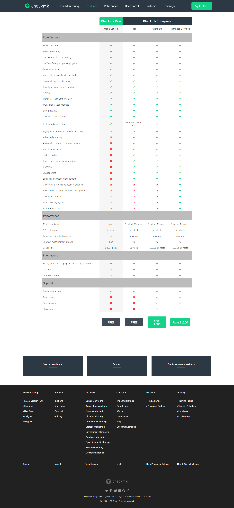

## Tìm hiểu về Check_mk

### 1. Tổng quan

Dự án Check_mk được phát triển từ năm 2008 như là một plugin của Nagios Core.

Năm 2010 dự án OMD (Open Monitoring Distribution) được khởi động bởi Mathias Kettner, là sự kết hợp của Nagios, Check_mk, NagVis, PNP4Nagios, DocuWiki, ...tạo nên sự linh hoạt trong giám sát. Các distro của OMD đang là OMD-Labs và Check_mk Raw.

Năm 2015, phiên bản đơn giản của OMD ra đời gọi là Check_mk.

Đây là một phần mềm được phát triển bằng Python và C ++ để theo dõi Cơ sở hạ tầng CNTT. Nó được sử dụng để giám sát các máy chủ, ứng dụng, mạng, cơ sở hạ tầng đám mây (công cộng, riêng, lai), container, storages, cơ sở dữ liệu ...

Checkmk có sẵn trong 4 phiên bản khác nhau:

- Checkmk Raw Edition hoàn toàn miễn phí, 100% mã nguồn mở, và toàn diện hệ thống giám sát CNTT.

- Checkmk Enterprise - Free Edition là phiên bản miễn phí của sản phẩm thương mại, bị giới hạn ở 2 sites, mỗi với tối đa 10 host có thể được theo dõi.

- Checkmk Enterprise - Standard Edition bao gồm nhiều tính năng bổ sung có liên quan, cung cấp một khả năng mở rộng lớn hơn, hỗ trợ doanh nghiệp thông qua các nhà cung cấp hoặc các partner network. Nó có sẵn dưới dạng gói thuê bao hàng năm, với giá khởi điểm là 600 €, chưa kể thuế.

- Checkmk Enterprise - Managed Services Edition dựa trên Enterprise - Standard Edition và cung cấp các tính năng đặc biệt nhắm vào các công ty muốn cung cấp Check_mk dưới dạng dịch vụ được quản lý, giá khởi điểm là 1200 €, chưa kể thuế.

Các phiên bản Check_mk này có sẵn cho một loạt các nền tảng, đặc biệt là các phiên bản khác nhau của Debia, Ubunt, SLES (SUSE Linux Enterprise Server) và RedHat/CentOS và cả dưới dạng Docker Image.

Các Checkmk agent được sử dụng để thu thập dữ liệu có sẵn cho 11 nền tảng, bao gồm cả Windows.

### 2. OMD-Labs và OMD(check_mk)

- OMD là một phiên bản nhỏ của OMD-LABS nó tập chung chủ yếu vào việc phát triển check_mk.

- OMD-LABS là phiên bản nâng cấp của OMD nên nó có thêm một số sản phẩm mã nguồn mở khác được tích hợp ví dụ như : Naemon; Icinga2; Grafana/Influxdb …

- Trang web mặc định của OMD-LABS là Thruk

- Từ phiên bản OMD-LABS 3.0 trở đi đã remove một số phần mềm là: Nagios3; Icinga 2, Check_mk, Nagvis

- Khoảng 6 tháng 1 lần OMD-Labs sẽ có 1 phiên bản stable mới được phát hành.

#### Một số điểm khác của OMD-LABS với OMD thường (Check_mk Raw):

Các thành phần phần mềm bổ sung: OMD-Labs chỉ bổ sung các thành phần phần mềm mới và không loại bỏ bất kì phần mềm nào, làm cho OMD-Labs trở nên hoàn hảo hơn, và có thể chuyển sang các phiên bản khác bằng omd update

- Lõi giám sát mới: Bên cạnh Nagios 3, OMD-Labs còn chứa hai Cores mới là Naemon và Icinga2. Trong khi Naemon hoàn toàn tương thích với định dạng Nagios 3 config thì Icinga2 sử dụng định dạng cấu hình mới

- Biểu đồ Grafana/Influxdb: Bên cạnh PNP4Nagios OMD có đồ thị Grafana dựa trên Influxdb. Để tạo mẫu đồ thị dựa trên mẫu, đã có histou (Histou được thiết kế để thêm các mẫu vào Grafana từ dữ liệu của Nagios). Giao diện giữa core giám sát và Influxdb được thực hiện trong thành phần Nagflux.

- Hệ thống con Prometheus: Bên cạnh việc giám sát truyền thống, OMD-Labs đi kèm với prometheus bao gồm quản lý cảnh báo, pushgateway và blackbox exporter

- Livestatus Multitool Daemon

Thay đổi Cài đặt mặc định

- Naemon Core: Naemon thay thế Nagios làm lõi mặc định trong OMD-Labs. Để trở lại cài đặt ban đầu:

`omd config set CORE nagios`

- Chế độ SSL / TLS Apache: OMD-Labs đi kèm với kích hoạt SSL / TLS Apache theo mặc định. Để trở lại mặc định:

`omd config set APACHE_MODE own`

### 3. Ưu điểm trong thiết kế kiến trúc của OMD

- OMD được xây dựng từ những đóng góp của cộng đồng về những khó khăn hay khuyết điểm mà Nagios gặp phải, từ đó đưa ra quyết định cần tích hợp thêm những sản phẩm gì để cải thiện.

- Việc cài đặt trở nên vô cùng đơn giản. OMD được đóng gói hoàn chỉnh trong một package, việc cài đặt và cấu hình chỉ mất rất ít thời gian với chỉ một câu lệnh

- Các lõi sẽ gọi xuống check_mk để thực hiện chức năng kiểm tra của nó

- Sau khi check thì livestatus sẽ hiển thị thông tin của mk lên website

- PNP4nagios: được sử dụng để xử lý dữ liệu để chuyển sang dạng biểu đồ

- Nagvis : được sử dụng để vẽ lại mô hình giám sát giúp người dùng có thể nhìn một cách dễ dàng hiểu hơn

- Dữ liệu sẽ được lưu vào trong RRD

### 4. 1 số khái niệm trong Check_mk

Check_MK ra đời để giải quyết bài toán về hiệu năng mà Nagios gặp phải trong quá khứ. Cơ chế mới của Check_MK cho phép việc mở rộng hệ thống trở nên dễ dàng hơn, có thể giám sát nhiều hệ thống chỉ từ một máy chủ Nagios Server.

Có 2 mô đun mà Check_mk sử dụng để cải thiện đáng kể hiệu năng là Livestatus và Livecheck

- Livestatus

#### Trước khi có Livestatus

Kết quả giám sát được sẽ lưu trong file status.dat gây nên hiện tượng nút thắt cổ chai cho CPU và Disk I/O

Trạng thái của file status không phải là real-time mà update ít nhất là mỗi 10s

NDOUtils sử dụng database để theo dõi kết quả (MySQL hoặc PostgreSQL), nhưng vẫn còn một số thiếu sót quan trọng.

Việc cài đặt NDOUtils khá phức tạp

NDOUtils cần một database cho việc lưu trữ dữ liệu. Hơn nữa, việc dữ liệu lưu trong database này tăng lên một cách nhanh chóng khiến cho cần phải tiêu tốn nhiều tài nguyên CPU chỉ để cập nhập database.

Một số dự án tương tự vẫn sử dụng NDOUtils: Centreon và Opsview

Việc dọn dẹp database có thể khiến Nagios bị treo trong một khoảng thời gian nhất định

#### Sau khi có Livestatus

Đây là một phần quan trọng trong check_mk. Nó giúp cho check_mk truy xuất dữ liệu một cách nhanh chóng

Livestatus cũng sử dụng Nagios Event Broker API như NDO, nhưng nó sẽ không chủ động ghi dữ liệu ra. Thay vào đó, nó sẽ mở ra một socket để dữ liệu có thể được lấy ra theo yêu cầu, do đó tốc độ truy vấn của nó không còn phụ thuộc vào tốc độ I/O như là lưu dữ liệu trong file

Livestatus sẽ sử dụng socket để check dữ liệu do đó công việc được phân đều cho các CPU

Livestatus tiêu tốn ít CPU

Khi truy xuất dữ liệu bằng command line thì livestatus sẽ phân biệt chữ hoa và chữ thường

Livestatus không làm cho Disk I/O thay đổi khi truy vấn trạng thái dữ liệu

Không cần cấu hình. Không cần cơ sở dữ liệu. Không cần quản lý

Livestatus có quy mô lớn với hơn 50.000 dịch vụ

- Livecheck

Các vấn đề tồn tại trong Nagios (trước Nagios 4.0)

Mỗi lần check tạo ra một bản fork. Quá trình fork rất tốn kém ngay cả khi kernel được tối ưu hóa

Quá trình fork trong Nagios Core (trước phiên bản Nagios 4.0) không phân tán ra nhiều CPU mà thực hiện trên chỉ một CPU đơn. Điều này dẫn tới việc giới hạn số lần check mỗi giây, trong khi phần lớn các CPU khác rảnh rỗi.

Làm thế nào để Livecheck giải quyết được vấn đề nút thắt cổ chai, cải thiện hiệu năng:

Livecheck sử dụng các helper process, các core giao tiếp với helper thông qua Unix socket (điều này không xảy ra trên file system)

Chỉ có một một helper program được fork thay vì toàn bộ Nagios Core.

Các tiến trình fork được phân tán trên tất cả các CPU thay vì chỉ một như trước

Process VM size tổng chỉ khoảng 100KB

- Multisite – Giao diện web tiên tiến hơn Nagios

Multisite là một phần của dự án Check_mk như là một giao diện web cho người dùng tốt hơn để thay thế cho Nagios

Một GUI mới và sáng tạo để xem thông tin trạng thái Nagios và kiểm soát hệ thống giám sát. Nó dựa trên MK Livestatus và nhằm mục đích thay thế cho GUI web Nagios. Multisite hỗ trợ giám sát phân tán một cách hiệu quả nhất

Kết hợp WATO để có thể hỗ trợ việc cấu hình bằng website

WATO là tập hợp nhiều modules được sử dụng để cấu hình cho check_mk server

Mỗi khi có thay đổi cần chọn cập nhật thay đổi

Có sẵn các agent giám sát được lưu trữ và hiển thị sẵn trên web

Nó có phiên bản tối ưu hóa cho điện thoại

Agent giám sát có sẵn cho Linux và Windows

Khả năng tìm kiếm mạnh mẽ

Thông số đo lường trực quan với Perf-O-Meter

- EVENT CONSOLE

Ngoài việc giám sát theo khoảng thời gian check bình thường còn có một loại giám sát theo sự kiện

Event console là hệ thống tích hợp theo dõi sự kiên từ các nguồn như syslog; SNMP traps; Windows event logs …

Những sự kiện xảy ra không được xử lý bằng lõi của check_mk mà được xử lý bằng một dịch vụ riêng biệt

- Round Robin Database(RRD)

Đây là dạng DB mặc định mà check_mk dùng để lưu trữ thông tin

Thông tin của DB được lưu trữ dưới dạng bảng và cột để lưu trữ dữ liệu

Có thể hợp nhất được dữ liệu của một khoảng thời gian lại vào làm một

Có thể truy vấn được dữ liệu trong RRD bằng live status language

Lưu ý ngôn ngữ truy vấn này phân biệt chữ hoa và chữ thường

Có thể sử dụng các headers để lọc thông tin hiển thị từ các truy vấn được sử dụng

Khi muốn truy vấn thống kê thì có các giá trị và các toán tử được định nghĩa sẵn để sử dụng

Khi dữ liệu được lưu đầy thì nó sẽ ghi đè lên dữ liệu cũ

- Site

Để có thể thực hiện việc giám sát thì cần tạo ra một site để có thể sử dụng

Một server có thể tạo ra được nhiều site

Để đăng nhập được vào site thì cần có user để đăng nhập và user được phân thành 3 loại user: Administrator; Guest; Normal monitoring

Có 2 user mặc định có quyền Administrator là omdadmin và cmkadmin

Site là cách gọi của sản phẩm được tạo ra từ Multisite