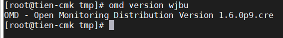

## Nâng cấp phiên bản Check_mk

Check_mk ra đời vào năm 2015 trải qua quá trình phát triển được rất nhiều các cá nhân, tổ chức sử dụng trong việc giám sát hệ thống, đáp ứng được nhu cầu giúp người quản trị giám sát và nhận cảnh báo đối với hệ thống của mình.

Theo vòng đời phát triển, đội ngũ phát triển của Check_mk thường xuyên đưa ra các bản vá và công bố version mới mang lại những tính năng, trải nghiệm tốt hơn cho người sử dụng.


Ngày 23/09/2019, phiên bản Check_mk Raw Edition (CRE) 1.6.0 dược công bố chính thức với rất nhiều tính năng nổi bật như: Kubernetes checks, docker_container … Đối với những hệ thống đang vận hành sử dụng bản checkmk version thấp hơn việc upgrade lên phiên bản stable mới nhất là điều cần thiết. Dưới đây là hướng dẫn cơ bản để upgrade lên version cao hơn.

### Chuẩn bị

Server Check_mk chạy version thấp hơn version muốn nâng cấp

như bên dưới tôi đang sử dụng phiên bản 1.6.0p8


- Sử dụng lệnh kiểm tra version Check_mk đang chạy

`omd versions`


### Các bước upgrade

Tải bản cài đặt mới [tại đây](https://checkmk.com/download-archive.php?)

Lựa chọn phiên bản Stable Versions

Tôi sẽ tiến hành upgrade từ phiên bản 1.6.0p8 lên 1.6.0p9


Chọn phiên bản đúng với hđh đang sử dụng, ở đây tôi dùng CentOS 7.


- Thực hiện tải gói cài đặt:

```
cd /tmp
wget https://checkmk.com/support/1.6.0p9/check-mk-raw-1.6.0p9-el7-38.x86_64.rpm
```


- Cài đặt gói với `yum`:

`yum install -y check-mk-raw-1.6.0p9-el7-38.x86_64.rpm`


- Kiểm tra lại phiên bản Check_mk mới vừa cài đặt:

`omd versions`


- Kiểm tra phiên bản Check_mk đang chạy cho site của bạn tạo. Site của bạn tên là gì bạn check là vậy, site của mình tên là `wjbu`.

`omd version wjbu`


- Lúc này site cũ có tên `wjbu` đang có phiên bản là 1.6.0p8.cre ta tiến hành nâng cấp phiên bản 1.6.0p9 của site này như sau:

stop site:

`omd stop wjbu`


upgrade site:

`omd update wjbu`


lựa chọn `Update!`

- Quá trình update thành công:


- Khởi động lại site và kiểm tra lại kết quả:

khởi động lại site:

`omd start wjbu`


kiểm tra lại version:

`omd version wjbu`




Như vậy bạn đã upgrade thành công Check_mk lên phiên bản mới nhất.

> Lưu ý: Cấu hình cảnh báo của bạn sẽ bị mất sau khi nâng cấp lên phiên bản mới, còn các thành phần cấu hình khác sẽ vẫn còn giữ nguyên.

## Hạ cấp phiên bản Check_mk

Quá trình chuyển trở lại phiên bản cũ chạy giống như chạy một bản cập nhật. Nói chính xác, `omd update` không quan tâm liệu phiên bản đích mới hơn hay cũ hơn phiên bản hiện tại - do đó bạn có thể chuyển đổi 'chuyển tiếp' hoặc 'ngược' như mong muốn.

Tuy nhiên, hãy lưu ý rằng ngay cả khi hạ cấp xuống phiên bản cũ đang hoạt động tốt, Check_mk cũ hơn có thể không phải lúc nào cũng có thể xử lý dữ liệu từ các phiên bản mới hơn. Phiên bản Check_mk mới có thể lưu trữ dữ liệu và cấu hình ở định dạng mở rộng mà phiên bản cũ hơn của phần mềm có thể không hiểu.

Các cấu hình được quản lý trong WATO có thể có thể được chuyển đổi sang định dạng mới sau khi WATO đang được sử dụng và sau đó có thể lưu trữ các cấu hình. Chừng nào những hành động như vậy chưa xảy ra, việc chuyển đổi trở lại phiên bản cũ nói chung là không có vấn đề gì.

Nếu bạn không chắc chắn có cần quay lại phiên bản cũ hay không, tôi khuyên bạn nên:

- Thực hiện sao lưu dữ liệu TRƯỚC KHI cập nhật.

- Dành thời gian để kiểm tra phiên bản mới trước khi thực hiện các thay đổi thông qua WATO.