## 1 số các khái niệm

### 1. 1 số các khái niệm liên quan

- **MySQL** là 1 hệ thống quản trị cơ sở dữ liệu mã nguồn mở (Relational Database Management System, viết tắt là RDBMS) hoạt động theo mô hình client-server được sử dụng 1 cách phổ biến. Tuy nhiên **MySQL** ngoài phiên bản miễn phí thì vẫn có bản thương mại.

- **MariaDB** là 1 nhánh được fork lại từ **MySQL** kể từ khi **MySQL** được Oracle mua lại nhằm theo hướng không phải trả phí với GNU GPL. **MariaDB** có các chức năng tương tự và khả năng tương thích cao với **MySQL**; được phát triển thêm 1 số các tính năng mới.

- Khi tạo 1 bảng (table) trong **MySQL** sẽ có nhiều kiểu **storage engine** để lựa chọn, có thể kể đến như: MyISAM, InnoDB, CSV, v.v.

- **Storage Engine** có thể được hiểu là cách mà MySQL lưu trữ dữ liệu trên đĩa cứng. **MySQL** lưu các database của mình như các thư mục nằm trên cây thư mục của hệ thống. Khi một table được tạo ra, **MySQL** sẽ lưu định nghĩa bảng ở một file với đuôi là .frm và có tên trùng với tên của bảng được tạo. Việc quản lý định nghĩa bảng là nhiệm vụ của mysql server, cách lưu trữ và đánh chỉ mục (index) các dữ liệu là phụ thuộc vào storage engine.

- Tổng quan về kiến trúc logic của **MySQL** như sau:

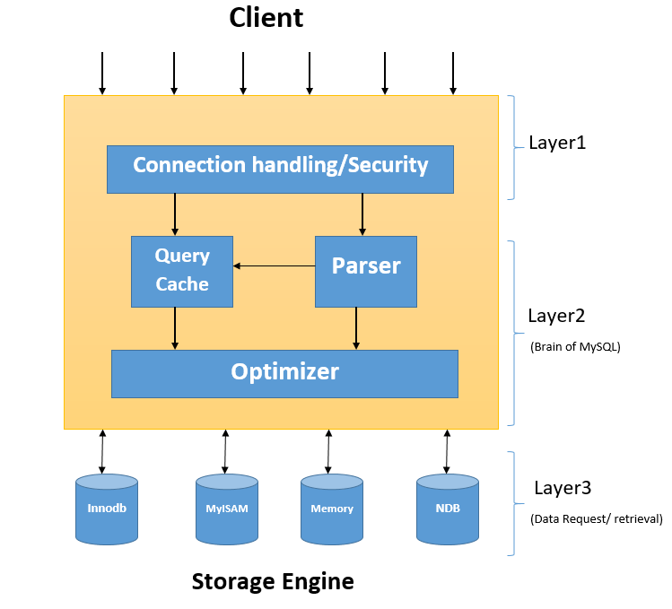

Như bạn có thể thấy trên hình, kiến trúc logic của MySQL gồm 3 layers chính.

Layer trên cùng chỉ ra các services mà MySQL cung cấp cho các hệ thống mạng client/server bao gồm xử lí kết nối, xác thực, bảo mật

Layer ở giữa, là trung tâm xử lí của MySQL bao gồm việc phân tích câu truy vấn, tối ưu hóa, caching và các hàm sẵn có trong MySQL

Layer dưới cùng bao gồm storage engine chịu trách nhiệm cho với lưu trữ và lấy ra dữ liệu. Các storage engine phổ biến hiện nay của MySQL là InnoDB và MyISAM.

Query parsing: phân tích câu lệnh SQL thành cú pháp sử dụng bên trong MySQL

Optimization: tìm ra cách thực thi câu lệnh (execution plan) tốt nhất

Query cache có khả năng lưu trữ 1 số lượng câu lệnh SQL đã thực thi, cũng như kết quả của 1 số câu lệnh hay thực thi, để giúp giảm thiểu thời gian thực thi lại 1 số câu lệnh thường xuyên.

Storage Engine bao gồm nhiều handler, cho phép MySQL truy vấn, xử lý và lưu trữ dữ liệu dưới nhiều format khác nhau.

### 2. Database Replication

Database Replication đề cập tới việc liên tục thực hiện sao chép dữ liệu từ 1 node (1 database trên 1 server) sang 1 node khác. Nó thực hiện trong 1 cụm cơ sở dữ liệu phân tán (distributed database) hay còn gọi là database cluster, nơi mà tất cả các node cùng thực hiện share các thông tin cùng nhau.

- Masters - Slaves

Thiết lập sao chép phổ biến nhất sử dụng mối quan hệ master/slave giữa bộ dữ liệu gốc và các bản sao.

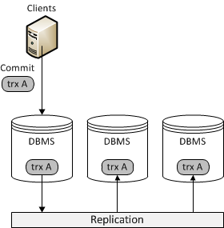

Trong hệ thống này, máy master sẽ ghi lại các cập nhật cho dữ liệu và truyền các bản ghi đó qua mạng tới các máy slaves. Các máy slaves nhận được một luồng cập nhật từ máy master và áp dụng những thay đổi đó.

- Multi-master

1 thiết lập sao chép phổ biến khác sử dụng multi-master, trong đó tất cả các node đều được coi là master

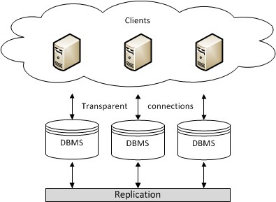

Trong 1 hệ thống multi-master replication, bạn có thể submit các bản cập nhật cho bất kỳ node nào. Những cập nhật này sau đó truyền qua mạng đến cacs node khác. Tất cả các node đều có các tính năng của một node master. Sẽ không có log thông báo hoặc các chỉ số để chỉ ra ràng việc update thành công.

- Asynchronous và Synchronous Replication

Ngoài việc thiết lập cách các node khác nhau liên quan đến nhau, còn có giao thức cho cách chúng truyền các giao dịch cơ sở dữ liệu thông qua cụm.

Synchronous Replication: Sử dụng phương pháp eager replication. Các node giữ cho tất cả các bản sao được đồng bộ hóa bằng cách cập nhật tất cả các bản sao trong một giao dịch. Nói cách khác, khi một giao dịch được commit, tất cả các node có cùng một giá trị.

Asynchronous Replication: Sử dụng phương pháp lazy replication. Node master truyền không đồng bộ bản sao các bản cập nhật đến các node khác. Sau khi node master truyền đi bản sao, transaction được commit. Nói cách khác, khi 1 transaction được commit, trong ít nhất một thời gian ngắn, các node giữ các giá trị khác nhau.

### 3. 1 số trường hợp có thể xảy ra đối với hệ thống cluster

Khi sử dụng thực tế, có rất nhiều trường hợp có thể xảy ra bất ngờ đối với hệ thống. Các ví dụ bên dưới mô tả 1 số trường hợp xảy ra với 1 hệ thống gồm 3 node.

- 1 node bất kỳ ngưng hoạt động

Trong trường hợp này, khi có 1 node ngưng hoạt hoạt động vì 1 lý do nào đó và 2 node còn lại không thể liên lạc với node này, vào thời điểm này các chỉ số về quorum và cluster size thay đổi sẽ bị thay đổi cho phù hợp với cluster lúc đó.

Khi node này hoạt động trở lại, nó sẽ chưa join vào cluster để xử lý các request cho đến khi được đồng bộ dữ liệu với các node còn lại. Đối với các hệ thống chạy **MySQL**/**MariaDB** bản cũ, ta cần phải thực hiện recovery để đồng bộ dữ liệu với câu lệnh `mysqld_safe --wsrep-recover`; thế nhưng nếu sử dụng bản mới hơn thì điều này thường được thực hiện 1 cách tự động

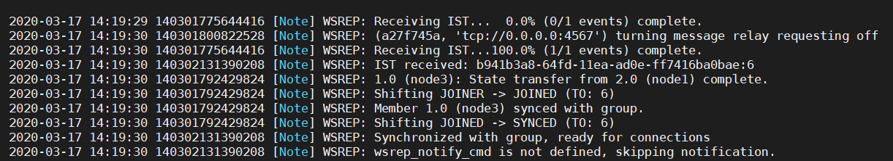

- 2 node bất kỳ ngưng hoạt động

Trong trường hợp này, các node bị lỗi trừ node còn lại gây mất quorum. Ở giai đoạn này, cụm Galera không còn có thể xử lý các yêu cầu SQL. Tuy nhiên vì 1 node vẫn đang hoạt động, không có dữ liệu nào bị mất. Nếu các node không online trở lại, chúng không thể tham gia lại cụm, vì cụm không tồn tại. Có thể xác minh điều này bằng cách sử dụng lệnh cluster size và cluster status từ node còn hoạt động:

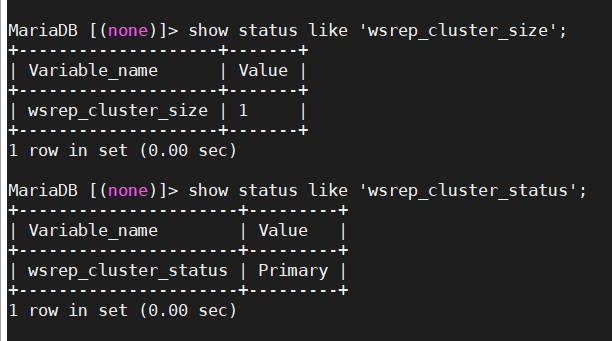

Trong một số trường hợp hiếm hoi, giá trị của trạng thái cụm có thể hiển thị là non-Primary. Nếu có thì lỗi không chỉ là mất quorum mà còn do kết nối mạng. Cần phải đảm bảo trạng thái trả về giá trị Primary trước khi tiến hành.

Sau đó, ta có thể sử dụng 1 trong 2 cách:

Automatic Bootstrap: cách đơn giản nhất để thiết lập lại quorum là tự động bootstrap. Chạy lệnh sau trong cơ sở dữ liệu để auto bootstrap node:

`set global wsrep_provider_options='pc.bootstrap=YES';`

Điều này sẽ bootstrap node còn hoạt động để trở thành node primary để các node bị lỗi khác có thể tham gia lại cụm.

Và thứ 2 là Manual Bootstrap. Chạy các lệnh sau để manually bootstrap node:

```
systemctl stop mariadb
galera_new_cluster
systemctl restart mariadb
```

Sau khi node primary hoạt động, hãy khởi động lại dịch vụ MariaDB trên tất cả các node còn lại.

- Cả 3 node đều ngưng hoạt động

Trong trường hợp này, tất cả các node failed hoặc không tắt đúng cách. Loss quorum = total đã xảy ra và cụm không chấp nhận bất kỳ yêu cầu SQL nào. Sau một sự cố nghiêm trọng như thế này, ngay cả khi tất cả các node được bật trở lại, dịch vụ MariaDB sẽ không thể khởi động.

Đầu tiên hãy kể đến trường hợp bảo trì hệ thống.

Trước khi off hệ thống cần kiểm tra lại trạng thái của cluster

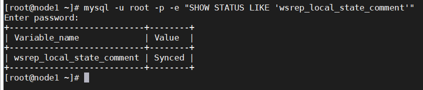

Sau đó thực hiện backup lại db để có thể restore phòng khi bị lỗi

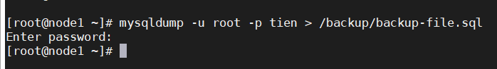

Trong trường hợp này, sẽ thưc hiện tắt cả 3 node. Ví dụ thứ tự sẽ là node 1 -> node 2 -> node 3

```
systemctl stop mariadb
systemctl disable mariadb
```

Sau khi cả 3 node down thực hiện kiểm tra file `/var/lib/mysql/grastate.dat`

node 1


node 2

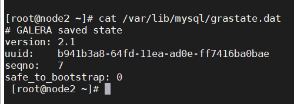

node 3

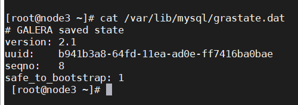

Do node 03 là node được tắt sau cùng, nên `safe_to_bootstrap` sẽ có giá trị là 1, thể hiện node 3 là node thực hiện giao dịch cuối cùng. Khi đó muốn khởi động lại cụm cluster thì cần khởi động từ node 3 trước để làm chuẩn cho các node còn lại khi join vào.

```
galera_new_cluster
systemctl start mariadb
```

Sau đó thực hiện bật lần lượt từng node trong 2 node còn lại lên để đồng bộ vào cluster

`systemctl start mariadb`

Ngoài ra còn 1 trường hợp khác có thể kể đến là hệ thống bị tắt đột ngột. Tình huống như vậy có thể xảy ra trong trường hợp mất điện trung tâm dữ liệu, gặp một số lỗi MySQL hoặc Galera dẫn đến sự cố trên tất cả các node. Trong trường hợp đó, tệp `grastate.dat` không được cập nhật và không chứa số thứ tự hợp lệ (seqno).

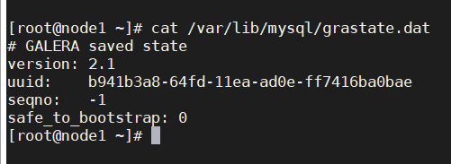

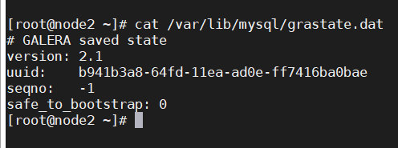

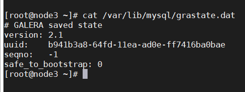

Khi đó sẽ không thể xác định được node nào đang là node thực hiện giao dịch cuối cùng, vì vậy cần phải sử dụng InnoDB để xác định node đó. Thực hiện recovery trên từng node. Ví dụ:

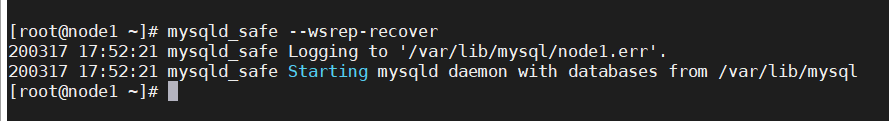


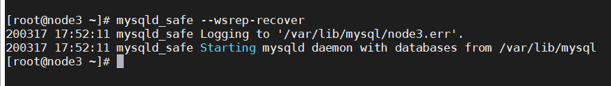

Đọc nội dung file log mariadb để biết thêm chi tiết. Mặc định file log trên CentOS sẽ là `/var/lib/mysql/hostname.err` (thay thế hostname bằng tên máy chủ thực sự của máy chủ của bạn)

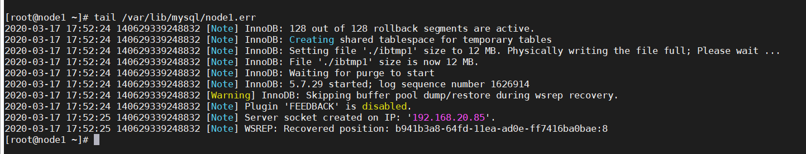

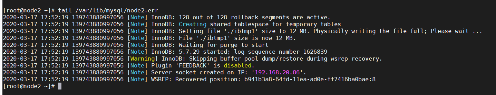

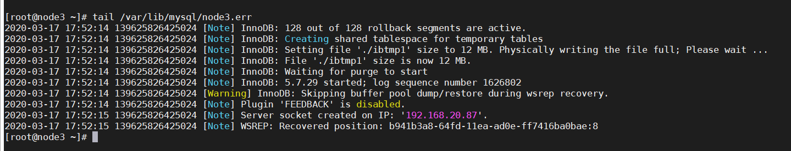

Ta có thể nhìn thấy dòng Recovered position phía sau UUID có một số, node nào có số cao nhất là node thực hiện giao dịch cuối cùng. Vì vậy để có thể khởi động lại hệ thống cluster thì cần khởi động node này trước. Vào node đó, chỉnh sửa file `/var/lib/mysql/grastate.dat` thông số `safe_to_bootstrap` thành 1:

`safe_to_bootstrap: 1`

Ở đây cả 3 node đều có số cuối như nhau nên có thể chọn bất cứ node nào để trở thanh primary node

Sau đó thực hiện bootstrap và khởi động mariadb trên node đó

```
galera_new_cluster
systemctl start mariadb
```

Sau khi node này khởi động thành công thì tiếp tục khởi động 2 node còn lại để thực hiện đồng bộ vào cluster.

Tuy nhiên, quy trình trên sẽ không cần thiết trong các phiên bản Galera gần đây. Có một tùy chọn mới - pc.recovery (được bật theo mặc định), giúp lưu trạng thái cụm vào một tệp có tên `gvwstate.dat` trên mỗi node thành viên.
