## Bootstrap MySQL hoặc MariaDB Galera Cluster

Cách để thiết lập 1 MySQL/MariaDB Galera Cluster sẽ khác so với MySQL server và MySQL Cluster. Galera yêu cầu bạn bắt đầu một node trong 1 cluster làm điểm tham chiếu, trước khi các node còn lại có thể tham gia và tạo thành cluster. Quá trình này được gọi là cluster bootstrap. Bootstrapping là bước đầu tiên để biến 1 node database làm primary component, trước khi những node khác join vào cluster và xem nó là điểm tham chiếu để đồng bộ hóa dữ liệu.

### Cách thức hoạt động

Khi Galera được bắt đầu với bootstrap command trên 1 node, state của node đó được chuyển thành Primary (có thể kiểm chứng điều này bằng cách check giá trị `wsrep_cluster_status`).

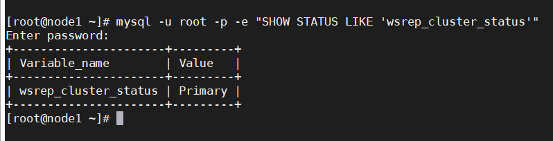

Các node còn lại chỉ cần được bật lên 1 cách bình thường và chúng sẽ tự động tìm kiếm primary component hiện có trong cluster và join vào. Việc đồng bộ hóa dữ liệu trong cluster được thực hiên thông qua IST (incremental state transfer) hoaặc SST (snapshot state transfer) giữa các node join vào và donor node.

Vì vậy, về cơ bản chỉ nên bootstrap cluster khi muốn tạo 1 cluster mới hoặc không có node nào ở trạng thái primary state.

Bên dưới là 1 số trường hợp khi khởi động 1 cluster gồm 3 node dựa trên trạng thái node (wsrep_local_state_comment) và trạng thái cluster (wsrep_cluster_status):

| Galera State | Bootstrap Flow |
| --- | --- |
| 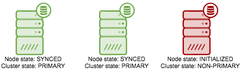 | Restart INITIALIZED node |
| 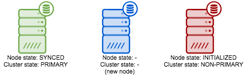 | Restart INITIALIZED node. Sau đó, start new node |
| 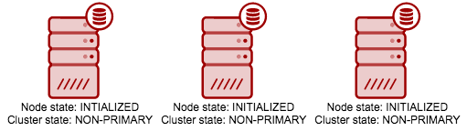 | Bootstrap node có transaction cuối cùng với tùy chọn "pc.bootstrap=1". Restart lần lượt các node còn lại |
| 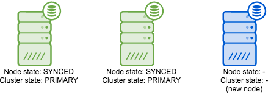 | Start new node |
| 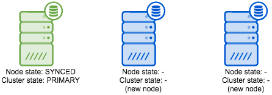 | Start lần lượt new node |
| 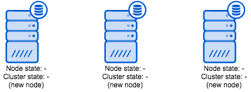 | Bootstrap 1 node bất kỳ. Sau đó start lần lượt các node còn lại |

### Start Galera cluster

3 nhà cung cấp Galera sử dụng các lệnh bootstrapping khác nhau (dựa trên phiên bản mới nhất của phần mềm). Trên node đầu tiên, chạy commmand:

- MySQL Galera Cluster (Codership):

```
service mysql bootstrap # sysvinit
galera_new_cluster # systemd
mysqld_safe --wsrep-new-cluster # command line
```

- Percona XtraDB Cluster (Percona):

```
service mysql bootstrap-pxc # sysvinit
systemctl start mysql@bootstrap.service # systemd
```

- MariaDB Galera Cluster (MariaDB):

```
service mysql bootstrap # sysvinit
service mysql start --wsrep-new-cluster # sysvinit
galera_new_cluster # systemd
mysqld_safe --wsrep-new-cluster # command line
```

> tùy thuộc vào hệ thống sử dụng sysvinit hay systemd mà chạy command phù hợp

Lệnh trên thực chất là start MySQL instance trên node đó với `gcomm://` là biến `wsrep_cluster_address`. Cũng có thể xác định thủ công các biến trong tệp `my.cnf` và sau đó chạy lệnh start/restart. Tuy nhiên, sau đó hãy sửa lại `wsrep_cluster_address` để chứa địa chỉ cho tất cả các node sau khi bắt đầu.

Khi node đầu tiên đã hoạt động, hãy chạy lệnh sau trên các node còn lại:

`service mysql start`

hoặc

`systemctl start mysql`

Các node mới sẽ kết nối với các thành viên trong cluster được xác định bởi tham số `wsrep_cluster_address`.

> Lưu ý: không bootstrap khi muốn reconnect 1 node với 1 cluster hiện có và không bootstrap trên nhiều node

### Safe-to-Bootstrap Flag

Kể từ phiên bản 3.19, Galera đi kèm với 1 cờ mới có tên là `safe_to_bootstrap` bên trong tệp `grastate.dat`. Cờ này sẽ theo dõi thứ tự các nút được tắt để tránh việc bootstrap từ các node được đánh dấu là unsafe. Node bị tắt cuối cùng sẽ được đánh dấu là "Safe-to-Bootstrap". Tất cả các node khác sẽ được đánh dấu là unsafe để tránh việc bootstrap từ đó.

Khi đọc nội dung tệp `grastate.dat` (mặc định nằm trong thư mục MySQL) và bạn sẽ thấy cờ ở dòng cuối cùng:

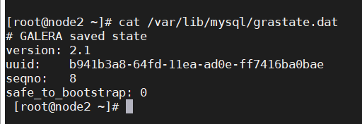

Node tắt cuối cùng sẽ được đánh dấu là an toàn để thực hiện bootstrap với `safe_to_bootstrap: 1`. Tất cả các node còn lại, option đó sẽ có giá trị là 0 và được đánh dấu là unsafe.

Khi bootstrapping 1 cluster mới, Galera sẽ không start node đầu tiên được đánh dấu là unsafe.

Trong trường hợp tắt máy đột ngột hoặc hệ thống bị crash, tất cả các node sẽ có giá trị `safe_to_bootstrap` là 0. Vì vậy, ta phải xác định được node nào là node cuối cùng được đồng bộ dữ liệu gần nhất bằng cách chạy lệnh `mysqld_safe --wsrep-recover`. Đồng thời cần phải xem file log `/var/lib/mysql/hostname.err` (thay thế hostname bằng tên máy chủ thực sự của máy chủ của bạn) để kiểm tra số sau chuỗi UUID trên dòng `Recovered position`. Chọn node có số cao nhất và chỉnh sửa tệp `grastate.dat` của nó để đặt giá trị `safe_to_bootstrap: 1` rồi bootstrap lại cluster trên node này.

### Các node bị phân rẽ

Trong một số trường hợp nhất định, các nút có thể đã bị phân rẽ khỏi nhau. Trạng thái của các node có thể chuyển thành Non-Primary do sự cố mạng giữa các node, cluster crash hoặc nếu Galera gặp vấn đề khi xác định Primary Component.

Trong trường hợp này, để xác định node nào cần được khởi động, hãy so sánh giá trị `wsrep_last_committed` trên tất cả các node:

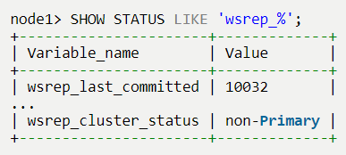

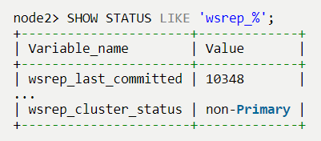

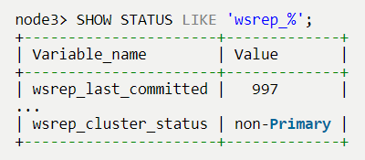

Từ các giá trị trên, node2 có giá trị `wsrep_last_committed`. Trong trường hợp này, tất cả các node Galera đã được bắt đầu, do đó bạn không nhất thiết phải khởi động lại cụm. Chúng ta chỉ cần biến node2 làm Primary Component:

`SET GLOBAL wsrep_provider_options="pc.bootstrap=1";`

Các node còn lại sau đó sẽ kết nối lại với Primary Component (node2) và đồng bộ lại dữ liệu của chúng dựa trên node này.