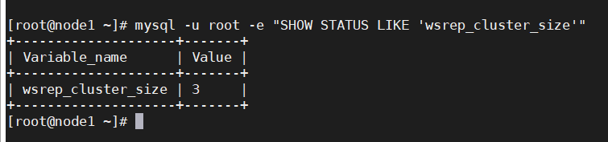
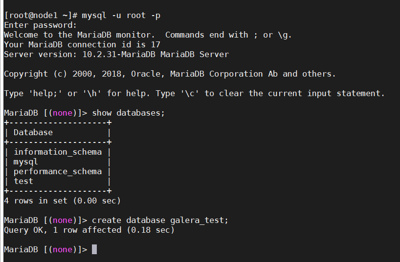
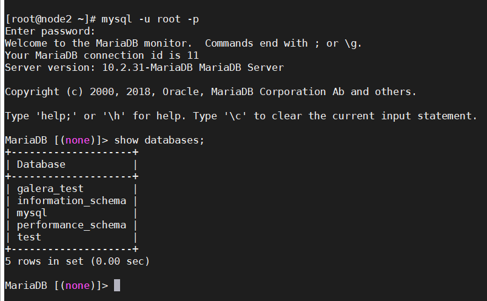
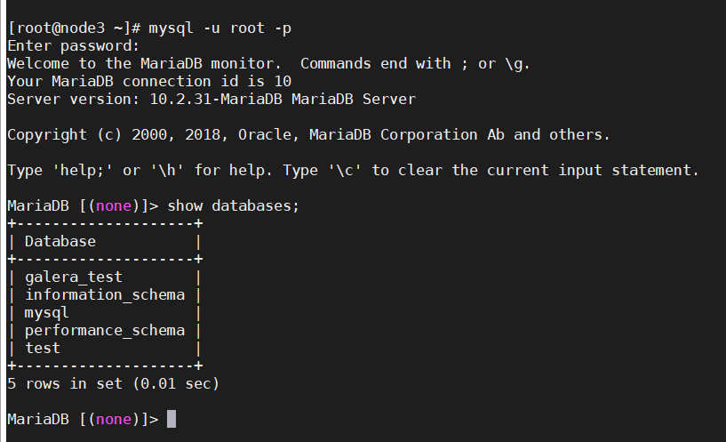

## Cài đặt Galera

### Tổng quan

MariaDB là một sản phẩm mã đóng tách ra từ mã mở do cộng đồng phát triển của hệ quản trị cơ sở dữ liệu quan hệ MySQL nhằm theo hướng không phải trả phí với GNU GPL. MariaDB được phát triển từ sự dẫn dắt của những nhà phát triển ban đầu của MySQL, do lo ngại khi MySQL bị Oracle Corporation mua lại. Những người đóng góp được yêu cầu chia sẻ quyền tác giả của họ với MariaDB Foundation.

MariaDB được định hướng để duy trì khả năng tương thích cao với MySQL, để đảm bảo khả năng hỗ trợ về thư viện đồng thời kết hợp một cách tốt nhất với các API và câu lệnh của MySQL. MariaDB đã có công cụ hỗ lưu trữ XtraDB thay cho InnoDB.

MariaDB Galera Cluster là giải pháp sao chép đồng bộ nâng cao tính sẵn sàng cho MariaDB. Galera hỗ trợ chế độ Active-Active tức có thể truy cập, ghi dữ liệu đồng thời trên tất các node MariaDB thuộc Galera Cluster.

### Cài đặt

- Thiết lập ban đầu:

Cấu hình Hostname:

`hostnamectl set-hostname node1`

Tắt Firewall, SELinux, Khởi động lại

```
sed -i 's/SELINUX=enforcing/SELINUX=disabled/g' /etc/sysconfig/selinux
sed -i 's/SELINUX=enforcing/SELINUX=disabled/g' /etc/selinux/config
systemctl stop firewalld
systemctl disable firewalld
init 6
```

Cấu hình vào file host:

```
echo "192.168.20.85 node1" >> /etc/hosts
echo "192.168.20.86 node2" >> /etc/hosts
echo "192.168.20.87 node3" >> /etc/hosts
```

- Cài đặt MariaDB:

Thực hiện trên tất cả các node.

Tạo repo cho MariaDB:

```
cat > /etc/yum.repos.d/MariaDB.repo <<\EOF
[mariadb]
name = MariaDB
baseurl = http://yum.mariadb.org/10.2/centos7-amd64
gpgkey=https://yum.mariadb.org/RPM-GPG-KEY-MariaDB
gpgcheck=1
EOF
```

Cài đặt MariaDB

`yum install -y mariadb mariadb-server`

Cài đặt galera và gói hỗ trợ:

`yum install -y galera rsync`

Tắt Mariadb:

`systemctl stop mariadb`

> Lưu ý: Không khởi động dịch vụ mariadb sau khi cài (Liên quan tới cấu hình Galera Mariadb)

### Cấu hình Galera Cluster

- Tại node1:

Chỉnh sửa cấu hình file `/etc/my.cnf.d/server.cnf`. Đầu tiên backup lại 1 bản để dự phòng

`cp /etc/my.cnf.d/server.cnf /etc/my.cnf.d/server.cnf.bak`

sau đó chỉnh sửa file

`vi /etc/my.cnf.d/server.cnf`

```
[server]
[mysqld]
bind-address=192.168.20.85

[galera]
wsrep_on=ON
wsrep_provider=/usr/lib64/galera/libgalera_smm.so
wsrep_cluster_address="gcomm://192.168.20.85,192.168.20.86,192.168.20.87"
binlog_format=row
default_storage_engine=InnoDB
innodb_autoinc_lock_mode=2

# Cluster name
wsrep_cluster_name="test_cluster"
# Allow server to accept connections on all interfaces.
bind-address=192.168.20.85
# server name, change for each server
wsrep_node_name="node1"
wsrep_sst_method=rsync
[embedded]
[mariadb]
[mariadb-10.2]
```

> Lưu ý:

Lưu ý:

`wsrep_cluster_address`: Danh sách các node thuộc Cluster, sử dụng địa chỉ IP

`wsrep_cluster_name`: Tên của cluster

`wsrep_node_address`: Địa chỉ IP của node đang thực hiện

`wsrep_node_name`: Tên node (Giống với hostname)

Không được bật mariadb (Quan trọng, nếu không sẽ dẫn tới lỗi khi khởi tạo Cluster)

- Tại node2:

Chỉnh sửa cấu hình

`cp /etc/my.cnf.d/server.cnf /etc/my.cnf.d/server.cnf.bak`

`vi /etc/my.cnf.d/server.cnf`

```
[server]
[mysqld]
bind-address=192.168.20.86

[galera]
wsrep_on=ON
wsrep_provider=/usr/lib64/galera/libgalera_smm.so
wsrep_cluster_address="gcomm://192.168.20.85,192.168.20.86,192.168.20.87"
binlog_format=row
default_storage_engine=InnoDB
innodb_autoinc_lock_mode=2

# Cluster name
wsrep_cluster_name="test_cluster"
# Allow server to accept connections on all interfaces.
bind-address=192.168.20.86
# server name, change for each server
wsrep_node_name="node2"
wsrep_sst_method=rsync
[embedded]
[mariadb]
[mariadb-10.2]
```

- Tại node 3:

Chỉnh sửa cấu hình

`cp /etc/my.cnf.d/server.cnf /etc/my.cnf.d/server.cnf.bak`

`vi /etc/my.cnf.d/server.cnf`

```
[server]
[mysqld]
bind-address=192.168.20.87

[galera]
wsrep_on=ON
wsrep_provider=/usr/lib64/galera/libgalera_smm.so
wsrep_cluster_address="gcomm://192.168.20.85,192.168.20.86,192.168.20.87"
binlog_format=row
default_storage_engine=InnoDB
innodb_autoinc_lock_mode=2

# Cluster name
wsrep_cluster_name="test_cluster"
# Allow server to accept connections on all interfaces.
bind-address=192.168.20.87
# server name, change for each server
wsrep_node_name="node3"
wsrep_sst_method=rsync
[embedded]
[mariadb]
[mariadb-10.2]
```

- Khởi động dịch vụ:

Tại node1, khởi tạo cluster

```
galera_new_cluster
systemctl start mariadb
systemctl enable mariadb
```

Tại node2, node3, chạy dịch vụ mariadb

```
systemctl start mariadb
systemctl enable mariadb
```

- Kiểm tra tại node1

`mysql -u root -e "SHOW STATUS LIKE 'wsrep_cluster_size'"`



Hơn thế nữa có thể thử tạo một thay đổi trên node1, ở đây là tạo một database mới.



Kế đó kiểm tra trên node2



trên node 3

