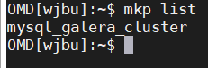
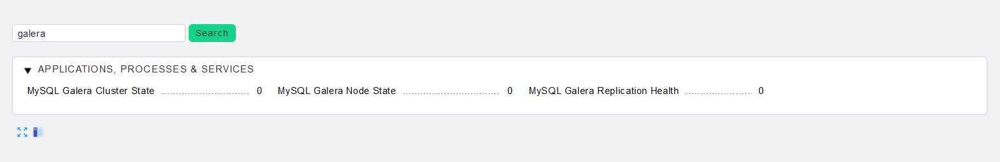
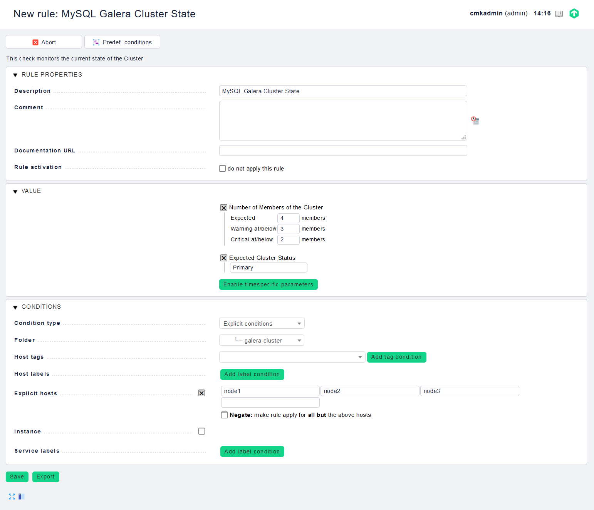
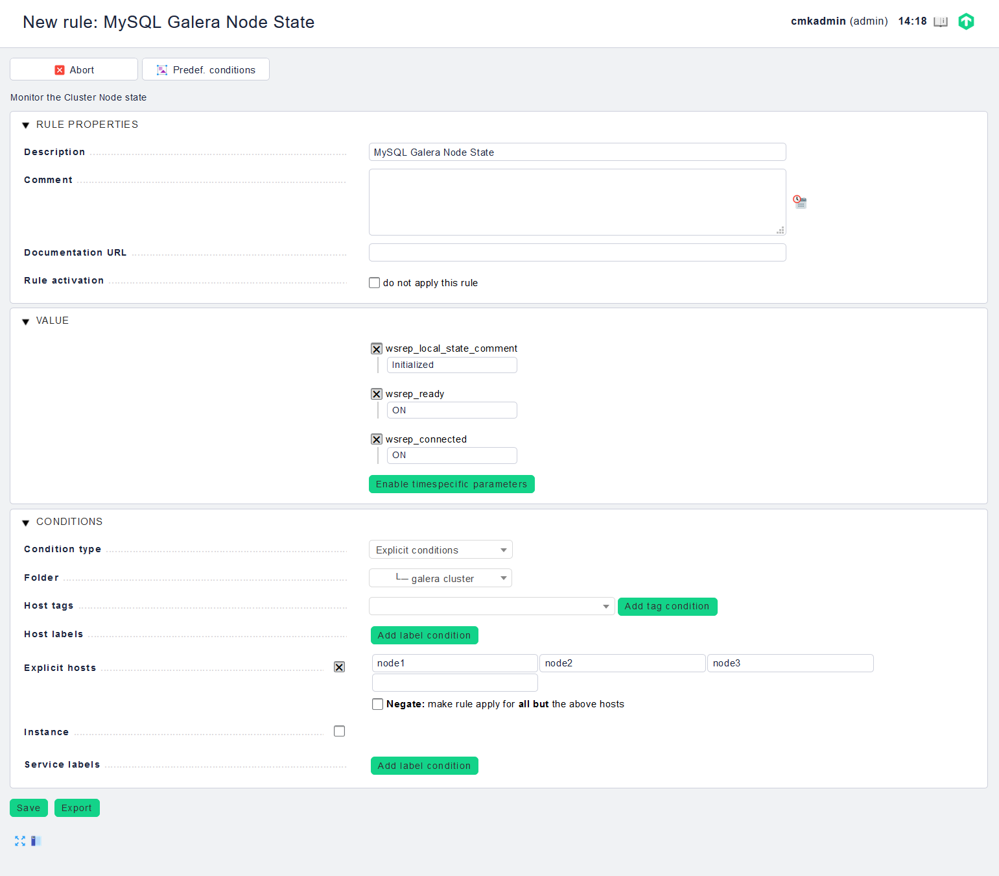
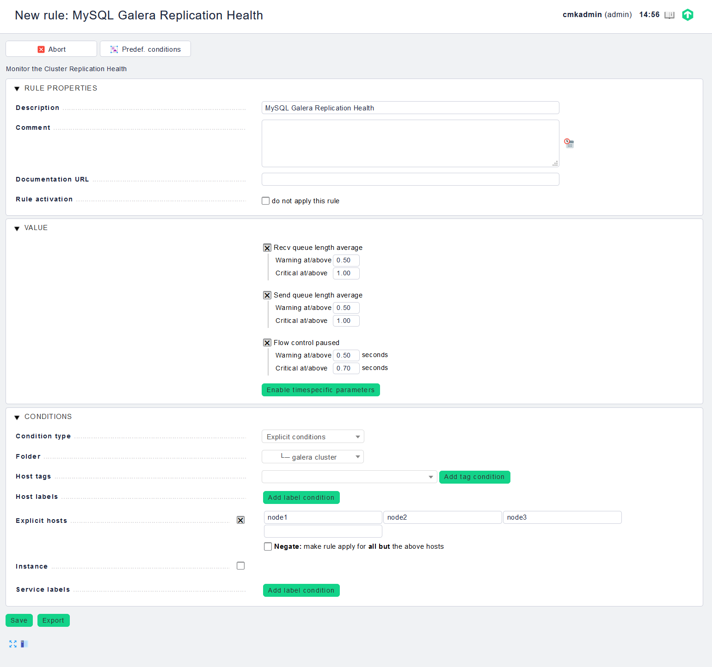

## Giám sát Galera cluster với Check_mk

Galera cluster có thể được giám sát nhờ vào plug-in của Check_mk.

Plug-in này sẽ kiểm tra trạng thái của galera cluster (dựa trên https://galeracluster.com/library/documentation/monitoring-cluster.html).

Nó sẽ cung cấp 3 kiểm tra được tích hợp trên WATO:

- MySQL Galera Cluster State

Kiểm tra hiển thị thông tin về trạng thái chung của cluster:

Size - Kích thước hiện tại của cluster và kích thước ​​được định cấu hình trong WATO

Status - Trạng thái hiện tại của cluster

ConfID - Hiển thị số lượng thay đổi cluster và phải giống nhau cho tất cả các node.

Cluster UUID - hiển thị UUID hiện tại và phải giống nhau cho tất cả các thành viên của cluster

- MySQL Galera Node State

Kiểm tra hiển thị thông tin về trạng thái node:

Ready - hiển thị nếu node đã sẵn sàng để chấp nhận tập hợp ghi từ cluster

Connected - hiển thị nếu node có kết nối mạng với bất kỳ node nào khác.

State - hiển thị nếu node là một phần hoạt động của cluster

- MySQL Galera Replication Health

Kiểm tra cho thấy thông tin về hiệu suất và có thể đưa ra gợi ý để xác định các vấn đề về hiệu suất.

### Cài đặt pakage

- Tải xuống packege trên server Check_mk

```
cd /tmp
wget https://github.com/kriegerse/check_mk-mysql_galera_cluster/raw/master/mkp/mysql_galera_cluster-1.1.mkp
```

- Cài đặt package

```
su wjbu
mkp install /tmp/mysql_galera_cluster-1.1.mkp
```

- Kiểm tra xem gói đã được cài đặt hay chưa

`mkp list`



### Cài đặt agent trên các node

Thực hiện tương tự như trong hướng dẫn [sau](https://github.com/nvtien996/thuctap062019/blob/master/Tiennv/Check_mk/Cai_dat_check_mk_agent.md)

### Cài đặt plug-in trên các node

- Tải xuống plug-in

Trên `WATO - CONFIGURATION`, truy cập `Monitoring Agents`

Tìm plug-in `mk_mysql` và tải về các node

```
cd /tmp
wget http://192.168.20.81/wjbu/check_mk/agents/plugins/mk_mysql
```

- Di chuyển plug-in vào đúng thư mục và phân quyền cho plug-in

```
mv /tmp/mk_mysql /usr/lib/check_mk_agent/plugins
chmod +x /usr/lib/check_mk_agent/plugins/mk_mysql
```

- Tạo file cấu hình chứa thông tin để giám sát

Tạo 1 file có tên gọi `mysql.cfg` nằm bên trong thư mục `/etc/check_mk`

Nội dung file như sau:

```
[client]
user=monitor
password=PassWord
```

Có thể chỉ định bất kỳ người dùng nào khác, không cần phải là người dùng giám sát hệ thống, có quyền trong MySQL để thực hiện các câu lệnh SQL: Select, Show Databases.

Nếu tạo người dùng MySQL chỉ để theo dõi, có thể cung cấp các quyền với câu lệnh SQL sau:

`GRANT SELECT, SHOW DATABASES ON *.* TO 'username'@'servername';`

thay thế `username` với người dùng muốn sử dụng. `servername` có thể là localhost, tên máy chủ được chỉ định hoặc `%`. `%` là ký tự đại diện, phù hợp với mọi tên máy chủ.

- Phân quyền cho tệp `mysql.cfg`

Do tệp này chứa các thông tin về user và có các quyền trong mysql nên cần phân quyền để tránh những người khác có thể đọc được

`chmod 400 /etc/check_mk/mysql.cfg`

- Discovery host trên WATO

Trên `WATO - CONFIGURATION`, truy cập `Hosts`, chọn `Bulk discovery`

Chọn tiếp `Add unmonitored services and new host labels, remove vanished services` rồi chọn `Start`

`Active Change` sau khi discovery xong

### Cấu hình trên WATO

Trên `WATO - CONFIGURATION`, truy cập `Host & Service Parameters`

Trong ô tìm kiếm nhập `galera` rồi bấm `Search`



Sẽ có 3 mục tương ứng để check là `MySQL Galera Cluster State`, `MySQL Galera Node State` và `MySQL Galera Replication Health`.

Vào từng mục và tạo rule để giám sát.

- MySQL Galera Cluster State



Ở đây ta có:

Number of Members of the Cluster: khai báo số lượng thành viên trong cluster

expected - số lượng node mà cluster có

warning threshold - warning alert sẽ được đưa ra khi số lượng thành viên dưới con số này

critical threshold - cirtical alert sẽ được đưa ra khi số lượng thành viên dưới con số này

Expected Cluster Status: Trạng thái cluster dự kiến

Xác định trạng thái của node. Điều này mặc định là "Primary" và không cần thay đổi điều này. Bất kỳ giá trị nào ngoài "Primary" sẽ chỉ ra các vấn đề với cluster.

- MySQL Galera Node State



Ta có các thông số như sau

`wsrep_local_state_comment`: hiển thị trạng thái node ở định dạng có thể đọc được. Khi node là một phần trong Primary Component, các giá trị trả về điển hình là Joining, Waiting on SST, Joined, Synced hoặc Donor. Trong trường hợp node là 1 phần của thành phần không hoạt động, giá trị trả về là Initialized. Mặc định là Initialized (giá trị có liên quan để cảnh báo).

`wsrep_ready`: hiển thị cho dù node có thể chấp nhận truy vấn. Khi node trả về giá trị ON, nó có thể chấp nhận các write-sets từ cluster. Khi nó trả về giá trị OFF, hầu như tất cả các truy vấn đều thất bại với lỗi: 'ERROR 1047 (08501) Unknown Command'. Thông thường giá trị mặc định là ON.

`wsrep_connected`: Hiển thị xem node có kết nối mạng với bất kỳ node nào khác không. Khi giá trị là ON, node có kết nối mạng với 1 hoặc nhiều node khác tạo thành cluster component. Khi giá trị là OFF, node không có kết nối với bất kỳ thành phần cluster nào. Thông thường giá trị mặc định là ON.

- MySQL Galera Replication Health

`Recv queue length average`:



Hiển thị kích thước trung bình của hàng đợi nhận cục bộ kể từ truy vấn trạng thái cuối cùng.
	
Khi node trả về giá trị cao hơn 0,0, điều đó có nghĩa là node không thể áp dụng các write-sets nhanh như nhận được chúng, điều này có thể dẫn đến replication throttling.
	
Có thể xác định các ngưỡng warning và critical để cảnh báo 1 node có vấn đề replication throttling.

`Send queue length average`:

Hiển thị giá trị trung bình cho độ dài hàng chở gửi đi kể từ truy vấn FLUSH STATUS cuối cùng.

Các giá trị lớn hơn 0.0 cho thấy các vấn đề replication throttling hoặc thông lượng mạng, chẳng hạn như 1 nút cổ chai trên đường mạng. Vấn đề có thể xảy ra ở bất kỳ lớp nào từ các thành phần vật lý của máy chủ cho đến cấu hình của hệ điều hành.

Có thể xác định các ngưỡng warning và critical để cảnh báo 1 node có vấn đề về thông lượng mạng.

`Flow control paused`:

Hiển thị phần thời gian, kể từ FLAT STATUS được gọi lần cuối, rằng nút bị tạm dừng do Flow Control.

Khi node trả về giá trị 0,0, nó chỉ ra rằng node không tạm dừng do Flow Control trong giai đoạn này. Khi node trả về giá trị là 1, nó chỉ ra rằng node đã tạm dừng toàn bộ thời gian.

Lý tưởng nhất là giá trị trả về phải càng gần 0,0 càng tốt. Trong trường hợp node đang tạm dừng thường xuyên, có thể điều chỉnh tham số `wsrep_slave_threads` hoặc có thể loại trừ node khỏi cluster.

- Cuối cùng là `Active Change` và discovery lại các host/service.

---

> tham khảo: https://github.com/kriegerse/check_mk-mysql_galera_cluster
> https://github.com/trangnth/Monitor/blob/master/Ghichep_omd/Check_MK%20Check%20galera.md