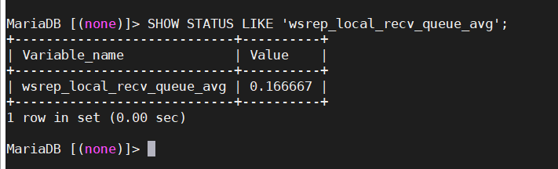
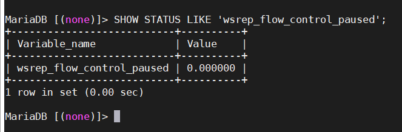
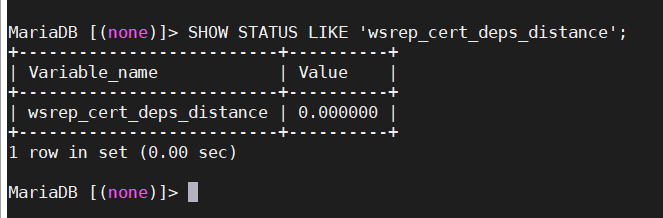
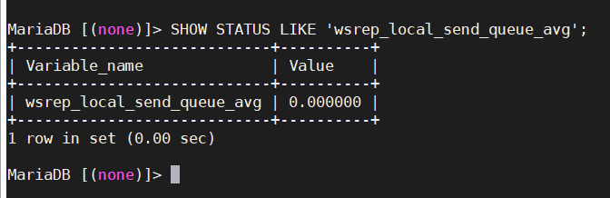

## Giám sát hoạt động của cluster

Đôi khi, bạn có thể muốn hoặc cần kiểm tra trạng thái của cluster. Ví dụ, bạn có thể muốn kiểm tra trạng thái của các node. Bạn có thể muốn kiểm tra các vấn đề kết nối mạng giữa các node.

Có 3 phương thức có sẵn để giám sát hoạt động của cluster và replication health: truy vấn thông qua database client với biến trạng thái; sử dụng script thông báo; hoặc thông qua ứng dụng giám sát của bên thứ ba (ví dụ: Nagios).

### Sử dụng biến trạng thái

Ngoài các biến trạng thái tiêu chuẩn trong MySQL, Galera Cluster cung cấp một loạt các biến trạng thái riêng. Những thứ này sẽ cho phép bạn kiểm tra trạng thái node và cluster, cũng như replication health thông qua database client.

Từ database client, bạn có thể kiểm tra trạng thái write-set replication trong toàn cụm bằng các truy vấn tiêu chuẩn. Các biến trạng thái liên quan đến write-set replication có tiền tố `wsrep_`, nghĩa là bạn có thể hiển thị tất cả chúng bằng truy vấn sau:

`SHOW GLOBAL STATUS LIKE 'wsrep_%';`


- Kiểm tra tính toàn vẹn cluster

Cluster có tính toàn vẹn khi tất cả các node trong nó nhận và sao chép write-sets từ tất cả các node khác. Các cluster bắt đầu mất tính toàn vẹn khi điều này bị phá vỡ, chẳng hạn như khi cluster bị hỏng, bị phân vùng hoặc bị phân tách.

Bạn có thể kiểm tra tính toàn vẹn của cluster bằng các biến trạng thái sau:

`wsrep_cluster_state_uuid` hiển thị trạng thái UUID cluster, bạn có thể sử dụng để xác định xem node có phải là một phần của cluster không.


Mỗi node trong cluster phải có cùng 1 giá trị. Khi 1 node mang 1 giá trị khác, điều này chỉ ra rằng nó không còn được kết nối với phần còn lại của cluster. Khi node thiết lập lại kết nối, nó sẽ tự điều chỉnh lại cho phù hợp với các node khác.

`wsrep_cluster_conf_id` hiển thị tổng số thay đổi cluster đã xảy ra, bạn có thể sử dụng để xác định xem node có phải là 1 phần của Primary Component không.


Mỗi node trong cluster phải có cùng 1 giá trị. Khi 1 node mang 1 giá trị khác nhau, điều này chỉ ra rằng cluster bị phân vùng. Khi node được thiết lập lại kết nối mạng, giá trị này sẽ tự động điều chỉnh với các node khác.

`wsrep_cluster_size` hiển thị số lượng node trong cluster, bạn có thể sử dụng để xác định xem có thiếu node nào không.


Bạn có thể chạy trên bất kỳ node nào. Nếu nó trả về giá trị thấp hơn số node trong cluster của bạn, điều đó có nghĩa là 1 số node bị mất kết nối mạng hoặc chúng đã bị lỗi.

`wsrep_cluster_status` hiển thị primary status của cluster component mà node ở bên trong, bạn có thể sử dụng để xác định xem cluster có đang gặp phân vùng hay không.


Giá trị trả về nên là Primary. Bất kỳ giá trị nào khác chỉ ra rằng node là một phần trong thành phần không hoạt động. Điều này xảy ra trong các trường hợp có nhiều thay đổi thành viên dẫn đến loss of quorum hoặc trong các trường hợp bị phân chia.

Khi các biến trạng thái này kiểm tra và trả về kết quả mong muốn trên mỗi node, cluster sẽ hoạt động và có tính toàn vẹn. Điều này có nghĩa là sự sao chép có thể xảy ra bình thường trên mọi node. Bước tiếp theo sau đó là kiểm tra trạng thái các node để đảm bảo rằng tất cả chúng đều hoạt động tốt và có thể nhận được các write-sets.

- Kiểm tra trạng thái node

Ngoài việc kiểm tra tính toàn vẹn của cluster, bạn cũng có thể theo dõi trạng thái của các node riêng lẻ. Điều này cho thấy các node có nhận và xử lý các bản cập nhật từ các cluster write-sets và có thể chỉ ra các vấn đề có thể ngăn chặn sự sao chép hay không.

`wsrep_ready` cho thấy node có thể chấp nhận truy vấn hay không.


Khi node trả về giá trị ON, nó có thể chấp nhận các write-sets từ cluster. Khi nó trả về giá trị OFF, hầu như tất cả các truy vấn đều lỗi:


`wsrep_connected` hiển thị xem node có kết nối mạng với bất kỳ node nào khác không.


Khi giá trị là ON, node có kết nối mạng với 1 hoặc nhiều node khác tạo thành một thành phần cụm. Khi giá trị là OFF, node không có kết nối với bất kỳ thành phần cụm nào.

> Lý do mất kết nối cũng có thể liên quan đến cấu hình sai. Ví dụ, nếu các node sử dụng các giá trị không hợp lệ cho tham số `wsrep_cluster_address` hoặc `wsrep_cluster_name`.

`wsrep_local_state_comment` hiển thị trạng thái nút ở định dạng có thể đọc được.


Khi node là một phần của Primary Component, các giá trị trở lại điển hình là `Joining`, `Waiting on SST`, `Joined`, `Synced` hoặc `Donor`. Nếu node là 1 phần của thành phần không hoạt động, giá trị trả về là `Initialized`.

Trong trường hợp mỗi biến trạng thái trả về các giá trị mong muốn, node sẽ ở trạng thái hoạt động. Điều này có nghĩa là nó đang nhận các write-sets từ cluster và sao chép chúng vào các bảng trong cơ sở dữ liệu cục bộ.

> Nếu node trả về bất kỳ giá trị nào khác với giá trị được liệt kê ở đây, thì trạng thái là tạm thời. Kiểm tra biến trạng thái một lần nữa để cập nhật.

- Kiểm tra Replication Health

Giám sát tính toàn vẹn của cluster và trạng thái node có thể hiển thị cho bạn các sự cố có thể ngăn chặn hoặc nếu không thì block replication. Các biến trạng thái này sẽ giúp xác định các vấn đề về hiệu suất và xác định các khu vực có vấn đề để bạn có thể tận dụng tối đa từ cluster của mình.

> Không giống như các biến trạng thái khác, những biến này sẽ đặt lại trên mỗi lệnh `FLUSH STATUS`

Galera Cluster kích hoạt một cơ chế phản hồi có tên Flow Control để quản lý quá trình sao chép. Khi trên local nhận được hàng chờ write-sets vượt quá một ngưỡng nhất định, node sẽ điều khiển Flow Control để tạm dừng sao chép trong khi đợi nó bắt kịp với hàng chờ.

Bạn có thể theo dõi local received queue và Flow Control bằng các biến trạng thái sau:

`wsrep_local_recv_queue_avg` hiển thị kích thước trung bình của local received queue kể từ truy vấn trạng thái cuối cùng.



Khi node trả về 1 giá trị cao hơn 0.0 nó có nghĩa là nút không thể áp dụng các write-sets nhanh như khi nhận được chúng, điều này có thể dẫn đến replication throttling.

> Ngoài biến trạng thái này, bạn cũng có thể sử dụng `wsrep_local_recv_queue_max` và `wsrep_local_recv_queue_min` để xem kích thước tối đa và tối thiểu mà node ghi lại cho local received queue.

`wsrep_flow_control_paused` hiển thị phần thời gian, kể từ lần cuối cùng `FLUSH STATUS` được gọi đến, nút bị tạm dừng do Flow Control.



Khi node trả về giá trị là 0.0, nó chỉ ra rằng node không bị tạm dừng do Flow Control trong khoảng thời gian này. Khi nút trả về giá trị là 1.0, nó chỉ ra rằng nút đã dành toàn bộ thời gian tạm dừng. Lý tưởng nhất là giá trị trả về nên càng gần 0.0 càng tốt, vì điều này có nghĩa là node không nằm sau cluster. Trong trường hợp bạn thấy rằng node đang tạm dừng thường xuyên, bạn có thể điều chỉnh tham số `wsrep_slave_threads` hoặc bạn có thể loại trừ node khỏi cluster.

`wsrep_cert_deps_distance` hiển thị khoảng cách trung bình giữa số thứ tự thấp nhất và cao nhất, hoặc seqno, các giá trị mà node có thể có thể áp dụng song song.



Điều này thể hiện mức độ tiềm năng của nút để song song hóa. Nói cách khác, giá trị tối ưu bạn có thể sử dụng với tham số `wsrep_slave_threads`, với điều kiện là không có lý do nào để gán nhiều slave threads hơn các giao dịch bạn có thể áp dụng song song.

- Phát hiện sự cố mạng chậm

Trong khi kiểm tra trạng thái của Flow Control và hàng chờ nhận được có thể cho bạn biết cách máy chủ cơ sở dữ liệu làm việc với các incoming write-sets, bạn có thể kiểm tra hàng gửi để theo dõi các vấn đề kết nối đi.

> Không giống như các biến trạng thái khác, những biến này sẽ đặt lại trên mỗi lệnh `FLUSH STATUS`

`wsrep_local_send_queue_avg` hiển thị giá trị trung bình cho độ dài hàng chờ gửi đi kể từ truy vấn `FLUSH STATUS` cuối cùng.



Giá trị lớn hơn so với 0.0 chỉ ra vấn đề replication throttling hoặc vấn đề về thông lượng mạng, chẳng hạn như nút cổ chai trên liên kết mạng. Vấn đề có thể xảy ra ở bất kỳ lớp nào từ các thành phần vật lý của máy chủ của bạn đến cấu hình của hệ điều hành.

> Ngoài biến trạng thái này, bạn cũng có thể sử dụng `wsrep_local_send_queue_max` và `wsrep_local_send_queue_min` để xem kích thước tối đa và tối thiểu mà node ghi lại cho local send queue.

### Notification Command

Bạn có thể sử dụng database client (ví dụ mysql client) để kiểm tra trạng thái của cluster, các node riêng lẻ hoặc replication health. Tuy nhiên, bạn có thể sẽ cảm thấy mất nhiều thời gian khi phải log vào từng node để chạy kiểm tra.

Là một phương pháp thay thế và tốt hơn, Galera Cluster cung cấp một phương thức để gọi 1 notification script. Nó là 1 script được tùy chỉnh để tự động hóa quá trình giám sát của 1 cluster.

Các node có thể gọi 1 notification script khi các thay đổi xảy ra trong tư cách thành viên của cụm, đó là khi các nút tham gia hoặc rời khỏi cluster. Bạn có thể chỉ định tên của script mà node gọi tới bằng `wsrep_notify_cmd`.

[Đây](https://raw.githubusercontent.com/edf-hpc/mariadb-galera/master/support-files/wsrep_notify.sh) là 1 ví dụ cho script được dùng để thông báo.

Bạn cầm phải chỉnh sửa các biến `USER`, `PSWD`, `HOST`, `PORT` cho phù hợp rồi đặt vào thư mục chứa các tệp tin nhị phân trên hệ thống. Trên Linux, thư mục nhị phân thường ở `/usr/bin`, trong khi trên FreeBSD thì là `/usr/local/bin`.

`mv wsrep_notify.sh /usr/bin`

Ngoài ra, do script chứa mật khẩu root, hãy thay đổi quyền sở hữu cho người dùng `mysql` và đảm bảo script chỉ được thực thi bởi người dùng đó.

```
chown mysql:mysql /usr/bin/wsrep-notify.sh
chmod 700 /usr/bin/wsrep-notify.sh
```

Điều này đảm bảo rằng chỉ người dùng `mysql` mới có thể thực thi và đọc script, ngăn các người dùng khác nhìn thấy mật khẩu root.

- Notification Parameters

Khi 1 node có 1 sự thay đổi trong chính nó hoặc trong cluster, nó sẽ kích hoạt tập lệnh hoặc lệnh thông báo. Làm như vậy, nó sẽ chuyển một số tham số nhất định cho tập lệnh thông báo. Dưới đây là danh sách của chúng và ý nghĩa cơ bản:

`--status` node chỉ ra trạng thái hiện tại của nó.

`--uuid` node trả về giá trị `yes` hoặc là `no`,  cho biết liệu nó có tự coi mình là một phần của Primary Component hay không.

`--members` node trả về 1 danh sách chứa các thành viên trong hiện tại trong cluster.

`--index` node chỉ ra giá trị index của chính nó trong danh sách thành viên của cluster.

Chỉ các node trong trạng thái `Synced` sẽ chấp nhận kết nối từ cluster.

- Node Status Strings

Script có thể trả về 1 trong 6 giá trị của tham số `--status` để cho biết trạng thái hiện tại của node:

`Undefined` chỉ ra node đang được khởi động, không phải là một phần của Primary Component.

`Joiner` cho biết node là 1 phần của Primary Component và đang nhận state snapshot transfer (SST).

`Donor` cho biết node là 1 phần của Primary Component và đang gửi đi state snapshot transfer.

`Joined` chỉ ra node là 1 phần của Primary Component và đang ở trạng thái hoàn tất việc join vào cluster.

`Synced` chỉ ra node đã được đồng bộ hóa với cluster.

`Error` chỉ ra rằng có lỗi đã xảy ra. Nó cũng có thể cung cấp mã lỗi với một số thông tin về những gì đã xảy ra.

- Members List Format

Script sẽ chuyển với tham số `--member`, trả về 1 danh sách chứa các mục cho mỗi node kết nối với thành phần cluster. Đối với mỗi mục trong danh sách, chúng sẽ có định dạng như sau:

`<node UUID> / <node name> / <incoming address>`

`node UUID` đề cập đến mã định danh duy nhất mà node nhận được từ wsrep Provider.

`node name` đề cập đến tên node, được xác định với tham số `wsrep_node_name` trong tệp cấu hình.

`incoming address` đề cập đến địa chỉ IP cho các kết nối máy khách, được đặt với tham số `wsrep_node_inending_address` trong tệp cấu hình. Nếu nó này không được đặt, thì giá trị mặc định sẽ là `AUTO`.

- Kích hoạt Notification Script

Bạn có thể kích hoạt notification script hoặc command thông qua tham số `wsrep_notify_cmd` trong tệp cấu hình.

`wsrep_notify_cmd=/path/wsrep_notify.sh`

Node sẽ gọi đến script cho mỗi thay đổi về thành viên trong cluster và trạng thái node.

### Database Server Logs

Galera Cluster cung cấp các tính năng ghi nhật ký database tương tự có sẵn như với MySQL, MariaDB và Percona XtraDB, tùy thuộc vào việc bạn sử dụng. Theo mặc định, nó ghi lỗi vào một tệp `<hostname>.err` trong thư mục dữ liệu. Bạn có thể thay đổi điều này trong tệp cấu hình bằng tùy chọn `log_error` hoặc bằng cách sử dụng tham số `--log-error`.

- Log Parameters

Galera Cluster cung cấp các tham số và tùy chọn wsrep cho phép bạn kích hoạt ghi nhật ký lỗi dựa trên các sự kiện dành riêng cho quá trình sao chép. Nếu bạn có một script theo dõi nhật ký, các mục nhập này có thể cung cấp thông tin về các xung đột xảy ra trong quá trình sao chép.

`wsrep_log_conflicts`: tham số này cho phép ghi nhật ký xung đột cho nhật ký lỗi. 1 ví dụ sẽ là khi 2 node cố gắng ghi vào cùng 1 hàng của cùng 1 bảng cùng 1 lúc.

`cert.log_conflicts`: tùy chọn wsrep Provider này cho phép ghi nhật ký thông tin về các lỗi chứng nhận trong quá trình sao chép.

`wsrep_debug`: tham số này bật tính năng debug info cho database server logs.

> Tuy nhiên ngoài thông tin debug hữu ích, tham số này cũng khiến in ra thông tin xác thực (vi dụ mật khẩu) vào nhật ký lỗi. Đây là 1 lỗ hổng bảo mật.

```
# wsrep Log Options
wsrep_log_conflicts=ON
wsrep_provider_options="cert.log_conflicts=ON"
wsrep_debug=ON
```

- Log file bổ sung

Bất cứ khi nào 1 node không áp dụng 1 sự kiện trên slave node, database server sẽ tạo một tệp nhật ký nhị phân đặc biệt của sự kiện trong thư mục dữ liệu. Quy ước đặt tên sử dụng cho tên tệp là `GRA_*.log`.