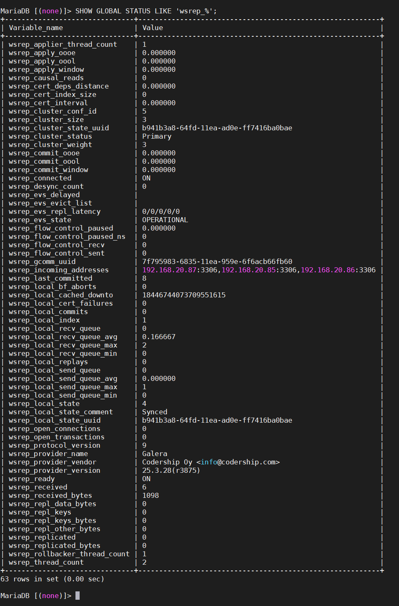
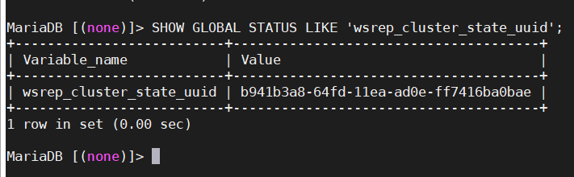
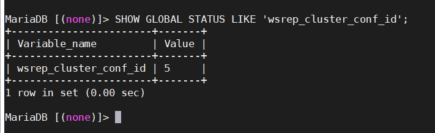
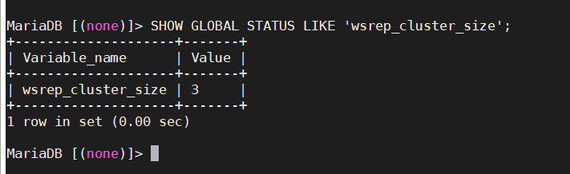
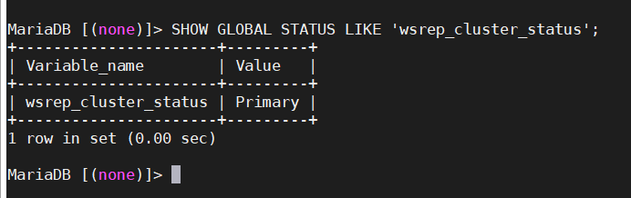
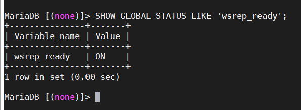
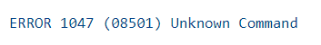
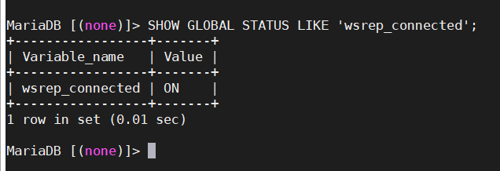
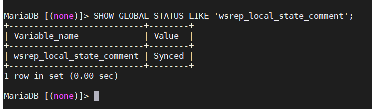

## Giám sát hoạt động của cluster

Đôi khi, bạn có thể muốn hoặc cần kiểm tra trạng thái của cluster. Ví dụ, bạn có thể muốn kiểm tra trạng thái của các node. Bạn có thể muốn kiểm tra các vấn đề kết nối mạng giữa các node.

Có 3 phương thức có sẵn để giám sát hoạt động của cluster và replication health: truy vấn thông qua database client với biến trạng thái; sử dụng script thông báo; hoặc thông qua ứng dụng giám sát của bên thứ ba (ví dụ: Nagios).

### Sử dụng biến trạng thái

Ngoài các biến trạng thái tiêu chuẩn trong MySQL, Galera Cluster cung cấp một loạt các biến trạng thái riêng. Những thứ này sẽ cho phép bạn kiểm tra trạng thái node và cluster, cũng như replication health thông qua database client.

Từ database client, bạn có thể kiểm tra trạng thái write-set replication trong toàn cụm bằng các truy vấn tiêu chuẩn. Các biến trạng thái liên quan đến write-set replication có tiền tố `wsrep_`, nghĩa là bạn có thể hiển thị tất cả chúng bằng truy vấn sau:

`SHOW GLOBAL STATUS LIKE 'wsrep_%';`

- Kiểm tra tính toàn vẹn cluster

Cluster có tính toàn vẹn khi tất cả các node trong nó nhận và sao chép write-sets từ tất cả các node khác. Các cluster bắt đầu mất tính toàn vẹn khi điều này bị phá vỡ, chẳng hạn như khi cluster bị hỏng, bị phân vùng hoặc bị phân tách.

Bạn có thể kiểm tra tính toàn vẹn của cluster bằng các biến trạng thái sau:

`wsrep_cluster_state_uuid` hiển thị trạng thái UUID cluster, bạn có thể sử dụng để xác định xem node có phải là một phần của cluster không.

Mỗi node trong cluster phải có cùng 1 giá trị. Khi 1 node mang 1 giá trị khác, điều này chỉ ra rằng nó không còn được kết nối với phần còn lại của cluster. Khi node thiết lập lại kết nối, nó sẽ tự điều chỉnh lại cho phù hợp với các node khác.

`wsrep_cluster_conf_id` hiển thị tổng số thay đổi cluster đã xảy ra, bạn có thể sử dụng để xác định xem node có phải là 1 phần của Primary Component không.

Mỗi node trong cluster phải có cùng 1 giá trị. Khi 1 node mang 1 giá trị khác nhau, điều này chỉ ra rằng cluster bị phân vùng. Khi node được thiết lập lại kết nối mạng, giá trị này sẽ tự động điều chỉnh với các node khác.

`wsrep_cluster_size` hiển thị số lượng node trong cluster, bạn có thể sử dụng để xác định xem có thiếu node nào không.

Bạn có thể chạy trên bất kỳ node nào. Nếu nó trả về giá trị thấp hơn số node trong cluster của bạn, điều đó có nghĩa là 1 số node bị mất kết nối mạng hoặc chúng đã bị lỗi.

`wsrep_cluster_status` hiển thị primary status của cluster component mà node ở bên trong, bạn có thể sử dụng để xác định xem cluster có đang gặp phân vùng hay không.

Giá trị trả về nên là Primary. Bất kỳ giá trị nào khác chỉ ra rằng node là một phần trong thành phần không hoạt động. Điều này xảy ra trong các trường hợp có nhiều thay đổi thành viên dẫn đến loss of quorum hoặc trong các trường hợp bị phân chia.

Khi các biến trạng thái này kiểm tra và trả về kết quả mong muốn trên mỗi node, cluster sẽ hoạt động và có tính toàn vẹn. Điều này có nghĩa là sự sao chép có thể xảy ra bình thường trên mọi node. Bước tiếp theo sau đó là kiểm tra trạng thái các node để đảm bảo rằng tất cả chúng đều hoạt động tốt và có thể nhận được các write-sets.

- Kiểm tra trạng thái node

Ngoài việc kiểm tra tính toàn vẹn của cluster, bạn cũng có thể theo dõi trạng thái của các node riêng lẻ. Điều này cho thấy các node có nhận và xử lý các bản cập nhật từ các cluster write-sets và có thể chỉ ra các vấn đề có thể ngăn chặn sự sao chép hay không.

`wsrep_ready` cho thấy node có thể chấp nhận truy vấn hay không.

Khi node trả về giá trị ON, nó có thể chấp nhận các write-sets từ cluster. Khi nó trả về giá trị OFF, hầu như tất cả các truy vấn đều lỗi:

`wsrep_connected` hiển thị xem node có kết nối mạng với bất kỳ node nào khác không.

Khi giá trị là ON, node có kết nối mạng với 1 hoặc nhiều node khác tạo thành một thành phần cụm. Khi giá trị là OFF, node không có kết nối với bất kỳ thành phần cụm nào.

> Lý do mất kết nối cũng có thể liên quan đến cấu hình sai. Ví dụ, nếu các node sử dụng các giá trị không hợp lệ cho tham số `wsrep_cluster_address` hoặc `wsrep_cluster_name`.

`wsrep_local_state_comment` hiển thị trạng thái nút ở định dạng có thể đọc được.

Khi node là một phần của Primary Component, các giá trị trở lại điển hình là `Joining`, `Waiting on SST`, `Joined`, `Synced` hoặc `Donor`. Nếu node là 1 phần của thành phần không hoạt động, giá trị trả về là `Initialized`.

Trong trường hợp mỗi biến trạng thái trả về các giá trị mong muốn, node sẽ ở trạng thái hoạt động. Điều này có nghĩa là nó đang nhận các write-sets từ cluster và sao chép chúng vào các bảng trong cơ sở dữ liệu cục bộ.

> Nếu node trả về bất kỳ giá trị nào khác với giá trị được liệt kê ở đây, thì trạng thái là tạm thời. Kiểm tra biến trạng thái một lần nữa để cập nhật.