## Tìm hiểu về Regular expression

Regular expression (RegEx) hay còn gọi là biểu thức chính quy được dùng để xử lý chuỗi nâng cao thông qua biểu thức riêng của nó. Những biểu thức này sẽ có những nguyên tắc riêng và bạn phải tuân theo nguyên tắc đó thì biểu thức cảu bạn mới hoạt động được. Nguyên tắc hoạt động của biểu thức RegEx là so khớp dựa vào khuôn mẫu, khuôn mẫu được xây dựng từ các quy tắc căn bản của biểu thức RegEx.

Các biểu thức chính quy bắt nguồn từ năm 1951, khi nhà toán học Stephen Cole Kleene mô tả cá ngôn ngữ thông thường sử dụng ký hiệu toán học của mình được gọi là regular events.

Các biểu thức chính quy được sử dụng phổ biến từ năm 1968 trong 2 cách sử dụng: khớp mẫu trong trình soạn thảo văn bản và phân tích từ vựng trong trình biên dịch. Trong số lần xuất hiện đầu tiên của biểu thức chính quy ở dạng chương trình là khi Ken Thompson xây dựng ký hiệu của Kleene vào trình soạn thảo QED như 1 phương tiện để khớp các mẫu trong tệp văn bản.

Nhiều biến thể của các dạng biểu thức chính quy ban đầu đã được sử dụng trong các chương trình Unix tại Bell Labs vào những năm 1970, bao gồm vi, lex, sed, awk, expr và trong các chương trình khác như Emacs. Các quy tắc sau đó đã được áp dụng bởi 1 loạt các chương trình, với các hình thức ban đầu này được chuẩn hóa trong tiêu chuẩn POSIX.2 vào năm 1992.

Trong những năm 1980, các biểu thức phức tạp hơn đã phát sinh ở Perl, xuất phát từ 1 thư viện regex được viết bởi Henry Spencer (1986), người sau đó đã viết 1 triển khai Biểu thức chính quy nâng cao cho Tcl.

Bắt đầu từ năm 1997, Philip Hazel đã phát triển PCRE (Perl Compatible Regular Expressions), cố gắng bắt chước chặt chẽ chức năng regex của Perl và được sử dụng bởi nhiều công cụ hiện đại bao gồm PHP và Apache HTTP server.

Ngày nay, regex được hỗ trợ rộng rãi trong các ngôn ngữ lập trình, chương trình xử lý văn bản (đặc biêt là từ vựng), trình soạn thảo văn bản nâng cao vào 1 số chương trình khác.

### Các quy tắc cơ bản

1. Khai báo 1 chuỗi RegEx

`/pattern/flag`

1 pattern sẽ bắt đầu bằng dấu `/` và cũng kết thức bằng dấu `/`. Đằng sau cặp dấu `/` này là các option, hay còn gọi là các flag (có thể có hoặc không). 3 flag cơ bản là:

- `i`: không phân biệt chữ hoa, chữ thường (case-insensitive)

- `g`: cho phép match lặp lại với các ký tự khác trong toàn bộ văn bản, nếu không có thì chỉ match kết quả đầu tiên (global)

- `m`: cho phép match theo từng dòng với văn bản đa dòng và có sử dụng cặp `^$` (multiline)

Ví dụ:

- pattern `/wibu/` sẽ trả về chuỗi `wibu` trùng khớp đầu tiên

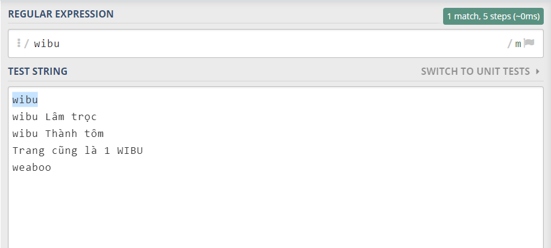

- khi thêm flag `g` sẽ tìm kiếm tất cả chuỗi `wibu` trong toàn bộ văn bản

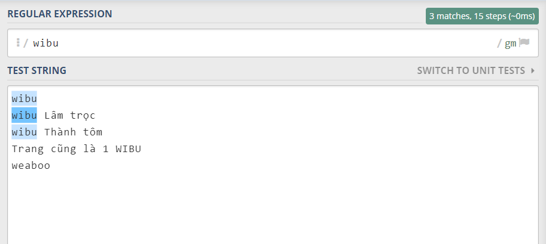

- khi thêm flag `i` thì sẽ không phân biệt chữ hoa chữ thường

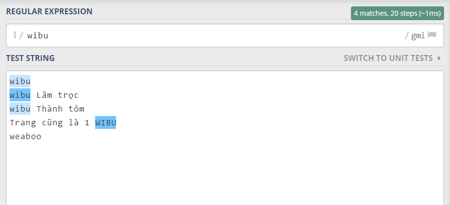

2. Ký tự bắt đầu và kết thúc trong regex

- Dấu `^` sẽ kiểm tra ký tự bắt đầu chuỗi

ví dụ pattern `/^wibu/` sẽ match với chuỗi bắt đầu bằng `wibu`

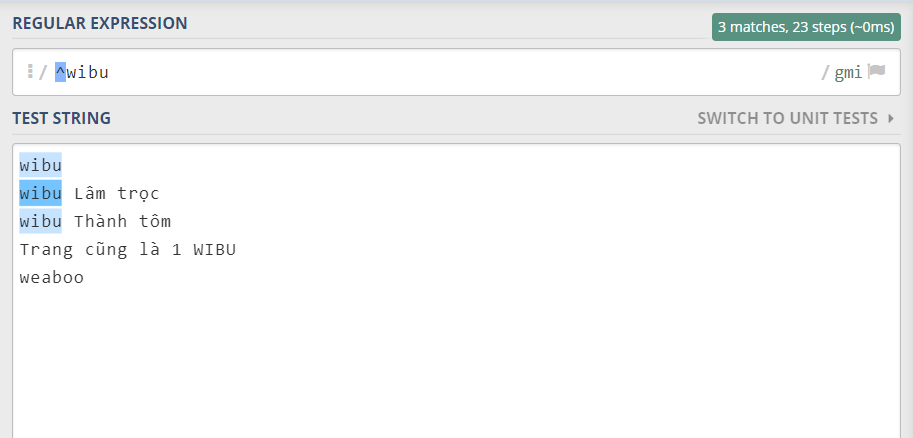

- Dấu `$` sẽ kiểm tra ký tự kết thúc chuỗi

ví dụ pattern `/wibu$/` sẽ match với chuỗi kết thúc bằng `wibu`

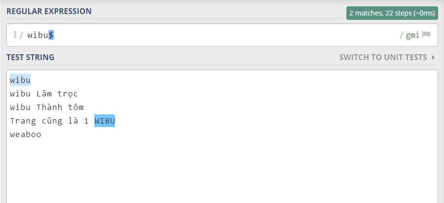

- Nếu sử dụng cả 2 ký tự `^$` trong cùng 1 biểu thức thì cõ nghĩa là match 1 chuỗi khớp hoàn toàn với biểu thức

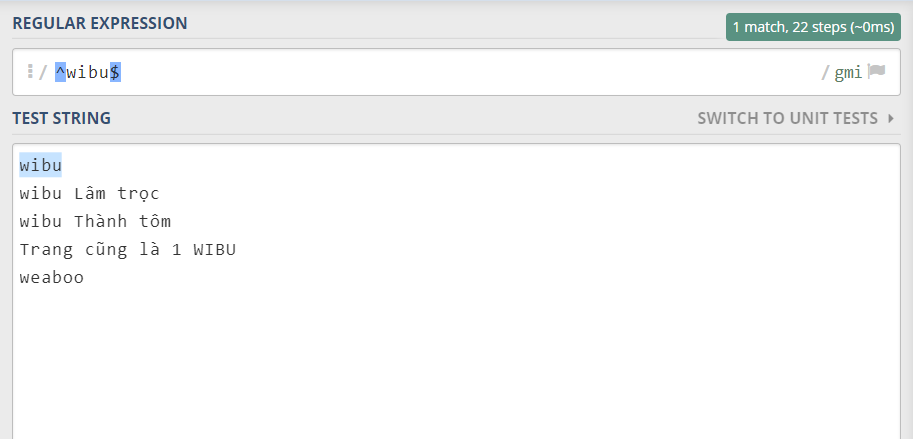

3. Xác định phạm vị của 1 chuỗi

- Để match với các chữ cái in thường , ta có pattern `/[a-z]/`

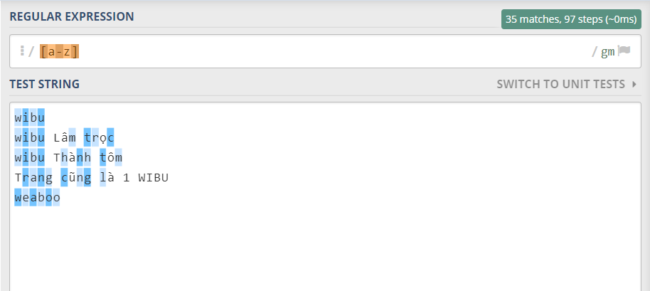

- Để match với các chữ cái in hoa, ta sử dụng `/[A-Z]/`

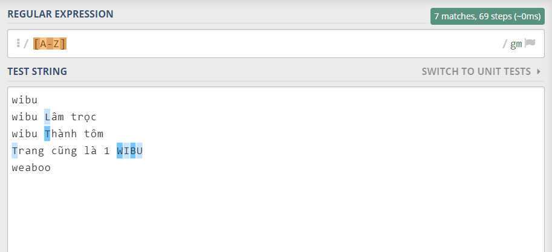

- Match các chữ số với pattern `/[0-9]/`

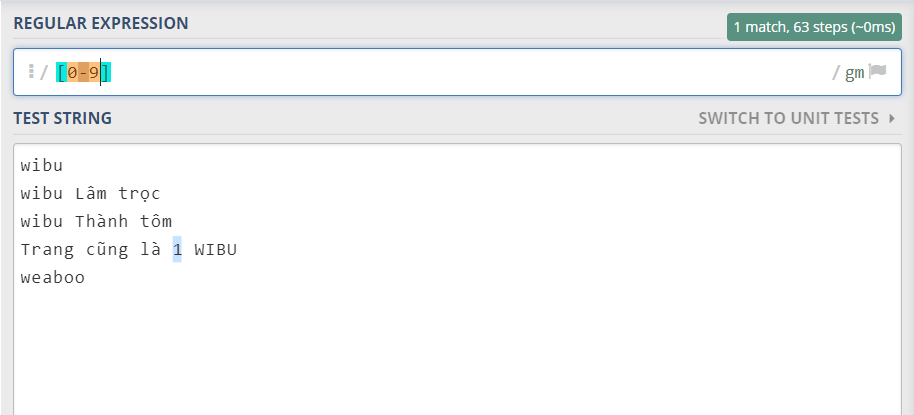

- Match cả chữ hoa, chữ thường với pattern `/[a-zA-Z]/`

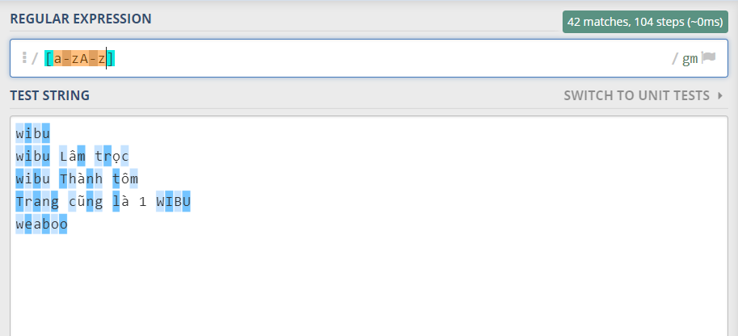

- Match cả ký tữ chữ hoa, chữ thường, chữ số (trừ các ký tự đặc biệt) với pattern `/[a-zA-Z0-9]/`

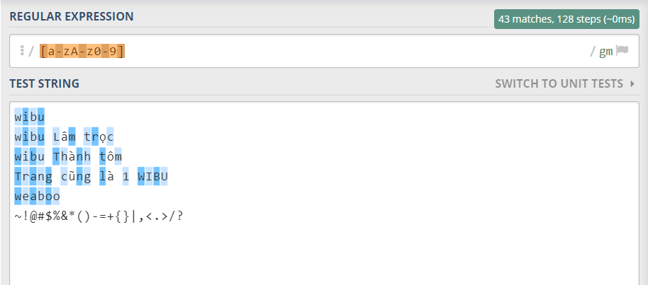

- Để match các ký tự trong tập hợp `wiebo` ta có pattern `/[wiebo]/`

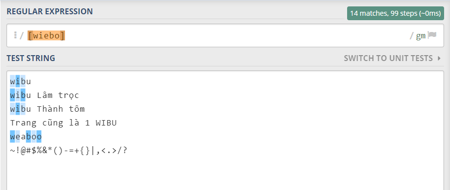

- Nếu không muốn match với các ký tự trong tập hợp `wiebo` ta thêm dấu `^` vào để phủ định như sau `/[^wiebo]/`

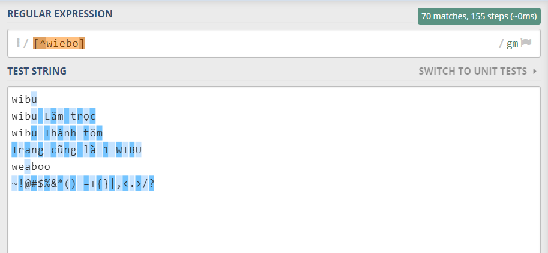

4. Xác định chiều dài chuỗi

- Để tìm các chuỗi có chiều dài từ x đến y, ta có cú pháp {x,y}. Ví dụ tìm các chuỗi có từ 4 đến 9 ký tự thường với cú pháp `/[a-z]{4,9}/`

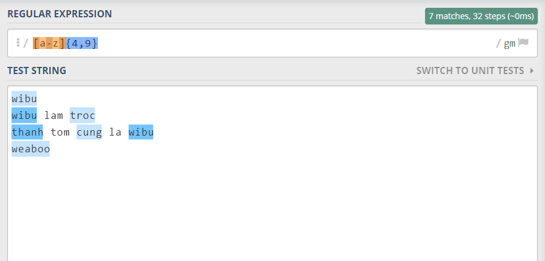

- Tìm các chuỗi có độ dài chính xác `/[a-z]{3}/`

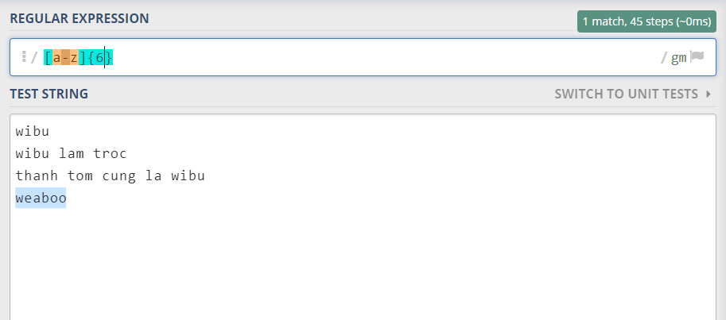

5. RegEx đại diện cho 1 ký tự

- Ký tự `.` được dùng để định nghĩa cho 1 ký tự bất kỳ. Ví dụ pattern `/.{0,6}/gm` sẽ tìm các chuỗi bất kỳ có từ 0 đến 6 ký tự

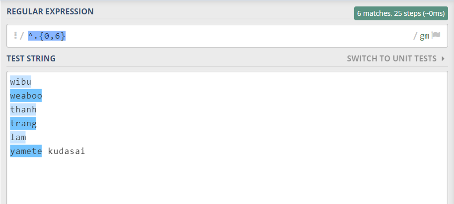

- pattern `/a.o/gm` sẽ tìm tất cả các cụm từ có ký tự bất kỳ nằm giữa ký tự `a` và `o`

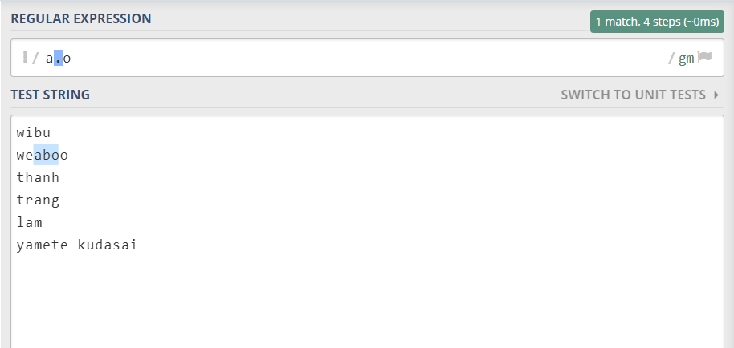

6. Ký tự đặc biệt cho các từ khóa regex

Các ký tự như `.`,`[]`,`{}`,... hay những ký tự liên quan đến quy tắc của regex đều được quy về dạng ký tự đặc biệt trong regex, vì vậy để phân biệt ký tự đặc biệt và ký tự thường trong regex thì ta thêm dấu `\` trước ký tự đó

Ví dụ: tìm dấu `.` trong đoạn văn bản bằng cách sử dụng `/\./`

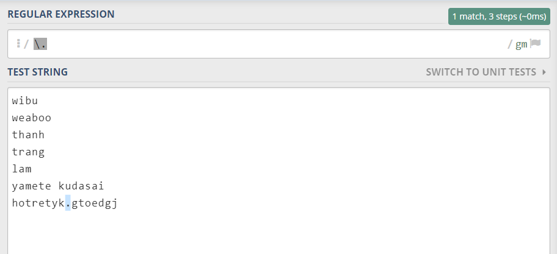

7. RegEx X hoặc Y

Khi muốn tìm chuỗi = X hoặc = Y thì dùng dấu `|`, đây là ký hiệu mô tả mối quan hệ OR

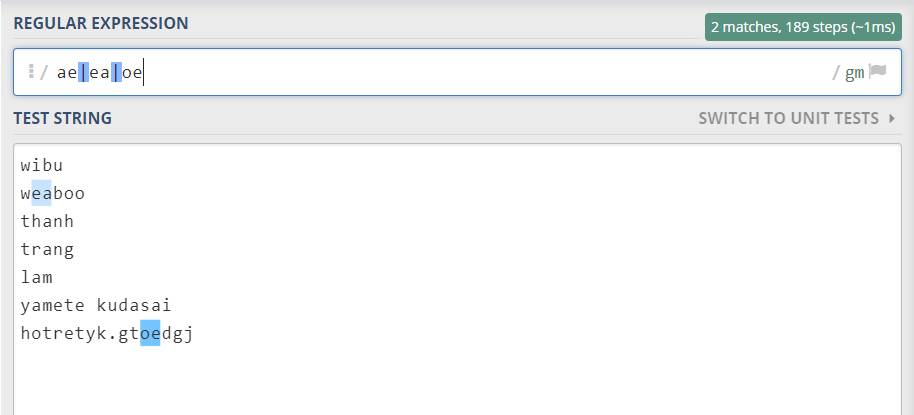

8. RegEx kiểm tra độ dài không giới hạn

- Ký tự `*` đại diện cho 0 hoặc nhiều ký tự, tương tự với biểu thức {0,}, ví dụ ta có pattern `/wibu.*/`

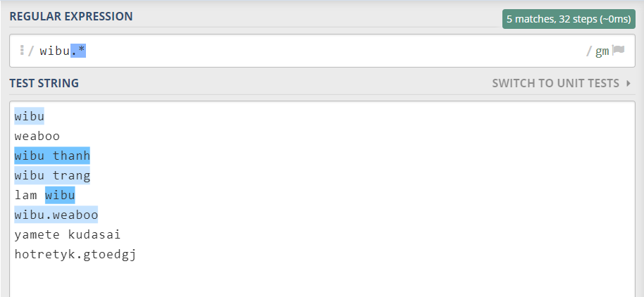

- Ký tự `+` đại diện cho 1 hoặc nhiều ký tự, tương tự với {1,}, ví dụ `/wibu.+/`

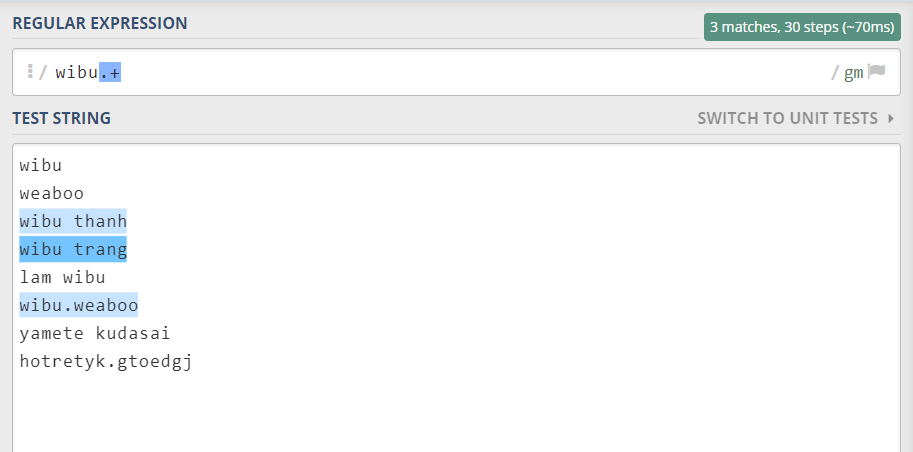

- Ký tự `?` đại diện cho 0 hoặc 1 ký tụ, tương tự {0,1}, ví dụ `/wi.?/`

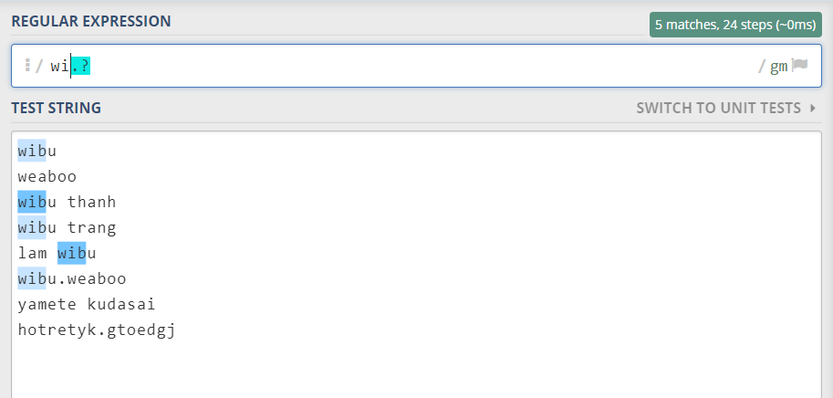

9. 1 số ký tự đặc biệt khác

| Ký tự | Mô tả |
| --- | --- |
| \w | ký tự chữ cái, số và gạch dưới `[a-zA-Z0-9_]` |
| \W | ký tự không phải chữ cái, số và gạch dưới `[^a-zA-Z0-9_]` |
| \d | ký tự số `[0-9]` |
| \D | ký tự không phải số `[^0-9]` |
| \s | ký tự khoảng trắng `[\r\n\t\f\v ]` |
| \S | ký tự không phải khoảng trắng `[^\r\n\t\f\v ]` |
| \b | ký tự biên, chỉ bắt đầu hoặc kết thúc chuỗi |
| \B | ký tụ không phải ký tự biên, không phải bắt đầu hoặc kết thúc chuỗi |
| \n | ký tự xuống dòng |
| \0 | ký tự NULL |