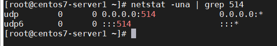

## Configure Rsyslog with Any Log File

### Yêu cầu

Cấu hình Rsyslog đọc bất kỳ file log nào và đẩy lên log server

### Chuẩn bị


- 1 máy Rsyslog server chạy CentOS 7, ip 192.168.254.234

- 1 máy Rsyslog client chạy CentOS 7, ip 192.168.254.222

### Thực hành

#### Trên server

- Mở port 514

```
firewall-cmd --permanent --add-port=514/udp
firewall-cmd --permanent --add-port=514/tcp
firewall-cmd --reload
```

- Chỉnh sửa trong file cấu hình /etc/rsyslog.conf của rsyslog server để nó có thể nhận các log từ client gửi đến

bỏ comment 2 dòng sau


bạn có thể lựa chọn sử dụng UDP hoặc TCP để cho phép server nhận các bản tin log. Mặc định syslog sử dụng port 514 để gửi và nhận thông tin log. Ở đây mình sử dụng UDP.

- Cấu hình để log server lưu log của client riêng đối với từng máy (Chú ý đặt trên GLOBAL DIRECTIVES)

Có 2 cách:

C1: thư mục lưu log là ip-client
	
```
$template RemoteServer, "/var/log/%fromhost-ip%/%SYSLOGFACILITY-TEXT%.log"
*.* ?RemoteServer
```
	
C2: thư mục lưu log là host name client
	
```
$template RemoteServer, "/var/log/%HOSTNAME%/%SYSLOGFACILITY-TEXT%.log"
*.* ?RemoteServer
```

Ngoài ra bạn có thể sử dụng cấu hình sau để lưu các file log với tên các chương trình:

```
$template TmplAuth,"/var/log/%HOSTNAME%/%PROGRAMNAME%.log" #hostname
*.*     ?TmplAuth
```

hoặc

```
$template TmplAuth,"/var/log/%fromhost-ip%/%PROGRAMNAME%.log" #ip-server
*.*     ?TmplAuth
```

- khởi động lại Rsyslog-server của bạn và đảm bảo rằng nó hiện đang lắng nghe trên cổng 514 cho UDP hoặc TCP

```
systemctl restart rsyslog
netstat -una | grep 514
```



Nếu bạn sử dụng TCP có thể sử dụng lệnh

`netstat -tna | grep 514`

#### Trên client

- Tắt SE Linux

`sudo setenforce 0`

điều này chỉ tạm thời tắt SE Linux, để tắt nó hoàn toàn ta cần chỉnh sửa trong tệp /etc/selinux/config

```
vi /etc/selinux/config
SELINUX=disabled
```

lưu lại và reboot.

Khi hệ thống khởi động lên, hãy xác nhận các thay đổi với câu lệnh

`sestatus`

- Để rsyslog có thể đọc file ngoài, ta cần phải dùng module `imfile` của rsyslog

Đây là mô-đun được viết nên bởi Rainer Gerhards - 1 kỹ sư phần mềm người Đức. Mô-đun này cung cấp khả năng chuyển đổi bất kỳ tệp văn bản tiêu chuẩn thành tin nhắn nhật ký hệ thống. Tệp văn bản tiêu chuẩn là một tệp bao gồm các ký tự có thể in được với các dòng được phân định bởi LF.

Tệp được đọc từng dòng một và mọi dòng đọc được chuyển đến công cụ quy tắc của rsyslog. Công cụ quy tắc áp dụng các điều kiện lọc và chọn hành động nào cần được thực hiện. Các dòng trống không được xử lý, vì chúng sẽ dẫn đến các bản ghi nhật ký hệ thống trống. Nó chỉ đơn giản là bỏ qua chúng. Khi các dòng mới được viết, chúng được lấy từ tệp và được xử lý.

- Tạo 1 file cấu hình /etc/rsyslog.d/test_file.conf và thêm nội dung sau:

```
$ModLoad imfile
$InputFileName /tmp/test
$InputFilePollInterval 10
$InputFileTag TEST_FILE
$InputFileStateFile test-log-state
$InputFileSeverity info
$InputFileFacility local5
$InputRunFileMonitor

local5.*	@192.186.254.234:514
```

trong đó:

`$ModLoad`: load module

`$InputFileName`: Đường dẫn tới file

`$InputFilePollInterval`: thời gian giữa 2 lần quét file (s)

`$InputFileTag`: Tên file sẽ hiển thị tại log server

`$InputFileStateFile`: Tạo file trạng thái

`$InputFileSeverity`: Thiết lập mức độ cảnh báo

`$InputFileFacility`: Cấu hình nguồn local, rsyslog cho phép tuỳ biến từ local0-7

`$InputRunFileMonitor`: Monitor file được định nghĩa ở trên

`local5.* @@IP_SYSLOG_SERVER:514`: Đẩy tất cả các log từ local5 về server port 514