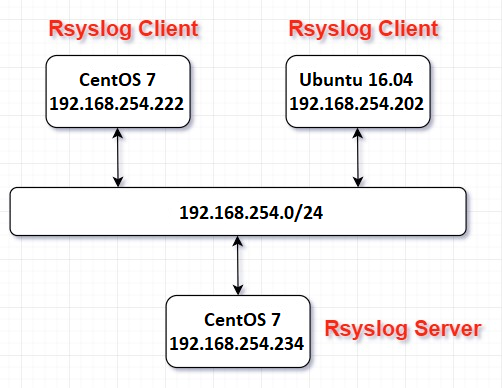
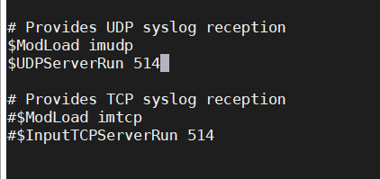
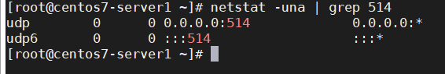
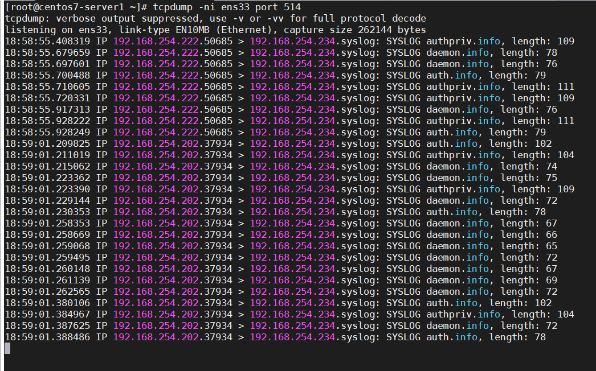
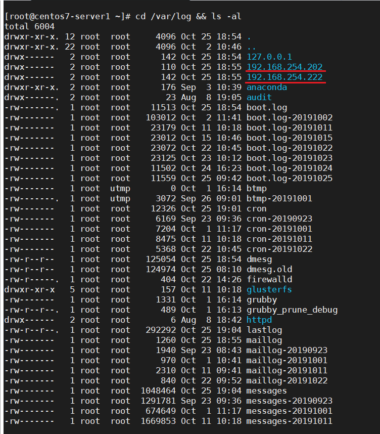

## Cấu hình rsyslog

### Yêu cầu

- Cài đặt và cấu hình log tập trung bằng rsyslog, đẩy log local và đẩy log đi server khác bằng TCP hoặc UDP

### Mô hình



### Thực hành

#### Cấu hình Rsyslog server

B1: chỉnh sửa trong file cấu hình /etc/rsyslog.conf của rsyslog server để nó có thể nhận các log từ client gửi đến

bỏ comment 2 dòng sau



bạn có thể lựa chọn sử dụng UDP hoặc TCP để cho phép server nhận các bản tin log. Mặc định syslog sử dụng port 514 để gửi và nhận thông tin log. Ở đây mình sử dụng UDP.

B2: cấu hình để log server lưu log của client riêng đối với từng máy (Chú ý đặt trên GLOBAL DIRECTIVES)

- Có 2 cách:

	- C1: thư mục lưu log là ip-client
	
	```
	$template RemoteServer, "/var/log/%fromhost-ip%/%SYSLOGFACILITY-TEXT%.log"
	*.* ?RemoteServer
	```
	
	- C2: thư mục lưu log là host name client
	
	```
	$template RemoteServer, "/var/log/%HOSTNAME%/%SYSLOGFACILITY-TEXT%.log"
	*.* ?RemoteServer
	```

Ngoài ra bạn có thể sử dụng cấu hình sau để lưu các file log với tên các chương trình:

```
$template TmplAuth,"/var/log/%HOSTNAME%/%PROGRAMNAME%.log" #hostname
*.*     ?TmplAuth
```

hoặc

```
$template TmplAuth,"/var/log/%fromhost-ip%/%PROGRAMNAME%.log" #ip-server
*.*     ?TmplAuth
```

B3: mở port 514

```
firewall-cmd --permanent --add-port=514/udp
firewall-cmd --permanent --add-port=514/tcp
firewall-cmd --reload
```

B4: khởi động lại Rsyslog-server của bạn và đảm bảo rằng nó hiện đang lắng nghe trên cổng 514 cho UDP hoặc TCP

```
systemctl restart rsyslog
netstat -una | grep 514
```



Nếu bạn sử dụng TCP có thể sử dụng lệnh

`netstat -tna | grep 514`

#### Cấu hình Rsyslog Client

> Lưu ý trên client cũng phải truyền đúng với giao thức như trên server

*.*	@IPserver:514 - đối với giao thức UDP

*.*	@@IPserver:514 - đối với giao thức TCP

- Đối với client CentOS 7

B1: khai báo IP của Rsyslog-server (dưới mục Rule)

```
vi /etc/rsyslog.conf
*.*	@192.168.254.234:514
```

B2: restart service Rsyslog

`systemctl restart rsyslog`

#### Đối với client Ubuntu

B1: khai báo ip của Rsyslog-server

```
vi /etc/rsyslog.d/50-default.conf
*.*	@192.168.254.234:514
```

B2: restart service Rsyslog

`systemctl restart rsyslog`

#### Kiểm tra

Tại trên máy Rsyslog Server dùng tcpdump để bắt và kiểm chứng các gói tin từ 2 client gửi về



như các bạn đã thấy, các log messages như daemon, syslog, authpriv,.. sẽ được đẩy từ client về server qua port 514

Sau đó, kiểm tra thư đẩy về tại /var/log trên máy Rsyslog-server

