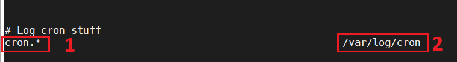
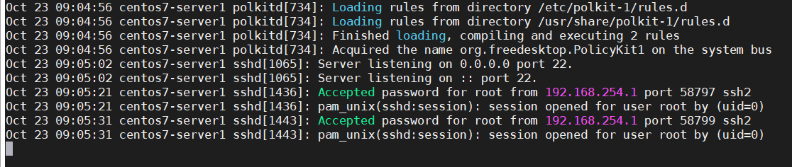
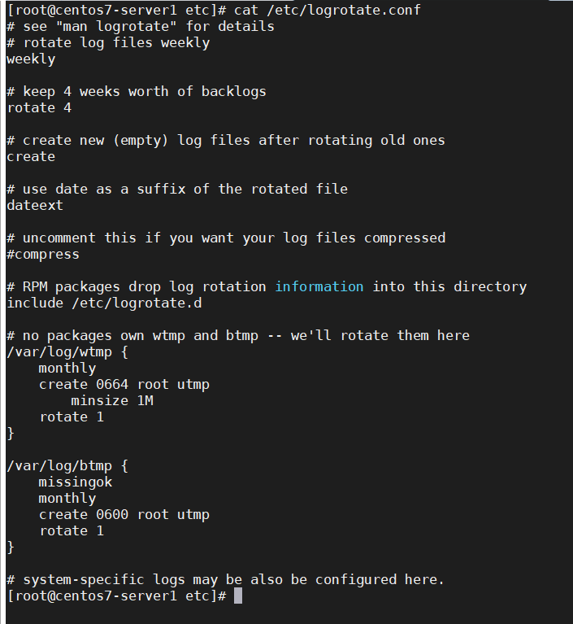

## Tổng quan về log

#### Khái niệm về log

Tong máy tính, log đơn giản là 1 file nhật ký ghi lại các hành động hay các sự kiện xảy ra trong hệ thống.

Log file thường là các file văn bản thông thường dưới dạng "clear text" và có thể dễ dàng đọc nó bằng việc sử dụng các trình soạn thao văn bản như Notepad (Windows) hay vi, vim, nano ... (linux) hoặc các trình xem văn bản thông thường như cat, tail, head ...

Đối với các hệ thống linux thì file log thường được lưu trữ tại thư mục /var/log

#### Công dụng của log

Log liên tục ghi lại các thông báo về hoạt động cũng như các sự kiện trong hệ thống. Từ các tệp nhật ký, người quản trị hệ thống có thể quan sát và tìm thấy các chi tiết về hiệu suất hoạt động, bảo mật, thông báo lỗi và các vấn đề tiềm ẩn đối với hệ thống. Do đó, các vấn đề nào mà máy chủ đang gặp phải đều có thể tìm thấy và giải quyết bằng cách đọc các file log

Log chủ yếu được dùng cho mục đích quản trị hệ thống, khắc phục sự cố khi hệ thống xảy ra vấn đề, troubleshooting trong quá trình cài đặt chương trình hay các services, truy vết các event đã và đang xảy ra, tra cứu nhanh các thông tin hệ thống, ...

Về cơ bản, phân tích log là điều đầu tiên mà người quản trị cần làm khi phát hiên ra sự cố

#### Các loại log

Log có thể được chia làm 4 loại cơ bản

- Application logs

- Event logs

- Service logs

- System logs

#### 1 số thuật ngữ cơ bản về log

có 1 số thuật ngữ cần biết như sau

| Thuật ngữ | Ý nghĩa |
| --- | --- |
| Facility | Facility giúp kiểm soát log đến dựa vào nguồn gốc được quy định như từ ứng dụng hay tiến trình nào. Syslog sử dụng facility để quy hoạch lại log, như vậy có thể coi facility là đại diện cho đối tượng tạo ra log message (kernel, process, apps, ...) |
| Priority (level) | mức độ quan trọng của log message được chỉ định, các mức được định nghĩa trong syslog, từ việc gỡ lỗi, thông tin dịch vụ cho đến các cảnh báo quan trọng khác |
| Selector | sự kết hợp giữa facility và level (facility.level), tức khi 1 event xảy ra thì nón sẽ xem có match bất kỳ selector nào không, nếu có thì hành động (action) tương ứng khi cấu hình sẽ được thực thi |
| Action | đại diện cho địa chỉ của log message tương ứng với facility.level. Action có thể là tên 1 file (ghi log vào file), 1 thiết bị (gửi đến thiết bị) 1 host name (gửi đến máy chủ có tên host name tương ứng - cần mở cổng 514), hay 1 danh sách người dùng ngăn cách bằng dấu `,` (gửi đến người dùng tương ứng) hoặc dấu `*` |

#### Các nguồn sinh log (Facility Level)

| Facility code | Keyword | Mô tả |
| 0 | kernel | Kernel messages |
| 1 | user | User-level messages |
| 2 | mail | Mail system |
| 3 | deamon | System deamons |
| 4 | auth | Security / authentication messages |
| 5 | syslog | Messages được tạo nội bộ bởi syslogd |
| 6 | lpr | Line printer subsystem |
| 7 | news | Network news subsystem (đặc biệ là từ NNTP - Network News Transfer Protocol - máy chủ quản lý các nhóm tin |
| 8 | uucp | UUCP subsystem (Unix to Unix Copy Program - 1 giao thức cũ đáng chú ý được sử dụng để phân phối email) |
| 9 | cron | Clock deamon |
| 10 | authpriv | Security / authentication messages (cũng giống như auth nhưng khi log này được ghi vào file chỉ có thể được đọc bởi user được lựa chọn |
| 11 | ftp | FTP deamon |
| 12 | ntp | NTP subsystem |
| 13 | security | Log audit |
| 14 | console | Log alert |
| 15 | solaris-cron | Scheduling deamon |
| 16 - 23 | local0 - local7 | Local use |

#### Các mức cảnh báo của log (Priority Level)

Log message trong hệ thống là rất nhiều, vì vậy để thuận tiên cho việc phân tích mức độ quan trọng của log, mỗi dòng log dều đueoecj gắn 1 mã cảnh báo, tương ứng với mức độ quan trọng của dòng log đó

Thống kê số lượng về mức độ cảnh báo của các file log cũng cho ta thấy 1 phần tình trạng hệ thống.

| Code | Mức cảnh báo | Keyword | Keyword không còn sử dụng | Ý nghĩa |
| --- | --- | --- | --- | --- |
| 0 | Emergency | emerg | panic | Thông báo tình trạng khẩn cấp, chẳng hạn như hệ thống có sự cố xảy ra, thường được gửi đến tất cả người dùng |
| 1 | Alert | alert | | Hệ thống hỏng hóc, cần can thiệp ngay lập tức |
| 2 | Critical | crit | | Sự cố quan trọng, chẳng hạn như lỗi phần cứng |
| 3 | Error | err | error | Thông báo lỗi thông thường |
| 4 | Warning | warning | warn | Mức cảnh báo đối với hệ thống |
| 5 | Notice | notice | | Thông báo này không phải là lỗi, chú ý đến hệ thống |
| 6 | Informational | info | | Thông báo thông tin |
| 7 | Debug | debug | | Thông báo gỡ lỗi |

Ngoài ra còn có 1 mức đặc biệt được gọi là "none", mức này sẽ disable facility đi cùng với nó. Level định nghĩa 1 số lượng các bản ghi chi tiết trong log file. Dấu `*` có thể được sử dụng để chỉ tất cả facility hoặc tất cả các level.

#### 1 số file log quan trọng

Như đã nói ở trên thì các file log thường sẽ được lưu tại thư mục /var/log

Dưới đây là các file log quan trọng trong hệ thống

- /var/log/syslog hoặc /var/log/message: thông báo chung cũng như thông tin liên qua đến hệ thống. Về cơ bản, nhật ký này lưu trữ tất cả dữ liệu hoạt động trên toàn hệ thống. Lưu ý rằng hoạt động cho các hệ thống dựa trên Redhat như CentOS hoặc Rhel được lưu trữ trong tệp message; trong khi Ubuntu và các hệ thống dựa trên Debian khác được lưu trữ trong syslog

- /var/log/auth.log hoặc /var/log/secure: lưu trữ nhật ký xác thực, bao gồm cả đăng nhập thành công, thất bại và phương thức xác thực. Với Debian/Ubuntu được lưu trữ trong /var/log/auth.log; trong khi Redhat/CentOS được lưu trữ trong /var/log/secure

- /var/log/boot.log: lưu trữ thông tin liên quan đến khởi động và mọi thông báo được ghi lại trong quá trình khởi động

- /var/log/maillog hoặc /var/log/mail.log: lưu trữ tất cả các nhật ký liên quan đến máy chủ thư, hữu ích khi bạn cần thông tin về postfix, smtpd hoặc bất cứ dịch vụ nào liên quan đến email đang chạy trên máy chủ của bạn

- /var/log/kern.log: lưu trữ nhật ký kernel và dữ liệu cảnh báo. Nhật ký này cũng có các giá trị để các kernel tùy chỉnh

- /var/log/dmesg: thông báo liên quan đến trình điều khiển thiết bị. Lệnh "dmesg" có thể được sử dụng để xem các thông báo trong tệp này

- /var/log/faillog: chứa thông tin tất cả các lần đăng nhập thất bại, rất hữu ích để có thể biết được thông tin về các vi phạm bảo mật, chẳng hạn như nỗ lực hack thông tin đăng nhập

- /var/log/cron: lưu trữ các thông báo liên quan đến cron job, chẳng hạn như khi crom deamon khởi tạo 1 công việc hoặc các thông báo lỗi liên quan

- /var/log/yum.log: nếu cài đặt các gói bằng lệnh "yum", nhật ký này lưu trữ tất cả thông tin liên quan, có thể hữu ích trong việc xác định xem 1 gói và các thành phần đã được cài đặt đúng chưa. Với Debian/Ubuntu và các phiên bản dùng hệ thống quản lý gói dpkg là dpkg.log

- /var/log/httpd: 1 thư mục chứa các tệp error_log và access_log của deamon apache httpd. Các error_log chứa tất cả các lỗi gặp phải của httpd. Những lỗi này bao gồm các vấn đề về bộ nhớ và các lỗi liên quan đến hệ thống khác. access_log chứa 1 bản ghi của tất cả các yêu cầu nhận được qua HTTP

- /var/log/mysqld.log hoặc /var/log/mysql.log: tệp nhật ký MySQL ghi nhật ký tất cả thông báo debug, thất bại, thành công. Chứa thông tin về việc bắt đầu, dừng và khởi động lại MySQL deamon mysqld. Redhat/CentOS/Fedora và các hệ thống dựa trên Redhat khác sử dụng /var/log/mysqld.log; trong khi Debian/Ubuntu sử dụng thư mục /var/log/mysql.log

- /var/log/btmp : ghi chú tất cả các lần đăng nhập thất bại.

- /var/log/wtmp : bản ghi của mỗi lần đăng nhập / đăng xuất.

- /var/log/lastlog: thông tin về lần đăng nhập cuối cùng cho tất cả người dùng. Tập tin nhị phân này có thể được đọc bằng lệnh "lastlog"

Ngoài ra còn có thư mục /var/run, đây là 1 thư mục được trỏ tới /run, chứa các thông tin về hệ thống hiện tại đang hoạt động

#### Syslog và rsyslog

- Syslog

Syslog là 1 giao thức chuẩn IETF RFC 5424 để ghi và thu thập nhật ký máy tính, phổ biến trong các hệ thống Unix / Linux bao gồm các client, server, thiết bị mạng và thiết bị IoT. Máy nhận log thường được gọi là syslogd, syslog deamon hoặc syslog server. Syslog có thể được gửi qua UDP hoặc TCP với port mặc định là 514. Các dữ liệu được gửi dưới dạng clear text.

Nó được phát triển vào những năm 1980 bởi Eric Allman như là 1 phần của dự án Sendmail và ban đầu chỉ được sử dụng duy nhất cho Sendmail. Sau đó nó đã thể hiện được giá trị của mình và được những ứng dụng khác chấp nhận và từ đó trở thành giải pháp ghi và thu thập nhật ký tiêu chuẩn trên các hệ thống Unix / Linux. Nó cũng được triển khai trên các hđh khác và nó thường được tìm thấy trên các thiết bị mạng, ví dụ như bộ định tuyến (router). Kể từ năm 2009, Syslog được chuẩn hóa bởi RFC 5424

Syslog ban đầu sử dụng giao thức UDP vốn không được đảm bảo về an toàn cũng như độ tin cậy cho việc truyền tin. Tuy nhiên sau đó IETF đã ban hành RFC 3195 (Đảm bảo rin cậy cho Syslog) và RFC 6587 (Truyền tải thông báo Syslog qua TCP). Điều này có nghĩa là ngoài UDP thì giờ đây Syslog cũng đã sử dụng TCP (port 6514) để đảm bảo an toàn cho quá trình truyền tin

Trong chuẩn syslog, mỗi thông báo đều được dán nhãn và được gán các mức độ nghiêm trọng khác nhau. Các loại phần mềm sau có thể sinh ra thông báo: auth, authPriv, daemon, cron, ftp, dhcp, kern, mail, syslog, user,... Với các mức độ nghiêm trọng từ cao nhất trở xuống Emergency, Alert, Critical, Error, Warning, Notice, Info, và Debug.

Ngày nay, nó đã giành được sự hỗ trợ rộng rãi trên nhiều hđh bao gồm hầu hết tất cả các phiên bản Linux, Unix và MacOS. Đối với Microsoft Windows, Syslog được hỗ trợ thông qua các nguồn mở và thư viện thương mại của bên thứ 3.

- Rsyslog

Rsyslog là rocket-fast system for log processing. Đây là 1 tiện ích phần mềm nguồn mở được sử dụng trên các hệ thống máy tính Unix / Linux để chuyển tiếp các log message trên mạng. Nó được bắt đầu phát triển từ năm 2004 bởi Rainer Gerhards. Nó thực hiên các giao thức syslog cơ bản, đặc biệt là sử dụng TCP cho việc truyền tải log từ client tới log server. Hiện nay Rsyslog là phần mềm được cài đặt trên hầu hết các hệ thống Unix và các bản phân phối của Linux như: Fedora, RHEL, CentOS, Debian, Ubuntu, OpenSUSE, FreeBSD, ...

**Syslog** là 1 giao thức và được sử dụng bởi dịch vụ **Rsyslog**. Dịch vụ Rsyslog mới là thứ đưa ra các quyết định.

Ta cần phân biệt rõ Syslog và Rsyslog:

	- Syslog: giao thức dùng để xử lý file log trong Linux
	
	- Rsyslog: dịch vụ sử dụng Syslog

#### Định dạng chung của 1 gói tin syslog

Định dạng hoàn chỉnh của 1 thông báo syslog gồm có 3 phần chính và độ dài 1 thông báo không được vượt quá 1024 vyté

Định dạng chung sẽ như sau:

`<PRI> HEADER MSG`

- PRI

Phần PRI hay Priority là 1 số được đặt trong ngoặc nhọn, thể hiện cơ sở sinh ra log hoặc mức độ nghiêm trọng, là 1 số gồm 8 bit:

	- 3 bit đầu tiên thể hiện cho tính nghiêm trọng của thông báo
	
	- 5 bit còn lại đại diên cho cơ sở sinh thông báo

Giá trị prioity được tính như sau: cơ sở sinh ra log x 8 + Mức độ nghiêm trọng

Ví dụ: thông báo từ kernel (facility = 0 ) với mức độ nghiêm trọng (severity = 0 ) thì giá trị  prioity là 0 x 8 + 0 = 0

Tham khảo thêm tại [đây](https://techdocs.broadcom.com/content/broadcom/techdocs/us/en/ca-enterprise-software/layer7-privileged-access-management/privileged-access-manager/3-1-1/reference/messages-and-log-formats/syslog-message-formats/syslog-priority-facility-severity-grid.html)

- HEADER

Phần header gồm các thành phần chính sau:

	- Time stamp - thời gian mà log message được tạo ra. Thời gian này được lấy từ hệ thống (nếu thời gian của server và client khác nhau thì thông báo ghi trên log được gửi lên server là thời gian của máy client)
	
	- Host name hoặc ip của máy tạo log

- MSG

Đây là phần message chứa thông tin về quá trình tạo ra thông điệp đó. Gồm 2 phần chính:

	- Tag field: tên chương trình tạo ra thông báo
	
	- Content field: chứa các chi tiết của thông báo

Thông thường bạn sẽ thấy các thông báo log ở 2 định dạng chính:

	- định dạng BSD gốc (RFC 3164)
	
	- định dạng "mới" (RFC 5424)

Với định dạng BSD gốc:


	- <34> là prioity number
	
	- Oct 11 22:14:15 là time stamp syslog. Nó không có năm, múi giờ cũng như cũng không có các thôgn tin phụ bổ sung. Và vì nhwũng lý do đó, rsyslog thay thế các log message có định dạng RFC 3164 với time stamp ISO-8601
	
	- mymachine là tên server tạo ra log
	
	- su là 1 tag. Thông thường, đây là tên tiến trình - đôi khi có 1 PID(như su[1234]:). Thường kết thúc bằng dấu `:`, nhưng cũng có đôi khi kết thúc bằng `]` hoặc dấu cách
	
	- nội dung message là phàn cuối sau tag. Trong ví dụ này, ta có dâu `:` để phân tách tag và nội dung message

Với định dạng "mới" (RFC 5424)

RFC 5424 được đưa ra vào năm 2009 để giải quyết các vấn đề của RFC 3164. Ta có ví dụ dưới đây

```
<34>1 2003-10-11T22:14:15.003Z mymachine.example.com su - - - 'su root' failed for lonvick on /dev/pts/8
```

Bây giờ chúng ta nhận được time stamp ISO-8601, ngoài ra còn 1 số các cải tiến khác. Nó cũng có nhiều cấu trúc hơn: các dấu gạch ngang mà bạn thấy có các vị trí cho PID, ID thông báo và dữ liệu có cấu trúc khác mà bạn có thể có. Ngoài ra, định dạng mới hỗ trợ UTF8 và các bảng mã khác, không chỉ ASCII và dễ dàng mở rộng hơn vì nó có số phien bản (trong ví dụ này là số 1 sau phần printer number)

về IS0-8601 hãy xem trang [wiki](https://en.wikipedia.org/wiki/ISO_8601) để biết thêm chi tiết

#### File cấu hình log

Trong CENTOS, file cấu hình là /etc/rsyslog.conf . File này chứa cả các rule về log

Trong UBUNTU file cấu hình là /etc/rsyslog.conf nhưng các rule được định nghĩa riêng trong /etc/rsyslog.d/50-defaul.conf . File rule này được khai báo include từ file cấu hình /etc/rsyslog.conf

Dưới đây là file cấu hình và khai báo rule trong CENTOS:

```
# rsyslog configuration file

# For more information see /usr/share/doc/rsyslog-*/rsyslog_conf.html
# If you experience problems, see http://www.rsyslog.com/doc/troubleshoot.html

#### MODULES ####

# The imjournal module bellow is now used as a message source instead of imuxsock.
$ModLoad imuxsock # provides support for local system logging (e.g. via logger command)
$ModLoad imjournal # provides access to the systemd journal
#$ModLoad imklog # reads kernel messages (the same are read from journald)
#$ModLoad immark  # provides --MARK-- message capability

# Provides UDP syslog reception
#$ModLoad imudp
#$UDPServerRun 514

# Provides TCP syslog reception
#$ModLoad imtcp
#$InputTCPServerRun 514


#### GLOBAL DIRECTIVES ####

# Where to place auxiliary files
$WorkDirectory /var/lib/rsyslog

# Use default timestamp format
$ActionFileDefaultTemplate RSYSLOG_TraditionalFileFormat

# File syncing capability is disabled by default. This feature is usually not required,
# not useful and an extreme performance hit
#$ActionFileEnableSync on

# Include all config files in /etc/rsyslog.d/
$IncludeConfig /etc/rsyslog.d/*.conf

# Turn off message reception via local log socket;
# local messages are retrieved through imjournal now.
$OmitLocalLogging on

# File to store the position in the journal
$IMJournalStateFile imjournal.state


#### RULES ####

# Log all kernel messages to the console.
# Logging much else clutters up the screen.
#kern.*                                                 /dev/console

# Log anything (except mail) of level info or higher.
# Don't log private authentication messages!
*.info;mail.none;authpriv.none;cron.none                /var/log/messages

# The authpriv file has restricted access.
authpriv.*                                              /var/log/secure

# Log all the mail messages in one place.
mail.*                                                  -/var/log/maillog


# Log cron stuff
cron.*                                                  /var/log/cron

# Everybody gets emergency messages
*.emerg                                                 :omusrmsg:*

# Save news errors of level crit and higher in a special file.
uucp,news.crit                                          /var/log/spooler

# Save boot messages also to boot.log
local7.*                                                /var/log/boot.log


# ### begin forwarding rule ###
# The statement between the begin ... end define a SINGLE forwarding
# rule. They belong together, do NOT split them. If you create multiple
# forwarding rules, duplicate the whole block!
# Remote Logging (we use TCP for reliable delivery)
#
# An on-disk queue is created for this action. If the remote host is
# down, messages are spooled to disk and sent when it is up again.
#$ActionQueueFileName fwdRule1 # unique name prefix for spool files
#$ActionQueueMaxDiskSpace 1g   # 1gb space limit (use as much as possible)
#$ActionQueueSaveOnShutdown on # save messages to disk on shutdown
#$ActionQueueType LinkedList   # run asynchronously
#$ActionResumeRetryCount -1    # infinite retries if host is down
# remote host is: name/ip:port, e.g. 192.168.0.1:514, port optional
#*.* @@remote-host:514
# ### end of the forwarding rule ###
```

Cơ bản trong file cấu hình của syslog cho chúng ta thấy được nơi lưu trữ của đối với các tiến trình của hệ thống



- Số 1 chỉ trường selector: chỉ ra nguồn tạo ra log và mức cảnh báo của log đó. Trường selector có 2 thành phần và được phân tách bằng dấu `.`. Một dấu `*` ám chỉ "tất cả", trong khi đó dấu `!` là ngoại trừ. Bạn cũng có thể sử dụng các dấu `,` để xác định nhiều phương thức. Hai hoặc nhiều selector có thể được nhóm lại với nhau bằng cách sử dụng một dấu `;`.

- Số 2 chỉ trường action: chỉ ra nơi lưu log của tiến trình đó. Có 2 loại là lưu file trong máy client hoặc gửi đến log server

#### Cách log được ghi lại

Ta có 2 cách ghi log cơ bản:

- 1 là [program] -> [log file]: chương trình đẩy log trực tiếp vào file mà nó muốn (thương là viết shell script)

- 2 là [program] -> syslog -> [log file]: chương rình đẩy log thông qua syslog để hệ thống phân loại và chỉ định hành động

#### Các hành động ghi log

Trường action chỉ định một trong 5 hành động sau :

Ghi log vào một tệp tin hoặc một thiết bị. Ví dụ : /var/log/lpr.log hoặc /dev/console.

Gửi thông điệp đến một user. Chúng ta có thể gửi đến hai hoặc nhiều hơn một người dùng bằng cách tách chúng ra bằng dấu phẩy (,). Ví dụ : root, abc.

Gửi message cho tất cả người dùng. Trong trường hợp này hành động được chỉ định bằng dấu hoa thị. Ví dụ : *.

Gửi message cho chương trình. Trong trường hợp này, chương trình được chỉ định sau ký hiệu `|`.

Gửi message tới syslog của một máy chủ khác. Trong trường hợp này, trường action bao gồm một tên máy hoặc ip máy. Ví dụ : @10.10.10.10 (1 ký tự @ là dùng udp còn @@ là dùng tcp)

#### Đọc log

Bên dưới là mẫu của 1 tệp log



Cú pháp chung sẽ là:

- Ngày

- Thời gian chính xác

- Server hostname (tên máy tính)

- Tên dịch vụ / tiến trình

- Thông báo

Để đọc 1 tệp log thì ta có thể dùng bất cứ trình soạn thảo hoặc xem văn bản nào vì chúng đơn giản chỉ là những "clear text", trừ 1 số file log đặc biệt cần sử dụng lệnh riêng

| Command | Ý nghĩa | Ghi chú |
| --- | --- | --- |
| more <đường dẫn file> | đọc nội dung toàn bộ file log | in ra thành từng trang trên màn hình, sử dụng dấu cách để chuyển trang |
| head <đường dẫn file> | in ra nội dung 10 dòng đầu tiên của file log | sử dụng tùy chọn `-n` để in ra số dòng theo yêu cầu (n là 1 số bất kỳ) |
| tail <đường dẫn file> | in ra nội dung 10 dòng cuối cùng của file log | sủ dụng tùy chọn `-n` để in ra số dòng theo yêu cầu |
| tailf <đường dẫn file> | in ra nội dung 10  dòng cuối cùng của file log theo thời gian thực | sử dụng tùy chọn `-n` để in ra số dòng theo yêu cầu |

#### Lệnh logger trong Unix/Linux

Unix/Linux cung cấp lệnh `logger`, nó là 1 lệnh thực sự hữu ích để giải quyết hệ thống ghi log. Lệnh này gửi các thông báo ghi log tới syslogd deamon, từ đó kích thích hệ thống ghi log

Điều này có nghĩa là ta có thể kiểm tra từ dòng lệnh tại bất cứ thời gian nào. Lệnh `logger` cung cấp 1 phương thức để thêm cổng vào 1 dòng tới hệ thống ghi log file từ dòng lệnh

Định dạng của lệnh:

`logger [-i] [-f file] [-p prioity] [-t tag] [message]...`

| chức năng | miêu tả |
| --- | --- |
| -f file name | sử dụng nội dung file được chỉ định như thông báo để log |
| - i | log ID tiến trình của tiến trình logger với mỗi dòng |
| -p prioity |  nhập thông báo với quyền ưu tiên được xác định, quyền ưu tiên thông báo có thể được xác định ở dạng số hoặc dạng chữ. Mặc định là user.notice |
| -t tag | đánh dấu mỗi dòng được thêm tới hệ thống log với thẻ đã xác định |
| message | các tham số chuỗi mà nội dung được kết nối cùng nhau theo thứ tự xác định, riêng rẽ bởi khoảng trống |
| -P  port | sử dụng port được chỉ định |
| -d | sử dụng udp, thường là port 514, được định nghĩa trong /etc/services |
| -T | sử dụng tcp, thường là port 601, được định nghĩa trong /etc/services |
| -n server | ghi vào máy chủ log từ xa đã chỉ định |

#### Log rotation

Phần lớn các distro  sẽ cài đặt 1 cấu hình syslog mặc định cho bạn, bao gồm loggging to message và các log files khác trong /var/log

Sở dĩ phải có log rotation bởi vì các file log có thiên hướng tăng lên rất nhanh và chiếm 1 lượng lớn dung lượng ổ đĩa. Vì vậy hệ thống sẽ tự động nén các file log cũ sau 1 time-frame được định sẵn để tiết kiệm không gian ổ đĩa nhưng nó vẫn sẽ sẵn sàng dùng lại khi cần thiết.

Hệ thống cron đưa ra các lệnh để thiết lập những log file mới, những file cũ được đổi tên bằng cách thay một con số ở hậu tố.

Tiện ích thi hành rotation là logrotate. Lệnh này được cấu hình sử dụng cho một hoặc nhiều files - được xác định bởi các tham số đi cùng.

Thông thường, quá trình rotation được cấu hình trong file /etc/logrotate.conf. Các file cấu hình rotate riêng cho 1 số file như rsyslog, dpkg, apache, ... sẽ được thêm vào trong /etc/logrotate.d/



Trong file cấu hình trên, bạn sẽ thấy:

- Hệ thống sẽ quay vòng log files hàng tuần

- Lưu lại những thông tin logs đáng giá trong 4 tuần

- Sử dụng định dạng ngày tháng thêm vào để làm hậu tố của log files (20181022, 20181023, ...)

- Thông tin về sự quay vòng log của các gói RPM nằm trong /etc/logrotate.d

- Rotation được thiết lập cho 2 files: /var/log/wtmp và /var/log/btmp