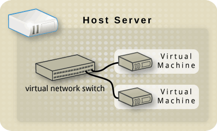
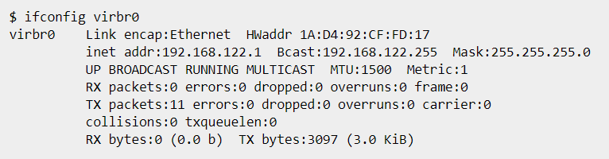
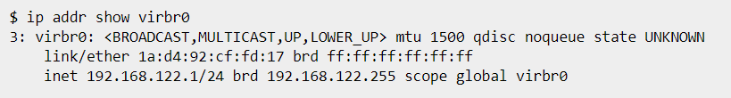
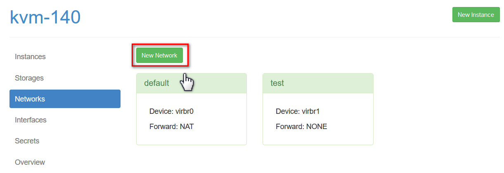

## 1 số chế độ mạng ảo với libvirt

### Giới thiệu

Mỗi máy ảo VM tạo ra cần được kết nối tới một mạng để liên lạc với các máy ảo khác, liên lạc với host hoặc ra ngoài Internet. Vì vậy, nhu cầu tạo ra các mạng phù hợp với yêu cầu kết nối của mỗi VM là cần thiết.

libvirt là thư viện các API tương tác và quản lý các hypervisor, trong đó hỗ trợ KVM. Và do đó, nó cũng sẽ có vai trò quản lý các mạng ảo trong host server.

Một số loại mạng ảo trong libvirt:

- Bridged network

- Routed network

- NAT-based network

- Isolated network

- Custom routed network

- Custom NAT-based network

- Multiple networks

Trong phần này mình sẽ chỉ tìm hiểu 4 chế độ mạng chính trong libvirt.

### Virtual network switch

Trước hết, libvirt sử dụng khái nhiệm là virtual network switch

Đây đơn giản là một phần mềm chạy trên host server, mà cho phép các máy ảo của bạn "cắm vào" (plug-in) và chuyển hướng lưu lượng.

Trên máy chủ Linux, virtual network switch được show lên như là một network interface.

Mặc định, khi libvirt được cài đặt và khởi động sẽ tạo một switch ảo có tên virbr0.

Nếu bạn quen thuộc với lệnh `ifconfig`, bạn có thể sử dụng lệnh đó để hiển thị:

hoặc nếu bạn quen thuộc hơn với lệnh `ip` thì thay vào đó, đây là giao diện:

1. Bridged network

Mạng bridged network chia sẻ 1 thiết bị Ethernet thật với các máy ảo VM. Mỗi VM ccó thể được gán trực tiếp bất kỳ địa chỉ IP trên mạng LAN, như 1 máy tính vật lý. Bridge cho hiệu năng mạng cao nhất và là kiểu mạng ít gây vấn đề nhất trong libvirt.

1.1. Hạn chế

- Libvirt server phải được kết nối trực tiếp tới LAN thông qua Ethernet. Nếu nó được kết nối không dây, thì nên sử dụng mạng Routed network hoặc NAT-based network.

- Hạn chế cho các server chuyên dụng.

- Yêu cầu phải đủ địa chỉ IPv4 cung cấp cho các máy ảo.

- Các nhà cung cấp thường chỉ cho phép các địa chỉ MAC gán tới địa chỉ IP trong mạng LAN. Nếu nhà cung cấp của bạn cho phép bạn thuê VLAN private mà cho phép kết nối trực tiếp tới địa chỉ IP, nhưng nếu điều này quá tốn thì cân nhắc tới mạng Routed network.

1.2. Cấu hình tạo mạng bridged network

Sử dụng virt-manager, hoặc webvirtmgr hoặc dùng file xml để tạo một mạng bridged network.

Mạng bridged network yêu cầu phải tạo trước 1 switch ảo để có thể bridging vào. Do đó, đầu tiên phải tạo bridge trước (ở đây sử dụng linux bridge)

`brctl addbr bridge`

#### Tạo từ webvirtmgr:

Làm theo các bước sau:

