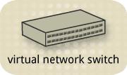
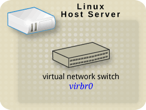
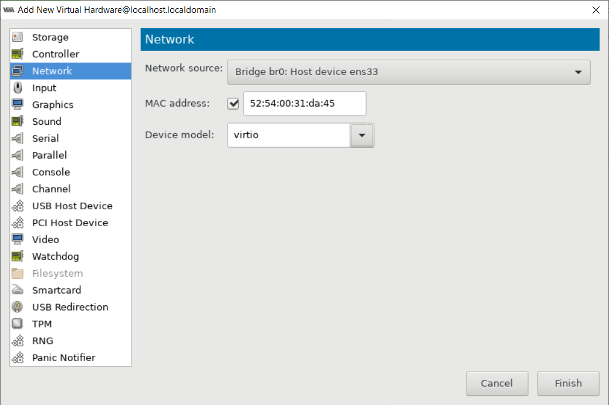

## 1 số chế độ mạng ảo với libvirt

### Giới thiệu

Mỗi máy ảo VM tạo ra cần được kết nối tới một mạng để liên lạc với các máy ảo khác, liên lạc với host hoặc ra ngoài Internet. Vì vậy, nhu cầu tạo ra các mạng phù hợp với yêu cầu kết nối của mỗi VM là cần thiết.

libvirt là thư viện các API tương tác và quản lý các hypervisor, trong đó hỗ trợ KVM. Và do đó, nó cũng sẽ có vai trò quản lý các mạng ảo trong host server.

Một số loại mạng ảo trong libvirt:

- Bridged network

- Routed network

- NAT-based network

- Isolated network

- Custom routed network

- Custom NAT-based network

- Multiple networks

Trong phần này mình sẽ chỉ tìm hiểu 4 chế độ mạng chính trong libvirt.

### Virtual network switch

Trước hết, libvirt sử dụng khái nhiệm là virtual network switch



Đây đơn giản là một phần mềm chạy trên host server, mà cho phép các máy ảo của bạn "cắm vào" (plug-in) và chuyển hướng lưu lượng.


Trên máy chủ Linux, virtual network switch được show lên như là một network interface.

Mặc định, khi libvirt được cài đặt và khởi động sẽ tạo một switch ảo có tên virbr0.



Nếu bạn quen thuộc với lệnh `ifconfig`, bạn có thể sử dụng lệnh đó để hiển thị:


hoặc nếu bạn quen thuộc hơn với lệnh `ip` thì thay vào đó, đây là giao diện:


1. Bridged network

Mạng bridged network chia sẻ 1 thiết bị Ethernet thật với các máy ảo VM. Mỗi VM ccó thể được gán trực tiếp bất kỳ địa chỉ IP trên mạng LAN, như 1 máy tính vật lý. Bridge cho hiệu năng mạng cao nhất và là kiểu mạng ít gây vấn đề nhất trong libvirt.

1.1. Hạn chế

- Libvirt server phải được kết nối trực tiếp tới LAN thông qua Ethernet. Nếu nó được kết nối không dây, thì nên sử dụng mạng Routed network hoặc NAT-based network.

- Hạn chế cho các server chuyên dụng.

- Yêu cầu phải đủ địa chỉ IPv4 cung cấp cho các máy ảo.

- Các nhà cung cấp thường chỉ cho phép các địa chỉ MAC gán tới địa chỉ IP trong mạng LAN. Nếu nhà cung cấp của bạn cho phép bạn thuê VLAN private mà cho phép kết nối trực tiếp tới địa chỉ IP, nhưng nếu điều này quá tốn thì cân nhắc tới mạng Routed network.

1.2. Cấu hình tạo mạng bridged network

Sử dụng virt-manager, hoặc webvirtmgr hoặc dùng file xml để tạo một mạng bridged network.

Mạng bridged network yêu cầu phải tạo trước 1 switch ảo để có thể bridging vào. Do đó, đầu tiên phải tạo bridge trước (ở đây sử dụng linux bridge)

`brctl addbr bridge`

#### Tạo từ webvirtmgr:

Làm theo các bước sau:


#### Tạo từ file xml:

Vào thư mục `/etc/libvirt/qemu/networks/` tạo file mạng bridge.xml có nội dung như sau: (ví dụ tạo mạng có tên bridge)

```
<network>
  <name>bridge</name>
  <uuid>bd3974f3-71d8-480c-9575-bab8b9afa9fb</uuid>
  <forward mode='bridge'/>
  <bridge name='bridge'/>
</network>
```

Sau đó, dùng các câu lệnh sau để tạo mạng từ file bridge.xml:

```
virsh net-define bridge.xml
virsh net-autostart bridge
virsh net-start bridge
```

Được kết quả như sau là ok!


1.3. Cấu hình máy ảo

Máy ảo VM muốn kết nối tới một mạng Bridged network thì chỉnh sửa cấu hình trong file xml như sau:

```
<interface type='bridge'>
  <mac address='52:54:00:81:5d:fe'/>
  <source bridge='br0'/>
  <model type='virtio'/>
  <address type='pci' domain='0x0000' bus='0x00' slot='0x03' function='0x0'/>
</interface>
```

hoặc chỉnh sủa với `virt-manager`:

Chọn máy ảo rồi chọn `Edit` >> `Virtual Machine Details`, chọn `View` >> `Details` rồi add thêm như sau



- Khi đó, máy ảo sẽ được kết nối thông qua bridge `bridge` như mạng cắm vào switch ở ngoài thực tế.

- Khởi động lại máy ảo.

- Khi đó, máy ảo sẽ có địa chỉ IP cùng dải mạng LAN vật lý kết nối host server.

2. Routed network

- Với Routed mode, virtual switch được kết nối tới mạng LAN vật lý của máy chủ, các lưu lượng của máy ảo guest sẽ được xử lý ra ngoài mà không thông qua NAT.

- Virtual switch sẽ thấy được IP trong mỗi gói tin, sử dụng thông tin đó để quyết định sẽ làm gì với nó.

- Trong chế độ này, tất cả máy ảo VM trong cùng một mạng con được định tuyến thông qua virtual switch. Tuy không máy ảo nào trong mạng vật lý biết sự tồn tại của mạng con này hoặc làm sao để tìm được ra nó. Đây là điều cần thiết để cấu hình định tuyến trong mạng vật lý (ví dụ sử dụng định tuyến tĩnh)


2.1. Cấu hình mạng Routed network

#### Tạo với webvirtmgr

Chọn chế độ mạng là route, và cấu hình IP như hình:


#### Tạo bằng virt-manager:

Chọn `Edit` >> `Connection Details`


#### Tạo từ file xml

Tạo file route.xml trong thư mục `/etc/libvirt/qemu/networks/` có nội dung như sau:

```
<network>
  <name>route</name>
  <uuid>5e275ec6-5c18-4397-a77d-c2b152b4715a</uuid>
  <forward dev='ens33' mode='route'>
    <interface dev='ens33'/>
  </forward>
  <bridge name='virbr1' stp='on' delay='0'/>
  <mac address='52:54:00:91:3c:9e'/>
  <domain name='route'/>
  <ip address='192.168.1.225' netmask='255.255.255.224'>
    <dhcp>
      <range start='192.168.1.240' end='192.168.1.254'/>
    </dhcp>
  </ip>
</network>
```

Sau đó dùng 3 câu lệnh virsh ở trên để tạo và khởi động mạng hoạt động.

> Lưu ý: Khi sử dụng mạng routed network, thì bạn có thể chọn routed tới card mạng không dây. (wlan)

2.2. Cấu hình máy ảo

Sửa lại cấu hình section `<interface>` trong file cấu hình xml của máy ảo sử dụng mạng route network như sau:

```
<interface type='network'>
  <mac address='02:55:66:f1:6b:4f'/>
  <source network='route'/>
  <model type='rtl8139'/>
  <address type='pci' domain='0x0000' bus='0x00' slot='0x03' function='0x0'/>
</interface>
```

2.3. Cấu hình định tuyến tĩnh tại router

- Tại router: thêm một đường định tuyến để các thiết bị trong mạng LAN có thể liên lạc được với máy ảo:

(ví dụ đang sử dụng router tenda, chỉ hỗ trợ định tuyến tĩnh cụ thể từng địa chỉ mạng nên thao tác thêm định tuyến như sau. Có thể một số router khác có thể thêm định tuyến cả vùng địa chỉ)


Sau đó, máy ảo sử dụng mạng routed network có địa chỉ IP 192.168.1.244 có thể liên lạc ra ngoài.

3. NAT-based network

Mặc định, một switch mạng ảo vận hành trong chế độ NAT mode (sử dụng IP masquerading hơn là SNAT hoặc DNAT)

Điều này có nghĩa là bất kì máy ảo nào được kết nối tới nó, sử sử dụng địa chỉ IP của máy host để liên lạc ra bên ngoài. Các máy ở mạng ngoài không thể liên lạc với máy guest ở bên trong khi swtich ảo hoạt động trong chế độ NAT.


Chế độ NAT-based network coi libvirt server như là một router, các lưu lượng của máy ảo xuất hiện từ địa chỉ của server để ra ngoài.

Đây là chế độ hoạt động mặc định khi cài đặt libvirt và bạn không cần cấu hình gì thêm.

Hạn chế: Virtual network mặc định hoạt động ở chế độ NAT-based. Không may, nó thường tự động thêm các rule iptable cho dù bạn có muốn hay không trừ khi bạn disable mạng default hoàn toàn. NAT được thiết lập bằng các quy tắc iptables. Hãy cẩn thận nếu bạn thay đổi những điều này trong khi switch ảo đang chạy. Nếu xảy ra sự cố với các quy tắc iptables, các máy ảo của bạn có thể bị ngừng liên lạc.


Để tạo mạng NAT-based network có thể sử dụng 3 công cụ như các cách đã nêu trên,chọn mode="nat" và cấp phát dải ip tùy ý.


Cấu hình máy ảo cũng tương tự như trình bày trên.

hoặc dùng `virt-manager`:


#### DNS & DHCP

Mỗi switch ảo có thể được cung cấp một loạt địa chỉ IP, để cung cấp cho các máy khách thông qua DHCP.

Libvirt sử dụng một chương trình, **dnsmasq**, cho việc này. Một phiên bản của dnsmasq được tự động cấu hình và bắt đầu bằng libvirt cho mỗi switch mạng ảo cần nó.


4. Isolated network

Trong mode này, các máy guest kết nối tới switch ảo có thể liên lạc với nhau và với host, nhưng lưu lượng của chúng sẽ không được đi ra ngoài host – cũng như không thể nhận các kết nối từ bên ngoài vào:


Việc sử dụng dnsmasq trong mode này là có thể và thực tế vì nó được sử dụng để trả lời cho DHCP request. Tuy nhiên, ngay cả khi mạng này được cách ly với bất kỳ mạng vật lý nào, vấn đề DNS name vẫn được giải quyết. Do đó, người ta có thể rơi vào tình huống DNS được giải quyết nhưng các máy khách không thể ping.

Việc cấu hình và tạo mạng isolate sẽ tự tạo thêm bridge ảo mới cho mạng. không cần tạo trước như mạng bridge network.


Việc cấu hình cho máy ảo và cấu hình tạo mạng cũng tương tự như các loại mạng đã kể trên, thay mode=isolate trong section forward của file xml cấu hình mạng

hoặc dùng `virt-manager`:


### Tổng kết

Nếu bạn đã quen với các netmowrk mode Vmware thì có thể hình dung như sau:

Mạng bridged network và routed network giống như chế độ mạng bridge của Vmware. Trong đó, bridge phải tạo bridge trước khi gán vào mạng bridge network và dùng trong trường hợp nối ra một card mạng của host là card ethernet. Còn mạng routed network hoạt động thêm tính năng là chia mạng con CIDR và dùng trong trường hợp nối với một card mạng của host là card wireless, và cần phải cấu hình tại router vật lý để định tuyến tĩnh cho mạng.

Mạng NAT-based network giống như chế độ mạng NAT của Vmware. (và là chế độ mạng mặc định của libvirt, sử dụng iptables để hoạt động)

Mạng isolated network giống như mạng host-only trong Vmware.

Các siwtch ảo tạo ra gán với mạng là các switch kiểu linux bridge, nên có thể dùng câu lệnh `brctl` để kiểm tra.