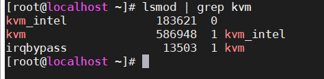
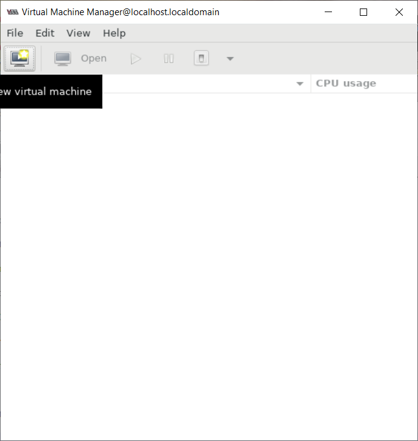
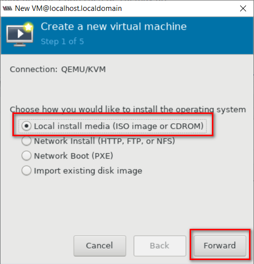
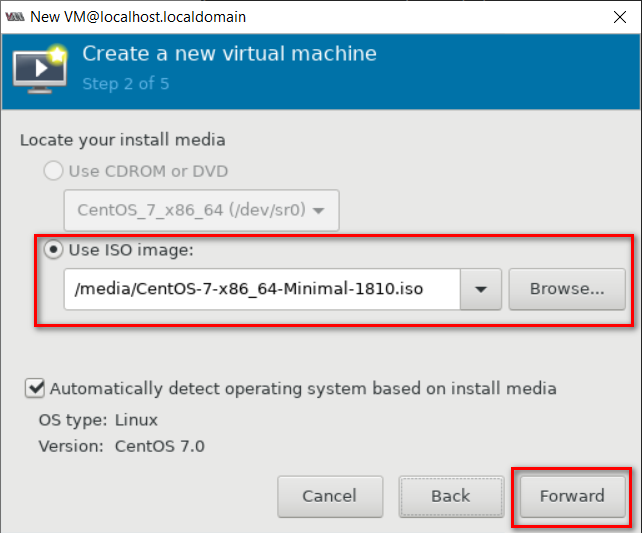
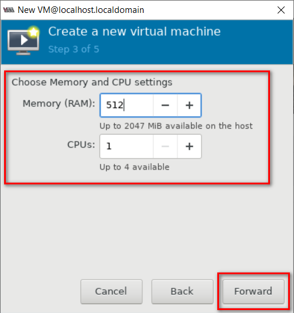
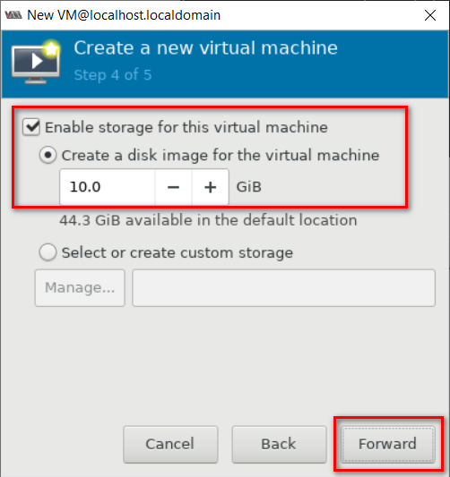
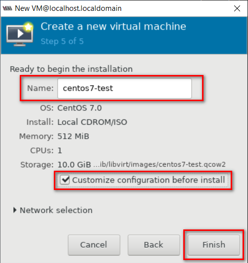
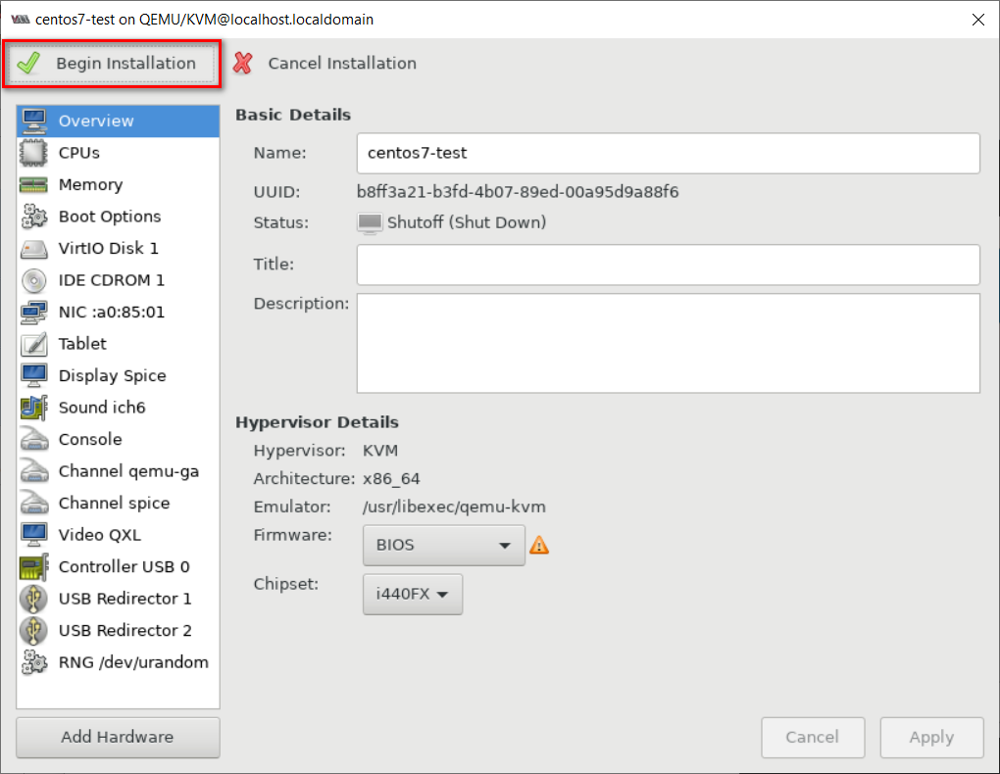

## Cài đặt KVM

Để cài đặt và chạy KVM, CPU của máy phải hỗ trợ ảo hoá phần cứng Intel VT-x hoặc AMD-V. Để xác định CPU có những tính năng này không, thực hiện lệnh sau:

`grep -E '(vmx|svm)' /proc/cpuinfo`

Giá trị trả về nếu có "vmx" hoặc "svm" nghĩa là CPU hỗ trợ ảo hoá phần cứng. Người dùng có thể vẫn phải kích hoạt chức năng hỗ trợ ảo hoá phần cứng trong BIOS của máy kể cả khi câu lệnh này trả về giá trị trên.

### Cài đặt KVM cà các package phụ thuộc:

`yum install -y qemu-kvm libvirt bridge-utils virt-manager qemu-img libvirt-python libvirt-client virt-install virt-viewer`

Trong đó:

	- qemu-kvm: trình giả lập QEMU
	
	- qemu-img: Trình quản lý disk image QEMU
	
	- virt-install: Công cụ dòng lệnh để tạo máy ảo
	
	- libvirt: Cung cấp trình nền libvirtd quản lý các máy ảo và điều khiển hypervisor
	
	- libvirt-client: Cung cấp API phía máy khách để truy cập máy chủ và cũng cung cấp tiện ích virsh cung cấp công cụ dòng lệnh để quản lý các máy ảo
	
	- virt-viewer:  Bảng điều khiển đồ họa

### Start và enable the libvirtd service:

```
systemctl start libvirtd
systemctl enable libvirtd
```

### Kiểm tra để chắc chắn rằng các modules của KVM đã được load vào kernel bằng lệnh:

`lsmod | grep kvm`



>Lưu ý: Nếu có một vài lỗi xảy ra ở đây, không khởi động được `virt-manager` thì thực hiện như sau:

Chỉnh sửa file `/etc/ssh/sshd_config`:

```
AddressFamily inet
...
X11UseLocalhost no
```

Restart sshd service:

`systemctl restart sshd`

### Configure Bridge Interface:

Trước khi bắt đầu tạo VM, trước tiên hãy tạo bridge interface, nó là bắt buộc nếu bạn muốn truy cập các máy ảo từ bên ngoài mạng của bạn.

`cp /etc/sysconfig/network-scripts/ifcfg-ens33 /etc/sysconfig/network-scripts/ifcfg-br0`

Chỉnh sửa các file như bên dưới:

```
vi ifcfg-ens33
TYPE=Ethernet
BOOTPROTO=static
DEVICE=ens33
ONBOOT=yes
BRIDGE=br0
```

```
vi ifcfg-br0
TYPE=Bridge
BOOTPROTO=static
DEVICE=br0
ONBOOT=yes
IPADDR=ip_vm
NETMASK=255.255.255.0
GATEWAY=ip_gateway
DNS1=8.8.8.8
```

>Lưu ý về tên các card mạng cho chính xác.

Khởi động lại network service:

`systemctl restart network`

Kiểm tra Bridge interface bằng lệnh bên dưới:

`ip addr show br0`

### Bắt đầu tạo máy ảo:

- Sử dụng `virt-manager`:

`virt-manager`

Sau khi câu lệnh trên được thực hiện sẽ hiện ra giao diện của virt-manager



Bấm `Create a new virtual machine` hoặc `File` -> `New Virtual Machine` để tạo 1 máy ảo mới

Sau đó chọn file cài đặt, có các cách sau:

	- Local install media: cài đặt từ file iso
	
	- Import existing disk image: cài đặt từ file image
	
	- còn lại là cài từ mạng ngoài



Ở đây, tôi chọn kiểu cài file ISO, chọn Browse để tìm các file ISO có sẵn trên máy (tải file iso về trước khi tạo máy ảo)



Chọn RAM và CPU:



Chọn dung lượng ổ đĩa:



Đặt tên cho máy ảo và chọn vào ô `Customize configuration before install` nếu muốn xem lại hoặc thay đổi các cấu hình trước khi bắt đầu OS



Chọn `Begin Installation` để bắt đầu tạo máy ảo, đợi một lúc cho nó khởi động lên:



Sau đó tiến hành cài đặt như bình thường.

- Sử dụng `virt-install`:

Không giống như virt-manager, virt-install là một công cụ dòng lệnh cho phép người dùng có thể tạo ta các KVM guest

	- Tạo máy ảo bằng file iso:
	
	```
	virt-install \
	--virt-type kvm \
	--os-type linux \
	--os-variant rhel7 \
	--name centos7-test2 \
	--memory=512 \
	--vcpus=1 \
	--cdrom=/media/CentOS-7-x86_64-Minimal-1810.iso \
	--network=bridge=br0,model=virtio \
	--graphics vnc \
	--disk path=/var/lib/libvirt/images/centos7.qcow2,size=10,bus=virtio,format=qcow2 \
	--hvm
	```
	
	trong đó:
	
	- virt-install : Câu lệnh thực hiện gọi chức năng virt-install (required)
	
	- virt-type: kvm (option)
	
	- os-type: linux (option)
	
	- os-variant: centos7 (option)
	
	- name: khai báo tên cho VM (required)
	
	- ram: khai báo ram (Mb) cung cấp cho VM (required)
	
	- vcpus: khai báo số lượng cpu ảo cung cấp cho VM (required)
	
	- cdrom: khai báo đường dẫn chứa file cài đặt hđh `(*.iso)` (required)
	
	- network: khai báo card mạng cho VM
	
	- model: interface model được cấu hình cho virtio
	
	- graphics: khai báo giao diện
	
	- disk path: khai báo đường dẫn file storage của VM
	
	- size: kích cỡ file storage của VM (Gb)
	
	- bus: sử dụng virtio cho disk bus
	
	- format: định dạng cho file storage
	
	- hvm: sử dụng full virtualization

Sau đó tiến hành cài đặt như bình thường.

	- Tạo máy ảo bằng file image:
	
	Tải file image (tương tự như file ghost) để vào thư mục `/var/lib/libvirt/images/`
	
	```
	cd /var/lib/libvirt/images/
	wget http://cloud.centos.org/centos/7/images/CentOS-7-x86_64-GenericCloud.qcow2
	```
	
	Tạo máy ảo:
	
	```
	virt-install \
	--virt-type kvm \
	--os-type linux \
	--os-variant rhel7 \
	--name centos7-test3 \
	--memory=512 \
	--vcpus=1 \
	--disk /path=/var/lib/libvirt/images/CentOS-7-x86_64-GenericCloud.qcow2,bus=virtio \
	--import \
	--network bridge=br0,model=virtio \
	--graphics vnc \
	--hvm
	```
	 
	- Tạo máy ảo bằng cách tải trực tiếp các gói trên mạng về rồi cài đặt:
	
	```
	--virt-type kvm \
	--os-type linux \
	--os-variant centos7 \
	--name centos7-test4 \
	--memory=512 \
	--vcpus=1 \
	--disk path=/var/lib/libvirt/images/centos7-test4.qcow2,size=10,format=qcow2 \
	--location http://example.com/path/to/os \
	--network bridge=br0
	```
	
	trong đó:
	
	- location: chỉ đường link để download các file cài đặt về.

Sau đó sẽ hiện lên giao diện cài đặt bình thường như cài đặt một hệ điều hành, các bước tương tự.