## Cài đặt Webvirtmgr trên CentOS 7

Webvirtmgr là một trong những công cụ quản lý máy ảo KVM. Nó có chức năng gần giống với virt-manager khi có thể kết nối đến nhiều host KVM để có thể quản lý tập trung các VM trên các máy đó. Nhưng nó có một ưu điểm đặc biệt hơn so với virt-manager đó là với virt-manager đó là ta chỉ có thể làm việc tại máy cài virt-manager. Còn với Webvirtmgr ta có thể làm việc với các VM ở bất kỳ đâu có internet.

### Chuẩn bị

- 1 máy cài đặt hđh CentOS 7 có cấu hình tối thiểu 1 CPU, 1 GB RAM và có 1 card mạng.

- Ít nhất 1 máy CentOS 7 đã cài đặt KVM để kiểm tra lại webvirtmgr đã hoạt động.

### Server cài Webvirtmgr

- Disable SE Linux và firewall:

```
sed -i 's/^SELINUX=.*/\SELINUX=disabled/' /etc/selinux/config
systemctl stop firewalld
systemctl disable firewalld
```

reboot lại server

- Cài một số gói cần thiết:

```
yum install -y epel-release
yum install -y git python-pip libvirt-python libxml2-python python-websockify supervisor nginx
yum install -y gcc python-devel
pip install --upgrade pip
pip install numpy
```

- Clone Webvirtmgr từ GitHub và cài đặt:

```
git clone git://github.com/retspen/webvirtmgr.git
cd webvirtmgr
pip install -r requirements.txt
```

- Sau đó ta chạy lệnh để thiết lập môi trường Django và tạo ra một tài khoản để đăng nhập Webvirtmgr:

`./manage.py syncdb`

- Sau đó tiếp tục chạy lệnh:

`./manage.py collectstatic`

- Adding additional superusers:

`./manage.py createsuperuser`

- Move thư mục `webvirtmgr` vào trong thư mục `/var/www`:

```
mkdir /var/www
cd ../
mv webvirtmgr /var/www/
```

- Mở file `webvirtmgr.conf` (ban đầu file này chưa tồn tại câu lệnh bên dưới cũng tiến hành tạo file):

`vi /etc/nginx/conf.d/webvirtmgr.conf`

- Thêm vào file những dòng như sau:

```
server {
    listen 80 default_server;

    server_name $hostname;
    #access_log /var/log/nginx/webvirtmgr_access_log; 

    location /static/ {
        root /var/www/webvirtmgr/webvirtmgr; # or /srv instead of /var
        expires max;
    }

    location / {
        proxy_pass http://127.0.0.1:8000;
        proxy_set_header X-Real-IP $remote_addr;
        proxy_set_header X-Forwarded-for $proxy_add_x_forwarded_for;
        proxy_set_header Host $host:$server_port;
        proxy_set_header X-Forwarded-Proto $scheme;
        proxy_connect_timeout 600;
        proxy_read_timeout 600;
        proxy_send_timeout 600;
        client_max_body_size 1024M; # Set higher depending on your needs 
    }
}
```

- Vào file `/etc/nginx/nginx.conf`:

`vi /etc/nginx/nginx.conf`

Comment lại những dòng sau:

```
#    server {
#        listen       80 default_server;
#        listen       [::]:80 default_server;
#        server_name  _;
#        root         /usr/share/nginx/html;

        # Load configuration files for the default server block.
#        include /etc/nginx/default.d/*.conf;

#        location / {
#        }

#        error_page 404 /404.html;
#            location = /40x.html {
#        }

#        error_page 500 502 503 504 /50x.html;
#            location = /50x.html {
#        }
#    }
```

- Restart và enable nginx:

```
systemctl restart nginx
systemctl enable nginx
```

- Cấp quyền cho người dùng:

`chown -R nginx:nginx /var/www/webvirtmgr`

- Mở file `webvirtmgr.ini` (file này ban đầu cũng chưa tồn tại)

`vi /etc/supervisord.d/webvirtmgr.ini`

- Thêm vào những dòng sau:

```
[program:webvirtmgr]
command=/usr/bin/python /var/www/webvirtmgr/manage.py run_gunicorn -c /var/www/webvirtmgr/conf/gunicorn.conf.py
directory=/var/www/webvirtmgr
autostart=true
autorestart=true
logfile=/var/log/supervisor/webvirtmgr.log
log_stderr=true
user=nginx

[program:webvirtmgr-console]
command=/usr/bin/python /var/www/webvirtmgr/console/webvirtmgr-console
directory=/var/www/webvirtmgr
autostart=true
autorestart=true
stdout_logfile=/var/log/supervisor/webvirtmgr-console.log
redirect_stderr=true
user=nginx
```

- Update:

```
cd /var/www/webvirtmgr
git pull
./manage.py collectstatic
systemctl restart supervisord
systemctl enable supervisord
```

Đến đây bạn đã cài đặt xong Webvirtmgr. Bạn mở trình duyệt và truy cập vào địa chỉ của server cài webvirtmgr. Kết quả như sau:

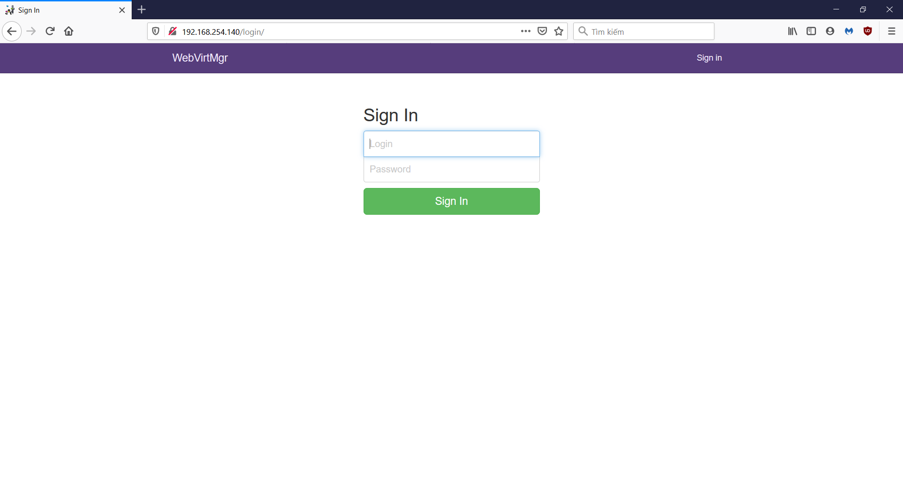

### Trên host cài đặt KVM

- Trước tiên cần cài gói libvirt (nếu đã cài đặt rồi thì có thể bỏ qua):

`yum install -y libvirt`

- Thực hiện lần lượt các lệnh sau:

```
sed -i 's/#listen_tls = 0/listen_tls = 0/g' /etc/libvirt/libvirtd.conf 
sed -i 's/#listen_tcp = 1/listen_tcp = 1/g' /etc/libvirt/libvirtd.conf
sed -i 's/#tcp_port = "16509"/tcp_port = "16509"/g' /etc/libvirt/libvirtd.conf
sed -i 's/#listen_addr = "192.168.0.1"/listen_addr = "0.0.0.0"/g' /etc/libvirt/libvirtd.conf
```

- Lưu ý nếu bạn không muốn xác thực trong quá trình kết nối qemu+tcp ta thực hiện lệnh sau (chỉ nên dùng trong môi trường lab):

`sed -i 's/#auth_tcp = "sasl"/auth_tcp = "none"/g' /etc/libvirt/libvirtd.conf`

- Tiếp tục thực hiện lệnh sau:

`sed -i 's/#LIBVIRTD_ARGS="--listen"/LIBVIRTD_ARGS="--listen"/g' /etc/sysconfig/libvirt`

- Sau đó tiến hành restart lại libvirtd:

`systemctl restart libvirtd`

### Sử dụng

Truy cập vào địa chỉ của server cài webvirt ta có giao diện như sau:


Ta dùng tài khoản ta tạo ở bên trên để đăng nhập vào. Để kết nối đến máy KVM click vào `Add connection`

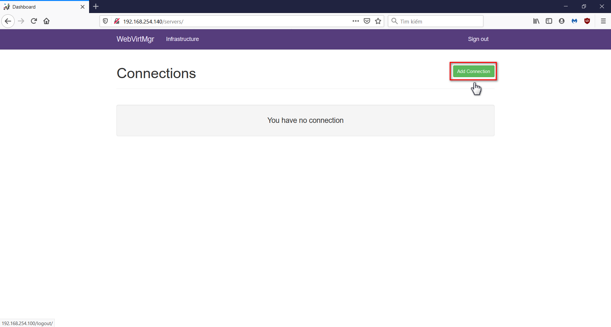

Điền các thông tin về KVM server muốn kết nối đến vào bảng. Tên đăng nhập và mật khẩu là tên username và mật khẩu bạn vừa tạo bên trên.

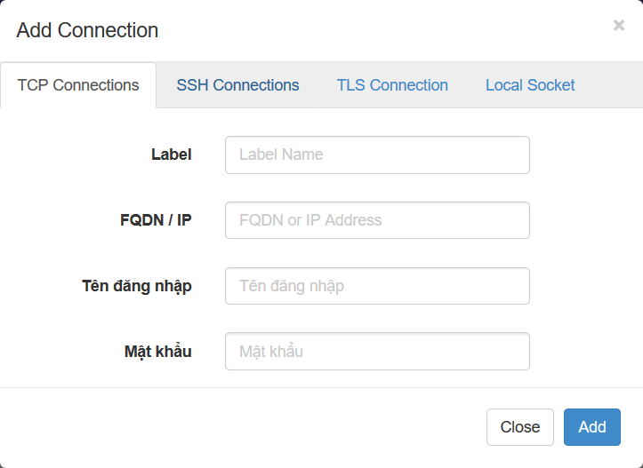

Kết nối thành công sẽ hiện lên giao diện như sau:

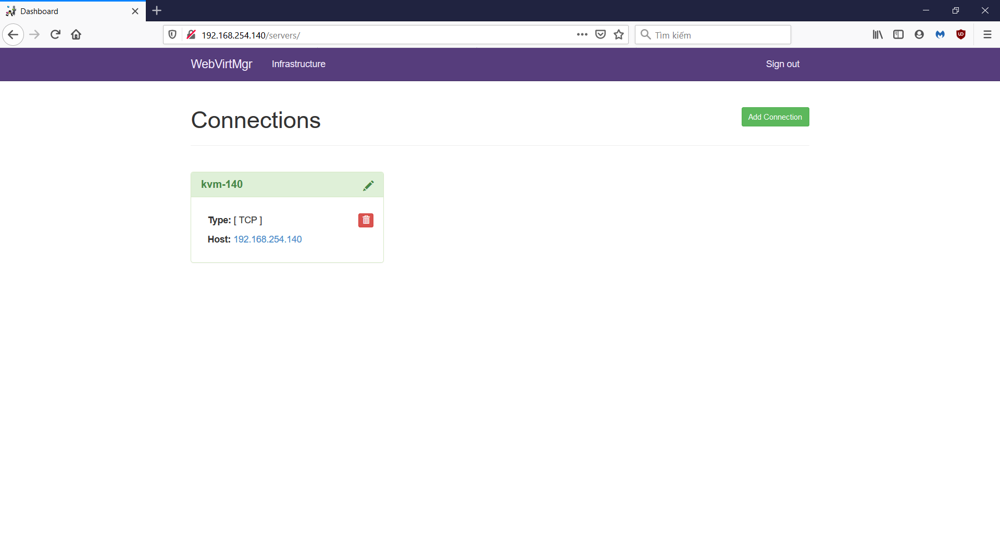

Sau đó bạn click vào kết nối đó chọn `Storages` sau đó là `New storages` để tạo vị trí lưu các file khi tạo máy ảo

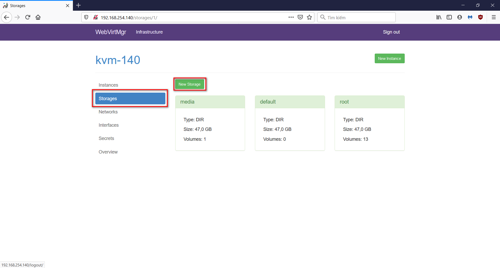

Bạn cũng có thể thiết lập mạng cho các VM bằng cách click vào `Networks`

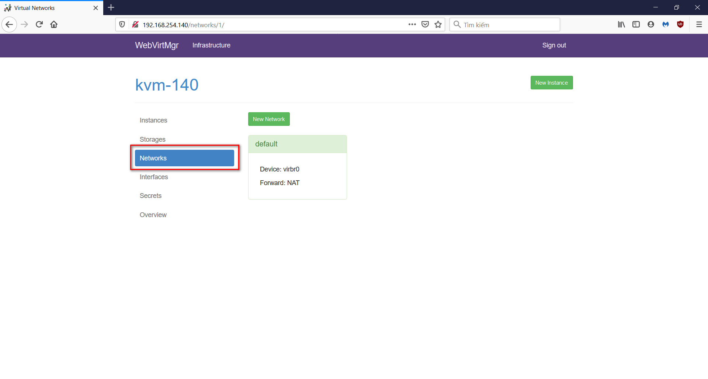

Để tạo VM trước tiên ta cần tạo cho VM đó 1 file image. Để tạo file nào ta vào `Storage` chọn vị trí lưu file image trong các thư mục ta vừa thêm ở bên trên sau đó chọn `Add image`

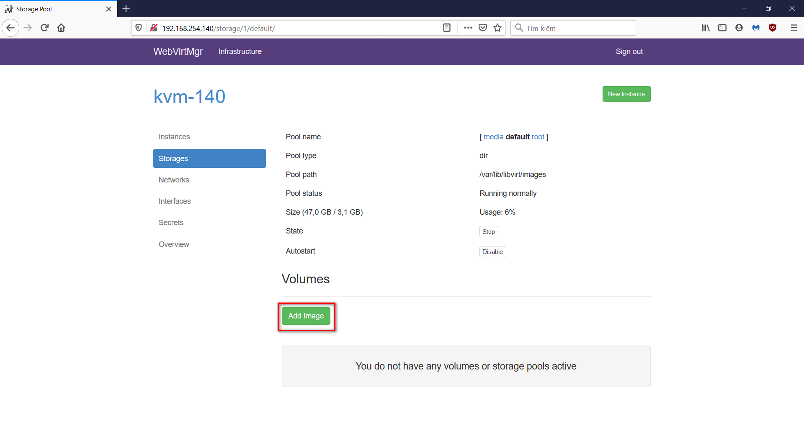

Chọn tên image, định dạng và dung lượng

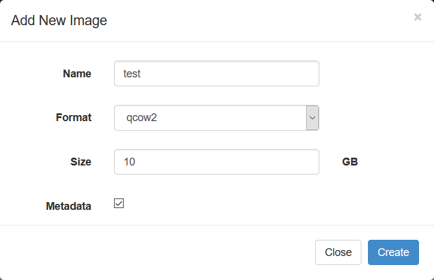

Chọn `New instance` để tạo VM

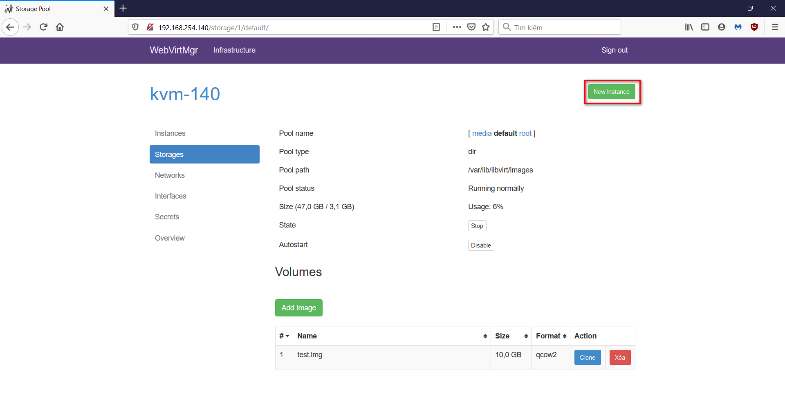

Chọn `Custom instance`

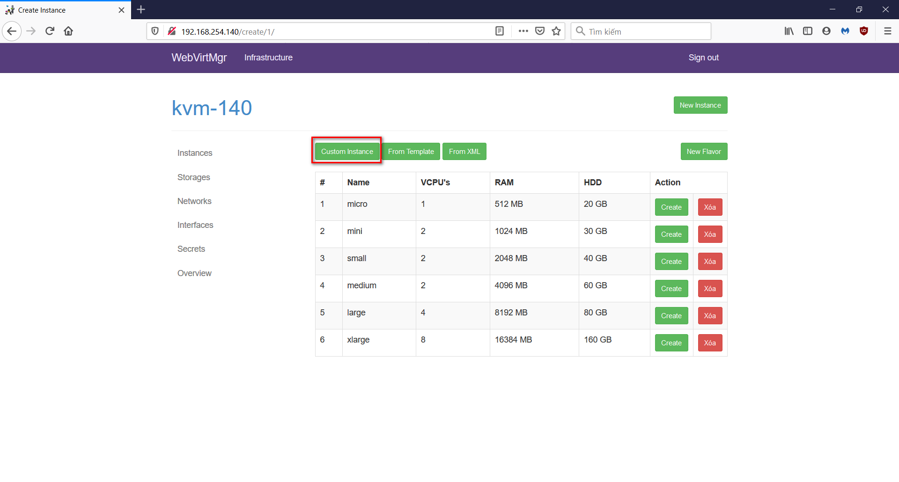

Chú ý các thông số tên VM, số vCPU, dung lượng RAM, HDD để chỉ ra file image của VM trỏ đến file vừa tạo, network để chọn mạng cho VM

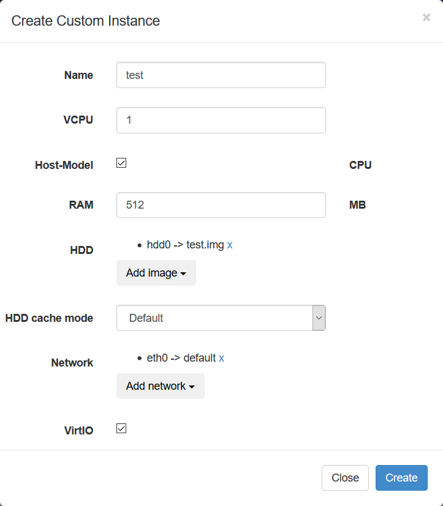

Chọn hệ điều hành cho VM bằng cách chỉ ra file ISO

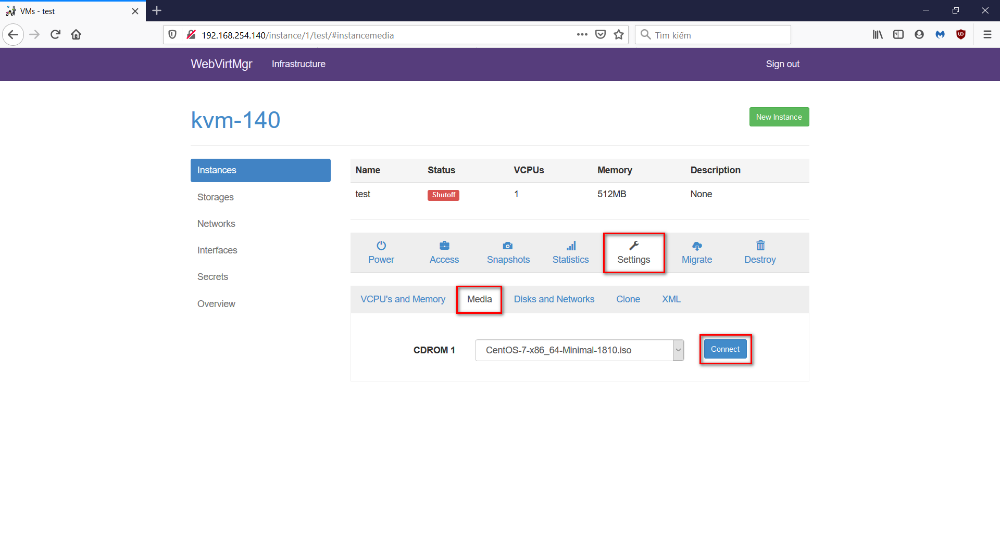

Start VM

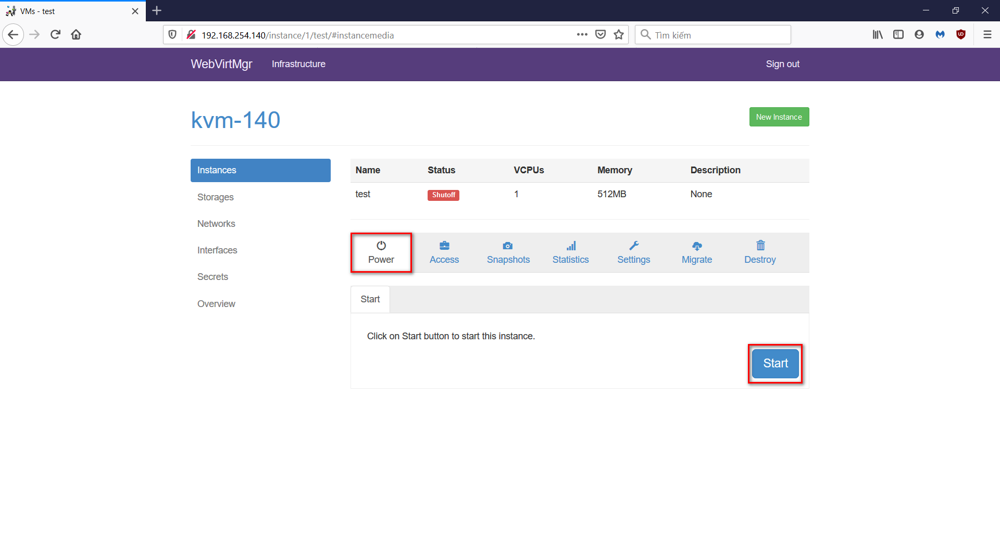

Để hiển thị màn hình VM click chọn `Access` -> `Console`

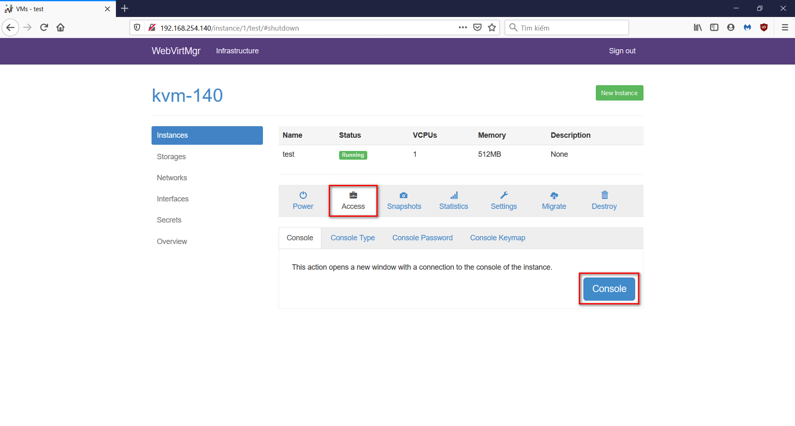

Snapshot máy ảo, trước hết ta càn shutdown VM

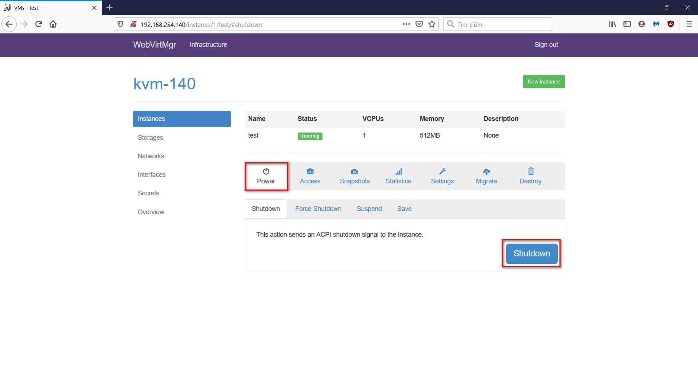

Chuyển sang tab `Snapshot`, đặt tên cho snapshot rồi bấm `Create Snapshot`

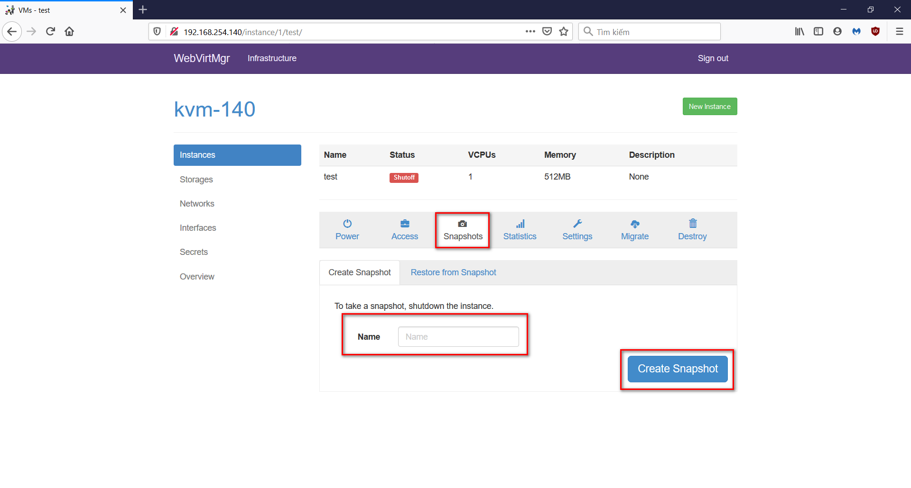

Delete máy ảo, chọn tab `Destroy`, tick vào ô `Delete HDD image` rôi chọn `Xóa`

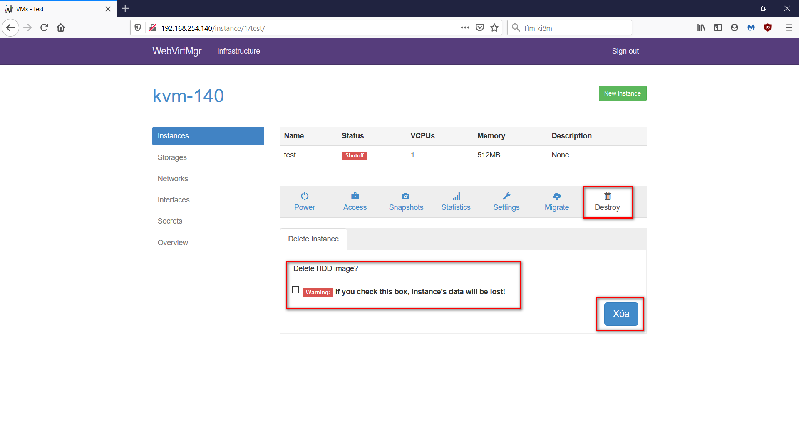