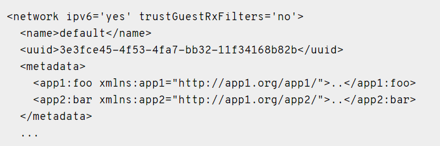
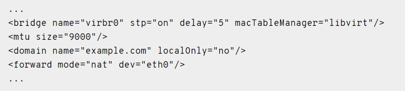
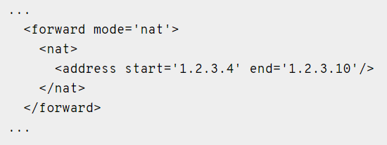
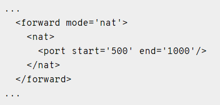
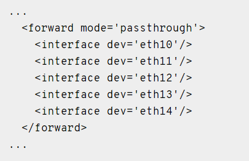
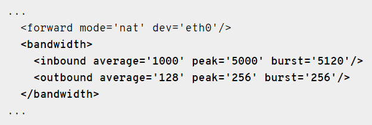

## File Network XML

Để có thể tạo ra 1 virtual network thì cần tạo ra 1 file xml cấu hình network

### Phần tử và thuộc tính tổng quan

Phần tử cần thiết cho tất cả các mạng ảo được đặt tên `network` và không có thuộc tính cấu hình

mặc dù kể từ 0.10.0, có một thuộc tính chỉ đọc tùy chọn - khi kiểm tra cấu hình trực tiếp của mạng, thuộc tính `connections`, nếu có, chỉ định số lượng guest interface hiện được kết nối qua mạng này

### metadata

Các yếu tố đầu tiên cung cấp metadata cơ bản về mạng ảo.



`name`: cung cấp một tên ngắn cho mạng ảo. Tên này chỉ bao gồm các ký tự chữ và số

`uuid`: cung cấp một định danh duy nhất toàn cầu cho mạng ảo. Định dạng phải tuân thủ RFC 4122

`ipv6`: khi được đặt thành `yes`, tham số tùy chọn `ipv6` cho phép định nghĩa mạng không có địa chỉ cổng IPv6 được chỉ định để liên lạc giữa các guest

`trustGuestRxFilters`: tham số tùy chọn `trustGuestRxFilters` có thể được sử dụng để đặt thuộc tính cùng tên cho mỗi domain interface được kết nối với mạng này

### Connectivity

Tập hợp các phần tử tiếp theo kiểm soát cách một mạng ảo được cung cấp kết nối với mạng LAN vật lý (nếu có).



`bridge`: xác định tên của một thiết bị bridge đó sẽ được sử dụng để xây dựng các mạng ảo. Các máy ảo sẽ được kết nối với thiết bị này cho phép chúng nói chuyện với nhau. Nó cũng có thể được kết nối với mạng LAN. Thuộc tính `stp` chỉ định nếu Spanning Tree Protocol là `on` hoặc `off` (mặc định là `off`). Thuộc tính `delay` đặt giá trị độ trễ chuyển tiếp của bridge trong vài giây (mặc định là 0)

`macTableManager`: thuộc tính của phần tử bridge được sử dụng để nói libvirt cách bảng địa chỉ MAC của bridge (dùng để xác định cổng ra chính xác cho các gói tin dựa trên địa chỉ MAC đích) sẽ được quản lý.

`zone`: thuộc tính tùy chọn của bridge được sử dụng để chỉ định vùng tường lửa cho bridge của mạng với chế độ forward như "nat", "route", "open" hoặc không có forward chỉ định

`mtu`: xác định Maximum Transmission Unit (MTU) cho mạng

`domain`: xác định miền DNS của máy chủ DHCP. Phần tử này là tùy chọn và chỉ được sử dụng cho các mạng có chế độ forward "nat" hoặc "route" (hoặc mạng bị cô lập không có forward). Nếu thuộc tính tùy chọn `localOnly` trên thành phần `domain` là `yes`, thì các DNS request trong miền này sẽ chỉ được giải quyết bởi máy chủ DNS của mạng ảo - chúng sẽ không được chuyển tiếp đến máy chủ DNS upstream của máy chủ. Nếu `localOnly` là `no` và theo mặc định, các yêu cầu chưa được giải quyết sẽ được chuyển tiếp

`forward`: cho biết rằng mạng ảo sẽ được kết nối với mạng LAN vật lý. Các thuộc tính `mode` quyết định phương pháp chuyển tiếp. Nếu không có phần tử `forward`, mạng sẽ được cách ly với bất kỳ mạng nào khác (tất nhiên trừ khi một guest được kết nối với mạng đó hoạt động như một bộ định tuyến. Sau đây là các cài đặt hợp lệ cho `mode`:

	- `nat`: Tất cả lưu lượng giữa khách được kết nối với mạng này và mạng vật lý sẽ được chuyển tiếp đến mạng vật lý thông qua ngăn định tuyến IP của máy chủ, sau đó địa chỉ IP của guest được nat thành địa chỉ IP công cộng của máy chủ
	
	
	
	Một địa chỉ IPv4 có thể được đặt bằng cách đặt các thuộc tính `start` và `end` cho cùng một giá trị.
	
	Phạm vi cổng được sử dụng cho `nat` có thể được đặt thông qua phần phụ `port`:
	
	
	
	- `route`: Lưu lượng truy cập mạng của khách sẽ được chuyển tiếp đến mạng vật lý thông qua ngăn định tuyến IP của máy chủ, nhưng không áp dụng NAT.
	
	- `open`: Cũng như mode = `route`, lưu lượng truy cập mạng của khách sẽ được chuyển tiếp đến mạng vật lý thông qua ngăn định tuyến IP của máy chủ, nhưng sẽ không có quy tắc tường lửa nào được thêm vào để kích hoạt hoặc ngăn chặn bất kỳ lưu lượng nào trong số này.
	
	- `bridge`: Mạng này được mô tả là  một host bridge đã được cấu hình bên ngoài của libvirt
	
	- `private`
	
	- `vepa`
	
	- `passthrough`
	
	- `hostdev`

một phần tử `forward` có thể có nhiều phần tử con `interface`, mỗi phần tử đặt tên của giao diện vật lý có thể được sử dụng cho mạng này



### Quality of service



Phần tử `bandwidth` cho phép thiết lập chất lượng dịch vụ cho một mạng cụ thể. Thiết lập `bandwidth` cho một mạng chỉ được hỗ trợ cho các mạng với phương thức `forward` như `route`, `nat` hoặc không có chế độ gì cả (tức là một mạng "cô lập"). Thiết lập `bandwidth` không được hỗ trợ `forward` với các chế độ `bridge`, `passthrough`, `private`, hoặc `hostdev`.

- `average`: Chỉ định tốc độ bit trung bình mong muốn cho giao diện được định hình (tính bằng kilobyte/giây).

- `peak`: Thuộc tính tùy chọn chỉ định tốc độ tối đa mà bridge có thể gửi dữ liệu (tính bằng kilobyte/giây). Lưu ý giới hạn triển khai: thuộc tính này trong `outbound` bị bỏ qua

- `burst`: Thuộc tính tùy chọn chỉ định số lượng kilobyte có thể được truyền trong một đợt duy nhất ở `peak` speed.

- `floor`: Thuộc tính tùy chọn chỉ có sẵn cho các phần tử `inbound`. Thuộc tính này đảm bảo thông lượng tối thiểu cho các giao diện hình.

### Host-only

Tạo 1 mạng host-only với file isolated.xml

```
<network>
<name>isolated</name>
</network>
```
