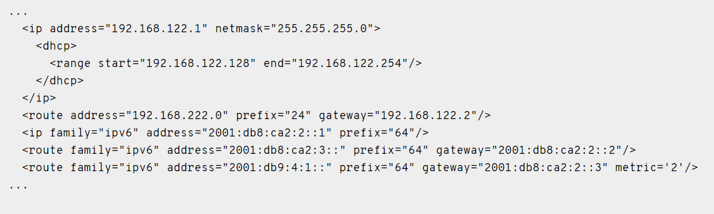
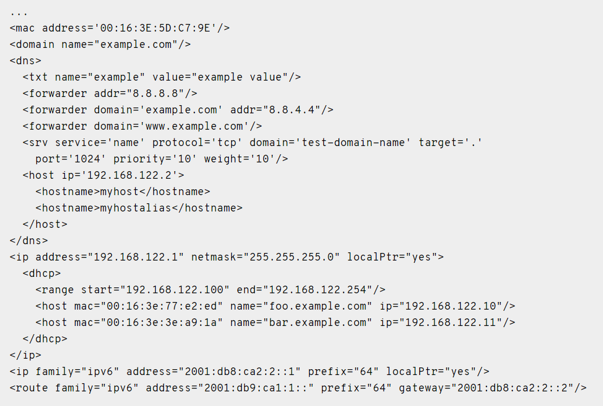
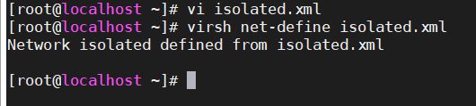
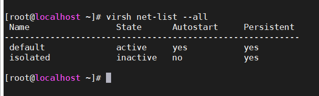
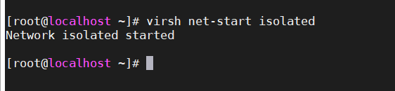

## File Network XML

Để có thể tạo ra 1 virtual network thì cần tạo ra 1 file xml cấu hình network

### Phần tử và thuộc tính tổng quan

Phần tử cần thiết cho tất cả các mạng ảo được đặt tên `network` và không có thuộc tính cấu hình

mặc dù kể từ 0.10.0, có một thuộc tính chỉ đọc tùy chọn - khi kiểm tra cấu hình trực tiếp của mạng, thuộc tính `connections`, nếu có, chỉ định số lượng guest interface hiện được kết nối qua mạng này

### metadata

Các yếu tố đầu tiên cung cấp metadata cơ bản về mạng ảo.


`name`: cung cấp một tên ngắn cho mạng ảo. Tên này chỉ bao gồm các ký tự chữ và số

`uuid`: cung cấp một định danh duy nhất toàn cầu cho mạng ảo. Định dạng phải tuân thủ RFC 4122

`ipv6`: khi được đặt thành `yes`, tham số tùy chọn `ipv6` cho phép định nghĩa mạng không có địa chỉ cổng IPv6 được chỉ định để liên lạc giữa các guest

`trustGuestRxFilters`: tham số tùy chọn `trustGuestRxFilters` có thể được sử dụng để đặt thuộc tính cùng tên cho mỗi domain interface được kết nối với mạng này

### Connectivity

Tập hợp các phần tử tiếp theo kiểm soát cách một mạng ảo được cung cấp kết nối với mạng LAN vật lý (nếu có).


`bridge`: xác định tên của một thiết bị bridge đó sẽ được sử dụng để xây dựng các mạng ảo. Các máy ảo sẽ được kết nối với thiết bị này cho phép chúng nói chuyện với nhau. Nó cũng có thể được kết nối với mạng LAN. Thuộc tính `stp` chỉ định nếu Spanning Tree Protocol là `on` hoặc `off` (mặc định là `off`). Thuộc tính `delay` đặt giá trị độ trễ chuyển tiếp của bridge trong vài giây (mặc định là 0)

`macTableManager`: thuộc tính của phần tử bridge được sử dụng để nói libvirt cách bảng địa chỉ MAC của bridge (dùng để xác định cổng ra chính xác cho các gói tin dựa trên địa chỉ MAC đích) sẽ được quản lý.

`zone`: thuộc tính tùy chọn của bridge được sử dụng để chỉ định vùng tường lửa cho bridge của mạng với chế độ forward như "nat", "route", "open" hoặc không có forward chỉ định

`mtu`: xác định Maximum Transmission Unit (MTU) cho mạng

`domain`: xác định miền DNS của máy chủ DHCP. Phần tử này là tùy chọn và chỉ được sử dụng cho các mạng có chế độ forward "nat" hoặc "route" (hoặc mạng bị cô lập không có forward). Nếu thuộc tính tùy chọn `localOnly` trên thành phần `domain` là `yes`, thì các DNS request trong miền này sẽ chỉ được giải quyết bởi máy chủ DNS của mạng ảo - chúng sẽ không được chuyển tiếp đến máy chủ DNS upstream của máy chủ. Nếu `localOnly` là `no` và theo mặc định, các yêu cầu chưa được giải quyết sẽ được chuyển tiếp

`forward`: cho biết rằng mạng ảo sẽ được kết nối với mạng LAN vật lý. Các thuộc tính `mode` quyết định phương pháp chuyển tiếp. Nếu không có phần tử `forward`, mạng sẽ được cách ly với bất kỳ mạng nào khác (tất nhiên trừ khi một guest được kết nối với mạng đó hoạt động như một bộ định tuyến. Sau đây là các cài đặt hợp lệ cho `mode`:

	- `nat`: Tất cả lưu lượng giữa khách được kết nối với mạng này và mạng vật lý sẽ được chuyển tiếp đến mạng vật lý thông qua ngăn định tuyến IP của máy chủ, sau đó địa chỉ IP của guest được nat thành địa chỉ IP công cộng của máy chủ
	
	
	
	Một địa chỉ IPv4 có thể được đặt bằng cách đặt các thuộc tính `start` và `end` cho cùng một giá trị.
	
	Phạm vi cổng được sử dụng cho `nat` có thể được đặt thông qua phần phụ `port`:
	
	
	
	- `route`: Lưu lượng truy cập mạng của khách sẽ được chuyển tiếp đến mạng vật lý thông qua ngăn định tuyến IP của máy chủ, nhưng không áp dụng NAT.
	
	- `open`: Cũng như mode = `route`, lưu lượng truy cập mạng của khách sẽ được chuyển tiếp đến mạng vật lý thông qua ngăn định tuyến IP của máy chủ, nhưng sẽ không có quy tắc tường lửa nào được thêm vào để kích hoạt hoặc ngăn chặn bất kỳ lưu lượng nào trong số này.
	
	- `bridge`: Mạng này được mô tả là  một host bridge đã được cấu hình bên ngoài của libvirt
	
	- `private`
	
	- `vepa`
	
	- `passthrough`
	
	- `hostdev`

một phần tử `forward` có thể có nhiều phần tử con `interface`, mỗi phần tử đặt tên của giao diện vật lý có thể được sử dụng cho mạng này


### Quality of service


Phần tử `bandwidth` cho phép thiết lập băng thông cho một mạng cụ thể. Thiết lập `bandwidth` cho một mạng chỉ được hỗ trợ cho các mạng với phương thức `forward` như `route`, `nat` hoặc không có chế độ gì cả (tức là một mạng "cô lập"). Thiết lập `bandwidth` không được hỗ trợ `forward` với các chế độ `bridge`, `passthrough`, `private`, hoặc `hostdev`.

- `average`: Chỉ định tốc độ bit trung bình mong muốn cho giao diện được định hình (tính bằng kilobyte/giây).

- `peak`: Thuộc tính tùy chọn chỉ định tốc độ tối đa mà bridge có thể gửi dữ liệu (tính bằng kilobyte/giây). Lưu ý giới hạn triển khai: thuộc tính này trong `outbound` bị bỏ qua

- `burst`: Thuộc tính tùy chọn chỉ định số lượng kilobyte có thể được truyền trong một đợt duy nhất ở `peak` speed.

- `floor`: Thuộc tính tùy chọn chỉ có sẵn cho các phần tử `inbound`. Thuộc tính này đảm bảo thông lượng tối thiểu cho các shaped interface. Tuy nhiên, điều này yêu cầu tất cả lưu lượng truy cập đều đi qua một điểm mà tại đó các quyết định QoS có thể diễn ra, do đó tại sao thuộc tính này chỉ hoạt động cho các mạng ảo (đó là `<interface type='network'/>` với forward type là route, nat hoặc no forward). Ngoài ra, mạng ảo mà interface được kết nối được yêu cầu phải có inbound QoS (tối thiểu là average)

### Static Route

được sử dụng để cung cấp thông tin định tuyến đến virtualization host cho các mạng không thể truy cập trực tiếp từ virtualization host, nhưng * có thể truy cập * từ một guest domain mà nó có thể truy cập được từ host



### Addressing

Tập hợp các phần tử cuối cùng xác định các địa chỉ (IPv4 và / hoặc IPv6, cũng như MAC) sẽ được gán cho thiết bị bridge được liên kết với mạng ảo và tùy chọn kích hoạt các dịch vụ DHCP. Các yếu tố này chỉ hợp lệ đối với các mạng bị cô lập (không có `forward` nào được chỉ định) và đối với các mạng có forward mode là 'route' hoặc 'nat'.



`mac`: `address` định nghĩa thuộc tính một địa chỉ MAC (phần cứng) được định dạng như 6 nhóm số thập lục phân 2 chữ số, các nhóm cách nhau bởi dấu hai chấm (ví dụ "52:54:00:1C:DA:2F"). Địa chỉ MAC này được gán cho thiết bị bridge khi nó được tạo

`dns`: Phần tử dns của mạng chứa thông tin cấu hình cho máy chủ DNS của mạng ảo. Các yếu tố phụ được hỗ trợ hiện tại của `<dns>` là:

	- `forwarder`: Mỗi phần tử `forwarder` xác định một máy chủ DNS thay thế để sử dụng cho một số hoặc tất cả các DNS request được gửi đến máy chủ DNS của mạng này. Có hai thuộc tính - `domain` và `addr`; ít nhất một trong số này phải được chỉ định trong bất kỳ `<forwarder>` nào
	
	- `txt`: `dns` có thể không có hoặc nhiều phần tử `txt`. Mỗi phần tử `txt` xác định một bản ghi TXT DNS và có hai thuộc tính, cả hai đều được yêu cầu: một tên có thể được truy vấn thông qua dns và một giá trị sẽ được trả về khi tên đó được truy vấn. Tên không thể chứa dấu cách hoặc dấu phẩy nhúng. Value là một chuỗi đơn có thể chứa nhiều giá trị được phân tách bằng dấu phẩy.
	
	- `host`: định nghĩa nhwũng máy nào được sử dụng dịch vụ dns. Địa chỉ IP được xác định bởi thuộc tính `ip` và tên của địa chỉ IP đó được xác định trong các thành phần phụ `hostname` phụ của thành phần `host`.
	
	- `srv`: `dns` cũng có thể không có hoặc nhiều bản ghi `srv`. Mỗi `srv` xác định bản ghi DNS SRV và có 2 thuộc tính bắt buộc và 5 thuộc tính tùy chọn. Các thuộc tính bắt buộc là dịch vụ `name` và `protocol` (tcp, udp) và các thuộc tính tùy chọn là `target`, `port`, `priority`, `weight` và `domain` theo quy định tại máy chủ DNS SRV RFC (RFC 2782).

`ip`: thuộc tính `address` xác định một địa chỉ IPv4 ở định dạng chấm thập phân, hoặc một địa chỉ IPv6 trong định dạng hexa tiêu chuẩn, mà sẽ được cấu hình trên thiết bị bridge gắn liền với mạng ảo.  Đối với địa chỉ IPv4, thuộc tính `netmask` xác định các bit quan trọng của địa chỉ mạng, một lần nữa được chỉ định ở định dạng thập phân rải rác. Đối với địa chỉ IPv6 và là phương thức thay thế cho địa chỉ IPv4, các bit quan trọng của địa chỉ mạng có thể được chỉ định bằng thuộc tính `prefix`, là một số nguyên (ví dụ, `netmask='255.255.255.0'` cũng có thể được cung cấp dưới dạng `prefix='24'`). Các thuộc tính `family` được sử dụng để xác định loại địa chỉ - `ipv4` hay `ipv6`; nếu `family` không được đưa ra, `ipv4` được giả định. Thuộc tính tùy chọn `localPtr` định cấu hình máy chủ DNS để không chuyển tiếp bất kỳ reverse DNS request nào cho địa chỉ IP từ mạng được định cấu hình bởi các thuộc tính `address` và `netmask`/`prefix`. `ip` có thể chứa các phần tử sau:

	- `tftp`:là 1 tùy chọn và thuộc tính `root` là bắt buộc của nó cho phép các dịch vụ TFTP. Thuộc tính chỉ định đường dẫn đến thư mục gốc được cung cấp qua TFTP. `tftp` không được hỗ trợ cho các địa chỉ IPv6 và chỉ có thể được chỉ định trên một địa chỉ IPv4 duy nhất trên mỗi mạng.
	
	- `dhcp`: cho phép các dịch vụ DHCP trên mạng ảo. `dhcp` được hỗ trợ cho cả IPv4 và IPv6, nhưng chỉ cho một địa chỉ IP của mỗi loại trên mỗi mạng. Các yếu tố phụ sau được hỗ trợ:
	
		- `range`: Các thuộc tính `start` và `end` trên thành phần `range` xác định ranh giới của một nhóm địa chỉ sẽ được cung cấp cho các máy khách DHCP. Hai địa chỉ này phải nằm trong phạm vi của mạng được xác định trên phần tử cha `ip`. Có thể không có hoặc nhiều yếu tố `range` được chỉ định.
		
		- `host`: `dhcp` có thể không có hoặc nhiều phần tử `host`. Chúng chỉ định các máy chủ sẽ được đặt tên và địa chỉ IP được xác định trước bởi máy chủ DHCP tích hợp. Bất kỳ phần tử IPv4 `host` nào cũng phải chỉ định địa chỉ MAC của máy chủ được gán tên đã cho (thông qua thuộc tính `mac`), IP được gán cho máy chủ đó (thông qua thuộc tính `ip`) và tên của chính nó (thuộc tính `name`). IPv6 `host` khác một chút so với IPv4: không có thuộc tính `mac` vì địa chỉ MAC không được xác định trong IPv6. Thay vào đó, thuộc tính `name` được sử dụng để xác định máy chủ được gán địa chỉ IPv6. Đối với DHCPv6, tên này là tên đơn giản của máy chủ khách được gửi bởi máy khách đến máy chủ.
		
		- `bootp`: Phần tử `bootp` là tùy chọn chỉ định các tùy chọn BOOTP được cung cấp bởi máy chủ DHCP chỉ cho IPv4. Hai thuộc tính được hỗ trợ: `file` là bắt buộc và cung cấp cho tệp được sử dụng cho boot image; `server` là tùy chọn và cung cấp địa chỉ của máy chủ TFTP từ đó boot image sẽ được tìm nạp. `server` mặc định cho cùng một host chạy máy chủ DHCP, như trường hợp phần tử `tftp` được sử dụng. Các tùy chọn BOOTP hiện tại phải giống nhau cho tất cả các phạm vi địa chỉ và địa chỉ được gán tĩnh.

### Host-only

- Tạo 1 mạng host-only với file isolated.xml

Biến thể này cung cấp một mạng riêng hoàn toàn biệt lập cho các máy guest. Chúng thể nói chuyện với nhau và HĐH máy chủ, nhưng không thể tiếp cận với bất kỳ máy nào khác trên mạng LAN, do thiếu sót của phần tử `forward` trong mô tả XML.

```
<network>
  <name>isolated</name>
  <bridge name="virbr2"/>
  <ip address="192.168.152.1" netmask="255.255.255.0">
    <dhcp>
      <range start="192.168.152.2" end="192.168.152.254"/>
    </dhcp>
  </ip>
  <ip family="ipv6" address="2001:db8:ca2:3::1" prefix="64"/>
</network>
```

- Isolated IPv6

Biến thể của một mạng bị cô lập chỉ xác định IPv6. Lưu ý rằng hầu hết các định nghĩa máy chủ dhcp sử dụng "id" (id máy khách hoặc DUID) vì điều này đã được chứng minh là cách đáng tin cậy hơn để chỉ định giao diện và liên kết của nó với địa chỉ IPv6.

```
<network>
  <name>sixnet</name>
  <bridge name="virbr6"/>
  <ip family="ipv6" address="2001:db8:ca2:6::1" prefix="64">
    <dhcp>
      <host name="peter" ip="2001:db8:ca2:6:6::1"/>
      <host id="0:1:0:1:18:aa:62:fe:0:16:3e:44:55:66" ip="2001:db8:ca2:6:6::2"/>
      <host id="0:3:0:1:0:16:3e:11:22:33" name="dariusz" ip="2001:db8:ca2:6:6::3"/>
      <host id="0:4:7e:7d:f0:7d:a8:bc:c5:d2:13:32:11:ed:16:ea:84:63"
        name="anita" ip="2001:db8:ca2:6:6::4"/>
    </dhcp>
  </ip>
</network>
```

- Define network từ file xml bằng câu lệnh:

`virsh net-define isolated.xml`



- Sau khi đã define, ta có thể xem các network khả dụng bằng câu lệnh:

`virsh net-list --all`



- `isolated` đã xuất hiên, tuy nhiên nó vẫn chưa được active

Sau khi define, libvirt sẽ tự động add thêm một số thành phần vào file xml bạn vừa tạo và lưu nó tại file `/etc/libvirt/qemu/networks/`

Bạn có thể chỉnh sửa file xml bằng lệnh `virsh net-edit isolated`. Bên cạnh đó, bạn cũng có thể dùng lệnh `virsh net-dumpxml netname` để xem chi tiết cấu hình trong các file network xml của Linux Bridge.

- Sau khi cấu hình xong, ta tiến hành start virtual network vừa tạo bằng câu lệnh:

`virsh net-start isolated`



Như vậy, `isolated` đã được start và có thể sử dụng

Trong trường hợp người dùng muốn thay đổi cấu hình, tiến hành chỉnh sửa trong file xml rồi dùng lệnh `virsh net-destroy` và `virt net-start` để reset lại virtual network.

### Brigde network

- Tạo 1 file `bridge1.xml` trong thư mục `/etc/libvirt/qemu/networks/` có nội dung như sau:

```
<network>
  <name>bridge1</name>
  <uuid>8918c778-0752-4e10-b73f-259e0736c829</uuid>
  <forward mode='bridge'/>
  <bridge name='bridge'/>
</network>
```

- Sau đó, dùng các câu lệnh sau để tạo mạng từ file `bridge1.xml`:

```
virsh net-define bridge1.xml
virsh net-autostart bridge1
virsh net-start bridge1
```

### Routed network

Đây là một biến thể trên mạng mặc định định tuyến lưu lượng truy cập từ mạng ảo đến mạng LAN mà không áp dụng bất kỳ NAT nào. Nó yêu cầu phạm vi địa chỉ IP phải được cấu hình sẵn trong các bảng định tuyến của bộ định tuyến trên mạng máy chủ. Ví dụ này xác định thêm rằng lưu lượng khách chỉ có thể đi ra ngoài thông qua thiết bị `ens33` trên mạng chủ.

Tạo file xml với nội dung như sau:

```
<network>
  <name>route</name>
  <uuid>5e275ec6-5c18-4397-a77d-c2b152b4715a</uuid>
  <forward dev='ens33' mode='route'>
    <interface dev='ens33'/>
  </forward>
  <bridge name='virbr1' stp='on' delay='0'/>
  <mac address='52:54:00:91:3c:9e'/>
  <domain name='route'/>
  <ip address='192.168.1.225' netmask='255.255.255.224'>
    <dhcp>
      <range start='192.168.1.240' end='192.168.1.254'/>
    </dhcp>
  </ip>
  <ip family="ipv6" address="2001:db8:ca2:2::1" prefix="64"/>
</network>
```

Bên dưới là cấu hình cho IPv6, thay vì dải IPv6 được định nghĩa, trong ví dụ này chỉ có 1 vài định nghĩa cho máy chủ IPv6

```
<network>
  <name>local6</name>
  <bridge name="virbr1"/>
  <forward mode="route" dev="ens33"/>
  <ip address="192.168.122.1" netmask="255.255.255.0">
    <dhcp>
      <range start="192.168.122.2" end="192.168.122.254"/>
    </dhcp>
  </ip>
  <ip family="ipv6" address="2001:db8:ca2:2::1" prefix="64">
    <dhcp>
      <host name="paul" ip="2001:db8:ca2:2:3::1"/>
      <host id="0:1:0:1:18:aa:62:fe:0:16:3e:44:55:66" ip="2001:db8:ca2:2:3::2"/>
      <host id="0:3:0:1:0:16:3e:11:22:33" name="ralph" ip="2001:db8:ca2:2:3::3"/>
      <host id="0:4:7e:7d:f0:7d:a8:bc:c5:d2:13:32:11:ed:16:ea:84:63"
        name="badbob" ip="2001:db8:ca2:2:3::4"/>
    </dhcp>
  </ip>
</network>
```

Bên dưới lại là 1 ví dụ khác cấu hình IPv6, ví dụ này chỉ có IPv6 được xác định với DHCP trên mạng IPv6 chính. Liên kết tĩnh nếu được xác định cho mạng IPv6 thứ 2 sẽ không hiển thị trực tiếp trên bridge interface nhưng sẽ có 1 static route được định nghĩa cho mạng này qua 1 gateway được chỉ định. Lưu ý ràng địa chỉ gateway phải có thể truy cập trực tiếp (trên cùng 1 subnet) thông qua 1 trong những địa chỉ `<ip>` được xác định cho `<network>` này

```
<network>
  <name>net7</name>
  <bridge name="virbr7"/>
  <forward mode="route"/>
  <ip family="ipv6" address="2001:db8:ca2:7::1" prefix="64">
    <dhcp>
      <range start="2001:db8:ca2:7::100" end="2001:db8:ca2::1ff"/>
      <host id="0:4:7e:7d:f0:7d:a8:bc:c5:d2:13:32:11:ed:16:ea:84:63"
        name="lucas" ip="2001:db8:ca2:2:3::4"/>
    </dhcp>
  </ip>
  <route family="ipv6" address="2001:db8:ca2:8::" prefix="64" gateway="2001:db8:ca2:7::4"/>
</network>
```

### NAT based network

Ví dụ này là mạng ảo "mặc định". Nó được cung cấp và kích hoạt sẵn có cho tất cả các cài đặt libvirt. Đây là cấu hình cho phép HĐH khách có được kết nối ra ngoài bất kể máy chủ sử dụng mạng ethernet, không dây, dial-up hoặc VPN mà không yêu cầu bất kỳ cấu hình quản trị cụ thể nào. Trong trường hợp không có mạng máy chủ, ít nhất nó cho phép các máy guest nói chuyện trực tiếp với nhau.

```
<network>
  <name>default</name>
  <bridge name="virbr0"/>
  <forward mode="nat"/>
  <ip address="192.168.122.1" netmask="255.255.255.0">
    <dhcp>
      <range start="192.168.122.2" end="192.168.122.254"/>
    </dhcp>
  </ip>
  <ip family="ipv6" address="2001:db8:ca2:2::1" prefix="64"/>
</network>
```

Dưới đây là một biến thể của ví dụ trên có thêm định nghĩa phạm vi dhcp IPv6.

```
<network>
  <name>default6</name>
  <bridge name="virbr0"/>
  <forward mode="nat"/>
  <ip address="192.168.122.1" netmask="255.255.255.0">
    <dhcp>
      <range start="192.168.122.2" end="192.168.122.254"/>
    </dhcp>
  </ip>
  <ip family="ipv6" address="2001:db8:ca2:2::1" prefix="64">
    <dhcp>
      <range start="2001:db8:ca2:2:1::10" end="2001:db8:ca2:2:1::ff"/>
    </dhcp>
  </ip>
</network>
```

### Use existing host bridge

Điều này cho thấy cách sử dụng host bridge "br0" có sẵn. Các máy guest sẽ được kết nối trực tiếp với mạng vật lý một cách hiệu quả (tức là tất cả các địa chỉ IP của họ sẽ nằm trên mạng con của mạng vật lý và sẽ không có hạn chế nào đối với các kết nối inbound hoặc outbound).

```
<network>
  <name>host-bridge</name>
  <forward mode="bridge"/>
  <bridge name="br0"/>
</network>
```

### Network config không có địa chỉ gateway

```
<network ipv6='yes'>
  <name>nogw</name>
  <uuid>7a3b7497-1ec7-8aef-6d5c-38dff9109e93</uuid>
  <bridge name="virbr2" stp="on" delay="0"/>
  <mac address='00:16:3E:5D:C7:9E'/>
</network>
```