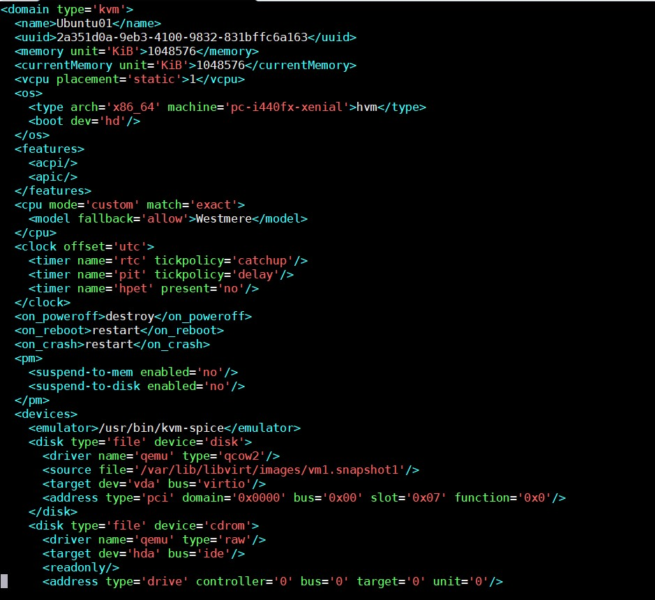

## File xml trong KVM

### Tổng quav về file xml

File có đuôi .xml là file Extensible Markup Language (Ngôn ngữ đánh dấu mở rộng - XML). Đây thực sự chỉ là các file văn bản thuần túy sử dụng thẻ tùy chỉnh để mô tả cấu trúc và các tính năng khác của tài liệu.

XML là gì?

XML là một ngôn ngữ đánh dấu được tạo ra bởi World Wide Web Consortium (W3C) để xác định cú pháp mã hóa tài liệu để con người và máy có thể đọc được. Nó thực hiện điều này thông qua việc sử dụng thẻ xác định cấu trúc tài liệu cũng như cách tài liệu được lưu trữ và vận chuyển.

Có thể dễ dàng so sánh nó với một ngôn ngữ đánh dấu khác mà bạn có thể quen thuộc — Hypertext Markup Language (Ngôn ngữ đánh dấu siêu văn bản - HTML) được sử dụng để mã hóa các trang web.

Tuy nhiên, điểm khác nhau là XML có thể mở rộng được, nó không có ngôn ngữ đánh dấu được xác định trước như HTML. Thay vào đó, XML cho phép người dùng tạo biểu tượng đánh dấu riêng để mô tả nội dung, tạo một biểu tượng không giới hạn và tự định nghĩa. Đặc biệt, HTML là ngôn ngữ tập trung vào việc trình bày nội dung, trong khi XML là ngôn ngữ mô tả dữ liệu được sử dụng để lưu trữ dữ liệu.

XML thường được sử dụng làm cơ sở cho các định dạng tài liệu khác. Dưới đây là một số định dạng bạn có thể biết:

- RSS và ATOM đều mô tả cách ứng dụng đọc xử lý nguồn cấp web.

- Microsoft .NET sử dụng XML cho các file cấu hình của nó.

- Microsoft Office 2007 và các phiên bản sau này sử dụng XML làm cơ sở cho cấu trúc tài liệu. "X" trong định dạng tài liệu Word .DOCX xuất phát từ đây. Ngoài ra, nó cũng được sử dụng trong Excel (file XLSX) và PowerPoint (file PPTX).

Đặc điểm của XML:

- XML được dùng cho dữ liệu có cấu trúc.

- Về trực quan, XML khá giống với HTML.

- Tuy là văn bản, nhưng XML không phải dùng để đọc.

- XML thường rất dài.

- XML được coi là cầu nối đưa HTML tới XHTML và là nền tảng cho RDF và Web mã hóa.

- XML là một module.

- XML miễn phí bản quyền, platform độc lập và được hỗ trợ rất tốt.

Cấu trúc của XML:

`<nodename>Content</nodename>`

Trong đó:

- `<nodename>`: Thẻ mở, nội dung, tên của thẻ này sẽ do người dùng tự xác định.

- Content: Nội dung chính của thẻ.

- `</nodename>`: Thẻ đóng, tên, nội dung của thẻ này và thẻ mở bắt buộc phải trùng nhau.

### File xml trong KVM

VM trong KVM có hai thành phần chính đó là VM's definition được lưu dưới dạng file XML mặc định ở thư mục /etc/libvirt/qemu và VM's storage lưu dưới dạng file image

File domain XML chứa những thông tin về thành phần của máy ảo (số CPU, RAM, các thiết lập của I/O devices...)

libvirt dùng những thông tin này để tiến hành khởi chạy tiến trình QEMU-KVM tạo máy ảo.

Ngoài domain XML, KVM cũng có các file XML khác để lưu các thông tin liên quan tới network, storage...

Ví dụ của domain XML:

#### Các thành phần trong file domain XML