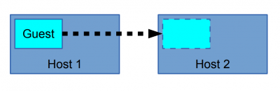
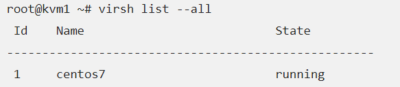
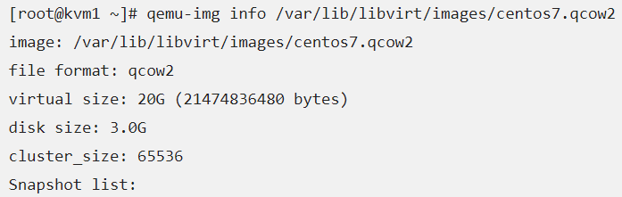
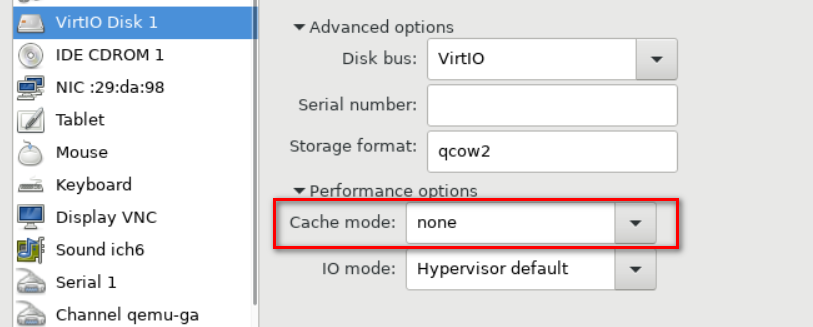
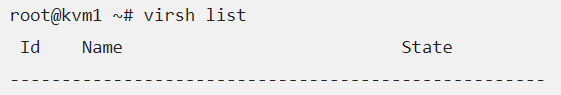
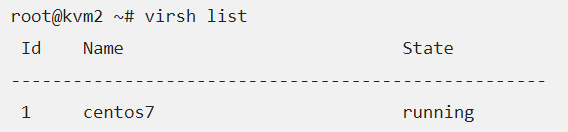

## Migrate máy ảo trên KVM

### 1. Tổng quan



- Migration là quá trình di chuyển máy ảo từ host vật lí này sang một host vật lí khác. Migration được sinh ra để làm nhiệm vụ bảo trì nâng cấp hệ thống. Ngày nay tính năng này đã được phát triển để thực hiện nhiều tác vụ hơn:

	- Cân bằng tải: Di chuyển VMs tới các host khác kh phát hiện host đang chạy có dấu hiệu quá tải.
	
	- Bảo trì, nâng cấp hệ thống: Di chuyển các VMs ra khỏi host trước khi tắt nó đi.
	
	- Khôi phục lại máy ảo khi host gặp lỗi: Restart máy ảo trên một host khác.
	
	- Trong OpenStack, việc migrate được thực hiện giữa các node compute với nhau hoặc giữa các project trên cùng 1 node compute.

### 2. Cơ chế migrate máy ảo

- Việc migrate có 2 cơ chế:

	- Offline Migrate: là cơ chế cần phải tắt guest trước khi thực hiện việc di chuyển image và file xml của guest sang host khác.

	- Live Migrate: là cơ chế di chuyển guest khi guest vẫn còn đang hoạt động, quá trình di chuyển rất nhanh và trong suốt với người dùng.

- Cơ chế cơ bản của live-migrate: Về cơ bản cơ chế di chuyển vm khi vm vẫn đang hoạt động. Quá trình trao đổi diễn ra nhanh các phiên làm việc kết nối hầu như không cảm nhận được sự gián đoạn nào. Quá trình Live Migrate được diễn ra như sau:

	- Bước đầu tiên của quá trình Live Migrate 1 snapshot ban đầu của VM cần chuyển trên host KVM1 được chuyển sang VM trên host KVM2.

	- Trong trường hợp người dùng đang truy cập VM tại host KVM1 thì những sự thay đổi và hoạt động trên host KVM1 vẫn diễn ra bình thường, tuy nhiên những thay đổi này sẽ không được ghi nhận.

	- Những thay đổi của VM trên host KVM1 được đồng bộ liên tục đến host KVM2.

	- Khi đã đồng bộ xong thì VM trên host KVM1 sẽ offline và các phiên truy cập trên host KVM1 được chuyển sang host KVM2.

### 3. Chuẩn bị

- Host kvm1 cài đặt KVM đã tạo 1 máy ảo, IP 100.100.100.11

- Host kvm2 cài đặt KVM chưa tạo máy ảo để làm host đích, IP 100.100.100.12

- Đều dùng CentOS 7

- Tắt SELinux trên cả 2 máy

```
sed -i 's/SELINUX=enforcing/SELINUX=disabled/g' /etc/selinux/config
sed -i 's/SELINUX=enforcing/SELINUX=disabled/g' /etc/sysconfig/selinux
setenforce 0
```

- Khai báo thông tin các máy chủ KVM vào file `/etc/hosts`

```
100.100.100.11 kvm1
100.100.100.12 kvm2
```

### 4. Offline migrate

- Để Migrate Offline thì đầu tiên phải shutdown VM trước:

`virsh shutdown VMname`

Sau khi đã shutdown VM, sử dụng câu lệnh sau để migrate máy ảo sang host 100.100.100.11:

`virsh migrate --offline VMname qemu+ssh://100.100.100.11/system`

### 5. Live migrate

- Cấu hình cho phép giao thức TCP trong dịch vụ libvirt, thực hiện lần lượt các lệnh sau

```
sed -i 's/#listen_tls = 0/listen_tls = 0/g' /etc/libvirt/libvirtd.conf 
sed -i 's/#listen_tcp = 1/listen_tcp = 1/g' /etc/libvirt/libvirtd.conf
sed -i 's/#tcp_port = "16509"/tcp_port = "16509"/g' /etc/libvirt/libvirtd.conf
sed -i 's/#listen_addr = "192.168.0.1"/listen_addr = "0.0.0.0"/g' /etc/libvirt/libvirtd.conf
sed -i 's/#auth_tcp = "none"/auth_tcp = "none"/g' /etc/libvirt/libvirtd.conf
sed -i 's/#mdns_adv = 1/mdns_adv = 0/g' /etc/libvirt/libvirtd.conf
```

- Cấu hình KVM lắng nghe các kết nối:

```
vi /etc/init/libvirt-bin.conf
exec /usr/sbin/libvirtd -d -l
```

- Tiếp tục thực hiện lệnh sau:

`sed -i 's/#LIBVIRTD_ARGS="--listen"/LIBVIRTD_ARGS="--listen"/g' /etc/sysconfig/libvirtd`
	
- Mở các port cần thiết trên cả 2 host:

```
firewall-cmd --permanent --add-port=16509/tcp
firewall-cmd --permanent --add-port=49152/tcp
firewall-cmd --reload
```

- Nếu muốn sử dụng quyền user root để migrate thì sửa file sau:

`vi /etc/libvirt/qemu.conf`

Bỏ comment

```
user = "root"
group= "root"
```

- Khởi động lại dịch vụ libvirtd:
	
`systemctl restart libvirtd`

- Sau khi khởi động lại, kiểm tra libvirt đã hoạt động chưa

`ps -ef | grep libvirt`

- Kiểm tra kết nối từ kvm1 đến kvm2 và ngược lại:

```
virsh -c qemu+tcp://root@kvm2/system
virsh -c qemu+tcp://root@kvm1/system
```

- Tiến hành Migrate

Bước 1: Chọn VM cần Migrate trên máy chủ 1

Liệt kê các VM đang chạy trên Máy chủ 1



Kiểm tra dung lượng disk mà VM đang sử dụng

`qemu-img info /var/lib/libvirt/images/centos7.qcow2`



Bước 2: Tạo file image cho VM trên kvm2

Tạo file image cho máy ảo thông tin giống trên kvm1

`qemu-img create -f qcow2 -o preallocation=metadata centos7.qcow2 21474836480`

Bước 3: Tiến hành Migrate VM từ kvm1

`virsh migrate --live --copy-storage-all --persistent centos7 qemu+tcp://root@kvm2:16509/system`

Thông báo:

Thành công khi `Migration: [100 %]`

nếu có lỗi `error: Unsafe migration: Migration may lead to data corruption if disks use cache != none`

Tiến hành tắt VM

Chỉnh sửa lại cấu hình của ổ cứng IDE:

Vào phần Advance Setting > Performance Option chọn `none` ở mục Cache mode



Tiến hành khởi động lại máy ảo và migrate bình thường.

Bước 4: Kiểm tra

Trên kvm1



Trên kvm2

