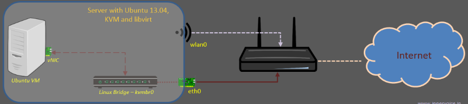
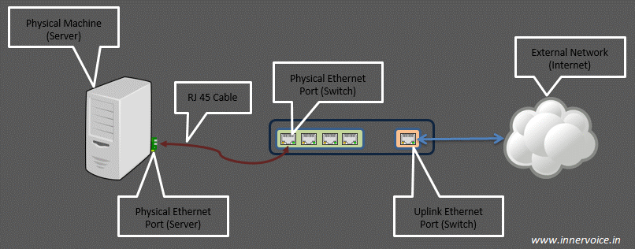
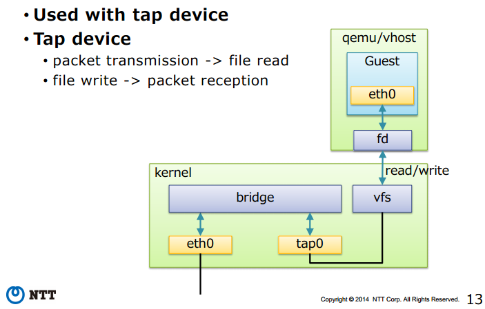
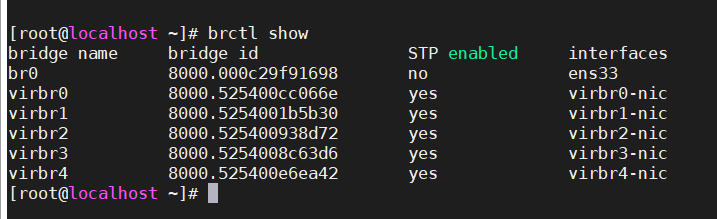

## Tìm hiểu Linux bridge

### 1. Tổng quan

#### 1.1. Giới thiệu

- Linux bridge là một phần mềm đượcc tích hợp vào trong nhân Linux (nó là 1 trong 3 công nghệ cung cấp switch ảo trong hệ thống Linux - bên cạnh macvlan và Open vSwitch) để giải quyết vấn đề ảo hóa phần network trong các máy vật lý.

- Về mặt logic Linux bridge sẽ tạo ra một con switch ảo (layer 2) để cho các VM kết nối được vào và có thể nói chuyện được với nhau cũng như sử dụng để ra mạng ngoài

- Linux Bridge thật ra chính là một switch ảo và được sử dụng với ảo hóa KVM/QEMU. Nó là 1 module trong nhân kernel. Sử dụng câu lệnh brctl để quản lý.

- Mô tả linux bridge (trường hợp cơ bản nhất):



> Lưu ý: Linux bridge được dùng kết hợp với các card ethernet của máy host. Không sử dụng với card wireless.

#### 1.2. Cấu trúc hệ thống sử dụng Linux bridge


Khái niệm về physical port và virtual port:

- Virtual Computing Device: Thường được biết đến như là máy ảo VM chạy trong host server

- Virtual NIC (vNIC): máy ảo VM có virtual network adapters(vNIC) mà đóng vai trò là NIC cho máy ảo. Virtual port được mô phỏng với sự hỗ trợ của KVM/QEMU.

- Physical swtich port: Là port sử dụng cho Ethernet switch, cổng vật lý xác định bởi các port RJ45. Một port RJ45 kết nối tới port trên NIC của máy host.

- Virtual swtich port: là port ảo tồn tại trên virtual switch. Cả virtual NIC (vNIC) và virtual port đều là phần mềm, nó liên kết với virtual cable kết nối vNIC

1 số khái niệm khác:

- Tap : có thể hiểu nó là một giao diên mạng để các máy ảo có thể giao tiếp được với bridge và nó nằm trong nhân kernel. Tap hoat động ở lớp 2 trong mô hình OSI

	- Port trên máy ảo VM chỉ có thể xử lý các frame Ethernet. Trong môi trường thực tế (không ảo hóa) interface NIC vật lý sẽ nhận và xử lý các khung Ethernet. Nó sẽ bóc lớp header và chuyển tiếp payload (thường là gói tin IP) cho hệ điều hành. Tuy nhiên, với môi trường ảo hóa, nó sẽ không làm việc vì các virtual NIC sẽ mong đợi các khung Ethernet.

	- Tap interface là một khái niệm về phần mềm được sử dụng để nói với Linux bridge là chuyến tiếp frame Ethernet vào nó. Hay nói cách khác, máy ảo kết nối tới tap interface sẽ có thể nhận được các khung frame Ethernet thô. Và do đó, máy ảo VM có thể tiếp tục được mô phỏng như là một máy vật lý ở trong mạng.

	- Nói chung, tap interface là một port trên switch dùng để kết nối với các máy ảo VM.

- Port:

	- Trong networking, khái niệm port đại diện cho điểm vào ra của dữ liệu trên máy tính hoặc các thiết bị mạng. Port có thể là khái niệm phần mềm hoặc phần cứng. Software port là khái niệm tồn tại trong hệ điều hành. Chúng thường là các điểm vào ra cho các lưu lượng của ứng dụng. Tức là khái niệm port mức logic. Ví dụ: port 80 trên server liên kết với Web server và truyền các lưu lượng HTTP.

	- Hardware port (port khái niệm phần cứng): là các điểm kết nối lưu lượng ở mức khái niệm vật lý trên các thiết bị mạng như switch, router, máy tính, … ví dụ: router với cổng kết nối RJ45 (L2/Ethernet) kết nối tới máy tính của bạn.
	
	- Uplink port: là khái niệm chỉ điểm vào ra của lưu lượng trong một switch ra các mạng bên ngoài. Nó sẽ là nơi tập trung tất cả các lưu lượng trên switch nếu muốn ra mạng ngoài.
	
	
	
	- Khái niệm virtual uplink switch port được hiểu có chức năng tương đương, là điểm để các lưu lượng trên các máy guest ảo đi ra ngoài máy host thật, hoặc ra mạng ngoài. Khi thêm một interface trên máy thật vào bridge (tạo mạng bridging với interface máy thật và đi ra ngoài), thì interface trên máy thật chính là virtual uplink port.
	
### 2. Kiến trúc

Kiến trúc của Linux bridge như hình sau:



Trong đó:

- Port : tương tự như port của một con switch thật

- Bridge: tương đương với switch layer 2

- tap : là giao diện để các VM kết nối với bridge do linux bridge tạo ra, hoạt động ở lớp 2 trong mô hình OSI

- FDB : Forwading database - chuyển tiếp dữ liệu từ máy ảo tới bridge

### 3. Chức năng của một switch ảo do Linux bridge tạo ra

- STP: là tính năng chống loop gói tin trong switch

- VLan: là tính năng rất quan trọng trong một switch

- FDB: là tính năng chuyển gói tin theo database được xây dựng giúp tăng tốc độ của switch

### 4. Cấu hình Linux Bridge

Sau khi đã [cài đặt KVM](), ta tiến hành cấu hình Linux bridge

- Đầu tiên tạo 1 bridge có tên `br0`

`brctl addbr br0`

- Gắn nó với card mạng thật của máy, xem các interface có sẵn trên máy với câu lệnh `ip a`, như trên máy tôi là `ens33`

`brctl addif br0 ens33`

- Nếu cần thiết thì có thể enable chế độ STP

`brctl stp br0 on`

- Khi tạo một switch mới là `br0`, trên host sẽ xuất hiện thêm một NIC ảo cung tên với switch đó là `br0`. Ta có thể cấu hình cho NIC này trong file `/etc/network/interface` hoặc `/etc/sysconfig/network-scripts/ifcfg-br0`

```
TYPE=Bridge
BOOTPROTO=none
DEVICE=br0
ONBOOT=yes
IPADDR=
PREFIX=24
GATEWAY=
DNS1=8.8.8.8
```

đồng thời vào file `/etc/sysconfig/network-scripts/ifcfg-ens33` và chỉnh sửa

```
TYPE="Ethernet"
#PROXY_METHOD="none"
#BROWSER_ONLY="no"
BOOTPROTO="static"
#DEFROUTE="yes"
#IPV4_FAILURE_FATAL="no"
#IPV6INIT="yes"
#IPV6_AUTOCONF="yes"
#IPV6_DEFROUTE="yes"
#IPV6_FAILURE_FATAL="no"
#IPV6_ADDR_GEN_MODE="stable-privacy"
NAME="ens33"
DEVICE="ens33"
ONBOOT="yes"
UUID="8e7b2a3e-c10b-4cdd-ba7f-f4406cf61043"
#IPADDR=
#NETMASK=255.255.255.0
#GATEWAY=
#DNS1=8.8.8.8
BRIDGE=br0
```

Một số tùy chọn:

	- bridge_ports none: nếu bạn không muốn gán bất cứ port nào vào bridge
	
	- bridge_stp off: tắt chế độ STP (Spanning Tree Protocol)
	
	- bridge_fd 0: không delay forwarding

- Restart network

`systemctl restart network`

- Kiểm tra lại bridge

`brctl show`



- Nếu muốn ngắt card ens33 ra khỏi br0

`brctl delif br0 ens33`

Nếu muốn gắn 2 card vào cùng 1 bridge là `br0`

```
brctl addif br0 ens33
brctl addif br0 ens32
```

Kiểm tra lại bằng câu lệnh

`brctl show`

Sau khi thực hiện việc gắn 2 card vào một bridge thành công, ta lưu tâm đến một tham số là priority. Có nghĩa là port nào có chỉ số priority cao hơn thì khi máy ảo gắn bridge đó vào thì nó sẽ nhận được IP của port có priority cao hơn.

```
brctl setportprio br0 ens33 2
brctl setportprio br0 ens32 1
```

Như trên thì, khi gắn VM vào br0, nó sẽ nhận ip theo ens33

### 5. Các thao tác quản lý Linux Bridge

#### 5.1. Cài đặt công cụ phần mềm quản lý Linux bridge

Linux bridge được hỗ trợ từ version nhân kernel từ 2.4 trở lên. Để sử dụng và quản lý các tính năng của linux birdge, cần cài đặt gói bridge-utilities (dùng các câu lệnh `brctl` để sử dụng linux bridge). Cài đặt dùng lệnh như sau:

`yum install -y bridge-utils`

#### 5.2. Một số câu lệnh quản lý

BRIDGE MANAGEMENT

| Hành động | brctl | bridge |
| --- | --- | --- |
| tạo bridge | brctl addbr <bridge> | |
| xóa bridge | brctl delbr <bridge> | |
| add interface (port) to bridge | brctl addif <bridge> <ifname> | |
| delete interface (port) on bridge | brctl delbr <bridge> | |

FDB MANAGEMENT

| Hành động | brtcl | bridge |
| --- | --- | --- |
| Hiển thị danh sách địa chỉ MAC | brctl showmacs <bridge> | bridge fdb show |
| Sets FDB entries ageing time | brctl setageingtime <bridge> <time> | |
| Sets FDB garbage collector interval | brctl setgcint <brname> <time> | |
| Adds FDB entry | | bridge fdb add dev <interface> [dst, vni, port, via] |
| Appends FDB entry | | bridge fdb append (các tham số giống như lệnh add bên trên) |
| Deletes FDB entry | | bridge fdb delete (các tham số giống như lệnh add bên trên) |

STP MANAGEMENT

| Hành động | brctl | bridge |
| --- | --- | --- |
| Bật tắt chế độ STP | brctl stp <bridge> <state> | |
| Thiết lập bridge priority | brctl setbridgeprio <bridge> <priority> | |
| Thiết lập bridge forward delay | brctl setfd <bridge> <time> | |
| Setting bridge 'hello' time | brctl sethello <bridge> <time> | |
| Setting bridge maximum message age | brctl setmaxage <bridge> <time> | |
| Setting cost of the port on bridge | brctl setpathcost <bridge> <port> <cost>	| bridge link set dev <port> cost <cost> |
| Thiết lập bridge port priority | brctl setportprio <bridge> <port> <priority> | bridge link set dev <port> priority <priority> |
| Should port process STP BPDUs | | bridge link set dev <port > guard [on, off] |
| Bridge có thể gửi các lưu lượng trên cổng mà nó đã được nhận | | bridge link set dev <port> hairpin [on,off] |
| Kích hoạt / vô hiệu hóa các tùy chọn fastleave trên cổng | | bridge link set dev <port> fastleave [on,off] |
| Đặt trạng thái cổng STP | | bridge link set dev <port> state <state> |

VLAN MANAGEMENT

| Hành động | brctl | bridge |
| Tạo VLAN filter entry mới | | bridge vlan add dev <dev> [vid, pvid, untagged, self, master] |
| Xóa VLAN filter entry | | bridge vlan delete dev <dev> (các tham số giơngs lệnh add bên trên) |
| List VLAN configuration | | bridge vlan show |