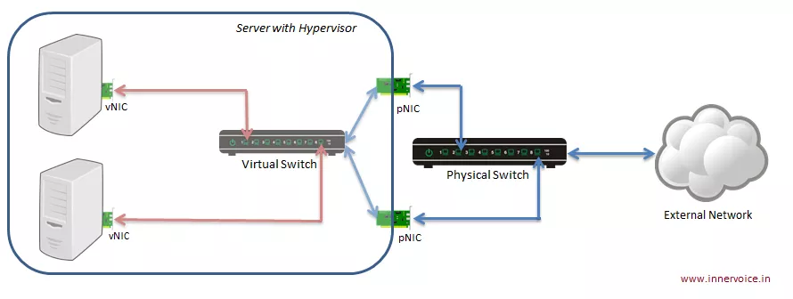

## Tìm hiểu Linux bridge

1. Tổng quan

1.1. Giới thiệu

- Linux bridge là một phần mềm đượcc tích hợp vào trong nhân Linux (nó là 1 trong 3 công nghệ cung cấp switch ảo trong hệ thống Linux - bên cạnh macvlan và Open vSwitch) để giải quyết vấn đề ảo hóa phần network trong các máy vật lý.

- Về mặt logic Linux bridge sẽ tạo ra một con switch ảo (layer 2) để cho các VM kết nối được vào và có thể nói chuyện được với nhau cũng như sử dụng để ra mạng ngoài

- Linux Bridge thật ra chính là một switch ảo và được sử dụng với ảo hóa KVM/QEMU. Nó là 1 module trong nhân kernel. Sử dụng câu lệnh brctl để quản lý.

- Mô tả linux bridge (trường hợp cơ bản nhất):

> Lưu ý: Linux bridge được dùng kết hợp với các card ethernet của máy host. Không sử dụng với card wireless.

1.2. Cấu trúc hệ thống sử dụng Linux bridge

Khái niệm về physical port và virtual port:

- Virtual Computing Device: Thường được biết đến như là máy ảo VM chạy trong host server

- Virtual NIC (vNIC): máy ảo VM có virtual network adapters(vNIC) mà đóng vai trò là NIC cho máy ảo. Virtual port được mô phỏng với sự hỗ trợ của KVM/QEMU.

- Physical swtich port: Là port sử dụng cho Ethernet switch, cổng vật lý xác định bởi các port RJ45. Một port RJ45 kết nối tới port trên NIC của máy host.

- Virtual swtich port: là port ảo tồn tại trên virtual switch. Cả virtual NIC (vNIC) và virtual port đều là phần mềm, nó liên kết với virtual cable kết nối vNIC

1 số khái niệm khác:

- Tap : có thể hiểu nó là một giao diên mạng để các máy ảo có thể giao tiếp được với bridge và nó nằm trong nhân kernel. Tap hoat động ở lớp 2 trong mô hình OSI

	- Port trên máy ảo VM chỉ có thể xử lý các frame Ethernet. Trong môi trường thực tế (không ảo hóa) interface NIC vật lý sẽ nhận và xử lý các khung Ethernet. Nó sẽ bóc lớp header và chuyển tiếp payload (thường là gói tin IP) cho hệ điều hành. Tuy nhiên, với môi trường ảo hóa, nó sẽ không làm việc vì các virtual NIC sẽ mong đợi các khung Ethernet.

	- Tap interface là một khái niệm về phần mềm được sử dụng để nói với Linux bridge là chuyến tiếp frame Ethernet vào nó. Hay nói cách khác, máy ảo kết nối tới tap interface sẽ có thể nhận được các khung frame Ethernet thô. Và do đó, máy ảo VM có thể tiếp tục được mô phỏng như là một máy vật lý ở trong mạng.

	- Nói chung, tap interface là một port trên switch dùng để kết nối với các máy ảo VM.

- Port:

	- Trong networking, khái niệm port đại diện cho điểm vào ra của dữ liệu trên máy tính hoặc các thiết bị mạng. Port có thể là khái niệm phần mềm hoặc phần cứng. Software port là khái niệm tồn tại trong hệ điều hành. Chúng thường là các điểm vào ra cho các lưu lượng của ứng dụng. Tức là khái niệm port mức logic. Ví dụ: port 80 trên server liên kết với Web server và truyền các lưu lượng HTTP.

	- Hardware port (port khái niệm phần cứng): là các điểm kết nối lưu lượng ở mức khái niệm vật lý trên các thiết bị mạng như switch, router, máy tính, … ví dụ: router với cổng kết nối RJ45 (L2/Ethernet) kết nối tới máy tính của bạn.

2. Kiến trúc

Kiến trúc của Linux bridge như hình sau:

Trong đó:

- Port : tương tự như port của một con switch thật

- Bridge: tương đương với switch layer 2

- tap : là giao diện để các VM kết nối với bridge do linux bridge tạo ra, hoạt động ở lớp 2 trong mô hình OSI

- FDB : Forwading database - chuyển tiếp dữ liệu từ máy ảo tới bridge

3. Chức năng của một switch ảo do Linux bridge tạo ra

- STP: là tính năng chống loop gói tin trong switch

- VLan: là tính năng rất quan trọng trong một switch

- FDB: là tính năng chuyển gói tin theo database được xây dựng giúp tăng tốc độ của switch